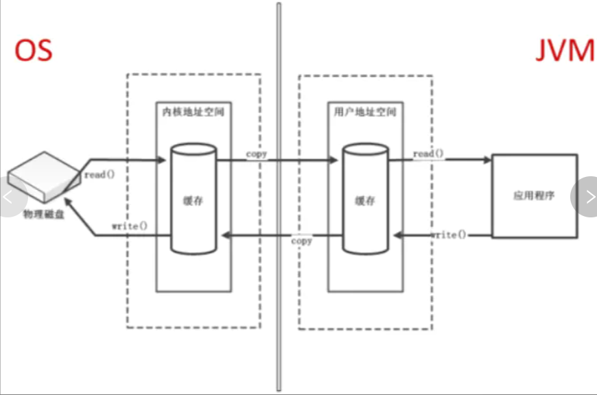
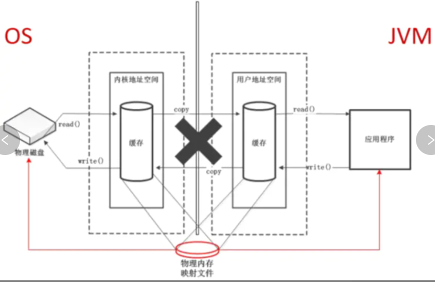

[toc]

---

# 概述
- 不是虚拟机运行时数据区的一部分，也不是《Java虚拟机规范》中定义的内存区域。
- 直接内存是在Java堆外的、直接向系统申请的内存区间。
- JVM通过NIO进行通信，使用DirectByteBuffer进行操作，用于数据缓冲区。
- 可能导致OutOfMemoryError异常
- Java堆和直接内存的总和依然受限于操作系统能给出的最大内存
- -DirectMemorySize可以设置直接内存大小，默认与堆内存的最大值-Xmx参数值一致。

## 缺点
1. 不受JVM内存回收管理，需手动回收
2. 分配与回收回收成本高（属于操作系统内存）
3. 不好控制，频繁操作，容易内存溢出。
4. 不适合储存复杂对象。

## 优点
1. 一般情况下访问直接内存的速度会比JVM堆快。即读写性能高。
2. 读写频繁的场合，使用直接内存更能提高性能。
3. 大内存更适合使用。
4. 因为不受jvm控制，可以减少stw时间。

# 差别说明
## 非直接缓冲区（堆内存）
1. 当我们发起一次文件读取操作时，与操作系统交互，需要由用户态切换内核态，这时需要拷贝到内核态指定的内存空间，再将数据拷贝到jvm的堆内存。
2. 需要两份内存空间。


## 直接缓冲区（直接内存）
1. 本质是减少内存之间的拷贝次数和共用一份内存空间。

2. 通过directByteBuffer操作，申请到一个直接内存地址。这个直接内存地址，实际是直接在内核态进行设备间的内存操作，而不必拷贝到jvm内存中。

3. 当我们发起一次文件读操作时，通过directByteBuffer获取到一个直接内存空间，并把文件加载到这篇空间里面，这里就不用再进行内存拷贝了。

4. 简单理解，直接内存可以看作是一片内核态和用户态公用的，属于内核态的内存空间。

  

# 内存溢出
## DirectByteBuffer

```java
public class DirectMemoryOomDemo {
    static int _100Mb = 1024*1024*100;

    public static void main(String[] args) {
        List<ByteBuffer> byteBuffers = new ArrayList<>();
        int i=0;
        try {
            while (true) {
                ByteBuffer byteBuffer = ByteBuffer.allocateDirect(_100Mb);
                byteBuffers.add(byteBuffer);
                i++;
            }
        }finally {
            System.out.println(i);
        }
    }
}

```

## HeapByteBuffer

```java
public class HeapMemoryOomDemo {
    static int _100Mb = 1024*1024*100;

    public static void main(String[] args) {
        List<ByteBuffer> byteBuffers = new ArrayList<>();
        int i=0;
        try {
            while (true) {
                ByteBuffer byteBuffer = ByteBuffer.allocate(_100Mb);
                byteBuffers.add(byteBuffer);
                i++;
            }
        }finally {
            System.out.println(i);
        }
    }
}
```

# 分配与回收
## 速度比较
### 小对象大数量

```java

/**
 * 比较DirectByteBuffer和HeapByteBuffer
 */
public class CompareDemo {
    private static final int capacity = 1024;

    private static final int len = 1024 * 1000;

    public static void main(String[] args) throws InterruptedException {
        Thread.sleep(1000);
        System.gc();
        createDirectMemory();
        Thread.sleep(1000);
        System.gc();
        Thread.sleep(1000);
        createHeapMemory();

    }

    public static void createDirectMemory() {
        long start = System.currentTimeMillis();

        ByteBuffer[] byteBuffers = new ByteBuffer[len];
        for (int i = 0; i < len; i++) {
            ByteBuffer byteBuffer = ByteBuffer.allocateDirect(capacity);
            byteBuffers[i] = byteBuffer;
        }
        long end = System.currentTimeMillis();
        System.out.println("DirectByteBuffer创建完成，耗时：" + (end - start));
    }

    public static void createHeapMemory() {
        long start = System.currentTimeMillis();
        ByteBuffer[] byteBuffers = new ByteBuffer[len];
        for (int i = 0; i < len; i++) {
            ByteBuffer byteBuffer = ByteBuffer.allocate(capacity);
            byteBuffers[i] = byteBuffer;
        }
        long end = System.currentTimeMillis();
        System.out.println("HeapByteBuffer创建完成，耗时：" + (end - start));

    }
}

```
这里设置了大小为1k，数量为1024000。我们运行一下查看结果。
```
DirectByteBuffer创建完成，耗时：1726
HeapByteBuffer创建完成，耗时：1304
```
可以看到DirectByteBuffer在数量越多的情况下性能更差。

### 大对象小数量
```java
private static final int capacity = 1024*1024*100;
private static final int len = 10;
```

这里延用前面的代码，并设置了大小为100M，数量为10。我们运行一下查看结果。
```
DirectByteBuffer创建完成，耗时：174
HeapByteBuffer创建完成，耗时：262
```
可以看到这种情况下DirectByteBuffer性能更具优势。

### 结论
1. DirectByteBuffer不适用于频繁申请内存的场景，当数量过多，性能将直线下降，不如使用堆内存。
2. DirectByteBuffer适用于大内存申请使用的情况，且服用内存空间，这样对运行性能更加友好。


## System.gc
```java
public class DirectMemoryGcDemo {
    private static int _500MB = 1024 * 1024 * 500;

    public static void main(String[] args) throws IOException {
        long start = System.currentTimeMillis();
        System.out.println("开始分配");
        ByteBuffer byteBuffer = ByteBuffer.allocateDirect(_500MB);
        long endtime = System.currentTimeMillis();

        System.out.println("分配完成,耗时：" + (endtime - start));
        System.in.read();
        byteBuffer = null;
        System.gc();
        System.out.println("执行System.gc，程序未完全退出");
        System.in.read();
        System.out.println("程序退出");
    }
}

```
执行程序后，分配完直接内存，会暂停，我们看一下任务管理器的情况。这里可以看到分配了一个将近500M的内存。

然后我们继续执行一下程序。

可以看见500M的java进程已经不见了。证明已经被我们System.gc()回收了。

## unsafe内存管理
==通常我们最好也不要使用Unsafe类，除非有明确的目的，并且也要对它有深入的了解才行。==

另外ByteBuffer，

```java
public class DirectmemoryUnsafeDemo {
    private final static int _100MB = 1024 * 1024 * 500;

    public static void main(String[] args) throws IOException {
        Unsafe unsafe = getUnsafe();
        long base = unsafe.allocateMemory(_100MB);
        unsafe.setMemory(base, _100MB, (byte) 0);
        System.out.println("分配内存成功");
        System.in.read();
        unsafe.freeMemory(base);
        System.out.println("释放内存");
        System.in.read();
    }

    public static Unsafe getUnsafe() {
        try {
            Field field = Unsafe.class.getDeclaredField("theUnsafe");
            field.setAccessible(true);
            Unsafe unsafe = (Unsafe) field.get(null);
            return unsafe;
        } catch (NoSuchFieldException | IllegalAccessException e) {
            e.printStackTrace();
            return null;
        }
    }
}
```

## ByteBuffer.cleaner()
```java
public class DirectMemoryFreeDemo {
    private static int _500MB = 1024 * 1024 * 500;

    public static void main(String[] args) throws IOException {
        long start = System.currentTimeMillis();
        System.out.println("开始分配");
        ByteBuffer byteBuffer = ByteBuffer.allocateDirect(_500MB);
        long endtime = System.currentTimeMillis();

        System.out.println("分配完成,耗时：" + (endtime - start));
        System.in.read();
        if (byteBuffer.isDirect()) {
            System.out.println("byteBuffer是直接内存");
            ((DirectBuffer) byteBuffer).cleaner().clean();
        }
        System.out.println("执行Cleaner，程序未完全退出");
        System.in.read();
        System.out.println("程序退出");
    }
}
```


# 使用场景
## 适用DirectByteBuffer(直接内存)的情况
> ByteBuffer.allocateDirect(int capacity)

1. 频繁的native IO，即java进程与本地磁盘,socket传输
2. 不需要经常创建和销毁DirectByteBuffer对象（执行分配和销毁代价大）（使用池思想，复用DirectByteBuffer）
3. DirectByteBuffer不会占用堆内存，也就是不受堆内存大小限制（受系统内存限制），只有在DirectByteBuffer回收时才释放缓冲区。
4. 大文件造成大对象，对GC负担比较重的情况。
5. 为了避免一直没有FULL GC，最终导致物理内存被耗完。我们会指定直接内存的最大值，通过-XX：MaxDirectMemerySize来指定，当达到阈值的时候，调用system.gc来进行一次full gc，把那些没有被使用的直接内存回收掉。

## 适用HeapByteBuffer(堆内存)的情况
> ByteBuffer.allocate(int capacity)

1. 数据仅在java进程中传输使用，不进行本地io操作。
2. 体积小，对GC负担低，能够快速回收。