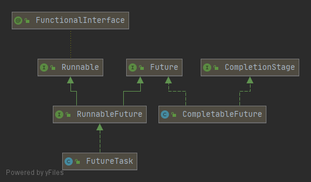

[toc]

---

# 简介

`CompletableFuture` 是 `java.io.conrrent` 库在 `JDK8` 中新增的并发工具，同传统的 `Future` 相比，支持流式计算、函数式编程、聚合计算、完成通知和自定义异常处理等特性。

`CompletableFuture` 实现了 `CompletionStage` 和 `Future`。`CompletionStage` 是对 `Future` 的扩展，增强了流式处理、异步回调、组合处理的能力，使得在处理多任务的协同工作时更加顺利。

`CompletableFuture` 和 `FutureTask` 属于 `Future` 接口的实现类，都可以获取线程的执行结果。	



# CompletableFuture创建

## 构造函数

最简单的方式是通过构造函数直接 `new` 一个 `CompletableFutrue` 实例。

```java
CompletableFuture<Object> completableFuture = new CompletableFuture<>();
Object join = completableFuture.join();
System.out.println(join);
// 无输出
```

但需要注意的是，新创建的 `CompletableFuture` 没有计算结果时，当前线程执行 `join` 方法，会一直阻塞。

我们可以通过 `complete` 方法给当前线程设置结果。

```java
CompletableFuture<Object> completableFuture = new CompletableFuture<>();
completableFuture.complete("create");
Object join = completableFuture.join();
System.out.println(join);

// 输出create
```

或者交由另外的线程设置计算结果，这样就实现了线程间协作。

```java
CompletableFuture<Object> completableFuture = new CompletableFuture<>();
new Thread(() -> {
    try {
        System.out.println("开始等待");
        Thread.sleep(1000);
    } catch (InterruptedException e) {
        e.printStackTrace();
    }
    System.out.println("结束等待");
    completableFuture.complete("create");
}).start();
System.out.println("获取值");
Object join = completableFuture.join();
Thread.sleep(1000);
System.out.println(join);
```

输出结果

```shell
获取值
开始等待
结束等待
create
```

## completedFuture创建

`CompletableFuture.completedFuture` 设置一个计算结果，这样 `CompletableFuture` 相当于已经执行过了 `complete` 了。当然，一般情况下这个使用较少。

```java

/**
     * Returns a new CompletableFuture that is already completed with
     * the given value.
     *
     * @param value the value
     * @param <U> the type of the value
     * @return the completed CompletableFuture
     */
public static <U> CompletableFuture<U> completedFuture(U value) {
    return new CompletableFuture<U>((value == null) ? NIL : value);
}
```

这里来看一下案例

```java
CompletableFuture<String> completedFuture = CompletableFuture.completedFuture("completedFuture");
String join1 = completedFuture.join();
log.info("result=>{}",join1);

completedFuture = CompletableFuture.completedFuture(null);
log.info("result=>{}",completedFuture.join());
```

输出结果

```shell
result=>completedFuture
result=>null
```


## runAsync创建

`CompletableFuture.runAsync` 要求传入 `Runnable` 类型的参数，因此没有返回值。所以 `runAsync` 适合使用在不需要返回值的计算场景中。

`CompletableFuture.runAsync` 有两个方法签名。其中第二种会允许传入一个线程池，当没有传入自定义线程池时，`runAsync` 默认会使用内部的 `ForkJoinPool` 线程池。

```java
public static CompletableFuture<Void> runAsync(Runnable runnable) {
    return asyncRunStage(asyncPool, runnable);
}  

public static CompletableFuture<Void> runAsync(Runnable runnable,
                                               Executor executor) {
    return asyncRunStage(screenExecutor(executor), runnable);
}
```

简单案例：

```java
CompletableFuture<Void> future = CompletableFuture.runAsync(() -> {
    getThreadName(0);
});
log.info("result=>{}", future.join());

// 输出结果null。
```

注意这里是会阻塞调用 `CompletableFuture.join` 的线程来等待结果返回。

## supplyAsync创建

`CompletableFuture.supplyAsycn` 方法与 `CompletableFuture.runAsync`  类似，区别在于 `supplyAsync` 接收一个 `Supplier` 类型的参数，会生成一个返回值，所以 `supplyAsync` 适用于需要返回值的计算场景中。

简单案例

```java
@Test
public void supplyAsync() {
    CompletableFuture<String> future = CompletableFuture.supplyAsync(() -> {
        getThreadName(0);
        return "success";
    });
    log.info("result=>{}", future.join());
}
```

输出结果

```shell
[ForkJoinPool.commonPool-worker-1] INFO top.zsmile.test.basic.threads.CompletableFutureTest - ThreadName:ForkJoinPool.commonPool-worker-1，value:0
[main] INFO top.zsmile.test.basic.threads.CompletableFutureTest - result=>success
```

从输出结果可以看出，`CompletableFuture` 生成的异步线程会打印执行线程信息，并将结果返回给主线程打印。


## 结果获取

`CompletableFutrue` 有4类获取结果的方法：

1. ` public T get() throws InterruptedException, ExecutionException`。获取结果。如果出现异常则抛出。
2. `public T get(long timeout, TimeUnit unit) throws InterruptedException, ExecutionException, TimeoutException`。获取结果，并允许传入超时字段，如果时间内没有获取到计算结果，则抛出 `TimeoutException` 异常，此时结果值为null。**注意：就算抛出异常，但任务也不会中断，而是继续执行**
3. `public T join() `。获取结果，且不会抛出异常。
4. `public T getNow(T valueIfAbsent) `。立即获取结果，如果 `CompletableFuture`的结果未计算完成，则返回传入结果。**注意：就算抛出异常，但任务也不会中断，而是继续执行**

验证一下。

```java
@Test
public void getResult() throws ExecutionException, InterruptedException {
    // get
    CompletableFuture<String> future = CompletableFuture.supplyAsync(() -> {
        getThreadName(0);
        return "success";
    });
    log.info("result=>{}", future.get());

    // get
    CompletableFuture<String> future1 = CompletableFuture.supplyAsync(() -> {
        getThreadName(0);
        try {
            int i = 1;
            while (i <= 5) {
                Thread.sleep(1000);
                log.debug("sleep1 1000");
                i++;
            }
        } catch (InterruptedException e) {
            e.printStackTrace();
        }
        return "success";
    });
    try {
        log.info("result1=>{}", future1.get(2000, TimeUnit.MILLISECONDS));
    } catch (TimeoutException e) {
        log.error("timeout1 => {}", e.getMessage());
    }

    // join
    CompletableFuture<String> future2 = CompletableFuture.supplyAsync(() -> {
        getThreadName(0);
        return "success";
    });

    log.info("result2=>{}", future2.join());

    // getNow
    CompletableFuture<String> future3 = CompletableFuture.supplyAsync(() -> {
        getThreadName(0);
        try {
            int i = 1;
            while (i <= 5) {
                Thread.sleep(1000);
                log.debug("sleep2 1000");
                i++;
            }
            log.info("over");
        } catch (InterruptedException e) {
            e.printStackTrace();
        }
        return "success";
    });
    log.info("result3=>{}", future3.getNow("6666"));
    Thread.sleep(10000);
    log.info("result3=>{}", future3.getNow("6666"));
}
```

输出结果

```shell
11:12:26.581 [ForkJoinPool.commonPool-worker-1] INFO top.zsmile.test.basic.threads.CompletableFutureTest - ThreadName:ForkJoinPool.commonPool-worker-1，value:0
11:12:26.585 [main] INFO top.zsmile.test.basic.threads.CompletableFutureTest - result=>success
11:12:26.586 [ForkJoinPool.commonPool-worker-1] INFO top.zsmile.test.basic.threads.CompletableFutureTest - ThreadName:ForkJoinPool.commonPool-worker-1，value:0
11:12:27.601 [ForkJoinPool.commonPool-worker-1] DEBUG top.zsmile.test.basic.threads.CompletableFutureTest - sleep1 1000
11:12:28.592 [main] ERROR top.zsmile.test.basic.threads.CompletableFutureTest - timeout1 => null
11:12:28.592 [ForkJoinPool.commonPool-worker-2] INFO top.zsmile.test.basic.threads.CompletableFutureTest - ThreadName:ForkJoinPool.commonPool-worker-2，value:0
11:12:28.592 [main] INFO top.zsmile.test.basic.threads.CompletableFutureTest - result2=>success
11:12:28.592 [main] INFO top.zsmile.test.basic.threads.CompletableFutureTest - result3=>6666
11:12:28.592 [ForkJoinPool.commonPool-worker-2] INFO top.zsmile.test.basic.threads.CompletableFutureTest - ThreadName:ForkJoinPool.commonPool-worker-2，value:0
11:12:28.607 [ForkJoinPool.commonPool-worker-1] DEBUG top.zsmile.test.basic.threads.CompletableFutureTest - sleep1 1000
11:12:29.603 [ForkJoinPool.commonPool-worker-2] DEBUG top.zsmile.test.basic.threads.CompletableFutureTest - sleep2 1000
11:12:29.618 [ForkJoinPool.commonPool-worker-1] DEBUG top.zsmile.test.basic.threads.CompletableFutureTest - sleep1 1000
11:12:30.614 [ForkJoinPool.commonPool-worker-2] DEBUG top.zsmile.test.basic.threads.CompletableFutureTest - sleep2 1000
11:12:30.630 [ForkJoinPool.commonPool-worker-1] DEBUG top.zsmile.test.basic.threads.CompletableFutureTest - sleep1 1000
11:12:31.615 [ForkJoinPool.commonPool-worker-2] DEBUG top.zsmile.test.basic.threads.CompletableFutureTest - sleep2 1000
11:12:31.631 [ForkJoinPool.commonPool-worker-1] DEBUG top.zsmile.test.basic.threads.CompletableFutureTest - sleep1 1000
11:12:32.623 [ForkJoinPool.commonPool-worker-2] DEBUG top.zsmile.test.basic.threads.CompletableFutureTest - sleep2 1000
11:12:33.630 [ForkJoinPool.commonPool-worker-2] DEBUG top.zsmile.test.basic.threads.CompletableFutureTest - sleep2 1000
11:12:33.630 [ForkJoinPool.commonPool-worker-2] INFO top.zsmile.test.basic.threads.CompletableFutureTest - over
11:12:38.605 [main] INFO top.zsmile.test.basic.threads.CompletableFutureTest - result3=>success
```

### join和get的区别

**另外 `join` 和 `get` 相同之处都是阻塞获取结果，那么这个异常抛出的差别是什么呢？**

```java
@Test
public void getOrJoin() {
    try {
        CompletableFuture<Integer> integerCompletableFuture = CompletableFuture.supplyAsync(() -> 1 / 0);
        log.info("join result => {}", integerCompletableFuture.join());
    } catch (Exception e) {
        e.printStackTrace();
    }
    try {
        CompletableFuture<Integer> integerCompletableFuture2 = CompletableFuture.supplyAsync(() -> 1 / 0);
        log.info("get result => {}", integerCompletableFuture2.get());
    } catch (InterruptedException e) {
        e.printStackTrace();
    } catch (ExecutionException e) {
        e.printStackTrace();
    }
}
```

输出结果

```shell
java.util.concurrent.CompletionException: java.lang.ArithmeticException: / by zero
...

java.util.concurrent.ExecutionException: java.lang.ArithmeticException: / by zero
...
```

这里 `join` 抛出 `CompletionException` 异常，而 `get` 抛出 `ExecutionException` 异常，既然都抛出了异常，那么他们的差别在于哪里呢？

1. `join` 抛出的是 `unchecked` 异常，即 `RuntimeException` 异常，这种异常在检查期间不会抛出，也不会强制要求开发者进行捕获。并且会将异常包装成 `CancellationException` 和 `CompletionException` 异常。
2. `get` 抛出的是经过检查的异常，`InterruptedException` 和 `ExecutionException` 。需要开发捕获处理。

# 流式计算

`CompletableFuture` 与 `Future` 最大的不同在于其对流式计算的支持，多个任务之间，可以关联，形成计算流。并对不同任务的计算结果进行处理。

`CompletableFuture` 流式方法的大致可以分为两类 带Async 和 不带Async的。带 `Async` 的会**单独提交到线程池中**。


