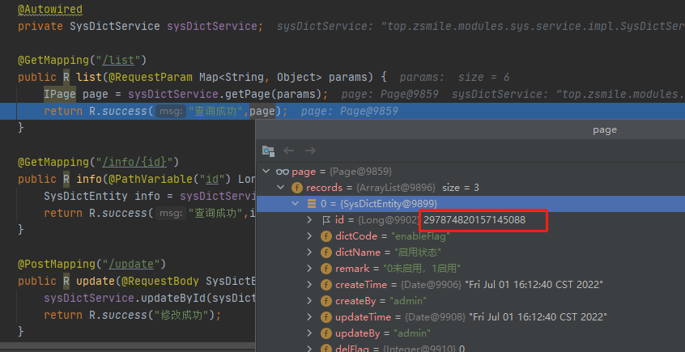
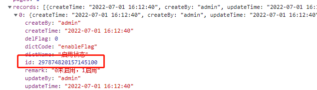
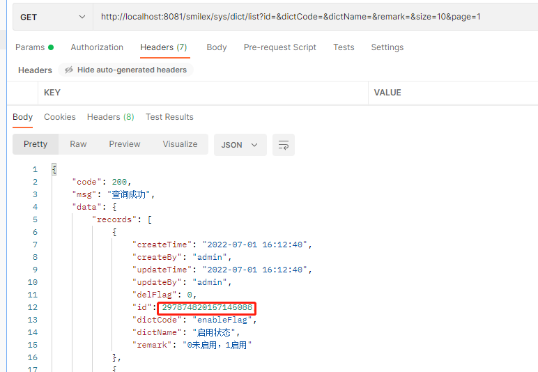
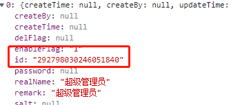
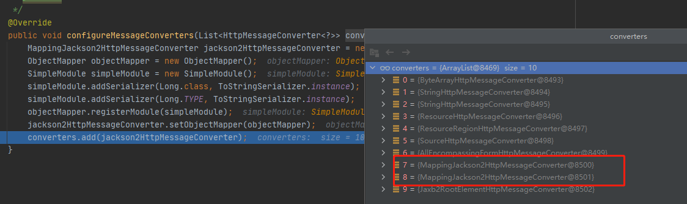

[toc]

---


# 前言

最近在开发中，碰到一个问题，关于数据库Long类型查询后，返回给前端后，精度丢失。

> 297874820157145088 => 297874820157145100

- [后端源码地址](https://github.com/smileluck/SmileX-boot)
- [前端源码地址](https://github.com/smileluck/SmileX-Admin-Vue3)

数据库数据如下：

| id | 字典码 | 字典名称 | 备注 |
| ---- | ---- | ---- | ---- |
| 297874820157145088 | enableFlag | 启用状态 | 0未启用，1启用|

查询语句如下：

```sql
SELECT id AS id, dict_code AS dictCode, dict_name AS dictName, remark AS remark, create_time AS createTime, create_by AS createBy, update_time AS updateTime, update_by AS updateBy, del_flag AS delFlag FROM sys_dict WHERE (del_flag=0) LIMIT 10 OFFSET 0
```

查询结果：(正确，此时并未出现精度丢失)

| id | 字典码 | 字典名称 | 备注 |
| ---- | ---- | ---- | ---- |
| 297874820157145088 | enableFlag | 启用状态 | 0未启用，1启用|

再来看一下Springboot准备返回时的数据显示：



这里可以看到返回类型是Long类型且精度并未丢失。




可以看到这时前端显示出来的，就出现问题了。是不是网络传输的过程有问题呢？我们换PostMan试一下。



可以看见这里的id是正确的，那么应该时JavaScript导致的精度丢失了。

大致看了一下网上的思路，因为JavaScript 的整数类型范围有限，精度为17位 ，当接口返回的Long类型过长时，javaScript会进行截断，所以解决办法就是把Long类型转换成String类型返回，这样就不会由精度丢失的问题了。

# 解决方法

## 基于注解@JsonSerialize(不推荐)

最直接的方式就是在需要转换的Long类型字段使用注解标记。

```java
@JsonSerialize
private Long id;
```

这样子好处是可以对单个的字段进行精细管理，但是需要每个字段都添加转换，很不方便，工作量大。

### 基于jackson全局配置(不推荐)

```yaml
spring:
	jackson:
		generator:
			write-numbers-as-strings: true
```




这个方法会将全局所有的数字类型包括int/long等都转换为string类型返回，不推荐使用。

## 使用JsonComponent 序列化配置

```java

@JsonComponent
public class JsonConfig {

    /**
     * 添加Long转json精度丢失的配置
     */
    @Bean
    public ObjectMapper jacksonObjectMapper(Jackson2ObjectMapperBuilder builder) {
        ObjectMapper objectMapper = builder.createXmlMapper(false).build();
        SimpleModule module = new SimpleModule();
        module.addSerializer(Long.class, ToStringSerializer.instance);
        module.addSerializer(Long.TYPE, ToStringSerializer.instance);
        objectMapper.registerModule(module);
        return objectMapper;
    }
}

```

为什么这样写能生效呢？我们可以看一下 WebMvcConfigurationSupport 类。

### WebMvcConfigurationSupport 分析

```java
//初始化
static {
   // etc...
    jackson2Present = ClassUtils.isPresent("com.fasterxml.jackson.databind.ObjectMapper", classLoader) && ClassUtils.isPresent("com.fasterxml.jackson.core.JsonGenerator", classLoader);
}

// 添加默认的httpMesssage转换器
protected final void addDefaultHttpMessageConverters(List<HttpMessageConverter<?>> messageConverters) {
    //etc
    
    if (jackson2Present) {
        builder = Jackson2ObjectMapperBuilder.json();
        if (this.applicationContext != null) {
            builder.applicationContext(this.applicationContext);
        }

        messageConverters.add(new MappingJackson2HttpMessageConverter(builder.build()));
    }
}       
```

这里可以看出来Springboot提供的默认mvc配置内容：

1. 初始化并查找是否有 ObjectMapper 类
2. 如果没有发现 ObjectMapper Bean对象，就会提供给一个默认的 MappingJackson2HttpMessageConverter 对象。
3. 如果发现 ObjectMapper Bean对象，就会将这个绑定到默认的转换器上。

## WebMvcConfigurer/WebMvcConfigurationSupport 
这里虽然将这两个类放一起，是因为都能基于他们去重写 configureMessageConverters方法，来实现对转换器的添加。
```java

@Configuration
public class WebConfig implements WebMvcConfigurer {
	
    /**
     * 添加Long转json精度丢失的配置
     *
     * @Return: void
     */
    @Override
    public void configureMessageConverters(List<HttpMessageConverter<?>> converters) {
        MappingJackson2HttpMessageConverter jackson2HttpMessageConverter = new MappingJackson2HttpMessageConverter();
        ObjectMapper objectMapper = new ObjectMapper();
        SimpleModule simpleModule = new SimpleModule();
        simpleModule.addSerializer(Long.class, ToStringSerializer.instance);
        simpleModule.addSerializer(Long.TYPE, ToStringSerializer.instance);
        objectMapper.registerModule(simpleModule);
        jackson2HttpMessageConverter.setObjectMapper(objectMapper);
        converters.add(jackson2HttpMessageConverter);
    }
}
```

这里需要注意的是，该方法可能存在失效的情况，但是如果我们改成这样，就能有效。

```
converters.add(0,jackson2HttpMessageConverter);
```

这是为什么呢？让我们探究一下。

### 分析

先看一下都有什么转换器。



可以看到在我们添加转换器前，就已经有了2个 Mappingjackson2HttpMessageConverter 了。我们说过springboot 自带了 HttpMessageConverter 。

那么这时出现多个，会不会相互之间有影响？

```java
// AbstractMessageConverterMethodProcessor.class
if (selectedMediaType != null) {
    selectedMediaType = selectedMediaType.removeQualityValue();
    for (HttpMessageConverter<?> converter : this.messageConverters) {
        GenericHttpMessageConverter genericConverter = (converter instanceof GenericHttpMessageConverter ?
                                                        (GenericHttpMessageConverter<?>) converter : null);
        if (genericConverter != null ?
            ((GenericHttpMessageConverter) converter).canWrite(targetType, valueType, selectedMediaType) :
            converter.canWrite(valueType, selectedMediaType)) {
            body = getAdvice().beforeBodyWrite(body, returnType, selectedMediaType,
                                               (Class<? extends HttpMessageConverter<?>>) converter.getClass(),
                                               inputMessage, outputMessage);
            if (body != null) {
                Object theBody = body;
                LogFormatUtils.traceDebug(logger, traceOn ->
                                          "Writing [" + LogFormatUtils.formatValue(theBody, !traceOn) + "]");
                addContentDispositionHeader(inputMessage, outputMessage);
                if (genericConverter != null) {
                    genericConverter.write(body, targetType, selectedMediaType, outputMessage);
                }
                else {
                    ((HttpMessageConverter) converter).write(body, selectedMediaType, outputMessage);
                }
            }
            else {
                if (logger.isDebugEnabled()) {
                    logger.debug("Nothing to write: null body");
                }
            }
            return;
        }
    }
}

// AbstractMessageConverterMethodArgumentResolver.class
for (HttpMessageConverter<?> converter : this.messageConverters) {
    Class<HttpMessageConverter<?>> converterType = (Class<HttpMessageConverter<?>>) converter.getClass();
    GenericHttpMessageConverter<?> genericConverter =
        (converter instanceof GenericHttpMessageConverter ? (GenericHttpMessageConverter<?>) converter : null);
    if (genericConverter != null ? genericConverter.canRead(targetType, contextClass, contentType) :
        (targetClass != null && converter.canRead(targetClass, contentType))) {
        if (message.hasBody()) {
            HttpInputMessage msgToUse =
                getAdvice().beforeBodyRead(message, parameter, targetType, converterType);
            body = (genericConverter != null ? genericConverter.read(targetType, contextClass, msgToUse) :
                    ((HttpMessageConverter<T>) converter).read(targetClass, msgToUse));
            body = getAdvice().afterBodyRead(body, msgToUse, parameter, targetType, converterType);
        }
        else {
            body = getAdvice().handleEmptyBody(null, message, parameter, targetType, converterType);
        }
        break;
    }
}
```

这里可以看到，会遍历messageConverters转换器列表，但是问题在于，如果有一个 HttpMessageConverter 类响应了读写信息，那么就会进行返回，这样导致了后面的转换器不生效。

### 解决方法

那么针对这种有几种解决方法

1. 提升自定义的消息处理转换器优先级；

```java
converters.add(0,jackson2HttpMessageConverter);
```

2. 移除列表里的springboot 默认的转换器；

```java
converters.removeIf(converter -> converter instanceof MappingJackson2HttpMessageConverter);
```

3. 使用@EnableWebMvc 注解。慎用，会清空sprinb自带的默认转换器导致某些功能失效。此时的converters转换列表为空。

```java
@EnableWebMvc
@Configuration
public class WebConfig implements WebMvcConfigurer {
    
    @Override
    public void configureMessageConverters(List<HttpMessageConverter<?>> converters) {
        MappingJackson2HttpMessageConverter jackson2HttpMessageConverter = new MappingJackson2HttpMessageConverter();
        ObjectMapper objectMapper = new ObjectMapper();
        SimpleModule simpleModule = new SimpleModule();
        simpleModule.addSerializer(Long.class, ToStringSerializer.instance);
        simpleModule.addSerializer(Long.TYPE, ToStringSerializer.instance);
        objectMapper.registerModule(simpleModule);
        jackson2HttpMessageConverter.setObjectMapper(objectMapper);
        converters.add(jackson2HttpMessageConverter);
    }
}
```

