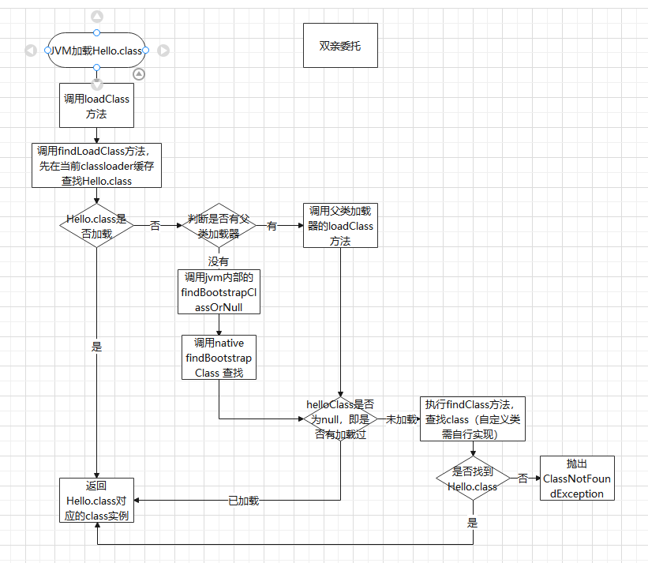
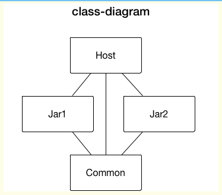

[toc]

---


# 双亲委托


其实上图也就几个步骤

1. 先检查类是否已经被加载过
2. 若没有加载则调用父加载器的loadClass()方法进行加载
3. 若父加载器为空则默认使用启动类加载器作为父加载器
4. 如果父类加载失败，抛出ClassNotFoundException异常后，再调用自己的findClass()方法进行加载。 

查看loadClass的方法，我们可以看到：

- 当我们遵循双亲委派机制时，自定义的classloader需要实现findClass方法。
- 当我们打破双亲委派机制，则需要实现loadClass方法

## 好处
- 避免java类的重复加载
- 避免用户自定义的包名类对jvm核心api破坏，保障安全。若是不使用双亲委托，用户可能会意外实现某些核心类（Object）等，导致破坏Jvm的稳定运行。
- 基于JVM标识每个类的唯一性需要与类加载器一同判断，那么我们通过自定义类的方式，可以隔离class使用，提高我们开发灵活性。

## 如何理解双亲委派模型的被破化？

> **想要破坏这种机制，那么就自定义一个类加载器，重写其中的loadClass方法，使其不进行双亲委派即可。** 

在这之前看一下`classloader` 提供的3个常用方法的区别：

- loadClass() 就是主要进行类加载的方法，默认的双亲委派机制就实现在这个方法中
- findClass() 根据名称或位置加载.class字节码
- defineClass() 把字节码转化为Class。


### loadClass
双亲委托模型是在JDK1.2之后出现的。在此之前类加载器和抽象类java.lang.ClassLoader就已经存在了。所以为了向前兼容，JDK1.2之后的java.lang.ClassLoader添加了一个新的protected方法findClass(),(在上面的源代码中也可以看见)。
**而在双亲委托模型未设计出前，用户去继承java.lang.ClassLoader的唯一目的就是为了重写loadClass()方法**，因为JVM在进行类加载的时候，会调用加载器私有方法loadClassInternal(),而这个方法的唯一逻辑就是去调用自己的loadClass()方法。
```java
private Class loadClassInternal(String name)
        throws ClassNotFoundException
    {
        // For backward compatibility, explicitly lock on 'this' when
        // the current class loader is not parallel capable.
        if (parallelLockMap == null) {
            synchronized (this) {
                 return loadClass(name);
            }
        } else {
            return loadClass(name);
        }
    }
```

而在JDK1.2双亲委托出现之后，不提倡用户再去覆盖loadClass()方法，而应当把自己的类加载逻辑写到findClass()方法完成加载,在loadClass()方法父类加载失败，则会调用自己的findClass方法完成加载，这样就保证写出来的类加载器是符合双亲委托规则的。

### 二次破坏
二次破环是该双亲委托模弊端引起的。该模型能很好的解决各个类加载器对基础类的统一问题。因为它们总是作为被用户代码调用的API，但是问题就来了。如果基础类又要调用回用户的代码，该如何实现?。

**典型例子：JNDI服务**，它的代码由启动类加载器加载(在rt.jar中)，但JNDI目的就是对整个程序的资源进行几种管理和查找，需要调用由每个不同独立厂商实现并且部署在应用程序的ClassPath下的JNDI接口提供者的代码。但是在应用启动时候读取rt.jar包时候，是不认识这些三方厂商定义的类的，那么如何解决？

java设计团队引入了一个新设计：**线程上下文类加载器(Thread Context ClassLoader)**。这个类加载器可以通过java.lang.Thread类的setContextClassLoader()方法进行设置，如果**创建线程时候，还未设置，将会从父线程中继承一个**。如果在应用程序全局范围都没有设置，**默认是appClassLoader类加载器**。
```java
class Thread implements Runnable {
     ...
    /* The context ClassLoader for this thread */
    private ClassLoader contextClassLoader;
    
@CallerSensitive
    public ClassLoader getContextClassLoader() {
        if (contextClassLoader == null)
            return null;
        SecurityManager sm = System.getSecurityManager();
        if (sm != null) {
            ClassLoader.checkClassLoaderPermission(contextClassLoader,
                                                   Reflection.getCallerClass());
        }
        return contextClassLoader;
    }
    //
     public void setContextClassLoader(ClassLoader cl) {
        SecurityManager sm = System.getSecurityManager();
        if (sm != null) {
            sm.checkPermission(new RuntimePermission("setContextClassLoader"));
        }
        contextClassLoader = cl;
    }
    /**
     * Returns a reference to the currently executing thread object.
     *
     * @return  the currently executing thread.
     */
    public static native Thread currentThread(); //用于获取当前现在运行程序的线程
...
}
```


# 相关问题


## 隔离问题
大家觉得一个运行程序中有没有可能同时存在两个包名和类名完全一致的类？

JVM 及 Dalvik 对类唯一的识别是 **ClassLoader id + PackageName + ClassName**，所以一个运行程序中是有可能存在两个包名和类名完全一致的类的。并且如果这两个”类”不是由一个 ClassLoader 加载，是无法将一个类的示例强转为另外一个类的，这就是 ClassLoader 隔离。 
```java
java.lang.ClassCastException: android.support.v4.view.ViewPager can not be cast to android.support.v4.view.ViewPager
```
当碰到这种问题时可以通过 instance.getClass().getClassLoader(); 得到 ClassLoader，看 ClassLoader 是否一样。

### 代码演示
#### 准备两个jar
编写HelloWord.java文件，并编译文件，打包成HelloWord.jar
```java
package top.zsmile.jvm.classloader;

public class HelloWord {
    public static void sayHello(){
        System.out.println("Hello World1");
    }

    public static void main(String[] args) {
        sayHello();
    }
}
```

编写HelloWord.java文件，并编译文件，打包成HelloWord-copy.jar
```java
package top.zsmile.jvm.classloader;

public class HelloWord {
    public static void sayHello(){
        System.out.println("Hello World2");
    }

    public static void main(String[] args) {
        sayHello();
    }
}
```

注意如果填写了包名，则需要在jar包内部填写按照包路径放置class文件。

#### 测试jar隔离
```java
public void isolate() {
    try {
        final String jarPath = "file:/D:\\project\\B.Smile\\geek-study1\\project\\src\\main\\java\\top\\zsmile\\jvm\\classloader\\HelloWord.jar";
        final String jarPath2 = "file:/D:\\project\\B.Smile\\geek-study1\\project\\src\\main\\java\\top\\zsmile\\jvm\\classloader\\HelloWord-copy.jar";
        final String className = "top.zsmile.jvm.classloader.HelloWord";

        ClassLoader urlClassLoader = new URLClassLoader(new URL[]{new URL(jarPath)}, getClass().getClassLoader());
        ClassLoader urlClassLoader2 = new URLClassLoader(new URL[]{new URL(jarPath2)}, getClass().getClassLoader());

        System.out.println("HelloWord.jar ======" + urlClassLoader);
        Class<?> aClass = Class.forName(className, true, urlClassLoader);
        runMain(aClass);
//            Object o = aClass.newInstance();
        System.out.println();


        System.out.println("HelloWord2.jar ====== " + urlClassLoader2);
        Class<?> aClass2 = Class.forName(className, true, urlClassLoader2);
        runMain(aClass2);
//            Object o2 = aClass2.newInstance();
        System.out.println();

        System.out.println("judge helloWord.class equals helloWord2.class");
        System.out.println(aClass.equals(aClass2));
    } catch (Exception e) {
        e.printStackTrace();
    }
}


public static void runMain(Class mainClass) {
    try {
        Method main = mainClass.getMethod("main", String[].class);
        main.invoke(null, (Object) null);
    } catch (NoSuchMethodException e) {
        e.printStackTrace();
    } catch (IllegalAccessException e) {
        e.printStackTrace();
    } catch (InvocationTargetException e) {
        e.printStackTrace();
    }

}
```

输出结果
```
HelloWord.jar ======java.net.URLClassLoader@4617c264
Hello World1

HelloWord2.jar ====== java.net.URLClassLoader@5305068a
Hello World2

judge helloWord.class equals helloWord2.class
false
```
这样我们可以看到不同classloader的class是相互隔离的，这样我们可以基于该机制，实现对class版本的管理。

## 加载不同jar包中公共类
现在 Host 工程包含了 common.jar, jar1.jar, jar2.jar，并且 jar1.jar 和 jar2.jar 都包含了 common.jar，我们通过 ClassLoader 将 jar1, jar2 动态加载进来，这样在 Host 中实际是存在三份 common.jar，如下图



们怎么保证 common.jar 只有一份而不会造成上面3中提到的 ClassLoader 隔离的问题呢，其实很简单，有三种方式：
1. 我们只要让加载 jar1 和 jar2 的 ClassLoader 的 parent 为同一个 ClassLoader，并且该 ClassLoader 加载过 common.jar，通过上面 1 中我们知道根据双亲委托，最后都会首先被 parentClassLoader加载。
2. 我们重写 jar1 和 jar2 的 ClassLoader，在 loadClass 函数中我们先去某个含有 common.jar 的 ClassLoader 中 load 即可，其实就是把上面的 parentClassLoader 换掉了而已。
3. 在生成 jar1 和 jar2 时把 common.jar 去掉，只保留 host 中一份，以 host ClassLoader 为 parentClassLoader 即可。


# 引用
- https://www.cnblogs.com/sidesky/p/11385188.html
- https://blog.csdn.net/briblue/article/details/54973413