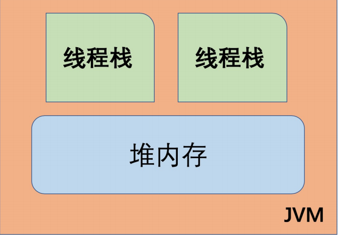
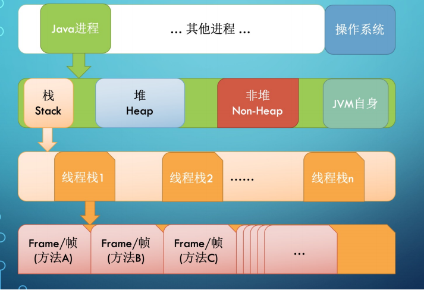
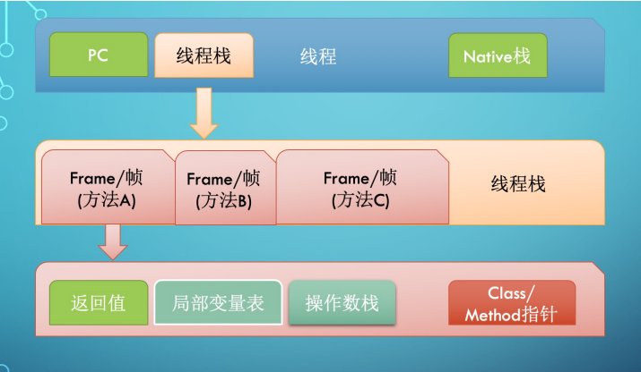
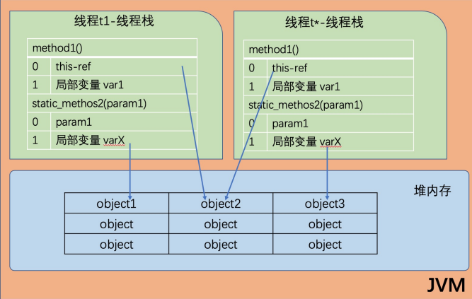
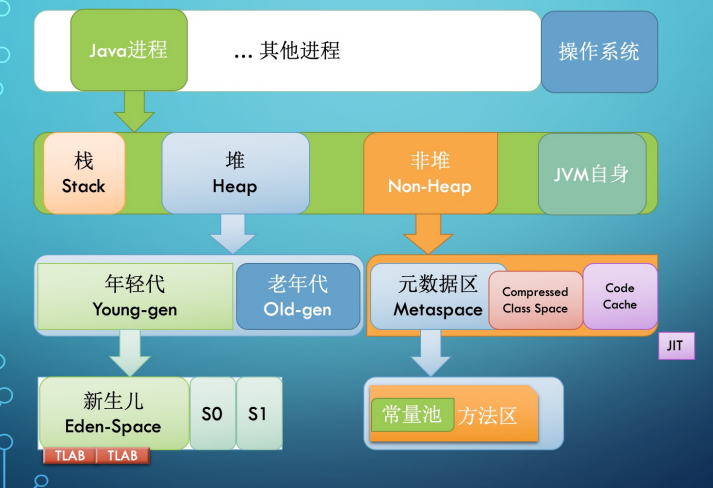
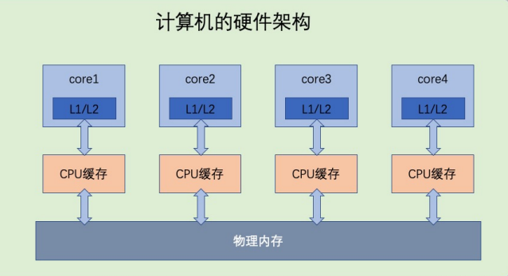
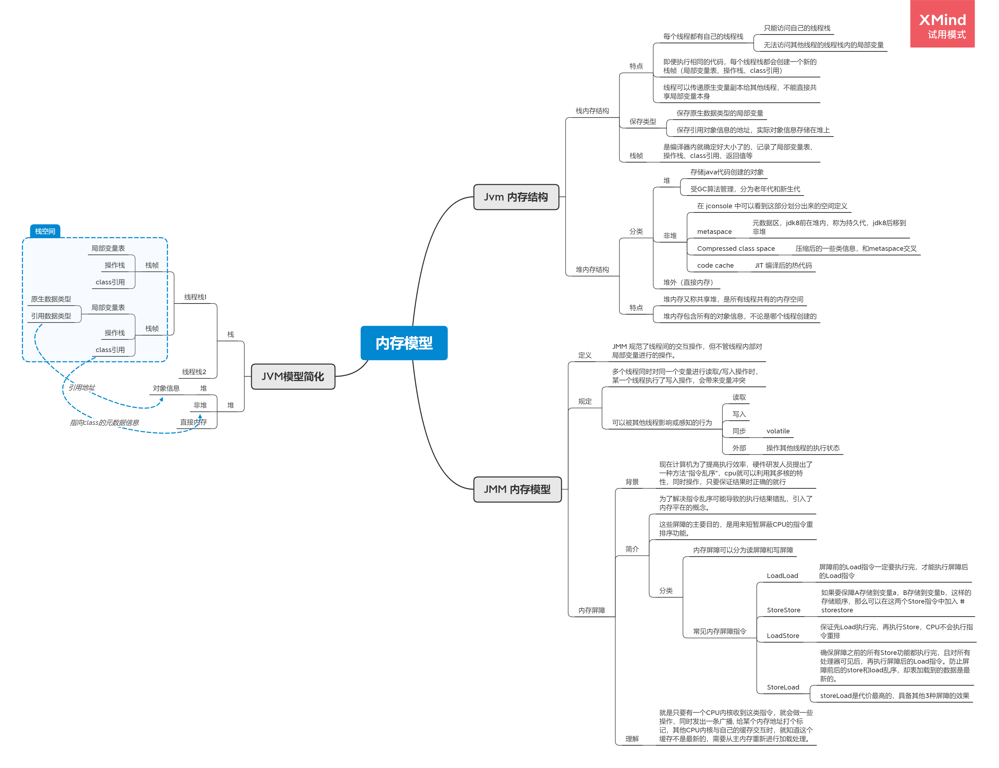

[toc]

---

# 前言

>  ==Jvm是一个完整的计算机模型，所以自然就需要有对应的内存模型，这个模型被称为 “ Java内存模型 ”，对应的英文是“ Java Memory Model ”，简称 JMM 。==

Java内存模型规定了JVM应该如何使用计算机内存（RAM）。   
广义来讲， Java内存模型分为两个部分：

- `Jvm` 内存结构 
- JMM与线程规范

其中，JVM内存结构是底层实现，也是我们理解和认识 `JMM` 的基础。 大家熟知的堆内存、栈内存等运行时数据区的划分就可以归为JVM内存结构。

# JVM内存结构

JVM内部使用的Java内存模型， **在逻辑上**将内存划分为 **线程栈 （thread stacks）** 和 **堆内存 （heap）**两个部分。

==JVM中，**每个正在运行的线程，都有自己的线程栈**。 线程栈包含了当前正在执行的方法链/调用链上的所有方法的状态信息。==  
线程栈又被称为“ **方法栈** ”或“ **调用栈** ”（call stack）。

线程栈里面保存了调用链上**正在执行的所有方法中的局部变量**。

- 每个线程都只能访问自己的线程栈。
- 每个线程都不能访问(看不见)其他线程的局部变量

即使**两个线程正在执行完全相同的代码**，但每个线程都会**在自己的线程栈内创建对应代码中声明的局部变量**。 所以**每个线程都有一份自己的局部变量副本**。

- 所有**原生类型的局部变量都存储在线程栈**中，因此**对其他线程是不可见的**。
- 线程可以将一个原生变量值的副本传给另一个线程，但**不能共享原生局部变量本身**。
- **堆内存中包含了Java代码中创建的所有对象，不管是哪个线程创建的**。 其中也涵 盖了包装类型（例如 Byte ， Integer ， Long 等）。
- 不管是创建一个对象并将其赋值给局部变量， 还是赋值给另一个对象的成员变量，**创建的对象都会被保存到堆内存中**。

下图演示了线程栈上的调用栈和局部变量，以及存储在堆内存中的对象：

- 如果是原生数据类型的局部变量，那么它的内容就全部保留在线程栈上。
- 如果是对象引用，则栈中的局部变量槽位中保存着对象的引用地址，而实际的对象内容保存在堆中。
- 对象的成员变量与对象本身一起存储在堆上,不管成员变量的类型是原生数值， 还是对象引用。
- 类的静态变量则和类定义一样都保存在堆中

## 栈内存的结构

每启动一个线程，JVM就会在栈空间栈分配对应的 线程栈, 比如 **1MB 的空间（ ‐Xss1m ）**。 

java虚拟机提供了参数 **-Xss来指定线程的最大空间**，这个参数也直接决定了方法调用的最大深度。

线程栈也叫做Java方法栈。**如果使用了JNI方法，则会分配一个单独的本地方法栈 (Native Stack)**

线程执行过程中，一般会有多个方法组成调用栈(Stack Trace), 比如A调用B，B调用C。每执行到一个方法，就会创建对应的 **栈帧** (Frame)

栈帧是一个逻辑上的概念，具体的大小在一个方法编写完成后基本上就能确定。 

比如 **返回值** 需要有一个空间存放吧，每个 **局部变量** 都需要对应的地址空间，此外 还有给指令使用的 **操作数栈** ，以及**class指针**(标识这个栈帧对应的是哪个类的方法, 指向非堆里面的Class对象）

### 小结

==方法中使用的原生数据类型和对象引用地址在栈上存储；对象、对象成员 与类定义、静态变量在堆上。==

**堆内存又称为“ 共享堆 ”，**堆中的所有对象，可以被所有线程访问,只要他们能拿到对象的引用地址。

- 如果一个线程可以访问某个对象时，也就可以访问该对象的成员变量。
- 如果两个线程同时调用某个对象的同一方法，则它们都可以访问到这个对象的成员变量，但每个线程的局部变量副本是独立的

虽然各个线程自己使用的局部变量都在自己的栈上，但是大家可以共享堆上的对象，特别地各个不同线程访问同一个对象实例的基础类型的成员变量，会给每 个线程一个变量的副本

## 堆内存的结构

**堆内存是所有线程共用的内存空间**，理论上大家都可以访问里面的内容。

但JVM的具体实现一般会有各种优化。比如将**逻辑上的Java堆**,划分为 **堆(Heap)和 非堆(Non‐Heap)** 两个部分。这种划分的依据在于，==我们编写的Java代码，基本上只能使用Heap这部分空间，发生内存分配和回收的主要区域也在这部分，所以有一种说法，这里的Heap也叫GC管理的堆(GC Heap)。==

### 堆

GC理论中有一个重要的思想，叫做分代。 经过研究发现，程序中分配的对象，要么 用过就扔，要么就能存活很久很久。  
因此，JVM将Heap内存分为年轻代（Young generation）和老年代（Old generation, 也叫 Tenured）两部分。

**年轻代还划分为3个内存池，新生代(Eden space)和存活区(Survivor space), 在大部分
GC算法中有2个存活区(S0,S1)**，在我们可以观察到的**任何时刻，S0和S1总有一个是空的**,但一般较小，也不浪费多少空间

==具体实现对新生代还有优化，那就是**TLAB**(Thread Local Allocation Buffer), 给每个线程先划定一小片空间，你创建的对象先在这里分配，满了再换。这能极大降低并发资 源锁定的开销。==

### 非堆

> java 官方工具 jconsole 可以看到这样的定义。，

Non­Heap本质上还是Heap，只是一般不归GC管理，里面划分为3个内存池。 

- 元数据区，Metaspace, 以前叫持久代(永久代, Permanent generation), Java8换了个名字叫 Metaspace.
- Java8将方法区移动到了Meta区里面，而方法又是class的一部分。。。和CCS交叉
- CCS, Compressed Class Space,存放class信息的，和 Metaspace 有交叉。 
- Code Cache, 存放 JIT编译器编译后的本地机器代码。

# JMM

## 背景

> JMM 规范对应的是 JSR-133 《Java 语言规范》 的 Memory Model 章节

JMM规范明确定义了**不同的线程之间，通过哪些方式，在什么时候可以看见其他线程保存到共享变量中的值**；以及在必要时，**如何对共享变量的访问进行同步**。这样的**好处**是屏蔽各种硬件平台和操作系统之间的内存访问差异，实现了Java并发程序真正的**跨平台**。

## 简介

JMM定义了一些术语和规定：

- 被多个线程共享使用的内存称之为**“共享内存”或"堆内存"**
- 所有的对象（包括内部的实例成员变量），static变量，以及数组，都必须存放到堆内存中。
- 局部变量，方法的形参/入参，异常处理语句的入参不允许在线程之间共享，所以不受到内存模型的影响。

- 多个线程同时对一个变量执行**读取/写入**时，这时候只要有某个线程执行的时写操作，那么就会引起 **“冲突”**

- 可以被其他线程影响或感知的操作，成为**线程间的交互行为**，可分为：读取、写入、同步、外部操作等。
  - 同步操作包括：
    - 对 volatile变量的读写
    - 对管程(monitor) 的锁定与解锁
    - 线程的起始操作和结尾操作
  - 外部操作包括
    - 对线程执行环境之外的操作，比如停止其他线程。

**`JMM` 规范的是线程间的交互操作，而不管线程内对局部变量进行的操作。**

# 内存屏障

## 背景（CPU指令与乱序执行）

计算机按支持的指令大致可以分为两类：

- **精简指令集计算机(RISC)** , 代表是如今大家熟知的 ARM 芯片，功耗低，运算能力相对较弱。
- **复杂指令集计算机(CISC)** , 代表作是Intel的X86芯片系列，比如奔腾，酷睿，至强，以及AMD的CPU。特点是性能强劲，功耗高。（实际上从奔腾4架构开始，对外是复杂指令集，内部实现则是精简指令集，所以主频才能大幅度提高）

写过程序的人都知道，同样的计算，可以有不同的实现方式。 硬件指令设计同样如此，比如说我们的系统需要实现某种功能，那么复杂点的办法就是在CPU中封装一个逻辑运算单元来实现这种的运算，对外暴露一个专用指令。  
当然也可以偷懒，不实现这个指令，而是由程序编译器想办法用原有的那些基础的，通用指令来模拟和拼凑出这个功能。那么随着时间的推移，实现专用指令的CPU指令集就会越来越复杂，被称为复杂指令集。 而偷懒的CPU指令集相对来说就会少很多，甚至砍掉了很多指令，所以叫精简指令集计算机。

不管哪一种指令集，CPU的实现都是采用流水线的方式。如果CPU一条指令一条指令地执行，那么很多流水线实际上是闲置的。简单理解，可以类比一个KFC的取餐窗口就是一条流水线。于是硬件设计人员就想出了一个好办法： “ **指令乱序** ”。  
CPU完全可以根据需要，通过内部调度把这些指令打乱了执行，充分利用流水线资源，只要最终结果是等价的，那么程序的正确性就没有问题。但这在如今多CPU内核的时代，随着复杂度的提升，并发执行的程序面临了很多问题。

CPU是多个核心一起执行，同时JVM中还有多个线程在并发执行，这种多对多让局面变得异常复杂，稍微控制不好，程序的执行结果可能就是错误的。

## 作用

前面提到了CPU会在合适的时机，按需要对将要进行的操作重新排序，但是有时候这个重排机会导致我们的代码跟预期不一致。

内存屏障可分为 **读屏障** 和 **写屏障** ，用于控制可见性。 常见的 内存屏障 包括：

- #LoadLoad 
- #StoreStore
- #LoadStore 
- #StoreLoad

==这些屏障的主要目的，是用来短暂屏蔽CPU的指令重排序功能。==

和CPU约定好，看见这些指令时，就要保证这个指令前后的相应操作不会被打乱。

- 比如看见 **#LoadLoad** ,那么屏障前面的Load指令就一定要先执行完，才能执行屏障后面的Load指令。
- 比如我要先把a值写到A字段中，然后再将b值写到B字段对应的内存地址。如果要严格保障这个顺序,那么就可以在这两个Store指令之间加入一个 **#StoreStore** 屏障。 
- 遇到 **#LoadStore** 屏障时,CPU自废武功，短暂屏蔽掉指令重排序功能。
- **#StoreLoad** 屏障, 能确保屏障之前执行的所有store操作，都对其他处理器可 见; 在屏障后面执行的load指令,都能取得到最新的值。换句话说,有效阻止屏障之前的store指令，与屏障之后的load指令乱序、即使是多核心处理器，在执行这些操作时的顺序也是一致的

==代价最高的是 **#StoreLoad** 屏障, 它同时具有其他几类屏障的效果，可以用来代替另外三种内存屏障。==

如何理解呢?  
就是只要有一个CPU内核收到这类指令，就会做一些操作，同时发出一条广播, 给某个内存地址打个标记，其他CPU内核与自己的缓存交互时，就知道这个缓存不是最新的，需要从主内存重新进行加载处理。

# 总结

1. JVM的内存区域分为: 堆内存 和 栈内存 ； 
2. 栈内存
3. 堆内存的实现可分为两部分: 堆(Heap) 和 非堆(Non‐Heap) ;
4. 堆主要由GC负责管理，按分代的方式一般分为: 老年代+年轻代；年轻代=新生代 +存活区； 
5. CPU有一个性能提升的利器: 指令重排序 ； 
6. JMM规范对应的是 JSR133, 现在由Java语言规范和JVM规范来维护；
7. 内存屏障的分类与作用。

