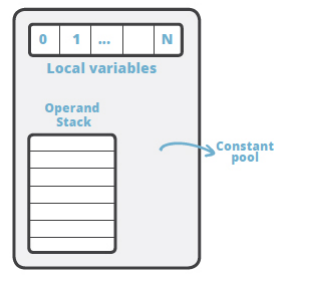
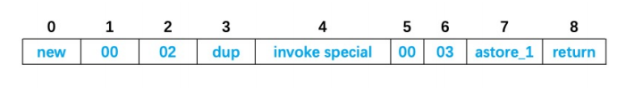
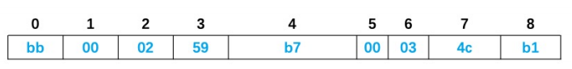
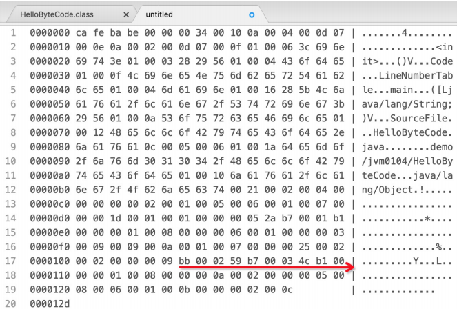
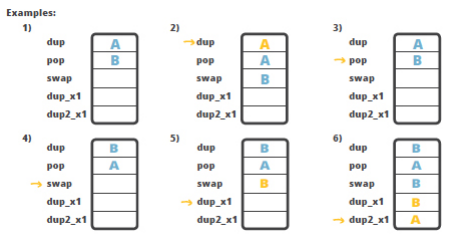
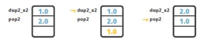
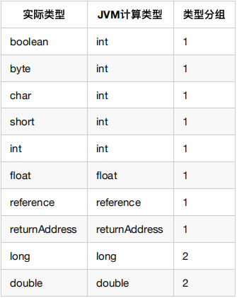
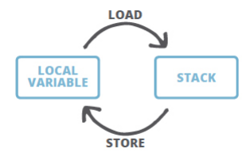
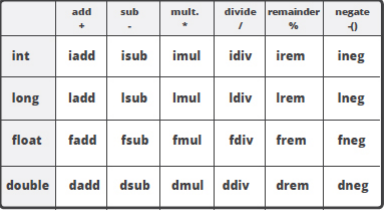
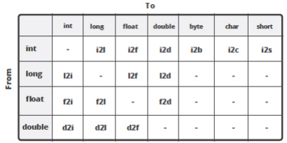

[toc]

---

# 前言

Java中的字节码，英文名为 bytecode ,是Java代码编译后的中间代码格式。JVM需要读取并解析字节码才能执行相应的任务。

**从技术人员的角度看**，Java字节码是JVM的指令集。JVM加载字节码格式的class文件，校验之后通过JIT编译器转换为本地机器代码执行。


对于卓越而有追求的程序员，都能深入去探索一些技术细节， 在需要的时候，可以在代码被执行前解读和理解中间形式的代码。对于Java来说，中间代码格式就是Java字节码。 了解字节码及其工作原理，对于编写高性能代码至关重 要，对于深入分析和排查问题也有一定作用，所以我们要想深入了解JVM来说，了解字节码也是夯实基础的一项基本功。


而对于工具领域和程序分析来说,字节码就是必不可少的基础知识了，通过修改字节码来调整程序的行为是司空见惯的事情。想了解分析器(Profiler)，Mock框架，AOP 等工具和技术这一类工具，则必须完全了解Java字节码。

# Java字节码简介
有一件有趣的事情，就如名称所示, **Java bytecode **由单字节( **byte** )的指令组成， 理论上最多支持 **256** 个操作码(opcode)。实际上Java只使用了200左右的操作码， 还有一些操作码则保留给调试操作。

操作码， 下面称为 **指令** , 主要由 **类型前缀** 和 **操作名称** 两部分组成。

> 例如，' i ' 前缀代表 ‘ integer ’，所以，' iadd ' 很容易理解, 表示对整数执行加 法运算。

**根据指令的性质，主要分为四个大类**

1. 栈操作指令，包括与局部变量交互的指令
2. 程序流程控制指令
3. 对象操作指令，包括方法调用指令 
4. 算术运算以及类型转换指令

# 获取字节码清单

1. 我们先创建一个`HelloByteCode.java`文件如下：

```java
package top.zsmile.test.jvm.bytecode;

public class HelloByteCode {
    public static void main(String[] args) {
        HelloByteCode obj = new HelloByteCode();
    }
}
```

2. 通过 `javac`  将 `.java` 文件编译成 `.class` 文件。或者在 IDEA或者Eclipse等集成开发工具自动编译，基本上是等效的。只要能找到对应的 class即可。

> javac 不指定 -d 参数编译后生成的 .class 文件默认和源代码在同一个目录。  
> 注意: javac 工具默认开启了优化功能,生成的字节码中没有局部变量表(LocalVariableTable)，相当于 局部变量名称被擦除。如果需要这些调试信息, 在编译时请加上 **-g** 选项。有兴趣的同学可以试试两种方式的区别，并对比结果。  

```shell
javac .\HelloByteCode.java

# 生成在demo 目录下，需要先创建目录
javac -d demo .\HelloByteCode.java
```

3. 可以用 **javap** 工具来获取 class 文件中的指令清单。 javap 是标准JDK 内置的一 款工具, 专门用于反编译class文件。

> JDK自带工具的详细用法, 请使用: javac -help 或者 javap -help 来查看; 其他类似。

然后使用 javap 工具来执行反编译, 获取字节码清单：
```shell
javap -c HelloByteCode # 当前 目录执行

# demo 目录下
javap -c demo.HelloByteCode
javap -c demo/HelloByteCode
javap -c demo/HelloByteCode.class
```

# 解读字节码清单

```shell
Compiled from "HelloByteCode.java"
public class top.zsmile.test.jvm.bytecode.HelloByteCode {
  public top.zsmile.test.jvm.bytecode.HelloByteCode();
    Code:
       0: aload_0
       1: invokespecial #1                  // Method java/lang/Object."<init>":()V
       4: return

  public static void main(java.lang.String[]);
    Code:
       0: new           #2                  // class top/zsmile/test/jvm/bytecode/HelloByteCode
       3: dup
       4: invokespecial #3                  // Method "<init>":()V
       7: astore_1
       8: return
}
```

可以看到，反编译后的代码清单中, 有一个默认的构造函数 HelloByteCode() , 以及 main 方法

自动生成的构造函数，其方法体应该是空的，但这里看到里面有一些指令。为什么呢？  
再次回顾Java知识, 每个构造函数中都会先调用 super 类的构造函数对吧？ 但这不是JVM自动执行的, 而是由程序指令控制，所以默认构造函数中也就有一些字节码指令来干这个事情。

基本上，这几条指令就是执行 super() 调用；
```java

 public top.zsmile.test.jvm.bytecode.HelloByteCode();
    Code:
       0: aload_0
       1: invokespecial #1                  // Method java/lang/Object."<init>":()V
       4: return

// java/lang/Object是默认继承了Object 类，是在编译时期就确定了的。

```

# 查看class文件的常量池信息

在 **javap** 命令中使用 **-verbose** 选项时， 还显示常量池信息。

```shell
javap -c -verbose HelloByteCode
```

常量池 大家应该都听说过, 英文是 Constant pool 。这里做一个强调: 大多数时候指的是 运行时常量 池 。但运行时常量池里面的常量是从哪里来的呢? 主要就是由 class 文件中的 常量池结构体 组成的。

> -verbose用于输出常量池和本地变量信息

```shell
Classfile /D:/project/B.Smile/SmileX-boot/smilex-study/src/test/java/top/zsmile/test/jvm/bytecode/HelloByteCode.class
  Last modified 2023-6-17; size 317 bytes
  MD5 checksum f051f7adba144f74795cb61735f4ac41
  Compiled from "HelloByteCode.java"
public class top.zsmile.test.jvm.bytecode.HelloByteCode
  minor version: 0
  major version: 52
  flags: ACC_PUBLIC, ACC_SUPER
```

其中显示了很多关于class文件信息： 编译时间， MD5校验和， 从哪个 .java 源文件编译得来，符合哪 个版本的Java语言规范等等。 

还可以看到 **ACC_PUBLIC** 和 **ACC_SUPER** 访问标志符。
- **ACC_PUBLIC** 标志很容易理解：这个类是 **public** 类，因此用这个标志来表示。 
- **ACC_SUPER** 标志是怎么回事呢？ 这就是历史原因, JDK1.0 的BUG修正中引入 **ACC_SUPER** 标志来修正 **invokespecial** 指令调用 super 类方法的问题，从 Java 1.1 开始， 编译器一般都会自动生成 **ACC_SUPER** 标志。

指令后面跟着的#1,#2,#3编号都是对常量池的引用。

==总结一下，常量池就是一个常量的大字典，使用编号的方式把程序里用到的各类常量统一管理起来，这样在字节码操作里，只需要引用编号即可。==

# 查看方法信息
在 **javap** 命令中使用 **-verbose** 选项时， 还显示方法的更多信息：

```java
public static void main(java.lang.String[]);
    descriptor: ([Ljava/lang/String;)V
    flags: ACC_PUBLIC, ACC_STATIC
    Code:
      stack=2, locals=2, args_size=1
```

可以看到方法描述: ([Ljava/lang/String;)V ：
- 其中小括号内是入参信息/形参信息, 
- 左方括号表述数组, 
- L 表示对象, 
- 后面的 java/lang/String 就是类名称
- 小括号后面的 V 则表示这个方法的返回值是 void
- 方法的访问标志也很容易理解 **flags: ACC_PUBLIC, ACC_STATIC** ，表示public和static

还可以看到执行该方法时需要的栈(stack)深度是多少，需要在局部变量表中保留多少个槽位, 还有方法的参数个数: **stack=2, locals=2, args_size=1**。把上面这些整合起来其实就是一个方法：
> public static void main(java.lang.String[]);  
> 注：实际上我们一般把一个方法的修饰符+名称+参数类型清单+返回值类型，合在一起叫“方法签名”， 即这些信息可以完整的表示一个方法。

看编译器自动生成的无参构造函数字节码:
```java
  public top.zsmile.jvm.bytecode.HelloByteCode();
    descriptor: ()V
    flags: ACC_PUBLIC
    Code:
      stack=1, locals=1, args_size=1
         0: aload_0
         1: invokespecial #1                  // Method java/lang/Object."<init>":()V
         4: return
      LineNumberTable:
        line 3: 0
      LocalVariableTable:
        Start  Length  Slot  Name   Signature
            0       5     0  this   Ltop/zsmile/jvm/bytecode/HelloByteCode;
```
你会发现一个奇怪的地方, 无参构造函数的参数个数居然不是0: **stack=1, locals=1,args_size=1 。**

这是因为在 Java 中, 如果是**静态方法则没有 this 引用**。 对于**非静态方法， this 将被分配到局部变量 表的第0号槽位中**, 关于局部变量表的细节,下面再进行介绍
> 有反射编程经验的同学可能比较容易理解: Method#invoke(Object obj, Object... args) ;  
> 有JavaScript编程经验的同学也可以类比: fn.apply(obj, args) && fn.call(obj, arg1,arg2);

这里新建了一个静态方法进行对比

```java
 public static void test();
    descriptor: ()V
    flags: ACC_PUBLIC, ACC_STATIC
    Code:
      stack=2, locals=0, args_size=0
         0: getstatic     #2                  // Field java/lang/System.out:Ljava/io/PrintStream;
         3: ldc           #3                  // String test
         5: invokevirtual #4                  // Method java/io/PrintStream.println:(Ljava/lang/String;)V
         8: return
      LineNumberTable:
        line 5: 0
        line 6: 8

```

这里可以看到 `args_size=0`，因为**静态方法没有this引用**。

# 线程栈与字节码执行模型

JVM是一台基于栈的计算机器。每个线程都有一个独属于自己的线程栈(JVM stack)，用于存储 栈帧 (Frame)。  
每一次方法调用，JVM都会自动创建一个栈帧。 **栈帧 由 操作数栈 ， 局部变量数组 以及一个 真数据区（class引用、异常处理表）组成**。 **class引用指向当前方法在运行时常量池中对应的class**。异常处理表对应的是发生异常时，方便找到异常处理的地方。



**局部变量数组** 也称为 **局部变量表** (LocalVariableTable), 其中包含了方法的参数，以及局部变量。 局部变 量数组的大小在编译时就已经确定: 和局部变量+形参的个数有关，还要看每个变量/参数占用多少个字节。 操作数栈是一个**LIFO结构**的栈， 用于压入和弹出值。 它的大小也在编译时确定。

有一些操作码/指令可以将值压入“操作数栈”； 还有一些操作码/指令则是从栈中获取操作数，并进行处理， 再将结果压入栈。操作数栈还用于接收调用其他方法时返回的结果值。

# 方法体中的字节码解读

```java
0: new           #5                  // class top/zsmile/jvm/bytecode/HelloByteCode
3: dup
4: invokespecial #6                  // Method "<init>":()V
7: astore_1
8: return
```

==间隔不相等的原因是,有一部分操作码会附带有操作数, 也会占用字节码数组中的空间。==

例如， new 就会占用三个槽位: 一个用于存放操作码指令自身，两个用于存放操作数。 因此，下一条指令 dup 的索引从 3 开始



每个操作码/指令都有对应的十六进制(HEX)表示形式， 如果换成十六进制来表示，则方法体可表示为HEX字 符串。例如上面的方法体表示成十六进制如下所示：



甚至我们还可以在支持十六进制的编辑器中打开class文件，可以在其中找到对应的字符串：



粗暴一点，我们可以通过HEX编辑器直接修改字节码，尽管这样做会有风险，但如果只修改一个数值的话 应该会很有趣。  
其实要使用编程的方式，方便和安全地实现字节码编辑和修改还有更好的办法，那就是使用**ASM和 Javassist之类的字节码操作工具**，也可以在类加载器和Agent上面做文章

# 对象初始化指令：new指令, init 以及clinit 简介

我们都知道 new 是Java编程语言中的一个关键字， 但其实在字节码中，也有一个指令叫做 new 。 当我 们创建类的实例时,编译器会生成类似下面这样的操作码：
```java
0: new           #5                  // class top/zsmile/jvm/bytecode/HelloByteCode
3: dup
4: invokespecial #6                  // Method "<init>":()V

```

当你同时看到 **new, dup 和 invokespecial 指令在一起**时，那么一定是在**创建类的实例对象**！

为什么是三条指令而不是一条呢？这是因为：
- new 指令只是创建对象，但没有调用构造函数
- invokespecial 指令用来调用某些特殊方法的, 当然这里调用的是构造函数。
- dup 指令用于复制栈顶的值

==由于构造函数调用不会返回值，所以如果没有dup指令, 在对象上调用方法并初始化之后，操作数栈就会是空的，在初始化之后就会出问题, 接下来的代码就无法对其进行处理。==

这就是为什么要**事先复制引用的原因**，为的是在构造函数返回之后，可以将对象实例赋值给局部变量或某个字段。因此，接下来的那条指令一般是以下几种：
- astore {N} or astore_{N} – 赋值给局部变量，其中 {N} 是局部变量表中的位置。
- putfield – 将值赋给实例字段
- putstatic – 将值赋给静态字段

==在调用构造函数的时候，其实还会执行另一个类似的方法 **<init>** ，甚至在执行构造函数之前就执行了。 还有一个可能执行的方法是该类的**静态初始化方法 <clinit> **， 但 **<clinit>** 并不能被直接调用，而 是由**这些指令触发的： new , getstatic , putstatic or invokestatic** 。==

实际上，还有一些情况会触发静态初始化， 详情请参考JVM规范： [http://docs.oracle.com/javase/specs/jvms/se8/html/]

# 栈内存操作指令

- dup 指令, 复制栈顶的值, 并将复制的值压入栈。
- pop 指令则从栈中删除最顶部的值。
-  swap 指令可交换栈顶两个元素的值，例如A和B交换位置(图中示例4)；
- dup_x1 指令, 复制栈顶的值, 并将复制的值插入到最上面2个值的下方。(图中示例5)；
- dup2_x1 指令, 复制栈顶1个64位/或2个32位的值, 并将复制的值按照原始顺序，插入原始值下面一 个32位值的下方(图中示例6)。



dup_x1 和 dup2_x1 指令看起来稍微有点复杂。而且为什么要设置这种指令呢? 在栈中复制最顶部的 值？

请看一个实际案例：怎样交换2个double类型的值？

==需要注意的是, 一个double值占两个槽位，也就是说如果栈中有两个double值，它们将占用4个槽位。==

要执行交换，你可能想到了 swap 指令，但问题是 swap 只适用于单字(one-word, 单字一般指32位4个 字节, 64位则是双字)，所以不能处理double类型, 但Java中又没有 swap2 指令。

怎么办呢? 解决方法就是使用 dup2_x2 指令, 将操作数栈顶部的double值, 复制到栈底double值的下方， 然后再使用 pop2 指令弹出栈顶的double值。结果就是交换了两个 double 值。 示意图如下图所示:



## dup , dup_x1 , dup2_x1 指令补充说明
- dup指令  

官方说明是: 复制栈顶的值, 并将复制的值压入栈.  
操作数栈的值变化情况(方括号标识新插入的值):

```java
..., value → 
..., value [,value]
```

- dup_x1 指令

官方说明是: 复制栈顶的值, 并将复制的值插入到最上面2个值的下方。  
操作数栈的值变化情况(方括号标识新插入的值):

```
..., value2, value1 → 
..., [value1,] value2, value1
```

- dup2_x1 指令

官方说明是: 复制栈顶 1个64位/或2个32位的值, 并将复制的值按照原始顺序，插入原始值下面一个32位值的 下方。  
操作数栈的值变化情况(方括号标识新插入的值):

```
# 情景1: value1, value2, and value3都是分组1的值(32位元素) 
..., value3, value2, value1 → 
..., [value2, value1,] value3, value2, value1 

# 情景2: value1 是分组2的值(64位,long或double), value2 是分组1的值(32位元素) 
..., value2, value1 → 
..., [value1,] value2, value1

```

> [Table 2.11.1-B 实际类型与JVM计算类型映射和分组](https://docs.oracle.com/javase/specs/jvms/se8/html/jvms-2.html#jvms-2.11.1)




# 局部变量表

**stack **主要用于执行指令，而局部变量则用来保存中间结果，两者之间可以直接交互。

> javac -g demp/*.java  
>  -g 参数生成调试信息

==关于 LocalVariableTable 有个有意思的事情， 就是最前面的槽位会被方法参数占用。==  
在这里，因为 main 是静态方法，所以槽位0中并没有设置为 this 引用的地址。 但是对于非静态方法 来说， this 会将分配到第0号槽位中



理解这些字节码的诀窍在于: 
- 给局部变量赋值时，需要使用相应的指令来进行 store ，如 astore_1 。 **store 类的指令都会删除栈顶值**。 
- 相应的 load 指令则会将值从局部变量表压入操作数栈，但并**不会删除局部变量表中的值**。

## 垃圾回收扩展

局部变量表中的变量也是重要的垃圾回收节点，**只要被局部变量表中直接或间接引用的对象都是不会被回收的**。

下面看个例子，来分析一下。

```java

// 用6M空间测试
int size = 6 * 1024 * 1024;

public void gc1() {
    byte[] a = new byte[size];
    System.gc();
}

public void gc2() {
    byte[] a = new byte[size];
    a = null;
    System.gc();
}

public void gc3() {
    {
        byte[] a = new byte[size];
    }
    System.gc();
}

public void gc4() {
    {
        byte[] a = new byte[size];
    }
    int c = 10;
    System.gc();
}

public void gc5() {
    gc1();
    System.gc();
}
```

- gc1。申请空间后，立即进行回收，此时byte数组被变量a引用无法回收。
- gc2。申请空间后，先将变量a设置为null，使得byte数组没有被引用，所以直接被回收
- gc3。申请空间后，虽然变量a在局部作用域内，当执行回收时，变量a已经失效，但是局部变量表中依然还有引用指向，所以无法回收。
- gc4。和gc4不同的是，回收前对变量c进行赋值，这时因为变量a已失效，所以变量c直接使用了变量a的slot，所以byte数组被回收
- gc5。执行gc1的时候，在gc1中没有释放byte数组，所以在gc1中无法回收byte数组。但是当gc1返回后，栈帧销毁，所以在gc5中可以顺利回收byte数组。

分析方法：可以使用参数 -XX:+PrintGC 执行上述几个函数，在输出日志中查看垃圾回收后堆的大小变化，判断byte数组是否被回收。


# 流程控制指令
流程控制指令主要是分支和循环在用, 根据检查条件来控制程序的执行流程。

```java
public class MovingAverage {
    private int count = 0;
    private double sum = 0.0d;

    public void submit(double value) {
        this.count++;
        this.sum += value;
    }

    public double getAvg() {
        if (0 == this.count) {
            return sum;
        }
        return this.sum / this.count;
    }
}
```

一般是 If-Then-Else 这种三元运算符(ternary operator)，   
Java中的各种循环，甚至异常处的理操作码都可归属于 程序流程控制


```
 0: new           #2                  // class top/zsmile/bytecode/MovingAverage
         3: dup
         4: invokespecial #3                  // Method top/zsmile/bytecode/MovingAverage."<init>":()V
         7: astore_1
         8: getstatic     #4                  // Field numbers:[I
        11: astore_2
        12: aload_2
        13: arraylength
        14: istore_3
        15: iconst_0
        16: istore        4
        18: iload         4
        20: iload_3
        21: if_icmpge     43
        24: aload_2
        25: iload         4
        27: iaload
        28: istore        5
        30: aload_1
        31: iload         5
        33: i2d
        34: invokevirtual #5                  // Method top/zsmile/bytecode/MovingAverage.submit:(D)V
        37: iinc          4, 1
        40: goto          18
        43: aload_1
        44: invokevirtual #6                  // Method top/zsmile/bytecode/MovingAverage.getAvg:()D
        47: dstore_2
        48: return
      LineNumberTable:
        line 7: 0
        line 8: 8
        line 9: 30
        line 8: 37
        line 11: 43
        line 12: 48
      LocalVariableTable:
        Start  Length  Slot  Name   Signature
           30       7     5 number   I
            0      49     0  args   [Ljava/lang/String;
            8      41     1    ma   Ltop/zsmile/bytecode/MovingAverage;
           48       1     2   avg   D
```

位置 [8~16] 的指令用于循环控制。  
我们从代码的声明从上往下看, 在最后面的LocalVariableTable 中:
- 0 号槽位被main方法的参数 args 占据了。 
- 1 号槽位被 ma 占用了。
- 5 号槽位被 number 占用了。 
- 2 号槽位是for循环之后才被 avg 占用的

通过分析字节码指令可以看出，在 2 , 3 , 4 槽位有3个匿名的局部变量( astore_2 , istore_3 ,
istore 4 等指令)

- 2 号槽位的变量保存了 numbers 的引用值，占据了 2 号槽位。
- 3 号槽位的变量, 由 arraylength 指令使用, 得出循环的长度。
- 4 号槽位的变量, 是循环计数器， 每次迭代后使用 iinc 指令来递增。

> 如果我们的JDK版本再老一点, 则会在 2 , 3 , 4 槽位发现三个源码中没有出现的变量： arr$ ,
> len$ , i$ ， 也就是循环变量

```
18: iload 4 
20: iload_3 
21: if_icmpge 43
```
这段指令将局部变量表中 4 号槽位 和 3 号槽位的值加载到栈中，并调用 if_icmpge 指令来比较他们的值。

==【 if_icmpge 解读: if, integer, compare, great equal】, 如果一个数的值大于或等于另一个值，则程序执 行流程跳转到 pc=43 的地方继续执行。==

# 算数运算指令与类型转换指令
Java字节码中有许多指令可以执行算术运算。实际上，指令集中有很大一部分表示都是关于数学运算的。对 于所有数值类型( int , long , double , float )，都有加，减，乘，除，取反的指令。

那么 byte 和 char , boolean 呢? JVM 是当做 int 来处理的。另外还有部分指令用于数据类型之 间的转换。

> 算术操作码和类型  
> 

> 类型转换操作码  
> 

==唯一不需要将数值load到操作数栈的指令是 iinc ，它可以直接对 LocalVariableTable 中的值进行 运算。 其他的所有操作均使用栈来执行==

# 方法调用指令和参数传递

这里列举了各种用于方法调用的指令：
- invokestatic ，顾名思义，这个指令用于调用某个类的静态方法，这也是方法调用指令中最快的一 个。
- invokespecial , 我们已经学过了, invokespecial 指令用来调用构造函数，但也可以用于调用 同一个类中的 private 方法, 以及可见的超类方法。
- invokevirtual ，如果是具体类型的目标对象， invokevirtual 用于调用公共，受保护和打包 私有方法。
- invokeinterface，当要调用的方法属于某个接口时，将使用 invokeinterface 指令。

> 那么 invokevirtual 和 invokeinterface 有什么区别呢？这确实是个好问题。 为什么需要
> invokevirtual 和 invokeinterface 这两种指令呢? 毕竟所有的接口方法都是公共方法, 直接 使用 invokevirtual 不就可以了吗？

这么做是源于对方法调用的优化。JVM必须先解析该方法，然后才能调用它。
- 使用 invokestatic 指令，JVM就确切地知道要调用的是哪个方法：因为调用的是静态方法，只能 属于一个类。 
- 使用 invokespecial 时， 查找的数量也很少， 解析也更加容易， 那么运行时就能更快地找到所需 的方法.

使用 invokevirtual 和 invokeinterface 的区别不是那么明显。

想象一下，类定义中包含一个方 法定义表， 所有方法都有位置编号。下面的示例中：A类包含 method1和method2方法； 子类B继承A，继 承了method1，覆写了method2，并声明了方法method3。

```
//method1和method2方法在类A和类B中处于相同的索引位置。
class A 
    1: method1 
    2: method2 
class B extends A
    1: method1 
    2: method2 
    3: method3
```

那么，在运行时只要调用 method2，一定是在位置2处找到它.

现在我们来解释 invokevirtual 和 invokeinterface 之间的本质区别。

假设有一个接口X声明了methodX方法, 让B类在上面的基础上实现接口X：

```

class B extends A implements X
    1: method1 
    2: method2 
    3: method3
    4: methodX
```

新方法methodX位于索引4处，在这种情况下，它看起来与method3没什么不同。  
但如果还有另一个类C也实现了X接口，但不继承A，也不继承B：
```
class C implements X 
    1: methodC 
    2: methodX
```

**类C中的接口方法位置与类B的不同**，这就是为什么**运行时在 invokinterface 方面受到更多限制的原因**。

==与 invokinterface 相比， invokevirtual 针对具体的类型方法表是固定的，所以每次都可以精确 查找，效率更高（具体的分析讨论可以参见参考材料的第一个链接）。==

## JDK7新增的方法调用指令invokedynamic
随着JDK 7的发布，字节码指令集新增了 invokedynamic 指令。**这条新增加的指令是实现“动态类型语言”**（Dynamically Typed Language）支持而进行的改进之一，同时也是 JDK 8以后支持的**lambda表达式的实现基础**。

我们知道在不改变字节码的情况下，我们在Java语言层面想调用一个类A的方法m，只有两个办法：
- 使用 A a=new A(); a.m() ，拿到一个A类型的实例，然后直接调用方法；
- 通过反射，通过A.class.getMethod拿到一个Method，然后再调用这个 Method.invoke 反射调用；

这两个方法都需要显式的把方法m和类型A直接关联起来，假设有一个类型B，也有一个一模一样的方法签名 的m方法，怎么来用这个方法在运行期指定调用A或者B的m方法呢？这个操作在JavaScript这种基于原型的语言里或者是C#这种有函数指针/方法委托的语言里非常常见，Java里是没有直接办法的。Java里我们一般 建议使用一个A和B公有的接口IC，然后IC里定义方法m，A和B都实现接口IC，这样就可以在运行时把A和B 都当做IC类型来操作，就同时有了方法m，这样的“强约束”带来了很多额外的操作。

而新增的invokedynamic指令，配合新增的方法句柄（Method Handles，它可以用来描述一个跟类型A无关 的方法m的签名，甚至不包括方法名称，这样就可以做到我们使用方法m的签名，但是直接执行的时候调用 的是相同签名的另一个方法b），可以在运行时再决定由哪个类来接收被调用的方法。在此之前，只能使用 反射来实现类似的功能。该指令使得可以出现基于JVM的动态语言，让jvm更加强大。而且在JVM上实现动 态调用机制，不会破坏原有的调用机制。这样既很好的支持了Scala、Clojure这些JVM上的动态语言，又可以支持代码里的动态lambda表达式

> 简单来说就是以前设计某些功能的时候把做法写死在了字节码里，后来想改也改不了了。  
> 所以这次给lambda语法设计翻译到字节码的策略是就用invokedynamic来作个弊，把实际的翻译策略隐 藏在JDK的库的实现里（metafactory）可以随时改，而在外部的标准上大家只看到一个固定的 invokedynamic。

# 总结

我们可以通过字节码对整个代码的运行情况进行分析，有些时候不同的写法实现的相同功能（for和foreach），可以通过对字节码的分析判断其性能上的差距。因为编译后会将 `java` 所提供的语法糖去掉。

常用的指令有如下几个：

1. `javac` 编译 `.java` 文件。如果需要更多调试信息，可以加上 `-g` 。

   ```shell
   javac xxx.java
   
   javac -g xxx.java
   ```

2. `javap`。反编译 `.class` 文件，解析出字节码清单。可以通过 `-verbose` 查询更多信息（常量池信息，方法签名等）

   ```shell
   javap -c xxx.class 
   # or
   javap -c xxx
   
   javap -c -verbose xxx.class
   ```

3. 通过分析方法信息，我们可以注意到

   1. 执行该方法时需要的栈(stack)深度是多少，需要在局部变量表中保留多少个槽位， 还有方法的参数个数: **stack=2, locals=2, args_size=1**。
   2. `args_size`。无参静态方法和无参对象方法的区别在于，无参对象方法，会将 `this引用` 的指向通过`args_size` 的第一个槽位传入 方法中使用，所以无参对象方法的 `args_size=1`.

4. 关于对象初始化时，会调用构造方法，其实还会执行另一个类似的方法 **<init>** ，甚至在执行构造函数之前就执行了。 还有一个可能执行的方法是该类的**静态初始化方法 <clinit> **， 但 **<clinit>** 并不能被直接调用，而 是由**这些指令触发的： new , getstatic , putstatic or invokestatic** 。

5. 各种用于方法调用的指令

   - invokestatic ，顾名思义，这个指令用于调用某个类的静态方法，这也是方法调用指令中最快的一 个。
   - invokespecial , 我们已经学过了, invokespecial 指令用来调用构造函数，但也可以用于调用 同一个类中的 private 方法, 以及可见的超类方法。
   - invokevirtual ，如果是具体类型的目标对象， invokevirtual 用于调用公共，受保护和打包 私有方法。
   - invokeinterface，当要调用的方法属于某个接口时，将使用 invokeinterface 指令。
   - invokedynamic，jdk7中新增的。**这条新增加的指令是实现“动态类型语言”**（Dynamically Typed Language）支持而进行的改进之一，同时也是 JDK 8以后支持的**lambda表达式的实现基础**。可以查看一下关于lambda表达式编译出来的源码可以看出差距。

6. 关于线程栈，每次方法调用都会生成一个栈帧，里面都会包括：

   - 操作栈。
   - 局部变量表。
   - 帧数据区（class引用、异常处理表）。用户获取class的常量池，以及异常发生后的处理方式。
   
   局部变量表和操作栈是可以互相交互的，操作栈是用来执行指令的，而局部变量表是用来记录状态的。他们通过 `store` 存储到局部变量表中，通过`load`加载到操作栈里。需要注意的是：`store`会删除栈顶的数据，而`load`不会删除局部变量表中的数据

# 附录

## 关于整形入栈指令（iconst,bipush,sipush,ldc)
- iconst。用于取值1~5
- bipush。用于取值-128~127
- sipush。用于取值-32768~32767
- ldc。用于取值-2147483648~2147483647

有几点需要注意：
- 取值-1时采用iconst_m1指令
- ldc指令是从常量池中获取值的，也能用来获取字符串

