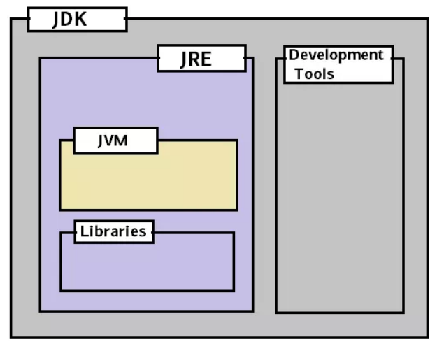
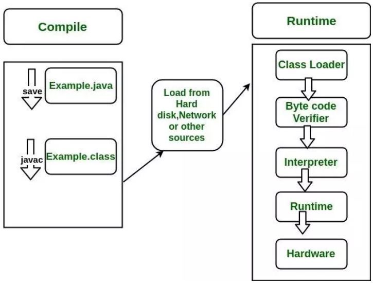

[toc]

---

# JDK、JRE、JVM的关系

## JDK
JDK（Java Development Kit） 是用于开发 Java 应用程序的软件开发工具集合，包括 了 Java 运行时的环境（JRE）、解释器（Java）、编译器（javac）、Java 归档 （jar）、文档生成器（Javadoc）等工具。简单的说我们要开发Java程序，就需要安 装某个版本的JDK工具包。

## JRE
JRE（Java Runtime Enviroment ）提供 Java 应用程序执行时所需的环境，由 Java 虚拟机（JVM）、核心类、支持文件等组成。简单的说，我们要是想在某个机器上运 行Java程序，可以安装JDK，也可以只安装JRE，后者体积比较小。

## JVM
Java Virtual Machine（Java 虚拟机）有三层含义，分别是： 
- JVM规范要求 满足 JVM 
- 规范要求的一种具体实现（一种计算机程序） 
- 一个 JVM 运行实例，在命令提示符下编写 Java 命令以运行 Java 类时，都会创建一 个 JVM 实例，我们下面如果只记到JVM则指的是这个含义；如果我们带上了某种JVM 的名称，比如说是Zing JVM，则表示上面第二种含义

## JDK 与 JRE、JVM 之间的关系

就范围来说，JDK > JRE > JVM：
- JDK = JRE + 开发工具
- JRE = JVM + 类库

三者在开发运行Java程序时的交互关系：
1. 简单的说，就是通过JDK开发的程序，编译以后，可以打包分发给其他装有JRE的机器上去运行。 
2. 运行的程序，则是通过java命令启动的一个JVM实例，代码逻辑的执行都运行在这个JVM实例上。

Java程序的开发运行过程为：

1. 我们利用 JDK （调用 Java API）开发Java程序，编译成字节码或者打包程序
2. 然后可以用 JRE 则启动一个JVM实例，加载、验证、执行 Java 字节码以及依赖库， 运行Java程序
3. 而JVM 将程序和依赖库的Java字节码解析并变成本地代码执行，产生结果

# JDK的发展过程与版本变迁

## JDK版本列表

| JDK版本 | 发布时间       | 代号               | 备注                                                         |
| ------- | -------------- | ------------------ | ------------------------------------------------------------ |
| 1       | 1996年1月23日  | Oak(橡树)          | 初代版本，伟大的一个里程碑，但是是纯解释运行，使用JIT，性能比较差，速度慢 |
| 1.1     | 1997年2月19日  | Sparkl er(宝石)    | JDBC、支持内部类、RMI、反射等等                              |
| 1.2     | 1998年12月8日  | Playground(操场)   | 集合框架、JIT等等                                            |
| 1.3     | 2000年5月8日   | Kestrel(红隼)      | 对Java的各个方面都做了大量优化和增强                         |
| 1.4     | 2004年2月6日   | Merlin(隼)         | XML处理、支持IPV6、正则表达式，引入nio和CMS垃圾回收器        |
| 5       | 2004年9月30日  | Tiger(老虎)        | 泛型、增强for语句、自动拆装箱、可变参数、静态导入、注解      |
| 6       | 2006年12月11日 | Mustang(野马)      | 支持脚本语言、JDBC4.0                                        |
| 7       | 2011年7月28日  | Dolphin(海豚)      | switch支持String类型、泛型推断、nio 2.0开发包、数            |
| 8       | 2014年3月18日  | Spider(蜘蛛)       | Lambda表达式、接口默认方法、Stream API、新的日期API、Nashorn引擎jjs，引入G1垃圾回收器 |
| 9       | 2017年9月22日  | Modularity(模块化) | 模块系统、HTTP 2 客户端、多版本兼容 JAR 包、私有接口方法、改进Stream API、响应式流（Reactive Streams) API |
| 10      | 2018年3月21日  |                    | 引入关键字 var 局部变量类型推断、统一的垃圾回收接口          |
| 11      | 2018年9月25日  |                    | HTTP客户端(标准)、无操作垃圾收集器，支持ZGC垃圾回收器，首个LTS版本 |
| 12      | 2019年3月19日  |                    | 新增一个名为Shenandoah的垃圾回收器、扩展switch 语句的功能、改进G1垃圾回收器 |
| 13      | 2019年9月17日  |                    | 改进了CDS内存共享，ZGC归还系统内存，SocketAPI  和switch语句以及文本块表示 |
| 14      | 开发中         |                    | 继续对ZGC、G1改进，标记ParallelScavenge +  SerialOld组合为过时的，移除CMS垃圾回收器 |

## Java大事记
1. 1995年5月23日，Java语言诞生
2. 1996年1月，第一个JDK­JDK1.0诞生
3. 1997年2月18日，JDK1.1发布 
4. 1997年4月2日，JavaOne会议召开，参与者逾一万人，创当时全球同类会议规模 之纪录 
5. 1997年9月，Java开发者社区成员超过十万 
6. 1998年2月，JDK1.1被下载超过200万次 
7. 1998年12月8日，JAVA2企业平台J2EE发布
8. 1999年6月，Sun公司发布Java的三个版本：标准版、企业版和微型版（J2SE、 J2EE、J2ME)
9. 2000年5月8日，JDK1.3发布 
10. 2000年5月29日，JDK1.4发布 
11. 2002年2月26日，J2SE1.4发布，自此Java的计算能力有了大幅提升
12. 2004年9月30日，J2SE1.5发布，是Java语言的发展史上的又一里程碑事件，Java并发包JUC也是这个版本引入的。为了表示这个版本的重要性，J2SE1.5更 名为J2SE5.0 
13. 2005年6月，发布Java SE 6，这也是一个比较长期使用的版本 
14. 2006年11月13日，Sun公司宣布Java全线采纳GNU General Public License Version 2，从而公开了Java的源代码 
15. 2009年04月20日，Oracle公司74亿美元收购Sun。取得java的版权 
16. 2011年7月28日，Oracle公司发布Java SE7.0的正式版 
17. 2014年3月18日，Oracle公司发布ava SE 8，这个版本是目前最广泛使用的版本 
18. 2017年9月22日，JDK9发布，API有了较大的调整，添加了对WebSocket和 HTTP/2的支持，此后每半年发布一个大版本 
19. 2018年3月21日，JDK10发布，最大的变化就是引入了var，如果你熟悉C#或 JavaScript/NodeJS就会知道它的作用
20. 2018年9月25日，JDK11发布，引入ZGC，这个也是第一个公布的长期维护版本 LTS
21. 2019年3月19日，JDK12发布，引入毫秒级停顿的Shenandoah GC
22. 2019年9月17日，JDK13发布，改进了CDS内存共享，ZGC归还系统内

> 常规的JDK，一般指OpenJDK或者Oracle JDK，当然Oracle还有一个新的JVM叫 GraalVM，也非常有意思。除了Sun/Oracle的JDK以外，原BEA公司（已被Oracle 收购）的JRockit，IBM公司的J9，Azul公司的Zing JVM，阿里巴巴公司的分支版 本DragonWell等等。