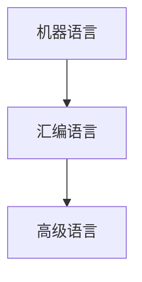
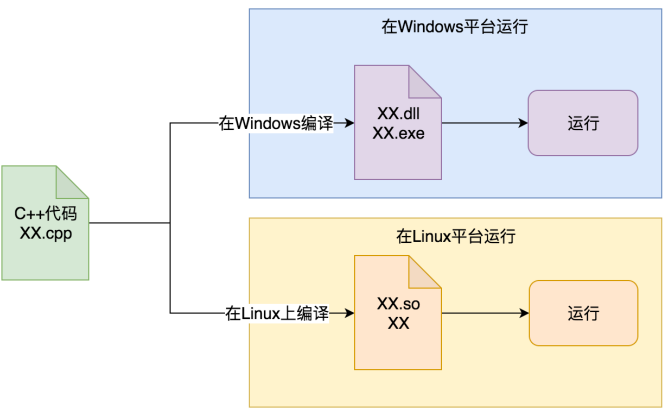
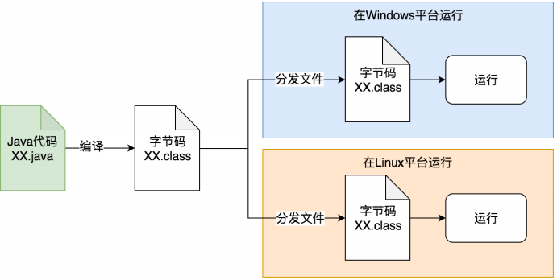

[toc]

---

# 编程语言类型

## 编程语言分类

程从底向上划分为最基本的三大类：机器语言、汇编 语言、高级语言。

按《计算机编程语言的发展与应用》一文里的定义：计算机编程语言能够实现人与机器之间的交流和沟通，而计算机编程语言主要包括汇编语言、机器语言以及高级语 言，具体内容如下：
- 机器语言：这种语言主要是利用二进制编码进行指令的发送，能够被计算机快速地识别，其灵活性相对较高，且执行速度较为可观，机器语言与汇编语言之间的相似性较高，但由于具有局限性，所以在使用上存在一定的约束性。 
- 汇编语言：该语言主要是以缩写英文作为标符进行编写的，运用汇编语言进行编写的一般都是较为简练的小程序，其在执行方面较为便利，但汇编语言在程序方 面较为冗长，所以具有较高的出错率。 
- 高级语言：所谓的高级语言，其实是由多种编程语言结合之后的总称，其可以对多条指令进行整合，将其变为单条指令完成输送，其在操作细节指令以及中间过程等方面都得到了适当的简化，所以，整个程序更为简便，具有较强的操作性，而这种编码方式的简化，使得计算机编程对于相关工作人员的专业水平要求不断放宽。

**总之**：机器语言是直接给机器执行的二进制指令，每种CPU平台都有对应的机器语言；  
而汇编语言则相当于是给机器执行的指令，按照人可以理解的助记符表示，这样代码就非常长，但是性能也很好；   
高级语言则是为了方便人来理解，进而快速设计和实现程序代码，一般跟机器语言和汇编语言的指令已经完全没有关系了，代码编写完成后通过编译或解释，转换成汇编 码或机器码，之后再传递给计算机去执行。

所以**机器语言和汇编语言都是跟目标机器的CPU架构有直接联系**，而高级语言一般就没有关系了，**高级语言高级就高级在，一份代码往往是可以跨不同的目标机器的CPU架构的**，不管是x86还是其他CPU，尽管不同CPU支持的指令集略有不同，但是都在编译或解释过程之后，变成实际平台的目标代码，进而代码的开发者很大程度上不需要关心目标平台的差异性。

## 高级语言分类
如果按照有没有虚拟机来划分，高级编程语言可分为两类：

- 有虚拟机：Java，Lua，Ruby，部分JavaScript的实现等等
- 无虚拟机：C，C++，C#，Golang，以及大部分常见的编程语言

如果按照变量是不是有确定的类型，还是类型可以随意变化来划分，高级编程语言可以分为：
- 静态类型：Java，C，C++等等
- 动态类型：所有脚本类型的语言

如果按照是编译执行，还是解释执行，可以分为： 
- 编译执行：C，C++，Golang，Rust，C#，Java，Scala，Clojure，Kotlin， Swift...等等
- 解释执行：JavaScript的部分实现和NodeJS，Python，Perl，Ruby...等等

C#和Java都是**编译后生成了一种中间类型的目标代码（类似汇编）**，但不是 汇编或机器码，在C#中称为 微软中间语言 （MSIL），在Java里叫做 Java字节码 （Java bytecode）。

虽然一般把JavaScript当做解释执行语言，但如今不少实现引擎都支持编译，比如 Google V8和Oracle Nashorn

我们还可以按照语言特点分类：
- 面向过程：C，Basic，Pascal，Fortran等等
- 面向对象：C++，Java，Ruby，Smalltalk等等
- 函数式编程：LISP、Haskell、Erlang、OCaml、Clojure、F#等等

# 关于跨平台

因为我们希望所编写的代码和程序，在源代码级别或者编译后，可以运行在多种不同的系统平台上，而不需要为了各个平台的不同点而去实现两套代码。

一般来说解释型语言都是跨平台的，同一份脚本代码，可以由不同平台上的解释器解释执行。   
但是对于编译型语言，存在两种级别的跨平台： 
- 典型的源码跨平台（C++）：
- 典型的二进制跨平台（Java字节码）：

Java语言通过**虚拟机技术**率先解决了这个难题。 源码只需要编译一次，然后把编译后的class文件或jar包，部署到不同平台，就可以直接通过安装在这些系统中的JVM上面执行。  
同时可以把依赖库（jar文件）一起复制到目标机器，慢慢地又有了可以在各个平台都直接使用的Maven中央库（类似于linux里的yum或apt­get源，macos里的 homebrew，现代的各种编程语言一般都有了这种包依赖管理机制：python的pip，dotnet的nuget，NodeJS的npm，golang的dep，rust的cargo等等）。这样就实现了让同一个应用程序在不同的平台上直接运行的能力。

## 小结
- 脚本语言直接使用不同平台的解释器执行，称之为脚本跨平台，平台间的差异由不同平台上的解释器去解决。这样的话代码很通用，但是需要解释和翻译，效率较低。
- 编译型语言的代码跨平台，同一份代码，需要被不同平台的编译器编译成相应的二进制文件，然后再去分发和执行，不同平台间的差异由编译器去解决。编译产生的文件是直接针对平台的可执行指令，运行效率很高。但是在不同平台上编译复杂软件，依赖配置可能会产生很多环境方面问题，导致开发和维护的成本较高。
- 编译型语言的二进制跨平台，同一份代码，先编译成一份通用的二进制文件，然后分发到不同平台，由虚拟机运行时来加载和执行，这样就会综合另外两种跨平台语言的优势，方便快捷地运行于各种平台，虽然运行效率可能比起本地编译类 型语言要稍低一点。而这些优缺点也是Java虚拟机的优缺点

> 现代商业应用最宝贵的是时间和人力,对大部分系统来说，机器相对来说就不是那么值钱了。

# 关于运行时（Runtime）与虚拟机（VM）
**Java运行时**和**JVM虚拟机**，简单的说JRE就是Java的运行时，包括虚拟机和相关的库等资源。  
可以说运行时提供了程序运行的基本环境，JVM在启动时需要加载所有运行时的核心库等资源，然后再加载我们的应用程序字节码，才能让应用程序字节码运行在JVM这个容器里。

但也有一些语言是没有虚拟机的，编译打包时就把依赖的核心库和其他特性支持，一起静态打包或动态链接到程序中，比如Golang和Rust，C#等。这样运行时就和程序指令组合在一起，成为了一个完整的应用程序，好处就是不需要 虚拟机环境，坏处是编译后的二进制文件没法直接跨平台了。

# 关于内存管理和垃圾回收（GC）
自从编程语言诞生以来，内存管理一直都是个非常重要的话题。因为内存资源总是有限而又宝贵的，只占用不释放，很快就会用完了。程序得不到可用内存就会崩溃（想 想C++里动不动就出现的野指针）。

**内存管理**就是内存的生命周期管理，包括内存的申请、压缩、回收等操作。

Java的内存管理就是GC，JVM的GC模块不仅管理内存的回收，也负责内存的分配和压缩整理。  
Java程序的指令都运行在JVM上，而且我们的程序代码 并不需要去分配内存和释放内存（例如C/C++里需要使用的malloc/free），那么这些操作自然是由JVM帮我们搞定的。   
JVM在我们创建Java对象的时候去分配新内存，并使用GC算法，根据对象的存活时间，在对象不使用之后，自动执行对象的内存回收操作。  

对于Golang和Rust这些语言来说，其实也是存在垃圾回收的，但是它们没有虚拟机， 又是怎么实现的呢？  
诀窍就在于运行时（Runtime），编译打包的时候，可以把内存使用分析的模块一起打包到应用程序中，在运行期间有专门的线程来分析内存使用情况，进而决定什么时 候执行GC，把不再使用的内存回收掉。这样就算是没有虚拟机，也可以实现GC。  
而Rust语言则更进一步，直接在语言规范层面限制了所有变量的生命周期，如果超出了一个明确的范围，就会不可用，这样在编译期就能直接知道每个对象在什么时候应该分配内存，什么时候应该销毁并回收内存，做到了很精确并且很安全的内存管理。

## 总结
- C/C++完全相信而且惯着程序员，让大家自行管理内存，所以可以编写很自由的代码，但一个不小心就会造成内存泄漏等问题导致程序崩溃。
- Java/Golang完全不相信程序员，但也惯着程序员。所有的内存生命周期都由JVM/运行时统一管理。在绝大部分场景下，你可以非常自由的写代码，而且不 用关心内存到底是什么情况。内存使用有问题的时候，我们可以通过JVM来信息 相关的分析诊断和调整。 
- Rust语言选择既不相信程序员，也不惯着程序员。 让你在写代码的时候，必须清楚明白的用Rust的规则管理好你的变量，好让机器能明白高效地分析和管理内存。 但是这样会导致代码不利于人的理解，写代码很不自由，学习成本也很高。

> 首先，Rust是有点反人类，否则不会一直都不火。然后，Rust之所以反人类，是因为人类这玩意既愚蠢，又自大，破事还贼多。你看C\+\+就很相信人类，它要求人类自己把自己new出来的东西给delete掉。  
> C++：“这点小事我相信你可以的！”  
> 人类：“没问题！包在我身上！”  
> 然后呢，内存泄漏、double free、野指针满世界飘……
> C++：“……”  
> Java选择不相信人类，但替人类把事办好。  
> Java：“别动，让我来，我有gc！”   人类：“你怎么做事这么慢呀？你怎么还stop the world了呀？你是不是不爱我了 呀？”   
> Java：“……”   
> Rust发现唯一的办法就是既不相信人类，也不惯着人类。   
> Rust：“按老子说的做，不做就不编译！”  
> 人类：“你反人类！” Rust：“滚！