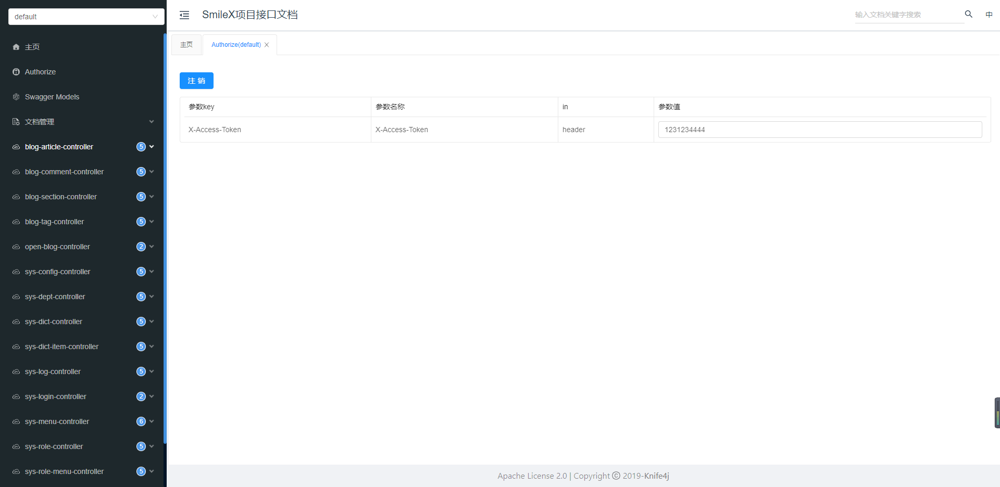
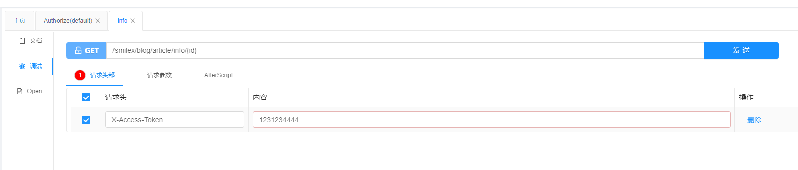

[toc]


---


# knife4j

 knife4j是为Java MVC框架集成Swagger生成Api文档的增强解决方案 。

- [官网](https://doc.xiaominfo.com/knife4j/)

- 访问地址都是/doc.html

## 前言

最近打算给自己的后台管理系统增加一个API管理，但是原生的Swagger，十分嫌弃，太丑了，所以找了个Knife4j，感觉上好看很多了。


## Maven版本

这里是基于springboot-2.3.5版本，OpenApi2。特别说明一下，我这里使用的是单体应用，如果架构不同会有区分微服务版本、网关版本等。

```xml
<!-- knife4j -->
<dependency>
    <groupId>com.github.xiaoymin</groupId>
    <artifactId>knife4j-spring-boot-starter</artifactId>
    <version>2.0.9</version>
</dependency>
```


## Swagger2Config

因为代码篇幅较多，我将对应的说明描述下代码里面，就不在外说明了。

```java

@Configuration
@EnableSwagger2WebMvc
public class Swagger2Config {

    @Bean
    public Docket api() {
        return new Docket(DocumentationType.SWAGGER_2)
                .apiInfo(apiInfo()).enable(true)
                .select()
                /***
                 重要的两个方法:
                 apis():指定要生成文档的接口包基本路径
                 paths():指定针对哪些请求生成接口文档
                 参考官方资料：http://www.baeldung.com/swagger-2-documentation-for-spring-rest-api
                 ****/
                // 1. 将 top.zsmile 设置为基础包扫描。
                // 2. 只包含 RestController 注解，也可以使用 Api 注解，但是对应的类需要添加。
                // 3. 针对所有路径扫描
                .apis(RequestHandlerSelectors.basePackage("top.zsmile"))
                .apis(RequestHandlerSelectors.withClassAnnotation(RestController.class))
                .paths(PathSelectors.any())
                .build()
                .securitySchemes(securityScheme())
                .securityContexts(securityContexts());

    }

    /**
     * 安全计划
     * 使用 X-ACCESS-TOKEN 作为请求头，添加在 HTTP Header 里面
     *
     * @return
     */
    @Bean
    public List<ApiKey> securityScheme() {
        return Collections.singletonList(new ApiKey(CommonConstant.X_ACCESS_TOKEN, CommonConstant.X_ACCESS_TOKEN, "header"));
    }

    /**
     * 新增 securityContexts 保持登录状态
     */
    private List<SecurityContext> securityContexts() {
        return Collections.singletonList(SecurityContext.builder()
                .securityReferences(defaultAuth())
                //设置需要登录认证的路径，非noauth开头的都需要Token认证
                .forPaths(PathSelectors.regex("^(?!noauth).*$"))
                .build());

    }

    /**
     * 默认授权
     *
     * @return
     */
    private List<SecurityReference> defaultAuth() {
        // 权限范围：Scope=>全局，设置在keyName=>X-ACCESS-TOKEN
        AuthorizationScope authorizationScope = new AuthorizationScope("global", "accessEverything");
        AuthorizationScope[] authorizationScopes = new AuthorizationScope[1];
        authorizationScopes[0] = authorizationScope;
        return Collections.singletonList(new SecurityReference(CommonConstant.X_ACCESS_TOKEN, authorizationScopes));
    }

    /**
     * 文档信息
     *
     * @return
     */
    private ApiInfo apiInfo() {
        Contact smileX = new Contact("SmileX", "https://github.com/smileluck", "");
        return new ApiInfoBuilder()
                .title("SmileX项目接口文档")
                .description("API接口文档")
                .version("1.0.0")
                .termsOfServiceUrl("https://github.com/smileluck")
                .contact(smileX)
                .build();
    }
}

```

经过这个配置，其实已经可以使用了。

## 增强

接下来是为了打开knife4j的增强，可以采用注解 @EnableKnife4j 开启增强。

```java
@EnableKnife4j
@Configuration
@EnableSwagger2WebMvc
public class Swagger2Config {}
```

或者通过yaml的形式进行配置。

```yaml
knife4j:
  # 开启增强
  enable: true
  # 开启生产环境保护
  production: false
  # 开启Swagger的Basic认证功能,默认是false
  basic:
    enable: false
    # Basic认证用户名
    username: knifeAdmin
    # Basic认证密码
    password: knifeAdmin
```

更多配置请查看官方文档。

## 注意事项

### Shiro整合使用

需要给knife4j 的路径进行放行，否则当我们访问时会出现401的问题。

```java
/*swagger*/
chainDefinition.addPathDefinition("/doc.html", "anon");
chainDefinition.addPathDefinition("/webjars/**", "anon");
chainDefinition.addPathDefinition("/v2/api-docs", "anon");
chainDefinition.addPathDefinition("/swagger-resources", "anon");
```

 如果使用了权限框架，如shiro、SpringSecurity，需要WebMvcConfigurer里面添加配置：

```java

@Configuration
public class WebMvcConfig implements WebMvcConfigurer {
    /**
     * 显示swagger-ui.html文档展示页，还必须注入swagger资源：
     *
     * @param registry
     */
    @Override
    public void addResourceHandlers(ResourceHandlerRegistry registry) {
        registry.addResourceHandler("swagger-ui.html").addResourceLocations("classpath:/META-INF/resources/");
        registry.addResourceHandler("doc.html").addResourceLocations("classpath:/META-INF/resources/");
        registry.addResourceHandler("/webjars/**").addResourceLocations("classpath:/META-INF/resources/webjars/");
    }
}
```

### 统一返回实体

```java

@ApiModel("统一返回结果")
public class R<T> implements Serializable {
    public static final long serialVersionUID = 1L;

    @ApiModelProperty("状态码")
    private int code;
    @ApiModelProperty("响应信息")
    private String msg;
    @ApiModelProperty("结果")
    private T data;
    @ApiModelProperty("是否成功")
    private boolean success;

    private R(int code, String msg, T data) {
        this.code = code;
        this.msg = msg;
        this.data = data;
        this.success = ResultCode.SUCCESS.getCode() == code;
    }

    private R(int code, String msg) {
        this(code, msg, null);
    }

    private R(ResultCode resultCode) {
        this(resultCode.getCode(), resultCode.getMessage());
    }

    private R(ResultCode resultCode, String msg) {
        this(resultCode.getCode(), msg);
    }

    private R(ResultCode resultCode, T data) {
        this(resultCode.getCode(), resultCode.getMessage(), data);
    }

    private R(ResultCode resultCode, String msg, T data) {
        this(resultCode.getCode(), msg, data);
    }


    public static <T> R<T> success() {
        return new R(ResultCode.SUCCESS);
    }

    public static <T> R<T> success(ResultCode resultCode) {
        return new R(resultCode);
    }

    public static <T> R<T> success(ResultCode resultCode, String msg) {
        return new R(resultCode, msg);
    }

    public static <T> R<T> success(String msg) {
        return new R(ResultCode.SUCCESS, msg);
    }

    public static <T> R<T> success(T data) {
        return new R(ResultCode.SUCCESS, data);
    }

    public static <T> R<T> success(String msg, T data) {
        return new R(ResultCode.SUCCESS, msg, data);
    }

    public static <T> R<T> fail() {
        return new R(ResultCode.FAILURE);
    }

    public static <T> R<T> fail(Integer code, String msg) {
        return new R(code, msg);
    }

    public static <T> R<T> fail(ResultCode resultCode) {
        return new R(resultCode);
    }

    public static <T> R<T> fail(ResultCode resultCode, String msg) {
        return new R(resultCode, msg);
    }

    public static <T> R<T> fail(String msg) {
        return new R(ResultCode.FAILURE, msg);
    }

    public static <T> R<T> fail(T data) {
        return new R(ResultCode.FAILURE, data);
    }

    public static <T> R<T> fail(String msg, T data) {
        return new R(ResultCode.FAILURE, msg, data);
    }

    public static boolean isSuccess(@Nullable R r) {
        return ObjectUtils.nullSafeEquals(ResultCode.SUCCESS, r.getCode());
    }

    public static boolean isNotSuccess(@Nullable R r) {
        return !isSuccess(r);
    }

    public int getCode() {
        return code;
    }

    public void setCode(int code) {
        this.code = code;
    }

    public String getMsg() {
        return msg;
    }

    public void setMsg(String msg) {
        this.msg = msg;
    }

    public T getData() {
        return data;
    }

    public void setData(T data) {
        this.data = data;
    }

    public boolean getSuccess() {
        return success;
    }

    public void setSuccess(boolean success) {
        this.success = success;
    }

}

```


## 界面

### 设置全局token



只要在这里填入token，那么就会自动注入到所有请求的请求头中使用。



