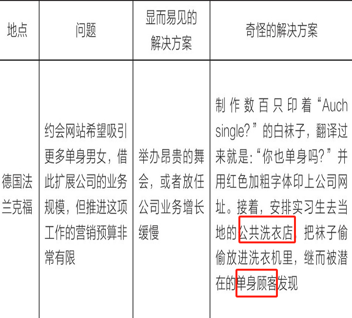

《微创新：小创意推动大变革》通过大量案例和研究，揭示了微小创新如何积累成重大突破，强调创造力是可培养的技能，而非天赋。以下是核心内容总结：

### **一、微创新的力量：小创意的大影响**
1. **烟蒂投票箱的启示**  
   环保主义者特雷温·莱斯特里克发明柠檬黄色的“烟蒂投票箱”，通过趣味设计（如设置“超级英雄投票”问题）引导吸烟者将烟蒂投入指定容器，使街道烟蒂垃圾减少80%。这一低成本、低技术的小创意，无需复杂研发，却在27个国家推广，成为解决全球烟蒂污染的有效方案。  
   - **核心逻辑**：微小、贴近生活的创意，通过巧妙设计改变行为习惯，积累成大规模影响。

2. **“渺小而伟大的突破”定义**  
   书中将微创新称为“渺小而伟大的突破”，指通过**日常小创意的持续积累**，而非一次性颠覆式创新，实现长期效益。例如，乐高通过模块化设计、主题乐园扩展等微创新，从木制玩具厂发展为全球玩具巨头。

### **二、创造力的本质：可学习的技能**
1. **破除“天赋论”迷思**  
   - 神经科学研究表明，大脑具有“神经可塑性”，创造力可通过训练提升。例如，爵士乐手通过练习关闭大脑抑制区域（背外侧前额叶皮层），激发即兴创作能力。  
   - 案例：林-曼努尔·米兰达创作《汉密尔顿》前，经历数百次失败，通过反复打磨歌词和旋律，而非依赖“灵感闪现”。

2. **日常训练的关键要素**  
   - **输入**：广泛接触不同领域知识（如阅读非专业书籍、观察自然），扩大创意素材库。  
   - **实验**：通过低成本试错（如A/B测试、快速原型）验证想法。例如，亚马逊每年进行数万次实验，96%失败但推动核心业务增长。  
   - **习惯**：建立日常创意仪式，如每天5分钟“创造力训练”（深呼吸、疯狂输入、创意健美操等），强化创新思维。

### **三、日常创新者的八大执念**
书中总结了创新者的思维模式，帮助普通人突破常规：
1. **爱上问题**：深入理解挑战，而非急于解决。例如，查德·普莱斯改造车管所，通过分析用户痛点（如漫长等待、环境恶劣），将其转化为高端体验空间，客户量增长1000%。  
2. **不要等到准备好再开始**：边行动边调整，如马洛里·布朗在尼泊尔地震后，未等计划完善即奔赴灾区，通过快速响应搭建临时援助体系。  
3. **开设实验厨房**：建立低成本试错环境。例如，奶昔小屋通过地下室“创新厨房”测试新菜品，每年推出数百种实验性菜单，推动收入增长。  
4. **不破不立**：主动解构现有模式。乐高持续重塑产品线，从积木到主题乐园、电影，打破“玩具公司”的固有定位。  
5. **打破常规**：用非传统方法解决问题。约翰尼将T恤店伪装成面包店，用“蛋糕愿景”吸引顾客，在竞争激烈的服装行业脱颖而出。  
6. **发挥所有潜能**：在资源限制下激发创造力。肯尼亚长跑运动员通过部落文化培养的“痛苦耐受能力”，在全球赛事中占据统治地位。  
7. **别忘了晚餐后的薄荷糖**：添加超出预期的细节。麦迪逊公园十一号餐厅为顾客提供“雪橇之夜”等惊喜体验，强化品牌记忆。  
8. **永不言败**：将失败视为数据。谷歌“坟场”陈列205项失败产品，从中吸取教训，推动核心业务如Google Maps成功。

#### 构建实验厨房/创意工厂
在构建自己的创意工厂时，请考虑如何设计环境所需的各个核心元素：**设备、参与者和原料**
1. **设备**。无论是固定的场所还是临时的地点，你都要为实验厨房配备任何可以帮助自己释放新思维的设备。幸运的是，数以百万计的知识型企业只需要一台笔记本电脑和无线网络就能搭建一个实验厨房。此外，你还需要考虑哪些用品可能有助于激发自己的创造力。我的购物清单包括巨型便利贴、彩色马克笔、橡皮泥、建筑用纸、胶带和水枪等。
2. **参与者**
   1. “两个比萨原则”要求领导者尽量精简团队的成员，团队成员晚餐的食量不能超过两个比萨。也就是说，如果两个比萨不足以喂饱一个团队，那么这个团队可能人数太多了。
   2. 让团队成员轮流发表观点，让大家从不同的思维模式中捕捉新的想法。
   3. 邀请看似背景毫不相关的人参与讨论也是激发创造力的好方法。但当你在考虑邀请谁的时候，要尽可能地保证人员的多样性。
   4. 定要考虑到人员的多样性，包括性别、教育背景、年龄、职业、工作资历、经验水平，甚至是行为举止。
3. **原料**
   1. 在实际的实验操作方面，有众多可以采纳的策略，但我建议从简单的A/B测试方法开始。目的是对单个变量进行分别的测试，从而确定因果关系。例如，如果你认为发送主题非常有趣的电子邮件会提高回复率，便可以直接通过简单的A/B测试检验自己的假设。

#### 找到“不破不立”的方法
1. 第一步：解构
   1. 分析当前方法的各个要素。无论是具体的步骤，还是象征性的步骤，你都需要把目标解构为尽可能小的细分步骤。
2. 第二步：审查
   1. 列出问题列表，对各个要素进行彻底理解和审查。
   2. 类似下面这些问题
      - 这个东西是做什么用的？
      - 目前还缺少什么？
      - 最初创意的思路和背景是什么？
      - 为什么这种做法在过去有效？
      - 今天又有什么不同？
      - 自最初的创意以来，客户的需求发生了什么样的变化？
      - 目前是哪些核心规则、真理、传统或信仰支撑这一创意，之后可能会受到挑战？
      - 世界上还有哪些地方存在类似的问题或模式？
      - 自当前的版本创建以来，哪些新兴的技术可以帮助改进现有的版本？
      - 它的耐用性如何，哪个环节可能会出现技术故障？短板又在哪里？
3. 第三步：重建
   1. 组装各个要素，允许自己进行一定的修改
   2. 参考类似下面的问题
      - 我可以添加哪个新元素？
      - 我可以删除哪个元素？有什么可替代的元素？
      - 如果我可以施展魔法让过程变得更好，最终会呈现什么结果？
      - 如何重新组装或重新安排才能节省时间或金钱？如何提高质量？如何解决新问题？
      - 同领域的其他人如何解决这个问题？其他领域的人又如何解决这个问题？
      - 我可以从自然或艺术中汲取哪些灵感，激发我升级当前的想法？
      - 我该如何升级某些要素，比如加大马力或提高计算能力？如何减少某些要素，比如缩小占地面积、减少浪费和更快交付？
      - 如果我已掌握了多种可能性，我该如何在推进这些可能性之前，构建一个快速测试这些可能性的模型？

#### 打破常规，怪异也许更好
> 德国哲学家叔本华有句名言：“所有的真理都要经过三个阶段。首先，被嘲笑；继而遭到激烈的反对；最后，被理所当然地接受。

1. 坏主意头脑风暴。
   1. 寻找解决问题的最糟糕的想法，而不是最好的想法。把你能想到的每一个可怕的、非法的、邪恶的、不道德的或糟糕透顶的想法都列举出来。
   2. 在你列举出所有的坏主意之后，再做第二轮的反思，反思所有堕落的概念，看看是否有一些坏主意可以转化为好主意。
   3. 糟糕的想法会将你的创造力推向未知领域。然后，我们只需改进和调整那些糟糕的主意，直到它们变成金点子
2. 世界第一
   1. 总结出以“世界第一”为开头的想法，能够把你的创造力水平提升到新的高度，并帮助你大胆地尝试新的可能性。
3. 角色风暴
   1. 与其独自进行头脑风暴（并对产生的任何想法负全部责任），你也可以同时扮演不同的角色借此进行头脑风暴。换句话说，你可以从不同角色出发构思出新的想法。
4. 单手切牌
   1. 你需要列举出自己惯常会使用哪些传统的方法应对自己面临的挑战。你以前都是怎么做的？行业资深人士的首选方法是什么？主流的传统观点是什么？
   2. 接下来，在这部分的下方画一条线，并逐一写出与每个传统方法截然相反的方法。
   3. 推动自己探索与传统方法完全相反的方法有助于唤醒你的创造性直觉，把你面临的挑战、机遇和威胁翻转成大胆的新发明。
   4. 例如；理发师按次收费，你可以反转成包月不限次
5. 扩大选项X
   1. 当我们做出一些大大小小的决定时，经常会迅速缩小选择的范围。
   2. 选项X是大胆、挑衅、出人意料、奇异的想法，或许能够成为你苦苦寻觅的打破游戏规则的选项。所以，在本次练习中，你需要通过头脑风暴得出最奇怪的想法，而不是最安全的想法。

#### 发挥所有潜能
1. 时间有限
   1. 时间通常被认为是限制创造力发挥的最重要因素。但讽刺的是，正是时间有限（也称为截止日期）激发了历史上一些最伟大的创意作品。
   2. 卡点做事能够激发他们的创造力，这样他们就没有时间去质疑自己的每一个决定。
   3. 当你缺乏资源时，正是你需要变得足智多谋的时候。
2. 人都是在条件有限的情况下才最具创造力。如果你拥有实现成功的所有资源，那就很容易随波逐流。但如果你的资源有限，那就会迫使你真正去突破界限。

#### 晚餐后的薄荷糖（意料之外的惊喜）
> “晚餐后的薄荷糖”是指出乎意料的惊喜和喜悦，无论是食物还是服务，都是在兑现餐厅的承诺，提供超过客人要求之外的服务。

1. “‘95-5原则’指的是在95%的时间里，我们精打细算每一分钱。但在剩下5%的时间里，我们愚蠢地毫不计算成本。”
2. 畅销书作家杰伊·贝尔（Jay Baer）在他2018年的著作《如何让你的产品被快速口口相传》（Talk Triggers）中研究了内附赠品的现象。这本书指出，品牌需要做一些超出其核心产品之外的事情，才能引发客户的口口相传。他认为，小而有创意的投资可以产生巨大的口碑效应。杰伊认为各种形状和大小的晚餐后的薄荷糖是有效的营销投资。
3. 晚餐后的薄荷糖都给客人带来了惊喜和愉悦的体验，引发了口口相传，并帮助创意公司在竞争激烈的领域中取得胜利。无论你经营的是什么类型的公司，都可以考虑添加一些创意来吸引客户。无论处于哪个领域、从事什么职业，永远不要低估晚餐后的薄荷糖的力量。
4. 在许多情况下，仅仅是在某个重点领域添加一块晚餐后的薄荷糖就可以带来巨大的收益。换句话说，你不需要在业务、事业或生活的每一个方面都添加晚餐后的薄荷糖。
5. 隔离那些无关的概念，专注于你的领域和目标。

#### 边缘风暴
1. 先解构出每个机会点。你需要解构的因素可以是公司层面的任何因素，例如提升效率、客户服务或数据挖掘。此外，你还可以利用边缘风暴解决任何特定的问题或抓住某个机会，例如“如何降低员工流失率”或“采取哪些措施来增加销量”。
2. 每个人都需要彻底释放自己的创造力，暂时抛开所有的执行、成本或风险因素。简而言之，大家所分享的想法必须都是极致的想法。
3. 需要明确的是，这些想法或许都不太现实，要么成本太高，要么脱离实际。但是，如果你能够将自己的创造力发挥到极致，继而让那些缥缈的想法回归现实，比一开始就提出一些不足为道的想法再去升级这些想法要容易得多。
4. 修建沙滩排球场的想法可以改编成举办一年一度的“公司运动会”，员工们可以在比赛期间争夺奖品。举办夏季系列音乐会的想法可以简化为邀请一位音乐家录制一系列歌曲，然后在社交媒体上发布这些歌曲。相比于从小处着手继而屈服于实用性的感召，更有效的做法是从疯狂的想法开始，继而打磨所有粗糙的边缘。即使你正在追求小的突破而不是大的创新，也可以使用边缘风暴突破自己想象力的极限，让遥远的想法回归现实，留待日后使用。

#### 永不言败
1. 危急时刻才是展现真本事的时候。公司在最困难的时期显然展现出了自己的最佳水平。
2. 跌倒七次，站起来八次的哲理是创造力和韧性达到完美结合。这不是盲目乐观的人口中所喊的“你能做到任何事”的陈词滥调，而是直面困难。日常创新者没有无谓地坚持，而是把挫折当作一次机会，每次都用不同的方法重新振作起来，用创造性的思维来指引方向。他们能够超脱对与错的判断，将错误视为可以为后续创造性尝试提供信息的数据。将坚韧与想象力融为一体，通过一系列创造性的调整和适应赢得这场战斗。
3. 一些创造性的想法会转化成实际的创新，而另一些会在尝试中消逝。速度和复杂性决定了一个创造性想法的成败。

##### 不是所有的墓地都吓人
1. 首先，新想法在初期总会较为混乱。我们永远不会期望刚出生的婴儿能够生活自理，所以我们也不应该对刚刚提出的想法设定如此不切实际的标准。事实上，早期的想法几乎都有缺陷。虽然创作是艺术家的首要工作，但测试、检查和完善作品直至恰到好处的循环也同样重要。虽说这是艺术家的事情，但别忘了我们都是艺术家，所以我们要意识到，磕磕绊绊和失误是创作过程的一部分，在第一次尝试失败后退出，就好像是棋手在对方走了开局的第一步棋后就认输了。
2. 另一个残酷的事实是，并非所有的想法都会成功。从来没有哪位成功的发明家未曾经历过失败，没有哪位传奇的诗人未曾写过狂妄的文字，没有哪位多产的音乐家未曾弹错过一个音符。若是没有经历过失败，那只能说明自己还不够努力。日常创新者既不寻求失败，也不享受失败，但他们认可失败是其创新过程的重要组成部分。从自己最糟糕的作品中吸取教训和见解，能够为未来创作出杰出作品打下基础。
3. 公开分享自己失败的经验并从挫折中吸取经验教训，赞扬每位创新者的失败经历中的一些创造性的成功。失败之墙也向公司内部的数千名潜在创新者传递了这样的信息：公司允许创新者承担责任风险，并愿意为创新者创造一个安全表达自己创造力的环境。
4. 会把挫折视为荣誉的象征，而非耻辱。他们忍受着失败带来的短暂痛苦，从中学习、适应和提高。通常情况下，若想获得长期的胜利，必然先经历看似无穷无尽的短期失败。

##### SLIP
> SLIP是Stop（停止）、Look（审视）、Investigate（调查）和Plan（计划）这四个单词的首字母缩写词。SLIP法能够帮助我们转变思维模式，把危机视为一种机遇。这是一种简单的、不带偏见的方法，使我们在遭受任何程度的挫折后依然能够重新振作起来。

1. 第一步是在采取下一步行动之前先暂时停下脚步。
2. 第二步，我会客观地看待当前的形势。不再一味地迷恋“孤注一搏”的谬论。
3. 第三步，我会调查情况，用一种支持性的、不加评判的方式评估过往发生的事情。
4. 第四步，进行干预，借此对下一步的行动做出深思熟虑的选择。

采用SLIP方法分析问题，即便感觉当下的问题像是一次失败的经历，也不要把它当作一种失败。无论你被打倒多少次，SLIP方法都能让你重整旗鼓，昂首挺立。

### **四、微创新的实践框架**
1. **创意生成三步法**  
   - **解构**：将问题拆解为最小单元（如分析传统外科手术服的缺陷：不合身、缺乏口袋）。  
   - **审查**：用“问题播放列表”质疑现状（如“为什么手术服不能时尚且功能性强？”）。  
   - **重建**：组合要素创造新方案（如“无花果”品牌设计贴身、带拉链口袋的手术服，年销售额达2.5亿美元）。  

2. **创新复利效应**  
   书中通过“1分钱每天翻倍30天”的比喻，说明微小创意的累积效应：即使起点微小，持续迭代可带来指数级增长。例如，塔拉斯·克拉夫乔克用3D打印和开源技术制造电动摩托车，成本仅为哈雷-戴维森同类产品的1%，却实现性能超越。

### **五、结论：人人可成为创新者**
- **核心观点**：创造力是人人具备的“通用技能”，通过日常练习（如每天5%的创意升级），任何人都能实现突破。  
- **行动号召**：从小处着手，拥抱失败，将微创新融入工作与生活。正如书中所言：“你不需要成为天才，只需成为每天进步5%的行动者。”

通过以上理念和方法，《微创新》证明，改变世界的力量藏于日常的小创意中，关键在于培养持续创新的思维与习惯。

### some sentences
1. 在创新方面，感知他人感受和情绪的能力是一项极为重要的优势。
2. 
