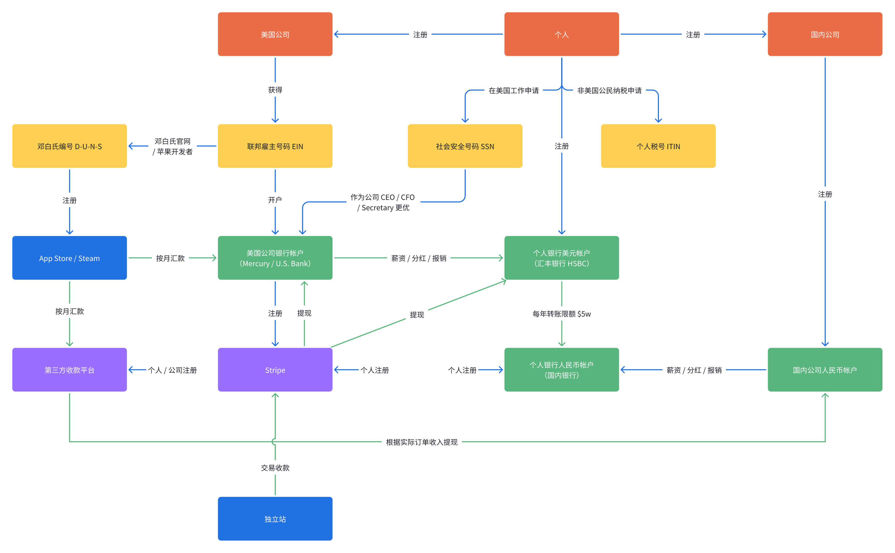

> 原文链接： https://v2ex.com/t/1108773#reply44
> 
> 独立开发者 / 独立小团队如何在一周内搞定所有的资质开始在 App Store / Steam / Stripe 收款

包含：

1. 成立上海公司
2. 开通国内银行公户
3. 成立美国公司
4. 开通美国对公银行账户
5. 申请邓白氏编号
6. 开通公司 Stripe
7. 开通公司 App Store
8. 获得版权登记证书一张

发现有的时候根本不是事情难，纯纯就是信息差，比如：

走苹果渠道申请邓白氏只用三天，但官网要一周到一个月
传统银行开户麻烦 + 入金超高，可以无脑冲 mercury
独立开发者要勇敢迈出第一步：注册公司，后面的事情都会很顺利很有信心
觉得有用的话可以关注一下我们！latentcat.com / troyni.com