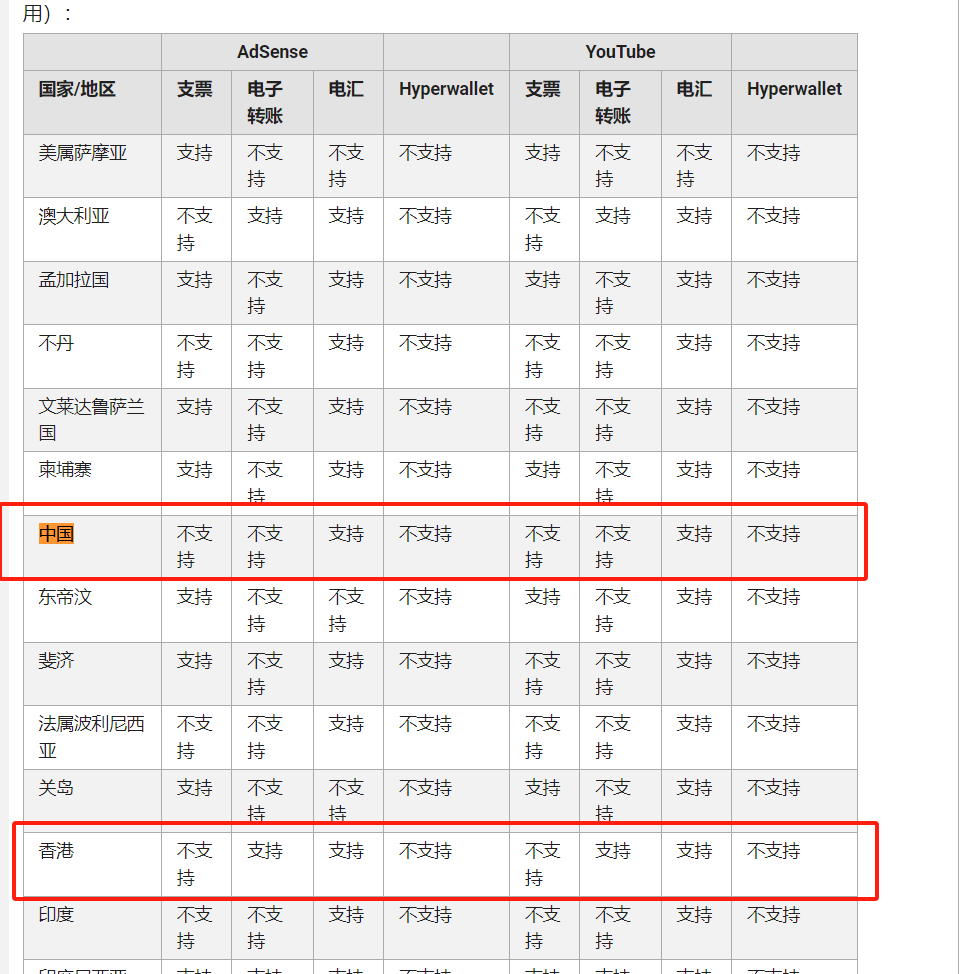

[toc]
---

# 申请Google Adsense

## 申请Google Adsence 的要求
谷歌官方在Google adsence 的具体审核标准，没有特别清晰，主要就是以下几点
1. 内容是否独创（也就是不要直接搬运别人的内容）
2. 是否有暴力、色情等内容。
3. 网页内容不要侵权（例如那种电影下载站、破解软件下载站）

## 注意事项
### 验证地址真实性

Google AdSense广告收入达到一定门槛谷歌就会给你邮寄PIN，用来验证你账号地址的真实性。

通常广告收入达到几美元就可以了，所以注册Google AdSense后就要尽快在后台设置收款信息。填写自己能收到信件的地址。

1. 收件地址有信箱，正常填写就能收到，如果没有信箱，一定要在地址第二行填写你的联系电话(邮寄小哥会打电话的)。一般是从国外(美国，马来西亚等)寄出。
2. 一般两周就能收到邮件，如果收件地址有误，或者没有收到邮件，可以联系Google AdSense客服。

### 没收到PIN码怎么办？
1. 申请再次重新发送PIN码，Google提供三次发送机会
2. 多次无法收到时，可以进行电话验证，可以直接通话获得验证码

### 税务信息
你需要提交税务信息来完成账户设置 ✅。对于中国大陆的AdSense账户，需要验证美国和新加坡的税务信息 🌍。我的建议是，如实填写真实的身份信息 👤，不要尝试提供虚假信息。一旦被识别，可能会影响你的收益，甚至导致账号问题 ⚠。我提交真实信息后，很快就通过了审核哦！👍

一般谷歌公司会帮你交税，如果没有在年度申报时填写选择劳务报酬所得即可。

### 收款方式
中国大陆这边只支持电汇。香港地区还支持电子转账。

# 关于收入
## 赚取收入
- AdSense 的收入主要来自两种模式：
    - CPC（按点击付费）：每当有人点击广告，就能赚取费用。
    - CPM（按千次展示付费）：广告每展示 1000 次，会获得收入。
- 影响收入的因素：
  - 流量：访问者越多，潜在收入越高。
  - 内容主题：某些高价值领域（如金融、科技）广告单价更高。
  - 点击率：广告位置和类型会影响用户点击的频率。