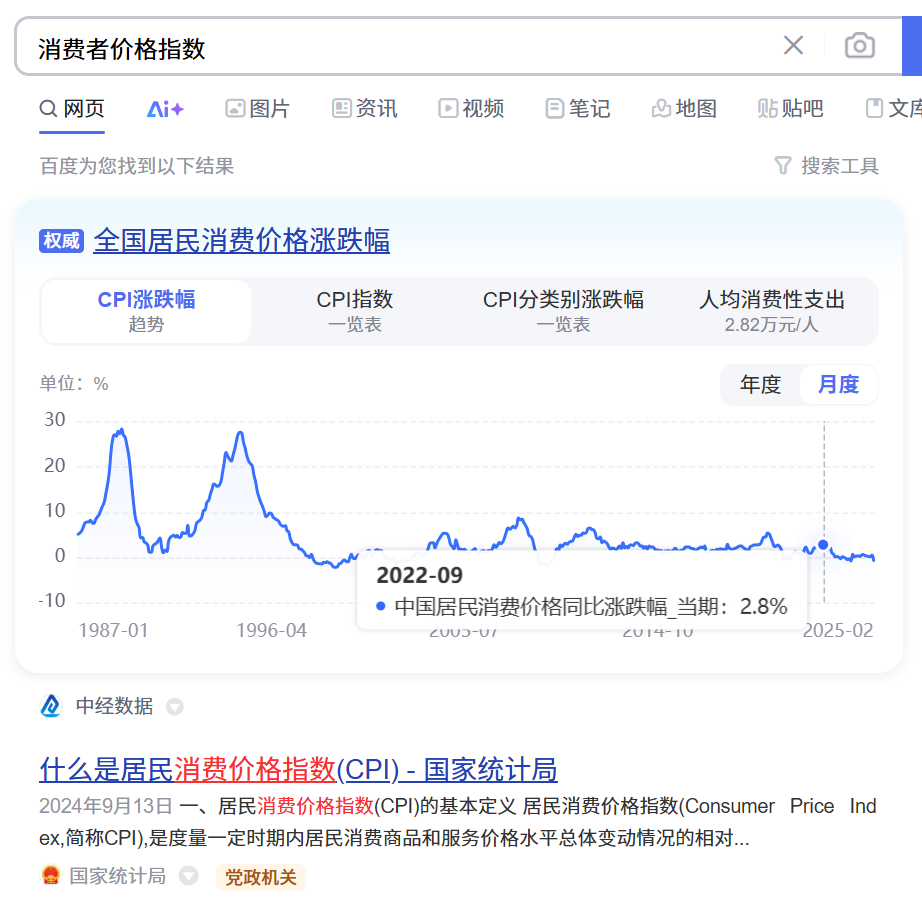

- [关键词](#关键词)
  - [石油输出国组织(OPEC)](#石油输出国组织opec)
  - [WTI原油](#wti原油)
  - [中概股](#中概股)
  - [股息率](#股息率)
  - [风险敞口](#风险敞口)
  - [阿尔法收益](#阿尔法收益)
    - [阿尔法收益：](#阿尔法收益-1)
  - [贝塔收益](#贝塔收益)
    - [贝塔收益的特点](#贝塔收益的特点)
    - [贝塔系数](#贝塔系数)
  - [ETF](#etf)
  - [LOF](#lof)
    - [二、如何区分LOF和ETF？](#二如何区分lof和etf)
    - [三、LOF，值得关注吗？](#三lof值得关注吗)
  - [消费者价格指数（CPI）](#消费者价格指数cpi)
    - [主要用途](#主要用途)
  - [生产者价格指数（PPI）](#生产者价格指数ppi)
    - [主要作用](#主要作用)
  - [美林投资时钟模型](#美林投资时钟模型)
    - [经济周期的四个阶段及投资优先级](#经济周期的四个阶段及投资优先级)
    - [股市内部的行业/风格轮动](#股市内部的行业风格轮动)
  - [大宗商品](#大宗商品)
  - [通货膨胀](#通货膨胀)
  - [跟踪误差](#跟踪误差)
  - [有效市场假说（尤金·法码）](#有效市场假说尤金法码)
  - [均值回归](#均值回归)
  - [最大回撤指数](#最大回撤指数)
  - [QDII](#qdii)
    - [介绍](#介绍)
- [背景](#背景)
  - [为什么选择基金](#为什么选择基金)
  - [注意几点](#注意几点)
  - [基金类型](#基金类型)
  - [风险适配，自己接受的风险和收益](#风险适配自己接受的风险和收益)
  - [关于长线投资](#关于长线投资)
- [基金基础](#基金基础)
  - [前言](#前言)
  - [货币基金](#货币基金)
  - [债券基金](#债券基金)
    - [关于债券](#关于债券)
    - [如何挑选](#如何挑选)
    - [固收+](#固收)
      - [如何配置](#如何配置)
  - [股票基金](#股票基金)
    - [为什么股票基金赚钱难?](#为什么股票基金赚钱难)
    - [如何赚到股票基金的钱](#如何赚到股票基金的钱)
  - [主动基金VS指数基金](#主动基金vs指数基金)
    - [指数基金](#指数基金)
      - [宽基](#宽基)
      - [窄基](#窄基)
    - [主动基金](#主动基金)
      - [如何选基金经理](#如何选基金经理)
    - [同一指数基金选择](#同一指数基金选择)
    - [被动指数基金](#被动指数基金)
    - [增强指数基金](#增强指数基金)
  - [商品基金](#商品基金)
    - [抗通胀](#抗通胀)
    - [低相关性](#低相关性)
    - [那些属于商品基金？](#那些属于商品基金)
    - [黄金基金——长期向上、胜率高](#黄金基金长期向上胜率高)
      - [黄金的属性](#黄金的属性)
      - [黄金的历史](#黄金的历史)
    - [油气基金——大宗商品之王，周期性显著](#油气基金大宗商品之王周期性显著)
      - [原有波动剧烈](#原有波动剧烈)
      - [油气基金怎么选？](#油气基金怎么选)
    - [豆粕基金——稳扎稳打，积累超额收益](#豆粕基金稳扎稳打积累超额收益)
      - [豆粕——饲料的必需品](#豆粕饲料的必需品)
      - [豆粕基金](#豆粕基金)
      - [超额收益怎么来的？](#超额收益怎么来的)
    - [小结](#小结)
  - [QDII基金](#qdii基金)
    - [QDII特点](#qdii特点)
      - [QDII股票基金](#qdii股票基金)
      - [QDII债券基金](#qdii债券基金)
      - [QDII另类基金](#qdii另类基金)
    - [全球性多元化配置](#全球性多元化配置)
    - [全球投资应重点考虑那些市场](#全球投资应重点考虑那些市场)
    - [QDII限购怎么办？](#qdii限购怎么办)
- [资产配置](#资产配置)
  - [为什么要做资产配置？](#为什么要做资产配置)
  - [核心要素](#核心要素)
    - [1. 平衡收益和风险](#1-平衡收益和风险)
    - [2. 寻找低相关性](#2-寻找低相关性)
      - [大类资产分散](#大类资产分散)
      - [全球市场分散](#全球市场分散)
    - [3. 体系取胜](#3-体系取胜)
  - [购买建议](#购买建议)
    - [购买指数基金](#购买指数基金)
  - [参考指标](#参考指标)
    - [借助估值](#借助估值)
      - [市盈率(PE)](#市盈率pe)
- [实践](#实践)
  - [从零到一，资产配置](#从零到一资产配置)
    - [确立投资目标](#确立投资目标)
    - [构建投资方案](#构建投资方案)
    - [定期进行再平衡](#定期进行再平衡)
  - [交易策略](#交易策略)
    - [买入技巧](#买入技巧)
    - [赎回时机](#赎回时机)
    - [提升胜率的技巧](#提升胜率的技巧)
    - [定投](#定投)
      - [为什么要定投](#为什么要定投)
      - [制定定投计划](#制定定投计划)
      - [定投的难点——坚持](#定投的难点坚持)
  - [基金费用](#基金费用)
    - [买卖费用](#买卖费用)
      - [申购费/认购费](#申购费认购费)
      - [赎回费](#赎回费)
    - [持有费用](#持有费用)
      - [管理费和托管费](#管理费和托管费)
      - [销售服务费](#销售服务费)
    - [场内基金](#场内基金)
    - [收益最大化](#收益最大化)
    - [注意事项！](#注意事项)
      - [切莫贪小便宜](#切莫贪小便宜)

---

# 关键词
## 石油输出国组织(OPEC)
OPEC是石油输出国组织（Organization of the Petroleum Exporting Countries）的简称，成立于1960年9月14日，总部位于奥地利维也纳。它是一个由亚洲、非洲和拉丁美洲的主要石油生产国组成的国际组织，旨在协调成员国的石油政策，通过商定原油产量和价格，反对西方国家对产油国的剥削和掠夺，保护本国资源，维护自身利益。OPEC的成员国包括阿尔及利亚、刚果共和国、赤道几内亚、加蓬、伊朗、伊拉克、科威特、利比亚、尼日利亚、沙特阿拉伯、阿拉伯联合酋长国和委内瑞拉。OPEC的决策机构是成员国大会，执行机构为理事会，日常工作由秘书处负责处理，此外还设有经济委员会，以协助维持石油价格的稳定。

## WTI原油
WTI是西得克萨斯中间基原油（West Texas Intermediate）的简称，它是国际石油市场的一种基准价格，也是纽约商品交易所石油期货合同的标的物。所有在美国生产或销往美国的原油，在计价时都以轻质低硫的WTI作为基准油。

## 中概股
中概股，全称中国概念股，是指外国投资者对所有海外上市的中国股票的统称。

这些股票主要包括两类：一是在中国大陆注册、国外上市的企业；二是虽然在国外注册，但主体业务和关系仍在中国大陆的企业

## 股息率

股息率（Dividend Yield Ratio），指一定时期内股息同股票面值的比率。

股息是公司利润的一部分，即公司以现金方式分配给投资者的那部分利润。股息率是以股息为参考的估值指标，其计算公式如下：

股息率=分红金额/市值=每股分红/股价

股息率高：一方面或许代表公司的分红较多（分子段）；一方面或许代表公司当前的估值较为低廉（分母端）。

## 风险敞口

风险敞口是金融领域中的一个重要概念，尤其在期货交易中，它指的是投资者或金融机构在某一特定金融工具或资产上可能面临的风险总量。简单来说，风险敞口就是未被对冲或保护的风险部分，它直接关系到投资者在不利市场变动下的潜在损失。

## 阿尔法收益

阿尔法收益，只超出大盘，战胜市场平均水平获得的收益。主要承担的是非系统性风险。通俗点说，就是投资人通过自己的选股策略挑选出能够战胜大盘或者比大盘更扛跌的股票，差额就是超额收益。

### 阿尔法收益：

是股票取得的实际收益与计算出的贝塔收益之间的差额。

假设一只股票的β系数为1.5，此时业绩比较基准涨了10%，那股票对应的贝塔收益应该为15%，但实际上股票却涨了25%，那么这二者的差额，即为股票的阿尔法收益。

也就是25%-15%=10%。

一般认为，阿尔法和贝塔两部分的价值是不一样的。对于贝塔收益，通过调节组合中的股票投资比例，就可以很容易地改变贝塔系数。

## 贝塔收益
贝塔收益（Beta收益）是指投资组合通过承担市场风险所获得的收益，它反映了投资组合与市场整体波动之间的相关性。

贝塔收益，就是跟随整个市场波动获取的平均收益。风险主要来自于市场的系统性风险。通俗点说就是投资人不假思索以大盘指数作为投资对象，收益完全跟随大盘涨跌。

### 贝塔收益的特点
- 市场联动性：贝塔收益与市场的涨跌密切相关，市场上涨时，贝塔收益为正，市场下跌时，贝塔收益为负。
- 风险性：贝塔收益伴随着市场风险，即系统性风险，这种风险无法通过分散投资来消除。
- 普遍性：对于大多数投资者而言，贝塔收益是投资回报的重要组成部分，尤其是在市场整体表现良好的情况下。
### 贝塔系数
- 定义：贝塔系数是衡量个别资产或投资组合相对于整体市场波动性的指标。
- 计算方法：通常通过历史数据回归分析来计算，比较个别资产收益与市场收益的协方差和市场收益的方差。
- 解读
   - β=1：表示资产或组合的波动与市场一致。
   - β>1：波动大于市场，风险较高，潜在收益也较高。
   - β<1：波动小于市场，风险较低，潜在收益也较低。
   - β<0：与市场波动方向相反，较为罕见

## ETF

“交易型开放式指数证券投资基金”（Exchange Traded Fund，以下简称ETF），简称“交易型开放式指数基金”，又称“交易所交易基金”。

ETF是一种跟踪“标的指数”变化、且在证券交易所上市交易的基金。投资人可以如买卖股票那么简单地去买卖“标的指数”的ETF，可以获得与该指数基本相同的报酬率。

ETF是一种特殊的开放式基金，既吸收了封闭式基金可以当日实时交易的优点，投资者可以像买卖封闭式基金或者股票一样，在二级市场买卖ETF份额；同时，ETF也具备了开放式基金可自由申购赎回的优点，投资者可以如买卖开放式基金一样，向基金管理公司申购或赎回ETF份额。

ETF通常由基金管理公司管理，基金资产为一篮子股票组合，组合中的股票种类与某一特定指数（如上证50指数）包含的成份股票相同，股票数量比例与该指数的成份股构成比例一致。例如，上证50指数包含中国银行、中国石化等50只股票，上证50指数ETF的投资组合也应该包含中国银行、中国石化等50只股票，且投资比例同指数样本中各只股票的权重对应一致。换句话说，指数不变，ETF的股票组合不变；指数调整，ETF投资组合要作相应调整。

目前ETF根据投资标的的资产类型或运作模式不同，分为股票ETF、债券ETF、跨境ETF、商品ETF、交易型货币基金几类，各类又细分出多个子类型，各子类型及定义详见相关业务指南。

## LOF

LOF全称“上市型开放式基金”。

“上市型”指的是可以像股票一样在场内交易基金份额。

“开放式”则指的是可以在场外申购、赎回基金份额。

这里要注意的是，LOF的场内和场外是相通的。比如你在场外某平台买了一只LOF（非定开型、封闭型），持有一段时间后想卖掉，那么：

可以在该平台直接赎回；

也可以通过“转托管机制”将所持份额转到自己的股票账户里，然后在场内交易。

有小伙伴可能想问：既然场外就能搞定，为啥还要选择将基金份额“向场内转”呢？这是因为场内交易会有些优势：

第一，减少交易费用。

相较于场外，LOF在场内交易的费用更加低廉。

第二，交易效率更高。

投资者T日在场内卖出LOF，当天资金可进行其它交易，T+1日可提取现金。

第三、有套利机会。

LOF有场内、场外两个价格，当差异较大时，投资者便可以通过套利获益。

如此我们又该如何识别这类基金呢？很简单，它的名称后面一般会带有关键词LOF。

### 二、如何区分LOF和ETF？

提到场内交易基金，自然不能不提ETF。

而LOF，虽然在名字上和ETF有几分像，但在运行机制上还是有不少区别的。

比如投资标的。

ETF是指数型，会紧密跟踪标的指数。

而LOF既可以是指数型，也可以是主动管理型。

（Wind）数据显示，全市场415只LOF中，有136只为指数型，175只为主动管理型（偏股混合型、灵活配置型、普通股票型）。

再比如申购、赎回门槛。

ETF主要是实物申赎，这里的实物指的是该基金跟踪指数的成份股组成的一篮子股票，资金量动辄需要百万元。

而LOF是现金申赎，一般10元起投，门槛很低。

所以对于普通投资者来说，参与ETF主要是在场内交易，而参与LOF，场内场外都可以选择。

还有产品透明度。

ETF每日会通过申购赎回清单充分披露其资产组合。

对比之下，LOF和场外的基金一样，一般一个季度才披露一次持仓情况。

因而从透明度上来说，ETF好于LOF。

### 三、LOF，值得关注吗？

新的问题：既然ETF和LOF各有所长，那为啥ETF更被人熟悉呢？

这就得从市场表现说起。

数量上，ETF要比LOF多。且论场内活跃度，ETF也比LOF要好。（Wind）数据显示，今年以来（截至2月6日），LOF场内日均成交额总和为12亿元，仅1只日均成交额超过1亿元，对比之下，ETF日均成交额总和为1325亿元，有147只日均成交额超过1亿元。

为啥会有这样明显的差别呢？

综合市场的观点，原因有很多。就拿套利机会来说，基金公司在设计LOF上市交易时，仍是以拓宽发行渠道为主要目的，在折溢价套利功能设计上不如ETF效率来得高，继而对大资金的吸引力会较弱。

如此LOF还值得关注吗？

事实上对于普通投资者来说，LOF撇开场内交易功能，也是可以当成一般的开放式基金长期投资的。因而是否值得关注，就要看具体产品的投资方向、投资策略、过往业绩等因素是否符合自己的需求了

## 消费者价格指数（CPI）
> https://www.stats.gov.cn/zs/tjws/zytjzbqs/jmxxggzs/202409/t20240910_1956353.html

居民消费价格指数（Consumer  Price  Index，简称CPI），是度量一定时期内居民消费商品和服务价格水平总体变动情况的相对数，综合反映居民消费商品和服务价格水平的变动趋势和变动程度。

### 主要用途
CPI是中国价格统计指标体系的重要组成部分，是宏观经济分析和决策、价格总水平监测和调控以及国民经济核算的重要指标。概括而言，CPI有以下基本用途：

1. 在一定程度上反映通货膨胀（紧缩）的程度。测定一定时期通货膨胀（紧缩）程度有不同的方法，应用较多也较普遍的就是CPI。严格地说，CPI并不等于通货膨胀率，因为CPI只反映了居民消费领域的价格变化，而不能代表全社会价格总水平的变化，但从CPI的变化中，可以看出价格变动的大致趋势，在一定程度上反映了通货膨胀（紧缩）的程度。
2. 用于国民经济核算。在GDP核算中，通常使用CPI对相关现价总量指标进行缩减，剔除价格因素的影响，实现不同时期经济指标之间的可比，从而计算不变价增长速度。
3. 用于计算货币购买力。CPI的倒数通常被视为货币购买力指数，即货币购买力的变化与CPI的变化成反比关系。例如，2022年全国CPI为102.0％，货币购买力指数则为1÷102.0％×100％＝98.0％，换句话说，在2021年用100元可以买到的商品和服务，在2022年需要花102元才能买到相同的商品和服务。在社会经济生活中，人们往往参考CPI来调整补偿、救助和补贴标准，消除货币购买力下降的影响。

## 生产者价格指数（PPI）
> https://www.stats.gov.cn/zs/tjws/tjzb/202301/t20230101_1903637.html

生产者价格指数（Producer Price Index，简称PPI），理论上应涵盖所有产业，即包括农业生产者价格指数、工业生产者价格指数和服务业生产者价格指数等指数。由于历史及技术原因，目前许多国家编制和发布的PPI仅指工业生产者价格指数。在我国，工业生产者价格指数包括出厂价格指数和购进价格指数，其中出厂价格指数是反映一段时期内工业生产领域产品出厂价格水平总体变动情况的相对数，一般称之为PPI。

### 主要作用

（一）监测工业生产领域价格变动趋势和景气状况。PPI客观准确反映国民经济活动中处于工业生产环节的产品价格变动情况，为社会各界全面了解和把握工业生产领域价格走势提供准确翔实的资料。此外，企业也可以依据PPI进行经济效益分析，调整生产经营策略。

（二）度量潜在通货膨胀（通货紧缩）。PPI反映工业生产领域价格变动情况，可以作为衡量通货膨胀（通货紧缩）的重要辅助、先行指标，为中央银行和政府金融等有关部门监测通货膨胀或通货紧缩趋势，进行宏观经济分析预测提供重要依据。

（三）用于国民经济核算。在国民经济核算中，为剔除价格因素影响，需要使用包括PPI在内的多种价格指数缩减现价国内生产总值（GDP），进而计算不变价的实际增长率。目前，我国统计系统采用价格指数缩减法计算工业发展速度。

（四）合约指数化。交易双方为规避签订长期合约产生的价格变动风险，在签订合约时，事先约定交货产品的实际价格将在当前价格基础上、依据未来PPI的涨跌幅度进行相应调整，即合约指数化。合约指数化会对实际交易额产生重要影响。

（五）国际比较指标。在由国际货币基金组织制定的数据公布特殊标准（SDDS）中，PPI是“必须”发布的数据种类，参与该计划的国家应按月及时公布PPI；另外，在数据公布通用系统（GDDS）中，PPI是“受鼓励”发布的指标，用以拓展监测物价的变动情况。

一般认为，适度的通货膨胀是有利的。价格上涨，会刺激厂商多生产，而因为担心未来涨价，人们也愿意多消费，这样经济中供需都会增长，经济向好。而如果发生通货紧缩，商品价格下跌，厂商生产积极性受挫，人们倾向于存钱不消费，因而不利于经济循环发展。

## 美林投资时钟模型

美林时钟是美国投行美林证券2004年在《The Investment Clock》报告中提出的资产配置理论。他们研究了美国市场超过30年的数据后，发现经济周期、资产配置和产业轮动之间是存在一定关系的，并且把这一理论归纳总结为一个“投资时钟”，也就是大家听说过的“美林时钟”。

美林时钟使用经济增长（GDP）和通胀（CPI）两个指标，将资产类别划分为债券、股票、大宗商品和现金四类，将经济周期分成了四个阶段，在每个阶段对应不同的资产配置表现（如下图），围绕“复苏——过热——滞涨——衰退——复苏”进行周期轮动。

### 经济周期的四个阶段及投资优先级

- 复苏期（高GDP + 低CPI）：经济刚从危机中恢复，GDP加速增长，物价水平不高，通胀压力小。政府采用宽松货币政策，利率低位，企业经营好，利润增长快，特别是率先复苏行业。人们信心恢复，风险偏好提升。此时是持有股票的好时机，投资优先级为股票>债券>货币>商品。
- 过热期（高GDP + 高CPI）：经济增速高，物价上涨，呈现GDP和CPI双高现象。大宗商品价格随CPI增长而升高，是投资黄金等商品的好时候。但通货膨胀高会使央行实行货币紧缩政策，市场利率升高影响债券价格。此阶段市场利率上升对债市杀伤力大，债市表现最差，投资优先级为商品>股票>货币>债券。
- 滞胀期（低GDP + 高CPI）：GDP增长率大幅降低，通胀继续上升。央行为防通胀进一步收缩银根，加息或提高准备金，导致融资成本上升，企业经营困难。股票可能开始冲顶或下跌，风险累积高。此时最好拿现金，不随便投资，尤其应降低股票配置仓位，投资优先级为货币>商品>股票>债券。
- 衰退期（低GDP + 低CPI）：经济下行，产能过剩，物价下跌，人们信心低迷。政府刺激经济，实行宽松货币政策，如降息降准，对债市是好信号。投资优先级为债券>货币>股票>商品。

### 股市内部的行业/风格轮动
- 复苏期内，成长股>价值股，其中大盘成长往往最好。
- 过热期内，价值股>成长股，其中小盘价值往往年化收益最高。
- 滞胀期与衰退期，A股普遍表现不佳，但小盘股抗压能力略高于大盘股。
从行业表现来看：
- 复苏期，各行业往往有不俗表现，可选消费、医药、科技等领域通常突出，过热期消费行业仍表现不错。
- 上游资源品行业与通货膨胀关系密切，在滞胀期、过热期物价向上或较高阶段表现较佳，衰退期中跌幅最大。
- 金融、房地产及公用事业等行业，在滞涨期和衰退期比其他行业更抗跌，必选消费品在衰退期也可能有优势。

## 大宗商品
在金融投资市场，大宗商品指同质化、可交易、被广泛作为工业基础原材料的商品，如原油、有色金属、钢铁、农产品、铁矿石、煤炭等。

大宗商品通常根据其性质和用途被分为以下几个主要类别：
1. 能化产品：主要包括原有、天然气、煤炭、橡胶等，它们是全球能源供应的重要组成部分或制造业的重要原料。
2. 金属产品：包括基础金属如铁、铜、铝、铅、锌等，以及贵金属如黄金、银贵金属、钯金、钯银等。这些金属在工业生产或金融投资中都有广泛引用。
3. 农产品：涉及一系列食物和农作物，如玉米、小麦、大豆、稻谷、棉花、咖啡、糖等。农产品是食品供应链的基础，并且也是许多工业产品的原料。

## 通货膨胀
通货简单里说就是流通中的货币，通货膨胀就是指一定时期内持续且普遍的物价上涨现象，简单来说就是钱不值钱了。

导致高通胀的直接原因是货币发行量的增加，造成货币供应过多，用过多的货币供应量与既定的商品和相应，必然导致货币贬值、物价上涨。

## 跟踪误差
由于存在管理费、托管费等多种运营费用，以及申购赎回造成的仓位变化等原因，指数基金也无法完全复制标的指数。我们管指数基金收益率和标的指数收益率之前的偏差，叫做跟踪指数。

## 有效市场假说（尤金·法码）
按照价格放映信息的充分程度，市场可以分为3中不同的类型。
1. 强有效市场。市场价格已充分反映所有历史交易数据，如价格和成交量。技术分析无效，但基本面分析可能帮助投资者获得超额收益。
2. 半强有效市场。价格不仅反映历史信息，还反映所有公开信息，如财务报表和新闻。基本面分析无效，只有内幕信息可能带来超额收益。
3. 弱有效市场。价格反映了所有信息，包括公开和未公开的内部信息。没有任何方法能帮助投资者获得超额利润。

## 均值回归
- 均值回归概念:
   - 定义：均值回归是指股票价格无论高于或低于价值中枢（或均值），都会以高概率向价值中枢回归的趋势。
   - 波动特性：股票价格总是围绕其平均值上下波动，上涨或下跌的趋势不能永远持续下去，最终会回归均值。
   - 随机性：回归的时间间隔和周期呈“随机漫步”，不同市场和同一市场的不同回归周期均不同。
- 均值回归的指导意义:
  - 理论必然性：股票价格不能总是上涨或下跌，一种趋势不管其持续的时间多长都不能永远持续下去。
  - 不对称性：正的收益与负的收益回归的幅度与速度不可能一样，回归的幅度与速度具有随机性。
  - 政府行为：市场在没有政府政策作用下也会实现均值回归，但政府行为可抑制市场无效和促进市场有效。
- 均值回归在股票投资中的应用:
  - 实证研究：西格尔教授研究发现1970-2001年主要股票市场的回报率相差无几，日本股市1989年的高点至今未创新高，但时间拉长后回报率与其他国家一致。
  - 行为金融学：理查德·塞勒和德邦特提出股市反应过度的理论，即以3-5年为一个周期，表现不佳的股票会摆脱困境，而赢家股票会走下坡路。

## 最大回撤指数
最大回撤指数（Maximum Drawdown Index）是投资分析中一个重要的指标，用来反映投资过程中最大回撤程度。简单来说，就是在一段时间内，对应基金类型/指数的最大亏损幅度。

最大回撤指数的计算公式为：
$$MDI=\frac{1}{1+max(0,R_t)}\times100$$
1. MDI值越大，表示投资过程中最大回撤程度越大，说明投资过程中出现过最大回撤。
2. MDI值越低，表示投资过程中最大回撤程度越低，说明投资过程中没有出现过最大回撤。
3. 最大回撤越小，基金越抗跌，持有体验越好。

## QDII
### 介绍
- QDII（qualified domestic institutional invest）（国内机构投资者赴海外投资资格认定制度）。我国的QDII基金是指在我国境内设立，经有关部门批准从事境外证券市场的股票、债券等有价证券业务的证券投资基金。和QFII一样，它也是在我国货币没有实现完全可自由兑换、资本项目尚未开放的情况下，有限度地允许国内投资者投资境外市场的一项过渡性的制度安排。
  - 各种类型的QDII基金特点：
    1. REITs（基础设施领域不动产投资信托基金）是房地产上行期的政策产物，初心是为分散的个人投资者提供一个投资房地产的机会，客观上促进了包括租赁住房在内的房地产发展。
    2. 黄金基金（避嫌配置品种）
    3. 石油基金（油价投资工具）
    4. 海外市场投资股票基金（参与全球证券市场）
    5. 海外市场债券基金（防范人民币汇率的波动）

# 背景
## 为什么选择基金
1. 买基金!=买股票，债券黄金石油，都可以是基金
   1. 基金只是一种投资工具
2. 投资门槛低，对个人投资友好
   1. 适合没有太多时间和精力的
      - 适合投资新手
      -  每个基金都有基金经理和专业团队，当然这不代表他们一定会盈利，但是选对了基金类型和合适的基金，都可以降低风险，提高盈利
   2. 没有足够多的本金
      - 有些股票，期货本身单价是偏高的，像是大豆期货，起码需要10w作为保证金才可以；或者是茅台，一首都需要十几万
      - 可以分散投资
   3. 没有极强的心理承受能力和执行力
      - 股票一天的波动最多可以到10%或者20%，甚至更高。但对于个人投资者来说，单只股票的巨幅波动，是非常影响心态的。**投资中最怕的，不是能力撑不起野心，而是心态撑不起野心**。基金每天的波动往往比底层资产小很多。
      - 面对市场巨幅波动时，心态不稳会导致动作变形，原先正确的策略被破坏，导致资金损失。
3. 监管严格，透明度高
   1. 所有理财中，公募基金监管最严格，透明度最高
   2. 每天的净值更新，招募说明书，运作报告，以及人事调整都会有严格的披露要求
   3. 银行理财不如基金透明，产品底层持有什么资产，是不披露的。

## 注意几点
1. 不会选——切勿盲目买基金
   1. 不清楚自己需要什么，也不知道自己应该选什么
   2. 购买基金时，要选择适合自己的投资目标，风险承受能力，投资期限等。
   3. 如果是保守型，应该选择固收的基金；如果看好A股大趋势，那配置指数基金；如果获得一些超额收益，可以选择主动管理强的基金经理；如果是看好一些热门行业，可以选择行业基金。
2. 拿不住——持有时间太短
    1. 基金持有时间太短，会因为市场风险、业绩不理想等原因，导致持有时间短，收益低。
    2. 投资是一个复利游戏，所有的投资都要有长线思维。
3. 不会配置——持仓过于集中
   1. 没有配置思维，不会分散风向。
   2. 基金本身作为组合，本身能够分散风险，但是配置的基金，如果都集中于某一个行业，或者某一个地区，或者某一个行业，那么就会有风险。

## 基金类型
根据基金底层大类资产划分，可以分成以下几类：
1. 货币基金。多数是固定收益类，由现金、银行存款、央行票据等安全性很高的资产组成。
2. 债券基金。80%以上的基金购买债券。
3. 股票基金。80%以上的基金购买股票。
4. 混合基金。既卖债券也买股票，二者比例视情况而定。
5. 另类基金。主要投资QDII、商品、REITS等另类资产。
6. 被动基金。是将某一个指数编制下的一篮子股票买入，有什么买什么，比如沪深300指数基金就是属于此类。

按照收益和风险排名大体如下：
股票基金>混合基金>债券基金>货币基金

## 风险适配，自己接受的风险和收益
1. 摸清底线，即所能接受的最大风险。根据每个人所处的阶段和经济能力等，一般而言年轻人会比较激进，中老年人更偏向稳定收益。
2. 确定收益目标，即预期收益和风险的平衡。对投资而言，收益和风险是成对出现的，所以要确定自己的投资目标，比如想要达到什么收益，然后根据风险承受能力，选择合适的基金。
   - 风险厌恶型。通常希望收益比银行略高即可，通常年收益目标在2%-3%即可，比较适合波动小的货币基金。
   - 风险中立型。通常愿意承受一定风险，换取更高的投资回报，收益目标可以定在4%-6%，适合中长期的债券或者偏债混合基金。
   - 风险接受型。有较强的风险承受能力且投资期限比较长，那么目标可以定在10-15%，这种情况就需要配置股票基金或者偏股混合基金。

## 关于长线投资
1. 在复利效应下，时间能带来巨大能量。
2. 短期择时难度极大，长期投资可以有效平滑风险，当然这里并不是说什么时候入场，长期投资都能平衡风险，只是说可以平滑市场的短期波动。所以要选定合适的时间进场。
3. 不管对哪类基金来说，年化收益都是一个平均值，不是说每年都能赚多少，而是持有期的一个平均收益。
4. 长线到底多长，要实现收益目标需要多少时间？一般可以用72法则作复利的粗略估算，知道年化收益率就可以计算大约需要多少年你的本金会翻倍。举例来说，如果年化收益率是12%，那么大概需要72/12 = 6年才能翻倍。
5. 长线投资并不是说用于拿着不要买，而是在合适的时机就卖了。只是时机的把握比较困难。

# 基金基础
## 前言
- 通常来说，最适合普通人的就是收益稳健、风险低的固收类产品。建议配置20-40%的固收类基金（年化2-6%）
- 

## 货币基金
货币基金就是投向货币市场的一种基金，这些货币工具期限短，流动性强，而且几乎没有信用风险，亏损概率极低。

货币基金中可能最令人熟悉的就是而余额宝了，当年的余额宝凭借高收益率，当日赎回到账等优势成为了大家管理零钱的工具。

但货币市场中的单笔交易巨大，参与者都是机构，个人基本无法参与其中，所以就需要货币基金将个人与机构之间架起桥梁。

<mark>需要注意的概念:</mark>
- 万份收益：万份收益是指一万元在当天能获得的收益；
- 七日年化：7日年化是指在7天内，万份收益的平均收益水平折合的年化收益；
- 万份收益是我们当天的实际收益，具有参考价值；而七日年化是过去七天盈利的平均值，我们应该关注的是收益率的稳定性。

**货币基金是零钱管理的好工具，但可以不用花费过多时间在这类产品上。**

## 债券基金

一般来说，债券基金是收益佳、波动小，能够带来更高的收益。

### 关于债券
> 重点关注：发行主体信用和债券久期。

1. 债券主体信用（安全性）角度
   1. 利率债
      1. 由政府、央行或政策性银行发行；
      2. 一般是由国家债券、政府部门债券、央行票据等组成；
      3. 违约风险低，收益率也相对较低。
   2. 信用债
      1. 由企业发行；一般用于筹集资金；
      2. 一般由公司债、金融债等组成；
      3. 违约风险高，收益率也相对较高。
2. 债券久期（到期时长）
   1. 中长期债券：无限制。可以投资短期，也可以投资长期债券；
   2. 中短期债券：80%以上债券资产剩余期限不超过3年；
   3. 短期债券：80%%以上债券资产剩余期限不超过397天;
   4. 超短期债券：80%%以上债券资产剩余期限不超过279天。
   8. 债券久期越长，收益越高，风险越大。
   9. 发行主体不同，风险和收益也有影响。
3. 可转债（可转换公司债券）
   1. 同时具备股票和债券的性质；
   2. 到期后，可以在一定期限内，将债券按照约定股票价格转换为股票；也可不转换，最终兑付本息；
   3. 可转载价格会受到正股影响；T+0交易制度，没有涨跌幅限制；
   4. 风险不比股票风险低。
4. 运作管理方式
   1. 被动债券基金（债券指数基金）
      1. 一般是跟踪特定债券指数，以该指数的全部或部分成份券构建投资组合，目标是获得与指数相同的收益率；
      2. 投资策略清晰透明，投资范围广，不易受个别债券的影响。
   2. 主动债券基金
      1. 由专门的基金经理管理，会研究宏观条件和市场行情，选择适合的债券，以确保收益稳定并降低风险
5. 投资范围
   1. 纯债基金
      1. 纯债基金，投资范围是债券、银行存款等固定收益类产品，不包含股票、可转债等；
      2. 风险较低，收益相对稳定。
   2. 混合债券基金
      1. 包括债券、股票、可转债等，投资范围广，风险和收益都有。
      2. 投资策略灵活，风向和波动率相对较高
   3. 可转债基金
      1. 主要投资可转债。
      2. 由于可转债具有与股票类似的性质，所以风险最大，同股票基金不相上下。
6. 债券交易价格波动因素
   1. 利率是最常见的。市场利率和债券价格是反向关系。
   2. 债券违约，简单说就是借款人无法偿还本息，债券就毫无价值可言了。

### 如何挑选
1. 选择固收大厂的基金。
   1. 能保证投研的开支，从而选出优秀的债券；
   2. 不会追求高收益而忽视安全性，更多考虑风险问题。
2. 选择靠谱的基金经理；
   1. 债市的特点是3年一轮回“牛一年、皮一年、熊一年”，最好选择经历完整周期的基金经理，也就是3年以上的基金经理和产品。
   2. 注意基金经理是否有重仓暴雷的经历。
3. 选择持仓分散的基金；
   1. 即使单只债券出现问题，对整体基金的影响也不会太大；一般来说单只债券的仓位在5%以上就风险较高了。
   2. 仓位和性质同时分析，如果前几名重仓的都是信用债，仓位和行业都比较集中，应及时回避。
4. 选择权威机构认可的基金
   1. 最出名的基金奖项——【金牛奖和晨星奖】
   2. 金牛奖是国内举办的，晨星奖是国际奖项。

### 固收+
本质上是混合基金，以收益稳定，风险低的债券作为基石，为基金提供稳定的收益；然后再控制风险的前提下，通过配置股票，可转债、衍生工具等风险较高的资产，追求更高的收益。

- 推荐使用固收+用来替换银行理财
  1. 公募基金深耕市场多年，拥有非常丰富的产品线，因此在大类资产配置上都有很强的投研能力。而银行理财的风险偏好较低，所以集中在固收上。
  2. 证监会对公募基金的信息披露要求严格。而银行理财则没有这个要求，对投资者不友好
  3. 公募基金以开放基金稳住，可以随时申购、赎回。而银行理财一般都有封闭期，少则30天到1年。

#### 如何配置
1. 根据股债比例分辨风险
   1. 一般固收+基金股票仓位会再20%，有些基金会在30%，甚至40%。股票配置越大，风险越高。
   2. 另外，债券的仓位多不代表风险就低。可转债虽然属于债券，但价格变动会受到股票的影响。
2. 选择经验丰富的投资经理
   1. 固收+基金对投资经理要求很高，因为涉及债券又投资股票、可转债等高风险资产。因此我们尽量选择又5年以上投资经验的基金经理。
   2. 观察基金经理的长期业绩，以此判断基金经理的投资能力。不仅要看近三年、五年的大区间，还要结合每年的收益情况一起考察。尤其需要看一下在熊市的表现，看看基金是否抗跌。
3. 选择长期收益好、回撤小的基金
   1. 不求短期领先，但求长期回报。确保基金有比较稳定的收益
   2. 可以借助最大回撤指标辅助判断基金的波动情况。最大回撤越小，基金抗跌能力越好。

## 股票基金
> 对于股票基金，最关心的问题，怎么才能赚钱？为什么买入就跌，卖出就涨？

<mark>股票是长期回报率最大的大类资产</mark>

### 为什么股票基金赚钱难?
- A股波动大、周期性强
  - A股具有典型的牛短熊长特征，牛市一两年就走完了，而熊市的持续时间很长。
  - 巨大的周期性变化，导致投资策略的复杂度大大增加。
- 权益投资收益非线性
  - 权益类基金的收益会随着市场波动，涨跌不可预测且分布很不均匀，这种就是非线性收益；而类似定期存款，存满一年可以获得一年收益，收益稳定均速上涨，就属于线性收益。
  - 非线性注定了投资的大多数时间都是在等待中度过。3年只是长期投资的一个起点，但从非线性收益的角度来看，对未来并不是坏事。
- 过高收益预期
  - 千万不要把阶段性的高收益视为理所当然。均值回归可能会迟到，但不会缺席。
  - 避免预期收益过高，和现实收益落差过大，容易导致心态不稳，决策错误。
- 盲目追求热门赛道
  - 赛道基金，就是集中投资于单一赛道/行业的基金。由于持仓非常集中，当行业处于爆发式增长时，可以获得远超市场的回报。但一旦市场风向转变，面临的就是巨大的回撤和亏损。
  - 高弹性和高波动就是赛道基金最大的特点。因此这类基金的投资难度极大，往往没吃到肉，就挨最狠的打。

### 如何赚到股票基金的钱
1. 高不买，低不卖
   - 低买高卖是逆人性的，高买低卖是顺人性的。
   - 精确抄底几乎无法实现，但判断高低区间并非难事，不需要追求精确，追求模糊的正确即可。
2. 选择合适的工具
   - 没有哪一类基金，能适应所有市场。每种类型的基金，都有其独特优势和最适配的市场环境，但同时也有缺点和局限性。
   - 坚持“不懂不投”的原则。
3. 放弃快钱的念头
   - 价值回归是需要一定时间来兑现。

## 主动基金VS指数基金

投资中有两大对立的思想流派：
- 被动投资。相信市场长期有效，试图战胜市场是徒劳无功的。只需获取市场的平均收益即可；
- 主动投资。市场中存在大量价格扭曲，通过深入研究可以战胜市场，并获得超额回报。

### 指数基金
> 指数基金，就是以特定的指数为跟踪对象，买入指数全部或部分成分股，来获得和指数相同的收益率。因此投资指数基金的重点，就是对于标的指数的研究。

如果把股票指数按代表性进行区分，可以分为宽基和窄基。
- 宽基指数的选股规则，并不限制非得是投资那些行业，选样空间宽，覆盖面广。
- 窄基指数，也就是行业主题指数，选样空间窄，只聚焦于某一具体行业或者主题，因此走势受该行业特性影响较大。

#### 宽基

<mark>宽基适合作为权益底仓作为配置</mark>

在指数基金中，宽基是大家最长配置的主流类型。优势在于：
1. 策略简单透明，投资逻辑清晰。
2. 费率低，可以用最低的成本，获得市场的平均收益。

此外，宽基还有以下几个特点：这些特点也让宽基成为最适合配置的权益底仓和抄底利器。
1. 买宽基就是买国运，经济体持续向好，宽基就能长期上涨
2. 确定性极高，单个公司可能倒闭，但指数永不消亡；
3. 分散风险，与个股、行业相比波动小，不用害怕暴雷；
4. 永远满仓运行，市场上涨时，选宽基不用担心踏空。

对于宽基来说，投资的时间点，很大程度上决定了你的收益。

#### 窄基
<mark>窄基适合小仓位配置来博取收益。</mark>

窄基指数的覆盖范围更加集中，更有针对性，通常只针对某一特定行业或主题。
1. 策略复杂，需要针对行业特性进行定制化策略。
2. 当行业风口来临时，直接选择窄基，免去了择股的精力，只需评估该行业的投资价值即可。

### 主动基金
- 能在A股中获得超额收益，就是选择主动基金的根本原因。
- 指数基金的聚焦点在底层指数，而主动基金的聚焦点在基金经理。
  
#### 如何选基金经理
<mark>12字方针“长期净值，业绩归因，人格认知”。
1. 长期净值
   1. 观察基金经理的长期业绩，以此判断基金经理的投资能力。时间越长，业绩的有效性越高。至少也要看3-5年的业绩，才能合理评估。
   2. 短期业绩都是能力和运气混杂的，时间越短，运气成分越高。
2. 业绩归因
   1. **判断基金经理时选股派还是择时派**。可以通过历史股票仓位或换手率的情况，判断基金经理属于哪类。
      - 选股是指通过精选个股，长期持有，赚取企业成长收益；
      - 择时是指通过低买高卖赚取差价。
      - 如果在重仓股上都盈利了，所选股票基本面表现强劲，大概率说明基金经理选股能力很强；如果在某些比较关键的市场节点，基金经理做了正确的择时动作，则市场判断能力比较好。
   2. **判断基金持仓是集中还是分散**。
      - 集中度：指的是前十大重仓持股占比或者在某一行业股票上的仓位比重。持仓集中度不仅反映了基金投资理念和风格，也是度量风险的重要指标。
      - 集中式持仓的基金，进攻性强，风险也强；分散持仓的基金，进攻性弱一点，但波动也小一点。
   3. **基金经理能力圈**
      - 能力圈：基金经理擅长的投资研究领域，且很大概率在这个领域里获得超额收益；
      - 能力圈越广泛，超额收益的来源也会越多。
      - 专注于某几个行业投资的基金经理，当能力圈内存在机会时，业绩会更具有弹性，波动也会更大。
   4. **基金经理投资风格**
      - 投资风格：基金经理在过往投资中展现出的习惯和偏好；
      - 你真正认可的，就是最合适的。
3. 人格认知
   - 人格认知是对基金经理更高维度的认知，只有深刻了解一个人的价值观和立案，才能更加深刻理解他管理基金的底层逻辑，知晓他是否知行合一
   - 不要神化基金经理，没有任何一个基金经理能玩美适配所有市场环境
   - 相比押注单一基金经理，组合才是最有解
 
### 同一指数基金选择
就算是同一指数基金，还可以分为被动型指数基金和指数增强型基金。
- 被动型指数基金，就是以指数为跟踪对象，买入指数全部或部分成分股，来获得和指数相同的收益率，追求最大程度上跟踪和复制指数，以此获得和指数相同的收益。因此投资指数基金的重点，就是对于标的指数的研究。
- 指数增强基金就是在跟踪指数的同时，加入主动管理的策略，争取获得比指数更高的收益。

指数增强基金大多数时候都能跑赢指数，实现“涨的比指数好、跌的比指数少”的效果。

大多数的指数增强基金，都是通过量化手段来实现的，公募基金主要采用**多因子选股模型**进行选股。常用的因子有九类，包括盈利、成长、流动性、营运能力、现金流、估值、交易量、规模、波动性、红利、一致预期等。

### 被动指数基金
<mark>小结：被动指数基金要选择管理费用便宜、规模1亿以上的，并且在跟踪误差规定范围内，收益比指数好的基金</mark>

1. 费用越低越好
   1. 目前被动收益基金的申购费率在1%-1.5%，管理费率在0.5%左右，托管费率在1%左右。
   2. 长期投资尽量选择A类基金，因为A类基金是一次性收取申购赎回费，没有销售服务费用，长期投资比较划算。如果是短期投资可以选择C类基金。
   3. 值得注意的是，无论是哪类基金，7天内赎回费用都很高。
2. 跟踪误差越小，跟踪效果越好
   1. 一般来说跟踪误差越小越好，说明基金追踪指数的效果越好。但是指数基金通过打姓股获得超额收益，导致收益率和指数出现了偏差。如果是这种情况造成的跟踪误差并不是坏事。
   2. 跟踪误差很重要，但收益率更重要，如果是正向的误差，可以通过基金规模来判断是否是打新带来的误差，可以通过基金规模来判断是否打新来的误差，如果是的话不妨选择这类基金。
3. 避开规模过小的基金
   1. 对于完全跟踪指数的基金来说，最好选择规模大的。规模越大，申购赎回产生的交易成本对基金的影响就越小，不会影响指数跟踪效果。规模过小，基金公司有可能停止运作，存在清盘风险。最好选择规模1亿以上的基金。

### 增强指数基金
1. 稳定超额收益最重要
   1. 只有持续稳定的正超额收益，才能不断积累形成丰厚的正收益。
   2. 建议选择成立3年以上，并且超额收益靠前的指数增强基金。
2. 费用越低越好
   1. 由于指数增强基金有部分主动操作，不仅要最大程度跟踪指数，还要争取超额收益，所以往往管理费会高过普通指数基金。
   2. 管理费用的差距不算太大，但是长期投资还是会影响收益率。
3. 规模适中就好
   1. 与被动管理基金不同的是，增强指数基金不是越大越好。基金规模越大，可能会导致某些增强因子的失效。
   2. 规模较小的基金，打新收益就越丰厚；相反的，就越不明显。
   3. 考虑基金规模太小会有清盘风险，以及打新需要一定的市场规模，因此建议指数增强基金选择2-20亿规模的基金。

## 商品基金
> 商品资产是对冲通胀的有效工具。在市场收益情况上，大宗商品类与债券、股票类的表现相对独立，可以有效分散市场风险，随着投资期限的延长，多元化配置的好处会逐渐体现。
>
> 常见的投资产品有黄金、油气等，研究大宗商品的核心逻辑是短期看供求关系，长期看通胀水平。

大宗商品基金的作用：
1. 抗通胀。在高通胀时期往往会推高大宗商品的价格，价格上涨会弥补通胀带来的损失。
2. 分散风险，优化资产组合。因为大宗商品和股票债券具有低相关性，配置大宗商品能够降低资产组合的波动率。

### 抗通胀
从长期来看，大宗商品价格中枢呈现出长期上涨的趋势。大宗商品作为实物资产，天生占到各国央行印钞机的对立面。

因为货币可以无限供给，但资源类产品，并非取之不尽用之不竭的。所以当通货膨胀发生时，大宗商品的价格也会随之上涨。

大宗商品之所以能够对冲通胀风险，主要原因在于通胀本身就体现在原材料的价格上涨之中。

### 低相关性
大宗商品和股票、债券等资产具有低相关性。从逻辑上出发，股票收益是靠企业盈利推动，债券收益率代表的是企业的融资成本，而商品则是企业生产的原材料，可以看作企业生产成本。

根据[美林投资时钟模型](#美林投资时钟模型)分析。

### 那些属于商品基金？
1. 如何投资大宗商品
   1. 购买实物商品，这是最直接的方式。比如我们购买金条存放。另外就是贵金属什么的，除了专业从事该行业的，普通人难以涉足。
   2. 投资商品期货合约。
      1. 期货合约不是货物，而是以某种大宗商品为标的标准化可交易合约。这样就提高了交易的效率。
      2. 但期货交易的风险非常大，远高于股票。期货交易采用保证金制度，只需支付一小部分的保证金，投资者就可以撬动10-20倍的杠杆，导致极大的风险性。
      3. 投资期货需要极强的专业能力和风险承受能力，对于普通投资者来说，期货合约更像是一种赌具。所以并不适合我们配置资产。
   3. 投资大宗商品基金。这是最适合普通人的方法。投资门槛低，投资策略是多元的。既有投资标的物本身的基金，也有投资于大宗商品相关的股票和期货合约的基金。
2. 国内大宗商品基金有哪些？
   1. 从投资策略角度可以分为两类
      1. 通过交易商品ETF、期货合约、现货合约等，追踪主流大宗商品价格走势的基金
      2. 通过投资主营业业务为煤炭、铝业、铁矿、原油等大宗商品生产或销售的上市公司股票，从而间接实现投资大宗商品的基金。
   2. 从大宗商品品种类型
      1. 贵金属
         1. 黄金。华安黄金ETF联接A(000216)
         2. 白银。国投瑞银白银期货(161226)
      2. 能源
         1. 原油。华宝标普油气上游股票人民币A(162411)
      3. 其它商品
         1. 农产品。华夏饲料豆珀期货ETF联接A(007937)
         2. 有色金属。大成有色金属期货ETF联接A(007910)
         3. 化工。建信易盛郑商所能源化工ETF联接A(008827)
         4. 综合。中信保诚全球商品主题(165513)
3. 优势及风险
   - 优势
      1. 抵抗通胀，获取收益。大宗商品通常在通胀时期价格上涨，投资商品基金可以为投资者提供保值增值的机会。而且，大宗商品及近通常是流动性比较好的资产投资者可以随时买卖基金份额，有利于投资者根据市场变化做出调整。
      2. 分散风险，优化组合。大宗商品基金通常与股票和债券市场表现的相关性很低，在资产配置中可以优化组合的收益风险比。通过将大宗商品基金纳入资产配置，可以在同等风险条件下提升收益，或者在同等收益条件下降低风险。
   - 风险
      1. 商品市场的波动性较大，可能面临价格风险；
      2. 大宗商品基金的涨跌受全球经济、地缘政治等因素的影响较大，需要投资者具备较高的专业知识和市场敏感度。

### 黄金基金——长期向上、胜率高

#### 黄金的属性
黄金的三重属性：商品、货币、金融
- 商品：供给稳定，需求波动。黄金产量波动较小、产地分散且存在在回收机制，供给端相对稳定；而黄金需求具有一定的波动性，受投资需求和央行购买影响较大。
- 货币：美元的替代效应。美元与黄金均是全球主要经济体央行的重要储备资产，黄金与美元存在具备替代效应。
- 金融：黄金是无息资产，机会成本=实际利率。

#### 黄金的历史
自从1971年布雷顿森林体系解体后，黄金就开始自由浮动的时代。
在53余年的时间里，伦敦金有37美元/盎司涨至2286美元/盎司，涨幅达到61倍.
2016年4月19日，伤害黄金交易所推出了“上海金”，这是以“人民币/克”为计价单位的集中定价合约，为国内市场提供了一个权威的黄金价格基准。
可以看出黄金的走势均是长期向上，长期投资黄金的胜率是比较高的。

### 油气基金——大宗商品之王，周期性显著

#### 原有波动剧烈
原油是一种重要的能源和战略资源，对全球经济和政治有着深远的影响。油价的历史变迁，反映了国际市场的供需关系，也反映了国际关系的变化和冲突。

油价历史变迁主要经历了以下3个阶段：
1. 1859-1973年，寡头垄断时间。油价主要由美国和跨国公司控制。
2. 1973-1990年，[OPEF](#石油输出国组织opec)主导时期。OPEC通过减产、增产、价格战的手段，对油价形成了重要应i想，也引发了多次石油危机。
3. 1990-至今，多元定价阶段。油价收到多方面因素的影响，如供需关系、地缘政治、金融市场、技术创新等。OPEC的作用相对减弱。

[WTI原油](#wti原油)价格走势基本上是以5-7年为一个周期，在30美元-120美元区间震荡。在这一过程中，原油市场经历了多次极端行情，比如2020年一度出现的负油价的原油期货。

作为大宗商品之王，原油价格表现出经济、金融、避险等多重属性，与供需格局（全球经济、核心产油区增减产）、美元强弱（多数时间负相关）、地缘冲突（正相关）等三大变量相关。这些因素多变，带动原油价格本身波动极大。

鉴于油价明显的周期性特点，建议可以采用一个“低买高卖”的策略来参与。

#### 油气基金怎么选？

投资油气的基金可以分为以下两种：
- 油气股主题基金。油气股票型基金主要投资于全球原油和天然气产业链的上市公司。
  - 华宝标普油气上有股票人民币A（162411）
  - 广发道琼斯是由指数QDII-A(162719)
- 油气商品型基金。一般是通过投资多个原油期货类ETF参与，属于主动管理的LOF基金。
  - 嘉实原油（160723）
  - 南方原油（501018）

从历史走势比较，油气股相对原油价格变动规律如下：
1. 油气股价和油价在片场区间的（季度或年度）正向相关性较高。在油价发生暴涨暴跌的阶段，油气骨架和油价的正向相关性大概率提升。
2. 油气股和油价的相对强弱一般与油价走势呈服负相关。当油价处于向下周期时，油气股一般来说相对油价走强，意味着油气股比原油本身更“抗跌”；当油价处于向上周期是，油气股相对油价走弱，涨幅不如原油本身涨幅。

所以当投资者愿意承受极大的波动且追求更高的涨幅，可以选择油气商品型基金，否则可以选择油气股票型基金。

油气类基金，波动比较大，风险比较高，比较稳健的方式实在低油价时期关注，高油价时期止盈离场。

### 豆粕基金——稳扎稳打，积累超额收益
#### 豆粕——饲料的必需品

豆粕是大都经过压榨工艺去油后得到的副产品，含有丰富的蛋白质，是饲料蛋白质的主要来源，能够充分满足不同牲畜和家禽对不同营养的需要。在蛋白粕类的消费中，豆粕占到60%以上，占据绝对主导地位。

作为一种大宗商品，中短期来看，豆粕的价格主要受供求关系影响，豆粕产量较少、库存下降会导致价格上涨，反之供应过剩，会导致价格下跌；需求方面和养殖行业的景气度息息相关，饲料养殖行业越景气，豆粕的需求量越大，越能带动价格上涨。长期来看，豆粕价格中枢是随着通货膨胀长期向上的。

#### 豆粕基金
华夏饲料豆粕期货ETF联接A是目前公墓唯一的农产品基金，基准为大商所豆粕期货价格指数。截止至20204年6月14日，这只基金成立4年多来，累计收益达到99.49%

#### 超额收益怎么来的？

豆粕基金跟踪大连商品交易所豆粕期货价格指数，这只基金持有豆粕期货合约价值合计（买入、卖出轧差计算）不低于基金资产净值90%，不高于基金资产净值110%。除开支付商品期货合约保证金以外的基金财产，应当投资于货币市场工具以及中国有关部门允许基金投资的其他金融工具。其中投资于货币市场工具应当不低于80%。

这里面透露一个重要的信息是该基金持有豆粕期货合约价值不低于基金资产净值90%，不高于基金资产净值110%。按照投资者的印象，豆粕基金一直处于满仓操作的状态。**这是一种误解**。期货采用的是保证金交易，大商所豆粕主力合约的保证金率一般在7%，也就是说，持有基金资产净值100%的豆粕期货合约价值，只需要占用7%的基金资产。其余90%以上的基金资产都可以用于投资低风险的货币市场工具。也就是说长期持有的收益，理论上会等于豆粕这个商品的涨幅，加上豆粕基金90%的资产还可以获得相当于货币市场基金的收益率，这意味着豆粕基金可以跑赢豆粕指数1.5-2%

另一方面，豆粕价格的涨幅不大。这与豆粕市场的参与主体和交易模式由密切的关系。由于国内豆粕原料主要来自于进口，而国际大豆交易采取点价模式，具体来说进口商用期货市场价格来固定现货市场价格，按照交易所期货价格固定基差进行定价。购买大豆后，国内油厂又幼在国内期货市场对压榨后的产品豆粕和豆油进行卖出套保。于是，在这种模式下，中国油厂是国际期货市场中大豆品种的天然多头，同时又成了国内期货市场中豆粕品种的天然空头。由于油厂巨大的空头套保交易量，导致豆粕远月合约往往处于大幅贴水现货的状态，随着时间的推移，近月合约又往往出现贴补水的走势，即修复与现货的差价，逐渐与现货接轨。

修复贴水的方式有两种：
1. 现货下跌与期货靠拢
2. 期货上涨与现货靠拢
无论是那种方式，期货贴水现货，可以看作是一种安全边际。贴水幅度越大，安全边际越高。关键是这种安全边际几乎在每个远月合约都存在，累积下来就形成了可观的收益。 

### 小结
大宗商品和股票、债券相关性低，是优化资产配置、分散投资风险的重要工具。各类大宗商品背后的涨跌逻辑是不同的，研究大宗商品的核心逻辑是短期看供求关系，长期看通胀水平。另外大宗商品具有显著的周期属性，因而商品基金也属于高风险、高波动的基金类型，投资前需要研究透商品背后的涨跌逻辑

## QDII基金

QDII基金是探索跨国投资的重要工具。

QDIi即合格境内机构投资者的英文简称，是指在人名币资本项目下不可自由兑换、资本项目未完全放开的条件下，复核条件的境内基金管理公司和证券公司等机构，经有关部门批准，允许投资境外资本市场的股票、债券等有价证券的一种制度安排

简单说，QDII基金就是投资境外市场的基金，用人民币就能购买，基金公司会帮你换成美元去境外投资。

QDII基金的优势：
1. 海外市场门槛高，专业机构帮你投资
2. 用人民币买不占用外汇额度。我国的外汇管制比较严格，每个人每年只有5万美元的换汇额度，港沪通则要50w元才能开户。
3. 分字资产组合风险。QDII为我们提供了低门槛全球资产配置通道。

### QDII特点

偏好美国股市和中国香港股市。其中最近概念的4支QDII基金：
1. 香港的恒生指数
2. 美国的纳斯达克
3. 标普500
4. 美股港股上市的中概股

根据投向资产的不同，主要可以划分为三大类：QDII股票基金、QDII债券基金和QDII另类基金。

#### QDII股票基金

- 从规模上来讲，股票型QDII基金最多；
- 从地域上看可以分为六的市场基金：大中华市场基金、香港市场基金、美国市场基金、全球市场基金、亚洲市场基金和欧洲市场基金。
  - 大中华市场基金是指投资在港股和美股上市的一些中国企业的基金。
- 全球配置，以被动管理为主。
- 投资三大类别
   1. 中概股，包括恒生科技指数。
   2. 跟踪美股的宽基指数产品
   3. 跟踪香港市场的指数产品。

#### QDII债券基金
QDII债券基金是境内投资者通过公募基金参与美元债投资的主要方式。

<mark>分解美债投资的收益构成：当前美债收益投资=票息收入（美联储加息后发行的高票息券种）+资本利得（未来利率正常化后债券价格上涨）+（人民币份额）汇兑损益</mark>

对境内投资者而言，参与美元债市场投资的价值主要体现在以下方面：
1. 增加投资组合的分散化程度；
2. 锁定当前较高的票息收益；
3. 美债利率下行周期 + 美联储降息周期带来的潜在资本利得回报。

<mark>注意两个指标：美国十年期国债利率和人民币兑美元汇率。</mark>两者的关系是市场利率和汇率与债券价格是反方向变动的，也就是说市场利率下降时，或者人民币贬值时，债券价格反而是上涨的。

#### QDII另类基金

海外市场投资品类丰富，除了股票和债券之外，还有黄金、石油、房产等多种投资品种，这些资产也是大类资产配置的虫咬组成部分。

我们可以通过QDII基金的法律文件和定期报告，了解该基金在各个国家正确市场的分布情况。

### 全球性多元化配置
对于基金投资来说，多元化配置也是基金投资计划成功的关键。当你构建投资组合时，可以选择高质量的股票和债券基金作为你投资组合的基础，同时配置海外基金。这样不仅可以降低投资组合的整体波动水平，还有可能提高整体投资回报。

为什么一定要从全球视角进行投资？
- 从经济角度看，不同国家在全球经济中都有自身的定位和优势。
- 从金融角度看，美国金融市场的全球影响力较大，是全球资金配置的第一大市场，受华尔街影响较大；而中国的外汇流动仍有管制，主要受内资影响。
- 从政策角度看，中美欧日等经济体在货币政策上具有一定的独立性，而流动性、利率则各有千秋。这也是造成资产有所差异的重要因素。
- 从相关性角度看，A股指数内部相关性极高，分散化的好处并不明显。

### 全球投资应重点考虑那些市场

- 美股市场。
   - 标普500指数。保持生产力、创造力和领导力。
   - 纳斯达克100指数。
- 香港市场。开发最完善的市场
  - 特点
    - 对中资境外上市企业覆盖全面；
    - 24年前后估值相对较低，一些资源和红利类标的，股息率之高是A股不具备的；
  - 恒生科技指数
  - 港股高股息策略
    - 港股分红水平和意愿较高，一方面金融、能源等大盘蓝筹股作为派息主力，分红稳定
    - 以互联网代表的科技股分红和回购正逐渐给力，代表“港股红利资产”的港股通高股息指数目前股息率达7%。
    - 相比于恒生指数，都有相对较高的超额收益，这也是高股息策略的最主要优势。
- 日本市场
  - 容易随美股衰退，易受外部冲击；
  - 日本上市企业是全球经济逻辑，因此全球经济出现风险时也会直接影响日企业绩，进而影响日本股票。
  - 日本经济一直需要面对来自自然灾害的尾部风险。

### QDII限购怎么办？
如果不采取限购策略，那么基金短期内净值快速回升，导致基金公司的外汇额度不足，导致申购需求么办法满足。

如果看好QDII基金，又怕基金公司外汇额度不够导致限购，可以优选外汇额度重组的大厂旗下产品。

可以通过两种途径解决这个问题：
1. 场内买入对应基金，即通过股票账户买卖对应的场内QDII基金，因为这种买卖交易双方都是投资者，基金公司不参与交易，所以不消耗公司的外汇制度。弹药注意产品的溢价现象。
2. 选择替代品，因为不同公司的外汇额度不同。所以当我们投资的QDII限购时，可以选择类似的可替代品。

# 资产配置

资产配置就是一个多类资产的组合。这个组合的目标并非实现收益率最大化，而是争取性价比最高，通过科学稳定的体系取得长期胜利。

## 为什么要做资产配置？

全球资产配置之父加里·布林森通过大量研究得出结论：**从长远看，大约90%的投资收益都来源于成功的资产配置，只有约10%是由择时交易和标的选择决定的。**

1. 市场的波动会让人拿不住。复利最大的敌人是波动，所以将波动降低到自己能承受的范围内，才是王道。
2. 押注单一资产的风险极高。
   - 此前表现糟糕的资产，具备较高的风险溢价，为日后跑赢市场奠定了基础。随着资金不断流入价格持续上涨，期风险溢价也不具备吸引力，随之而来就是跑输市场。直到跌到一定程度。
   - 霍华德·马克斯曾对这种轮动做出总结：**好资产变成坏资产，坏资产又变成好资产的过程，就是周期循环。**
   - **资产配置的核心在于风险的配置，并不是在配置资产。**所以对单一资产的押注，本质上都似乎在扩大组合的风险敞口。
3. 资产配置是对市场的敬畏
4. 购买指数基金
   - 底层逻辑是：未来无法预测，目前表现好的资产，在未来都有具有高度的不确定性。只有通过分散配置多种类别的资产，才能降低风险，获得较为稳定的长期回报。
   - 资产配置是一种“不预测，只应对” 的行为逻辑。

## 核心要素

### 1. 平衡收益和风险

**资产配置追求的并不是高收益，而是高的风险收益比。**

资产配置正是在风险和收益之间谋求一种平衡，帮助获得更高的风险收益比。

马科维兹的现代投资组合理论：
1. 如果想获得某个预期回报，有非常多的投资组合可以实现，但是其中有一个投资组合的风险是最低的；
2. 如果你可以承担一定的风险，在这既定的风险水平上，有诸多的投资组合可以选择，其中也有一个组合的预期回报是最高的。
这意味着，通过合理的资产配置，能够实现【收益提高，风险降低】。

核心在于**低相关性**的资产。

### 2. 寻找低相关性
相关性是指：两个标的涨跌相似性，这是可以量化出来的，从-1到1之间数字来衡量。
- 相关性为1，说明完全同步；
- 相关性为0，说明毫不相关；
- 相关性为-1，说明完全相反。

资产配置之所以能偶降低风险，就是通过利用各类资产不同的涨跌方向和大小，来尽量抵消掉组合的波动。所以应尽量选择低相关或负相关的资产。

#### 大类资产分散

股票、债券和商品，是我们做资产配置是最长选择的三种大类资产，就是因为它们通常是负相关的。
- 经济高速增长时，股票资产好于债券和商品
- 经济处于衰退时，股票和商品受到较大冲击，债券表现最佳
- 处于通胀较高时，商品资产好于其它两类

可能有人会有疑问：**配置负相关的资产固然可以对冲风险，但会不会把收益也给对冲没了？**

短周期内，股债商通常呈现负相关关系，但如果以20年为长周期，又呈现正相关关系，这是因为**股债商都属于能长期上涨的资产**。

- 股票之所以能长期上涨，靠的是企业成长驱动，而企业成长是社会进步的原动力。
- 债券的来源是票息，其还本付息的的特性，使得债券价格最终会接近面值。虽然短期受利率波动的影响，但长期来看终会倍票息收益修复。
- 商品作为实物资产，天生占到各国央行印钞机的对立面。进入纸币时代后，货币发行失去约束，货币超发成为长期现象，所以商品价格中枢也呈现出长期上涨的趋势。

三类资产的关系：**短期负相关，长期正相关。**利用三类资产组成组合，对冲的只有短期的波动，而长期的收益不受损。

资产配置的核心，也是为了减少中短期波动的干扰，让我们更好地拿到各类资产的长期贝塔收益。

#### 全球市场分散

近年来，随着逆全球化和贸易保护主义的兴起，世界经济格局步入“大分化”的时代。各个经济体之间的分化日益加剧，特别是中国与海外发达经济体之间的联动性显著降低。

**全球配置的核心不在于预测各国的经济、政策和市场，而在于选择那些相关性不高的，且长期发展趋势相好的市场进行配置。**

全球化的投资组合中，总会有某些资产表现强势。不仅能让我们的投资不在局限于单一市场或者地区，在全球范围实现分散风险，还能帮助捕捉不同经济体的红利。

全球配置的本质是押注全球经济的未来将比现在更加繁荣，无疑比单纯押注任何一个单一经济体要理性得多。

### 3. 体系取胜

**投资这事儿，有人靠运气，有人靠超凡的认知，但资产配置凭借的是体系。**

## 购买建议

### 购买指数基金
- 初级投资者可以选择被动指数基金，通过费率、规模，再结合收益率和跟踪误差，选择适合自己的基金。
- 高级投资者可以选择指数增强基金，首选稳定超额收益的基金，再结合费率与规模筛选即可。

## 参考指标
> 不同时间点买入，收益差距极大。

### 借助估值
   
#### 市盈率(PE)
> 市盈率是指数估值最常用的指标,表示为股价与每股净利润的比率。

不同的的指数之间不能比较估值，那么要衡量当前指数是处于高估还是低估？就要借助历史百分位。
- PE百分位的意思是当前估值在选定历史区间所处的水平，数值越小，说明指数当前估值越低。
- 当前市场多以30%、70%为分界点。当PE在30%以内时，说明估值较低；在70%以上时，说明估值较高；其余时候为估值适中，可以持有观望。
- 选择5年区间的数据比较合适，毕竟很多周期性行业或者牛熊跨越都需要5年时间。

# 实践

## 从零到一，资产配置
大体上分成五个步骤：
1. 明确风险承受能力，设定合理的投资目标和时长；
2. 选择底层资产并分配权重比例；
3. 筛选可用的基金工具，确定具体标的；
4. 形成配置方案，进行历史回测；
5. 定期调仓，对方案进行持续跟踪和评估。

### 确立投资目标
1. 考虑风险承受能力
   1. 先考虑风险，在考虑收益。
   2. 任何投资收益，本质上是对于承担风险的补偿。
   3. 风险承受能力，简单来说就是：在不影响正常生活的情况下，能承受多大的投资损失。
   4. 认真对待“风险测评问卷”，这能帮助我们正确评估风险承受能力，并指引制定出合理的配置方案。
2. 建立合理的收益预期
   1. 应当基于风险承受能力进行合理规划，从而确定我们的预期收益率。
      - 超过5%的亏损会让你坐立难安，那么只有固收类基金符合你的风险承受能力，因此合理的预期年化收益率应该是3%-5%；
      - 若愿意承担更大的风险来争取收益，能承受15%以内的亏损，那么可以适当增加股票或商品基金的比例，长期收益率达到6-8%;
      - 如愿意承担更大风险（超过25%的亏损），那么就必须大幅提高股票基金的比例，年化收益率有机会达到10%。
      - 每提升一个点的预期收益，都需要付出相应代价，去撑到更大的风险和波动。
3. 确定预计的投资期限
   1. 收益不仅是对风险的补偿，也是对流动性的补偿。
   2. 对于短期投资，都具有较大的不确定性；持有时间与实现正收益的概率之间存在着显著的正相关关系。
   3. “不可能三角理论”。**高收益、低风险、高流动性不可兼得**。
   4. **风险承受能力、预期收益以及投资期限**，这三点是制定投资目标是的核心考量因素。

### 构建投资方案

涉及三个核心决策问题：
1. 选择那些底层资产？
2. 如何分配权重？
3. 用哪些金融工具完成配置？

具体来分析看看。
1. 选择底层资产，这是方案构建的起点。
   1. 从资产类别层面，寻找低相关性的资产；
   2. 从地域层面，聚焦中美欧日印全球前五大经济体；
   3. PS: 港股上市公司的主营业务多半在内地，且很多公司都是AH两地上市，因此港股和A股呈现高度正相关的情况。如果仅配置A股和港股，很难获得良好的分散效果。
   4. 按照上述原则，可以梳理出一个底层资产的可选池：A/港股、美股、欧股、日股、印股、中债、美债、黄金、原油、铜、豆粕。也可以简化为A股、美股、中债、黄金。
2. 分配资产权重。
   1. 配置思路——桥水全天候策略。全天候策略是全球最大的量化对冲基金桥水基金的主打策略。其核心理念是**风险平价**，通过使用杠杆将股票、债券、大宗商品的风险调整至相同水平，使得资产之间形成有效对冲，更平稳地取得底层资产的长期贝塔效益，理论上可以应对任何市场环境。
   2. **简化版全天候策略**：可以根据自己的风险承受能力，投资目标进行调整。
      1. 30%的资产配置到股票类资产上;
      2. 将55%的资产配置在债权类资产；
      3. 配置7.5%的黄金和7.5%的大宗商品；
      4. 每年进行一次再平衡。
3. 具体产品配置。
   1. 核心原则:**先锁定贝塔收益，在寻求阿尔法收益**。
   2. 首选能用最低成本拿到市场被他收益的宽基；还需考虑策略、风格的分散，尽量做到大小盘、成长价值风格均衡。想追求阿尔法收益，可以选择指数增强型基金或均衡性主动基金。
   3. 海外配置上，选择该市场的主流宽基指数、把握贝塔就足够了。
   4. 配置债券指数基金，方便追踪债券市场走势，还具有投资策略清晰、持仓相对透明、风险分散等特点。债基想获得阿尔法收益，可以选择长期债基或固收+基金，来实现收益增强。
   5. 商品配置上，可以简单在选择胜率最高的黄金。
4. 其它方面。
   1. 回测不能代表未来，只是提供一些投资前的参考。同时能够在实际操作前对潜在的收益风险形成清晰认识，才能更好评估组合是否能满足自己的投资目标。

### 定期进行再平衡
1. **再平衡的本质是“低买高卖”和“高抛低吸”。**
2. **再平衡基于“均值回归”这一信仰**。任何资产都不会永远无限上涨，也不会永远无限下跌。
3. **泡沫总会破灭，价值洼地也总要被填平**。
4. 再平衡策略一般有两种方式：
   1. 定期再平衡，是指在固定的时间节点进行再平衡操作，如每年或每半年做一次再平衡。通常设置一年或半年一次即可。
   2. 偏离度再平衡，是指在资产配置比例超出预设的阈值时进行调整，比如偏离目标超过20%，就着手进行再平衡。偏离度阈值通常不要低于5%，否则会增加交易成本。
   3. 再平衡并非越频繁越好。频繁操作也会增加交易成本，而且会过分削弱强势资产的收益率。
5. 主动调仓本质是对市场的一种预测。除非具有极高的市场预测准确率，或者某类资产投资性价比出现了极端变化，否则不要轻易进行调整。

## 交易策略

### 买入技巧

1. 债券基金
   1. 择时买卖本质上就是想利用市场波动，来获取超额收益。**而债基以稳健性主程，本身波动较小，择时对收益的贡献非常有限**。
   2. 债基由于其债息的存在，绝大多数时间里都是不断上涨的。
   3. 无论何时入场，中长期来看差别并不大，根据自己的需求，可以随时买入并持有。
2. 股票基金
   1. 想判断现阶段适不适合买股票基金，最简单直接的方式就是看**市场估值**。
   2. 高估并不意味市场就会立即下跌，但肯定代表了风险不断积累。同样低估不意味着马上反转，但肯定代表了机会在持续酝酿。
   3. 拉长期限来看，只要**避免在估值明显偏高的时候买入，随着投资时间的延长，实现预期收益的可能性将逐步增高**。
3. 商品基金
   1. **大宗商品最适合在通胀上升期配置**
   2. 参考指标：
      1. [消费者价格指数(CPI)](#消费者价格指数cpi)
      2. [生产者价格指数(PPI)](#生产者价格指数ppi)
      3. CPI和PPI分别放映了不同需求端的价格指数，综合来看，可以反映社会整体通胀水平。在中国，这两个数据通常会由国家统计局每月月中公布。
      4. 理论上，CPI和PPI的数值持续上升，则表示经济正在增长，市场需求旺盛，通胀水平上行，大宗商品有较好的投资机会。反之，则大宗商品处于逆风期。
      5. 实际上，2022年至24年，这种长期以来的正相关性被打破了。CPI和PPI走低，但商品市场却上涨。原因是大宗商品的价格**不仅受国内需求影响，更是全球定价**。说明**评估商品市场投资机会时，要放在全球框架中进行理解**。
      6. 通胀时期是较好的商品投资机会，但不要忽略一个**前提——经济增长需与通胀同步上涨**。**只有经济增长与通胀同步上升时，才是商品基金的最佳投机时机**。

### 赎回时机

1. 债券基金
   1. 需要用钱，立即卖出。
   2. 基金踩雷，立即卖出。
      1. 一天跌完了纪念的收益，应该立即卖出，千万不要硬抗。菜类后大概率还伴随更加可怕的流动性风险，卖的越晚，亏得越多。
2. 股票基金
   1. 市场过度疯狂时。虽然提倡长期投资，但短期内过于疯狂，看涨的观点高度一致时，应谨慎了。出于风险控制的考虑，可以降低仓位或暂时离场。
   2. 达到目标收益时。在牛市氛围中，如果容易成为羊群效应的一员，那么可以根据最初设定的收益目标来设定卖出条件。可能吃不到完整的牛市红利，但能保证更加理性。
   3. 主动基金规模过大，超额收益能力下滑。对于主动基金来说，规模是业绩的天敌。规模过大，不仅会限制基金经理的选股范围，交易上也会产生较高的摩擦成本，最终难以跑出超额收益。
   4. 基金风格漂移。基金合同中有明确界定了基金的投资方向，基金经理却按照自己对短期市场的理解违反了合同规定，理论上是属于违反行为。此时违背了选择该基金的初衷，可以考虑卖出。
   5. 主动基金经理离职。如果基金经理离职了，那就违背了我们买入的初衷，可以考虑卖出。对债基也适用。
3. 商品基金
   1. 判断错误，买入逻辑被证伪。投资大宗商品，不仅需要对全球宏观经济和政策进行预判，对具体品种的供需关系、库存水平等也要追踪，并形成投资逻辑。如果后续逻辑被证伪，应立即卖出。
   2. 期货市场短期投机盘旺盛。期货市场参与者主要分为两类：进行套期保值的企业投资者和投机者。
      1. 投资者通常从事商品胜场、加工或者贸易的企业，需要通过期货市场对冲现货市场风险。
      2. 投机者并非为了实物交割，而是想利用价格波动来获利。短期内大量投机盘涌入，会造成商品价格大幅波动。
      3. 市场投机盘旺盛时，大概率说明短期交易过热，可以考虑卖出。

### 提升胜率的技巧

1. 网格交易方法
   - 简单来说，就是把基金价格的波动范围划分为一个个格子，每个网格代表一定幅度的波动，并将资金也分成若干份，利用市场的波动在这张“价格网”里进行交易，通过低买高卖、高抛低吸来赚取收益。
    - 玩个交易的局限之处，仅在反复震荡的行情中效果最佳，单边下跌或上涨的趋势行情并不适用。
    - 特别注意以下几点。
      1. 首先判断是否处于震荡横盘环境。如果判断错误，后续发生趋势性上涨/下跌行情，需对交易策略进行及时调整。
      2. 优先选择高确定性的品种。为了防止标的不断下跌，将网格跌穿，可考虑估值较低、能提供一定安全边际的指数基金。另外由于网格交易较为频繁，为避免产生较高的交易费用，交易应选择C类份额。
      3. 交易标的需一定的波动性。有波动才有赚取差价的机会，波动太小则意味着没有买卖机会，无法赚取波动的收益。在设置网格密度时，应根据标的波动性调整网格的宽度。如果标的波动率较高，可将网格宽度设置为8%-10%；如果标的波动率较小，可以将网格宽度设置为3%-5%。
2. 金字塔加减仓法
   - 仓位管理时交易中非常重要的一部分。而金字塔加减仓法，就是一种广受认可的仓位管理策略。
   - 核心在于，无论是市场低迷时加仓，还是在市场亢奋时加仓，都是会按照一个递进的比例分批来进行了。
   - 具体分为两部分：正金字塔加仓和倒金字塔加仓。
     - 正金字塔加仓。
       - 当市场处于低迷，随着基金净值的下跌，每次加仓的比例都会增加，也就是“越卖越跌”。每次下跌，都意味着风险的持续释放，机会也在酝酿。所以在低位坚持加仓，可以持续降低成本，提高胜率。
       - 首先，市场估值应处于低位。采取“越跌越买”策略，本质上时相信均值回归，在低谷值时买入，等待市场回归到长期价值中枢。
       - 其次，加仓的品种需具有极高的确定性。“越卖越跌”的品种必须具有高度确定性和强投资逻辑。而宽基指数基金，就是极少数复核上述标准的产品之一，适合在低位采取正金字塔加仓的方式进行投资。
     - 倒金字塔加仓。
       - 减仓采用的是倒金字塔法，即随着基金精致的上涨，卖出仓位逐渐增多。
       - 好处有以下几点：
         1. 在净值上涨时逐步卖出，可以提前锁定收益，防止后续市场下跌造成收益回吐；
         2. 即使判断错误，逐步减仓也能保证不会错过后续的上涨行情；
         3. 减仓的得到的现金也能提供更高的灵活性。如果市场后续回调，这部分资金能把握新的投资机会。
       - 总之，倒金字塔减仓是一种在市场走高的过程中，逐步锁定收益、落袋为安的策略。局限也很明显，不能实现收益最大化。
       - **对市场保持敬畏之心，谨防满仓，谨防空仓，才是长期投资的生存之道。**

### 定投

#### 为什么要定投

1. 择时只是一种神话
   1. 择时成功固然效果斐然，但择时这场游戏里，没有赢家。
   2. 想依靠择时来实现收益增厚，不仅是个人投资者做不到，对于专业机构投资者，也是一种“神话”
   3. 择时注定是一个 互相摸兜的零和博弈，如果再计入交易成本，它甚至是一个负和博弈。在这样的游戏中，只有短期赢家，没有长期赢家。
2. 定投，是认清自身局限后的选择
   1. 投资中，认清自身的局限性至关重要。对于大多数人而言，择时能力是难以具备的。
   2. 定投之所以能脱颖而出，根本原因在于不需要过多考虑投资时机。
   3. 对于定投来说，择时不重要，只有拿的住，最后呈现出来的平均成本还是比较合理的。
3. 利用好时间和现金流
   1. 跟专业机构相比，个人投资者再信息、研究和资金量等方面都处于劣势，但也有稳定的现金流和时间优势。
   2. 每月的工资收入提供了稳定的现金流收入，同时个人投资者无需再短时间内向任何人证明和交代。
   3. 定投相当于吧持续的现金流和时间优势结合，成为个人投资者卓有成效的策略。

#### 制定定投计划

1. 合理的资金规划
   - 根据资金的性质，资金可以分为两类：存量和增量资金
     - 存量资金：短期内不打算动用的积蓄，通常金额较大；
     - 增量资金：定期流入的现金流，其特点是稳定且持续。
   - 鉴于两种资金的性质不同，分别对应的投资方式也不同。
     - 对于存量资金，应做好大类资产配置，搭配多种低相关性资产，降低整体组合的风险；
     - 对于增量资金，适合做高波动行基金瓶中的定投。
2. 合理的收益预期
   - 定投本质上是通过分批买入，来帮助我们获得市场的平均成本。
   - 定投的时间足够长，持仓成本就会无限接近于市场的平均成本。相应地，定投的收益也会无限接近于资产本身的长期贝塔收益。
3. 选对定投目标
   - 避免选择波动过小的基金品类，因为这类基金的波动有限，难以充分发挥定投策略的特点。
   - 对于定投目标，我们要选择具有一定波动性、且能够长期上涨的品种，如核心的宽基指数基金。
   - 定投是一种长期的投资方式，一定要是最优质，且能长期上涨和持有的资产。

#### 定投的难点——坚持

当市场下行，或者长期处于底部震荡是，坚持很久的定投没有赚到钱是，就会难以坚持。

其实，对于长期确定性较高的资产来说，**那些看似难以坚持的时候，往往就是值得坚持的时刻**。

在定投过程中，往往看到账户上涨时，才有动力继续执行定投。但定投真正的挑战实在市场表现低迷，长时间不赚钱甚至亏损时，能继续坚守。

定投策略之所能够成功，关键在于“低位买入的便宜份额”。每一次波动和下跌，都为定投带来了以低成本积攒份额的机会。

市场波动并不可怕，无需回避每一次下跌。不如树立对均值回归的信仰。

## 基金费用

基金费用可以简单划分为买卖费用和持有费用。
- 买卖费用：在买入和卖出基金时产生的费用，包括认购费/申购费和赎回费，以及场内基金的交易佣金。
- 持有费用/运作费用：指的是基金日常运行中产生的费用，主要包括“管托销三费”即管理费、托管费、销售服务费。

### 买卖费用
买基金不要频繁交易，要长线投资，一方面是因为择时难度，另一方面则是因为基金短期交易的成本非常高。

#### 申购费/认购费

申购费/认购费本质上是同一类费用，是基金在购买基金份额时所支付的费用。

二者区别在于，认购费是在购买新发的基金时交的费用，申购费是在买常见的老基金的费用。

关于申购费用，需要注意的是：
1. 申购费主要与交易金额挂钩，即每次购买基金的时候按照费率**一次性扣除**。
   - 计算公式：申购费=圣公金额-申购金额÷(1+申购费率)。申购金额不是几十万的，可以简单计算。即申购费=本金*申购费率
   - 申购金额即总共支付的金额，申购费从申购金额中扣除，剩下的金额就是净申购金额（实际的基金份额）
2. 不同类型的基金申购费率不一样。
   1. 股票型主动基金1.2%-1.5%
   2. 股票指数基金0.8%-1.5%
   3. 债券基金0.4%-1%
   4. 混合指数基金0.6%-1.5%
   5. 货币基金不收取申购费
3. 常听到的基金手续费打折，就是指申购费率打折。除了申购费意外，其他各类费用的费率在各个平台都是一样的，不会有打折一说。申购费一般最终是付给各个代销基金的机构作为销售费用的，打不打折都由代销机构自行决定。

#### 赎回费
赎回费指的是卖出基金的时候要交的手续费。

计算公式：赎回费=赎回份额\*赎回日基金净值\*赎回费率。

赎回费也是**根据赎回金额一次性扣除**。但不一样的是，还和我们**持有基金的时间强相关**。**持有时间越长，赎回费率越低**。

对于所有非货币基金，持有时间还没到7日就卖出，那么需要交的赎回费费率高达1.5%，这也被称为“惩罚性赎回费”。

### 持有费用

持有纪念期间，也在每天支付一定的费用以维持基金产品的日常运作。但这笔钱不需要我们另外支付，而是在基金每日公布的净值中扣除了，更像是一种隐形费用。

|   | 管理费 | 托管费 | 销售服务费（仅C类） |
| :----- | :-----: | -----: | -----: |
| 股票基金（主动管理）  | 1.0%-1.5%   | 0.1%-0.25%  | 0.25%-0.8%  |
| 股票指数基金  | 0.15%-1.2%   | 0.1%-0.25%  | 0.1%-0.5%  |
| 债券基金  | 0.3%-1.0%   | 0.05%-0.2%  | 0.1%-0.4%  |
| 混合基金  | 0.6%-1.5%   | 0.1%-0.25%  | 0.1%-0.8%  |
| 货币基金  | 1.5%-0.33%   | 0.05%-0.1%  | 0.01%-0.3%  |

#### 管理费和托管费

买基金就是把钱给基金公司替我们投资，基金公司相当于专业的理财管家，管理费就是我们给的报酬。

托管费的这算也是一样的道理，跟管理费比起来，托管费相对便宜的，一般不会高于0.25%/年。但是托管费不是给基金公司，而是给托管银行的。

基金公司并不是直接长官我们的钱，而是通过托管银行的账户进行资金调动，每一只基金都有独立的账户，通过这种方式，托管银行能时刻监督基金公司的运作是否规范，保障我们的资金安全。

#### 销售服务费

一般只有C类基金（基金名称后边带C的基金）和货币基金收销售服务费，同样也是折算在每天的净值中。

C类基金与常见的A类相比，除了收费方式和费率不一样，其他都一样，一般没有标注都按A类基金收费。
- 买入环节，C类基金不受申购费。
- 卖出环节，两类基金都收取赎回费，但费率标准不同，短期内C类相对更优惠。
- 单看买入和卖出，C类比A类更便宜，但算上销售服务费就不是那么回事了。

|  费用/基金类型 | A类 | C类  |
| :----- | :-----: | -----: |
| 申购费  | 折后最高0.15%   | 0  | 
| 赎回费  | 持有超2年免收  | 持有超1个月免收  | 
| 销售服务费  | 0   | 0.5%/年左右  |

根据上面表格，可以看出，时间长，那么两类基金赎回费都很低，此时A类基金性价比高，可以遵循“长A短C”。

其中时间长和时间短的界限：
- 简答来说，可以用一年来分割，持有一年以上买A划算，一年以内买C划算。
- 精确算法，可以参考万能公式：持有时间临界值=（A类基金申购费+赎回费）/销售服务费。赎回费按照时间梯度算，如果临界值大于1，则选C类；小于1则选A类。

各类基金的成本由高到低排序：股票型基金>混合型基金>债券型基金>货币基金。一般平均回报越高、风险越高的基金类型对应的总手续费也越高。

### 场内基金

上面的费用都是针对场外基金，而对于场内基金（ETF基金），收费方式不太一样。

买卖费用上，场内基金没有申购赎回费，而是和常见的股票交易一样由开户券商收取交易佣金。目前券商的佣金费率一般在万2.5-万3左右，不管买还是卖都会收取成交金额的0.025%-0.03%。作为手续费，有些会不满5元，按5元算；有些不满5元直接免手续费。

持有费用上，场内基金是用股票账户交易，在A股市场上就能进行买卖。不涉及像银行、第三方平台等代销机构，所以没有销售服务费；同时，场内基金因为也是由基金公司发行管理，同样需要收取管理费和托管费。

场内基金并不适合所有人，原因如下：
1. 场内基金品种很少，ETF全都是被动指数基金，跟踪大盘指数或行业指数，不适合想获得更多超额收益的投资者。
2. 场内基金由较强的“股性”，不适合经验少的新手基民。

### 收益最大化

1. 在哪买——选有折扣的平台
2. 怎么买——选定投
3. 怎么支付
4. 分红怎么办——选红利再投资
5. 拿着——长期持有最省钱

### 注意事项！
#### 切莫贪小便宜

1. 净值低不代表基金更便宜
   1. 要关注持有期间净值的增长率，是一个相对变化值，而不是绝对值的大小。
2. 基金便宜不一定是“好货”
   1. 只有对投资对象足够了解再去考虑费用问题才会避免一叶障目。

