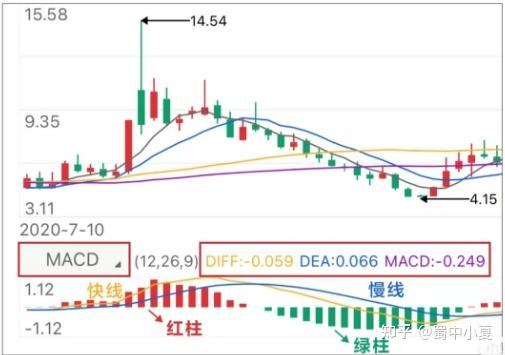
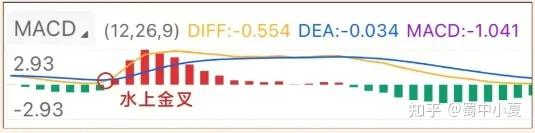
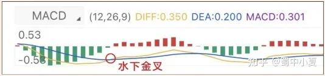
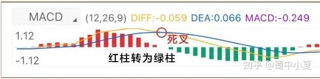
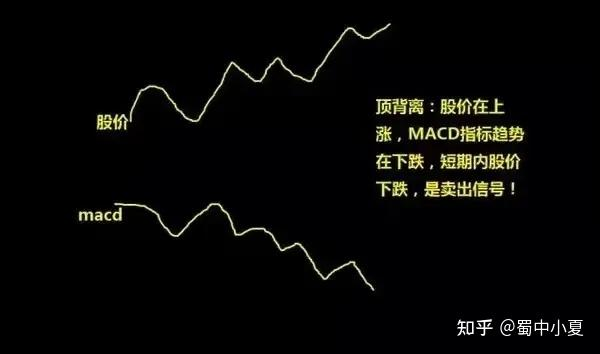
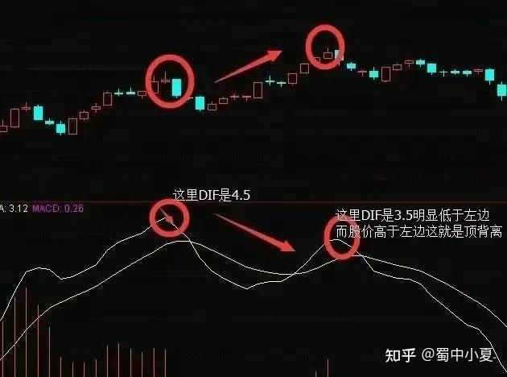
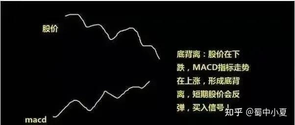
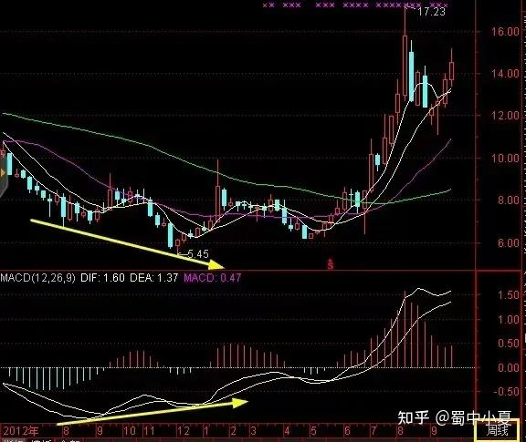

## MACD指标的构成

MACD是股票分析的技术指标之一，号称技术指标之王。MACD指标，全名叫做平滑异同平均线，由一根快线、一根慢线、一根0轴线和无数根柱状线组成。

MACD计算公式复杂，我们不需要自己计算，股票软件会帮我们算好，我们只需要懂得看图就行。

### MACD的五大元素

1、DIF: 又称快线，是快速移动平均线。其计算公式为: DIF值 =快速平滑移动平均线(EMA1)- 慢速平滑移动平均线(EMA2)。

2、DEA: 又称慢线，是慢速移动平均线，也被称为异同平均数。其计算方法是将多个DIF值进行加权平均。

3、红绿柱:

红柱:当快线DIF在慢线DEA之上时，快线减慢线的差值为正，即为红柱。

绿柱: 当快线DIF在慢线DEA之下时，快线减慢线的差值为负，即为绿柱。

红绿柱的高度(即DIF与DEA差值的两倍)直接反映了市场多空力量的强弱。

4、0轴

红柱与绿柱之间的分界线，MACD的多空分界线0轴之上为多头市场，0轴之下为空头市场。

### MACD的应用

1.多头市场

当快线DIF和慢线DEA均大于0，且两条线均呈上升趋势时，表明股价将上涨，涨势良好，整体市场属于多头市场。

2.空头市场

当快线DIF和慢线DEA均小于0，且两条线均呈下降趋势时，表明股价已下跌，且下跌幅度可能会进一步扩大，整体市场属于空头市场。

当红柱在0轴上方由长变短时，这是一个卖出信号。

3.金叉

当DIF自下而上穿越DEA，MACD由绿柱转为红柱时，表示股价由下跌转为上升，多头市场开始。

根据金叉位置与零轴线的关系，可以分为以下两种情况:

零轴上方:称为水上金叉。快线从下向上穿过慢线并在零轴以上形成水上金叉，红柱逐渐变长，表明市场进入多头力量主导阶段，预示股价将上涨。如果在低位出现两次金叉，通常预示后市将大幅上涨。

零轴下方:称为水下金叉。快线从下向上穿过慢线并在零轴以下形成水下金叉，此时零轴下方的绿柱逐渐缩短，表明行情由空头转为多头，这是买入信号。然而，这种情况通常只是空头市场中的短暂反弹，其稳定性较低，力度也不大。

4.死叉

当DIF自上而下穿越DEA，且MACD由红柱转为绿柱时，意味着股价由上涨转为下跌，空头市场开始。

根据死叉位置与零轴线的关系，可以分为以下两种情况:

水上死叉:通常只是多头市场中的一个回调，可靠性一般不高。

水下死叉:往往意味着新一波下跌的开始，且下跌幅度较大。

5.顶背离

当股价走势持续上涨，一峰比一峰高，而MACD指标的红柱图形却一峰比一峰低时，称为顶背离现象。这通常是股价在高位即将反转的信号，表明股价在短期内存在较大风险。

6.底背离

底背离通常出现在股价低位区域。当股价持续下跌，而MACD指标的绿柱图形却一浪比一浪低时，就出现了底背离现象。这通常预示股价在低位可能会反转向上，表明股价在短期内可能会出现反弹。

### 注意

①MACD指标是最著名的趋势性指标，其主要特点是稳健性。它可以在较长的时间周期内提供相对稳定的买卖信号，因此中长线操作者可以参照MACD指标进行操作。

②MACD是一个滞后指标。由于MACD中使用的所有数据都是基于历史价格，因此它必然滞后于价格变化。日线级别的MACD指标并不适用于短线操作。在行情波动较小或盘整时，按照信号进场后可能很快又要出场，买卖之间可能没有利润，甚至可能会损失价差或手续费。另外这里提一下我个人的macd参数设置，macd默认参数为（12,26,9）我是改成的（5,34,5），对于缓解滞后性有一定帮助，仅供参考。

③在中长期的上涨或下跌行情中，投资者用MACD会比较有