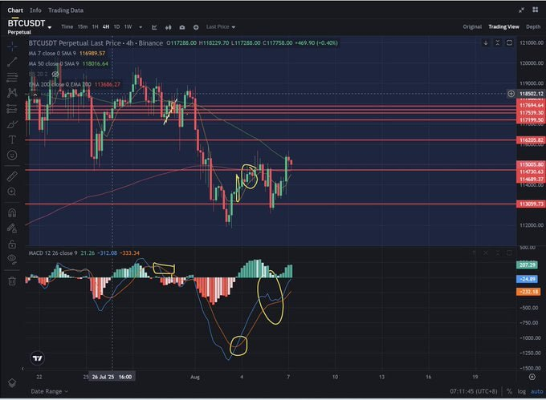

# 策略
1. 找到自己的节奏
2. 看 1、3、5、15 、30、1h 的macd线
3. 注意死亡交叉
4. 注意及时止损，抗单不要慌，切记频繁乱操作

1️⃣ 强势币高位连续跌9天，一定要果断跟进，很多人等不起这9天。
2️⃣ 连续涨2天的币，必须减仓，别贪心；该落袋为安就落袋。
3️⃣ 当日拉升超7%的币，第2天一般还有冲高，可继续观望，勿急入。
4️⃣ 大牛币别追高，等回调确认结束再进场。
5️⃣ 币价连续3天横盘没动静，再观察3天，若还没变化，考虑换仓。
6️⃣ 如果次日无法回本前一天成本，及时出局，不能恋战。
7️⃣ 涨幅榜有“三”必有“五”，有“五”就可能有“七”。连续涨两天的币，第三天低吸，第五天通常是卖点。
8️⃣ 量价是灵魂：低位放量突破是机会，高位放量滞涨要离场。
9️⃣ 只做上升趋势币：3日线短多，30日线中多，80日线主升浪，120日线才是真牛市的底层逻辑。
🔟 小资金一样能跑赢大盘，关键是：方法对，心态稳，执行狠，机会来要敢上。

我这一年靠的不是复杂指标，而是纪律+执行力：
✅ 无形态不做单
✅ 看准机会才进场
✅ 五年保持胜率90%以上

# 投资机构
- A16Z
- ConsenSys Ventures
- Paradigm

# SWAP 去中心链交易地址
- sushi：https://sushi.com

# 分析工具
- aicoin
- tradingView 

# 基础知识

## NFT 

# 记录
钱包市场寻找热度新币做波段周期1~3天，止盈后赚取利润就反哺主流币屯着

现货的话看是什么板块，当前ETH已经涨了很多了，我看他的顶部在4200，现在的山寨还没有涨，我会选择defi版块币种

我都是寻找一些有潜力有热度的新币，去做初期的热度。在刚发行的时候拿底部价，在热度高峰期就止盈

关注了两个多月的AI智能板块项目马上就要落地了，到时候可以分享给你参考参考

## 分析记录

### 分析1
THETA今天冲12倍了，前两天小群喊单0.75进。跟上的都赚钱了。

我还要让兄弟家人可以自己了解如何吃到整个波段。

今天分享：一刀进场法，如何靠1根放量K，吃掉整段主升浪

有时候，市场的上涨并不是慢慢爬上去的，而是突然爆发。一刀进场法，就是等那根“特别的K线”出现时果断切入，吃掉后面的大段利润。

什么是关键K线？

关键位突破：关键位是价格历史上多次遇到阻力或支撑的位置，比如前高、趋势线、箱体上沿。当价格突破这些位置，意味着一部分资金被迫平仓，另一部分资金开始追涨。

放量：成交量突然暴增，达到最近20根K线平均成交量的2.5倍以上，说明有大量资金在同一时间进场。

大阳线：K线实体部分（开盘到收盘的距离）明显大于平时，一般要大于14根K线平均波动幅度（ATR）的1.2倍，显示出单边强攻的力量。
只有这三点同时满足，这根K线才是“一刀”的目标。

多周期共振

不仅要看一个时间级别，还要看多个周期的走势一致。比如在1小时和15分钟周期上，均线呈现多头排列（短期均线在上，长期均线在下），RSI（相对强弱指标）大于50，MACD（平滑异同移动平均线）的红柱放大，这些都说明多空力量倾向一致。

进场方法

收盘就进（激进）：突破K收盘站稳关键位后直接买入。

回踩再进（稳健）：等价格回到突破位置附近再买入，相当于等个“确认”。

次K突破进（跟随）：等下一根K线突破上一根K线的最高点再进。

止损（最大可接受的亏损点）建议放在突破K的最低点下方，留一点安全距离。

止盈方法

先锁利润：价格涨到你计划盈利的1倍时，先卖掉一半，把止损提到买入价，这样就算行情回头也不亏。

分批落袋：价格涨到2倍时再卖一部分，剩下的留着赚更大的行情。

拖尾保护：让价格一直跑，直到跌破某个保护线（比如一条均线），自动卖出。

退出信号

突破后，下一根K线如果出现放量大跌，就马上离场。

如果连续三根K线没新高，并且成交量回到正常水平，也该撤了。

一天内如果连续两次假突破，就别再出手，当天收工。

一刀进场法的精髓，就是等、准、狠。等到关键位突破那一刻，确认放量且买盘强劲，再精准切入，不贪恋所有行情，只吃最有把握的那一段。

### 分析2
BTC这几天冲高了，从113附近来了一波，我今天继续分享如何利用MACD抓住短线。

记住：炒币必须短期暴利。长期拿稳，结果十个里面九个归零。

抓住暴利最好的方法就是MACD金叉共振法，这个战法现在完全开源。要么暴利走人，要么长期当韭。这是币圈唯一的真理。

项目方、交易所、KOL在上面割一轮又一轮，你还在做“价值投资”？

你是投资它价值，别人是投资你韭菜的价值。短期暴利才是散户活下来的唯一机会。

提示时间：凌晨提示113附近进场

【BTC复盘总结｜实战验证MACD多周期共振策略】

✅ 本轮BTC从113407进场，成功抓住反弹至11500+，验证了MACD多周期共振进场法的有效性。

📊 三周期共振信号复盘：
1️⃣ 15分钟图：最先出现MACD金叉，低位缩量震荡，底背离形态清晰，提示短线资金开始吸筹。

2️⃣ 1小时图：MACD同步金叉，价格突破短均线压制，确认多头接力。

3️⃣ 4小时图：MACD形成金叉，长周期转强，是中期上涨的启动确认。

### 分析3

MACD是趋势确认工具，单一周期容易滞后或假信号，
而多周期共振＝小周期提前预判，大周期确认主升浪 → 抓底+吃大段。

1. 三周期架构

日线（大周期）：确认牛熊 → 只做顺势单

4小时（中周期）：确定波段拐点 → 选定交易方向

15分钟（小周期）：精确找切入点 → 最佳杠杆进场时机

2. 多周期共振信号
底部共振做多：

日线MACD死叉后底部钝化 → 柱状图缩短，DIF/DEA即将金叉

4小时MACD提前金叉 → 波段反转信号

15分钟MACD二次金叉+放量突破平台 → 执行进场

顶部共振做空（或止盈）：

日线MACD金叉高位钝化 → 柱状图缩短

4小时MACD死叉 → 波段见顶信号

15分钟MACD二次死叉+跌破平台 → 平仓或反向进空

3. 杠杆与资金管理公式
初始资金：100U

3倍杠杆起步 → 小周期提前进场

日线+4小时共振确认后 加仓到5-10倍杠杆

每次波段盈利 50-100% → 止盈一半 + 滚仓下一波

目标 7-8 次波段 → 100U → 200U → 400U → 800U → 1600U → 3200U → 6400U → 12800U → 25600U → 51200U → 102400U

4. 进场与出场条件
进场：

日线与4小时MACD金叉 +价格突破前期平台

15分钟回踩不破EMA均线确认支撑

出场：

4小时MACD死叉 +柱状图放大

或价格放量跌破关键EMA支撑

5. 心法（最重要）
不抄顶部，不接飞刀，只做共振波段

小周期提前埋伏，大周期确认加仓

资金只做分批滚仓，守纪律，别贪

一句话口诀
“日线定方向，4小时抓波段，15分钟抢精准；金叉共振梭哈，多头钝化持仓，死叉共振跑路。”