- [国债逆回购](#国债逆回购)
  - [基本规则](#基本规则)
  - [背景分析](#背景分析)
- [可转债](#可转债)
  - [背景分析](#背景分析-1)
  - [可转债打新和打新股的区别](#可转债打新和打新股的区别)
  - [可转债套利](#可转债套利)
    - [可转债转股套利](#可转债转股套利)
    - [下调转股价条款套利](#下调转股价条款套利)
    - [强制赎回条款套利](#强制赎回条款套利)
    - [回售保护条款套利](#回售保护条款套利)
  - [常见指标](#常见指标)
  - [可转债网站查询](#可转债网站查询)
- [期权](#期权)
  - [场内可以交易的ETF期权品种](#场内可以交易的etf期权品种)
  - [背景分析](#背景分析-2)
  - [期权不仅是赌具，也是保单](#期权不仅是赌具也是保单)
    - [最基础的功效--风险大挪移](#最基础的功效--风险大挪移)
    - [提供高杠杆--花小钱办大事](#提供高杠杆--花小钱办大事)
    - [不只可以做多--立体化作战](#不只可以做多--立体化作战)
  - [什么决定了期权的价格？](#什么决定了期权的价格)
    - [首先最重要的是基础资产的价格波动](#首先最重要的是基础资产的价格波动)
    - [第二是行权价格和基础资产的现价对比](#第二是行权价格和基础资产的现价对比)
    - [第三是时间价值对期权权利金的影响](#第三是时间价值对期权权利金的影响)
    - [第四是市场预期和波动对期权权利金的影响](#第四是市场预期和波动对期权权利金的影响)
  - [如何交易期权](#如何交易期权)
    - [单腿策略](#单腿策略)
      - [买认购，盼股涨，下跌可能全亏光](#买认购盼股涨下跌可能全亏光)
      - [卖认购，怕股涨，风险无限细思量](#卖认购怕股涨风险无限细思量)
      - [买认沽，盼股跌，上涨或许皆湮灭](#买认沽盼股跌上涨或许皆湮灭)
      - [卖认沽，怕股跌，损失巨大空悲切](#卖认沽怕股跌损失巨大空悲切)
    - [组合策略](#组合策略)
      - [买入跨式策略](#买入跨式策略)
      - [卖出跨式策略](#卖出跨式策略)

# 国债逆回购

## 基本规则
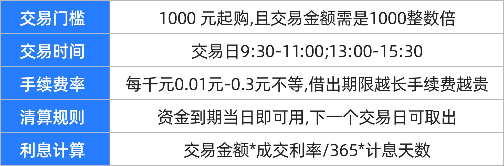

## 背景分析
1. 国债逆回购深度解析
   1. 国债逆回购本质上是一种短期贷款，其融资方大多数是银行、保险等大型金融机构，几乎不会出现违约情况。即便发生系统性风险，交易所作为中介方，也会承担相应担保职能，保证借款人的利益。
2. 为什么国债逆回购更适合股民？
   1. 国债逆回购通过交易所撮合交易，只需通过股 票账户即可进行场内交易。国债逆回购有两大优势：一是逆回购拥有相比于银行定期存款更高的短期利率，且灵活性高，不耽误股 票交易。二是逆回购手续费极低，交易成本小，且国债逆回购利率会实时变化，存在捕捉高利率机会。
3. 国债逆回购的实操玩法有哪些？
   1. 对于国债逆回购赚钱技巧，记住三个关键时间。   
   2. 一是“疯狂星期四”，周四的逆回购在周五计息，但周一才能取出，多出两天计息日。
   3. 二是“周五陷阱”，因为非交易日不能作为起息日，周五做逆回购只能周一才计息，性价比低。
   4. 三是“假期前两天”，节前第二个交易日逆回购可计入假期时段利息。

# 可转债

## 背景分析

1. 如何通过可转债穿越牛熊
   1. 相比于股 票，可转债有几大优势。首先是参与门槛比较低，开通权限即可打新，无需预缴申购资金；其次可转债实行T+0交易，当日实现短线交易。最重要的是，可转债即可以像股票一样投资价差，且涨跌幅空间更大，也可以像债券一样持有，以获取票息。
2. 想读懂可转债，牢记4个指标
   1. 分析可转债的投资价值，需要围绕几个因素：
      1. 转股价和下修条款是进行债转股的重要指标，可以为转债价格提供参考。
      2. 强制赎回条款是上市公司促使转股的重要手段，需要了解透彻。
      3. 回售保护条款则是可转债的保护伞。
   2. 转股价
      1. 转股价，可以说是可转债最重要的元素，几乎其他所有的条款和投资行为都以它为准绳。
      2. 当转股价低于股票市场价的时候，等于可以低价买入股票，所以可转债的价格就会上涨并维持在面值100元以上;当转股价高于股票市场价时等于高价买入股票不值得，所以可转债价格下跌，向面值靠拢甚至跌破100元。
      3. 转股价中还有个关键的词，叫转股期。它规定了可转债发行上市以后，必须过了一定的时间才能进行转换股票的行为。这就等于促使企业借到钱以后尽量用在生产上，而不是用来操纵股价牟取暴利。
      4. 值得注意的是，转股价不是一成不变的，在正式发行之后，当上市公司因增新股或配股、派息等情况就会使公司股份发生变化时，将按照一定的规则和公式，进行转股价格的调整
   3. 下调转股价条款
      1. 假设碰到极端情况，在发行可转债以后，股市节节下跌，上市公司股票也是掉头向下，并且已经远远低于转股价，可转债基本已经毫无转股价值，怎么办?"下调转股价条款“在这个时候就会派上用场。
      2. 下调转股价条款”的基本思想是
         1. 假如上市公司的股票市场价，在一定的时间段内，低于设定的一个阈值，那么上市公司有权在一定的条件下下调转股价。
         2. 下调修正后的转股价格一般应不低于一个特定日期前20个交易日内该公司股票交易均价和前一交易日均价之间的较高者，同时修正后的转股价格不低于最近一期经审计的每股净资产和股票面值
      3. 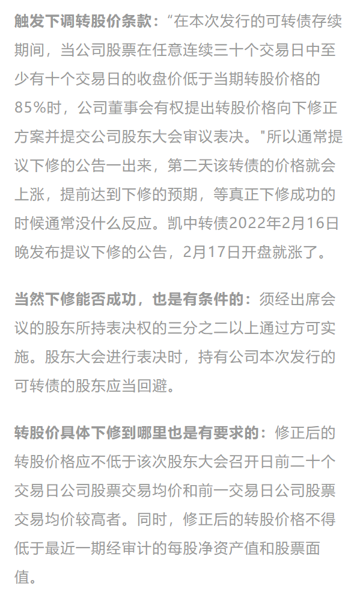
      4. 而下调转股价，确实能把转股获利的可能性大大增加了，往往会立竿见影地刺激可转债的市场价格，从而给持有人带来套利机会。
      5. 需要注意的是，向下修正转股价条款带有很多附加限制条件，如“有权提出调 整”说明仅是“权利而不是”义务”;提交股东大会能否通过还需要一定的票数;就算是实施了，具体下调到哪里也有限制;此外，有的可转债进入转股期后才能向下修正，也需留心。
   4. 强制赎回条款
      1. 强制赎回”一旦发生，表示可转债初始持有人至少赚了30%以上的利润，上不封顶，而且可以马上拿钱走人;同时，可转债的发行公司成功地把所有的“债主”一网打尽变成了自己的“股东”
      2. 可转债发行公司的终极目的，是让可转债持有人全部转股，从“债主”变成“股东”怎样才能做到这点?当然是让股票的市场价大大高于转股价，这样持有人等于能以低价买到股票然后以高价在市场中卖出，从而赚得其中的高。
      3. 问题是，如果股票市场价格已经远远高于转股价了，还是有人愿意持有可转债，不愿意转股怎么办?毕竟可转债有保底嘛!
      4. 强制赎回条款”的基本思想是:
         1. 在可转债转股期内，如果本公司股票市场价格在一定的时间段内，高于设定的一个阈值(一般是当期转股价的130%)，那么上市公司有权按照略高于可转债面值的一个约定赎回价格(一般是103元)赎回全部或部分未转股的可转债。
         2. 简而言之，股价已经远远超过约定转股价，您已经赚到了，赶快转股吧!否则我就以低价赎回!要么您在市场上赚30%以上(转股或者卖出可转债)，要么以103元卖给我，二选一!
         3. 举个例子:以天地转债为例，背后正股为天地数码，强赎条款为15/30，130%，转股价为12.04元/股，强赎触发价为12.04*1.3x15.65元
      5. 公布强赎后，可转债的价格一般会有所下跌，从而压缩溢价率至趋近于0甚至小于0，溢价率小于0意味着可转债转化为股票是有利可图的，也就会有很多持债者主动转股。
      6. 值得一提的是，满足“强制赎回"条件以后，也不用开什么股东大会投票批准了，上市公司直接就能发布公告实施赎回。但是上面提到的”下调转股价条款”必须要经过重重手续、道道关卡才能放行。
      7. 非常可惜的是，过去在可转债强制赎回发生后确实有极少数投资人出于种种原因忘记了、错过了或者根本不知道一居然没有转股，到期后被自动强制赎回。
   5. 回售保护条款
      1. 核心思想
         1. 在可转债存续的一定时间内，如果公司股票收盘价在N个交易日低于当期转股价格的一个阙值(这个阙值一般要低于向下修正转股价)时，可转债持有人有权将其持有的可转债全部或部分按面值的103%或面值100元+当期计息年度利息回售给本公司。
         2. 任一计息年度可转债持有人在回售条件首次满足后可以进行回售，但若首次不实施回售的，则该计息年度不应再行使回售权。
      2. 这是对可转债投资者的一种保护机制，如果可转债背后正股股价持续低迷，可转债持有者看不到希望，就需要回售条款出场了。这时，为了避免回售，上市公司可能会努力经营抬升股价或者下调转股价。
3. 汇总可转债的多样玩法
   1. 3️可转债的玩法有很多，主要分为两个方面：
      1. 一方面是可转债打新，相比于股票打新，转债打新优势是信用打新、不需要市值，同时破发率低，对新手友好；
      2. 另一方面则是可转债套利投资，投资者可通过债转股、利用下修、赎回、回售条款获取低风险套利收益。
   
## 可转债打新和打新股的区别
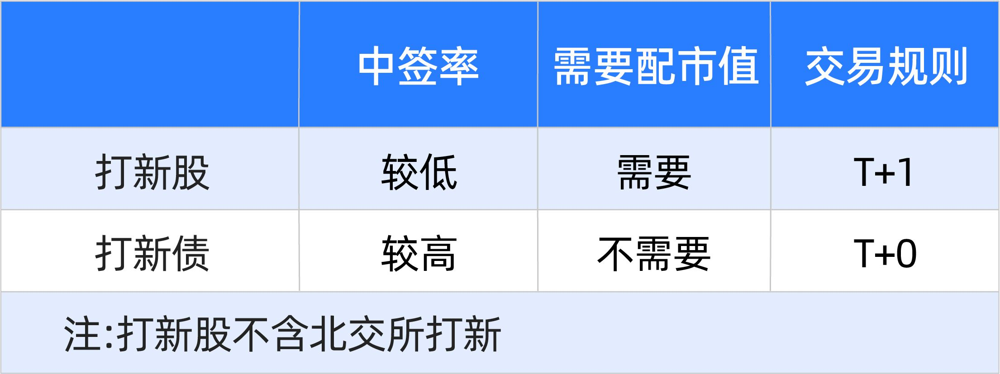

相比于A股打新，可转债打新最大的优势就是信用打新、不需要市值，它的第二优势是破发率较低，投资新手完全可以参与。

## 可转债套利
可转债就是个公认的套利好工具。但前提是你需要对可转债的各种条款烂熟于胸，对于股价的即时走势时时关心。**其核心就是利用可转债的公开规则，再结合市场价格的有利变动，在正股或可转债价格的关键节点上埋伏进去，给予最后一击!**
所谓利用规则套利，主要是结合可转债的向下修正转股价条款和回售保护条款，有时也涉及强制赎回条款。既含有可转债套利，也含有正股套利，一般常见的有以下几种情况。

### 可转债转股套利
假设某转债转股价2元，转债现价101元，正股价2.1元。此时以101元买进转债，以2元转股价转股可得50股正股，市价卖出得50x2.1=105元去掉交易成本和101元，剩下的就是套利所得，不过，由于当日转股需次日卖出，所以既有时间成本，次日股价也有下跌风险。
这块套利比较重要的，就是去哪里看转股套利的机会?
可以登录集思录App首页可转债数据一栏按溢价率从小到大排序或者在雪球App搜索可转债的代码，在右上角都会显示目前可以折价的转债。

### 下调转股价条款套利
绝大多数可转债都有一个“转股价格向下修正条款”，比如“在本次发行的可转换公司债券存续期间，当公司股票在任意连续30个交易日中至少有15个交易日的收盘价低于当期转股价格的90%时，公司董事会有权提出转股价格向下修正方案并提交公司股东大会表决。
一般去寻找那些大股东持有可转债，并且满足转股价下调条款，低于100元的可转债，因为大股东被套了，会有动力推动董事会提议下调转股价。
一旦上市公司将转股价下调到能下调的最低价可转债转股价值就回到100元左右，转债价格很可能会超过100元，
但是，此套利需预判上市公司下调转股价，进而提高转债价值，具有一定的不确定性。
需要特别强调的是，可转债的正股套利只是低风险，不是无风险，具体情况还要看市场和公司运作情况而定，不可一概而论，否则可能造成损失。

### 强制赎回条款套利
首先敲个黑板:只有进入转股期才能触发强赎可转债一般在发行6个月后进入转股期;强赎是上市公司的权利，而不是义务，
历史上，95%以上的可转债都是因为触发强制赎回而消失的。那么，我们就可以利用这个方式来进行可转债的低风险套利。
从强制赎回的条款中，我们可以知道30个交易日内有15个交易日，股价在转股价的30%以上时会触发强制赎回。
此时，可转债的价格计算方式就是:可转债的价格=目前股价/转股价*100+溢价
通常情况下，由于可转债的债性，一般都是具有正溢价的。那么结合可转债的强赎条款，触发强制赎回时，可转债的价格通常在130元以上，甚至更多。也就是说，130元，通常是一个强赎点。

### 回售保护条款套利
所谓可转债的回售套利，就是利用回售条款，对可转债进行低买高卖，赚取差价。
可转债回售套利的前提，是可转债处于回售期内或离回售期比较近的时期。
常见的回售套利有两种情况
1. 一种是上市公司执行了回售，那么在回售价格以下买入可转债，再回售给上市公司，就完成了套利;
2. 另一种套利是博弈上市公司将采取措施避免回售。上市公司有可能拉抬股价也可能会下修转股价，这两种方式理论上都会提升可转债的价格。
要做回售套利，咱们需要先知道哪些可转债将触发回售条款。大家可以在集思录网站查询，方法很简单。

## 常见指标
- 转股价值：100*正股价/转股价，简单讲就是这个转债目前的只考虑股属性的公允价值；
- 溢价率：100%*债现价/转股价值-100%，简单讲就是比转股公允价值高出部分的比率，用于高估和低估的判断使用；
- 纯债价值：就是字面意思，只考虑他是个债券，抛弃股性后，仅考量其还本付息时所体现的价值。
- 值得注意的是，溢价率越高，买入后的风险相对更大，转债的盘子一般都不大，很容易被资金带上去

## 可转债网站查询

# 期权

## 场内可以交易的ETF期权品种
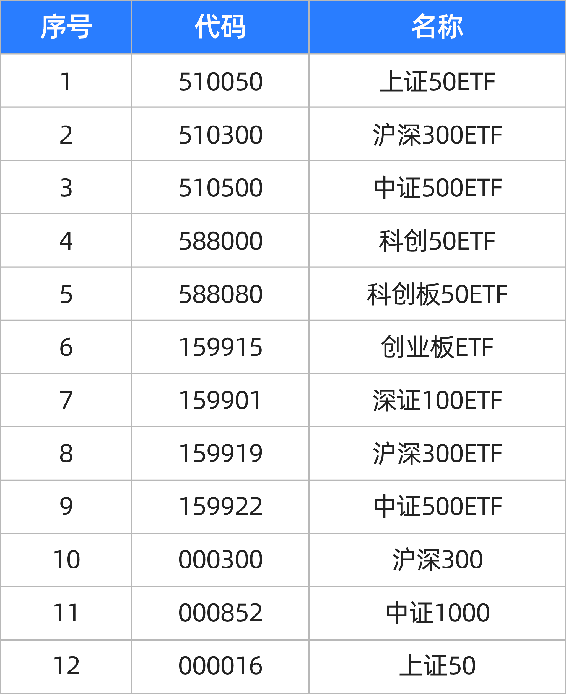

## 背景分析
1. 期权有哪些功效？
    1. 期权，顾名思义，期就是未来，权就是权力，期权就是未来的权力。股票期权就像投资股票的保险，期权的买方相当于投保人，期权的卖方相当于保险公司。期权具有高杠杆交易、风险分散、多空双向交易等职能，帮助投资者丰富投资手段。
2. 期权交易怎么玩？
   1. 有四个因素决定着期权的价格：
      1. 一是期权随着相应标的价格变化而涨跌。
      2. 二是基础资产现价与期权行权价格差距越大，期权价格就越低。
      3. 三是行权时间越远，期权价格越高。
      4. 四是隐含波动率越低，期权价值就越低。
3. 投资期权警惕哪些风险？
   1. 期权的玩法有很多，主流的操作分为买入跨式策略和卖出跨式策略。
      1. 买入跨式策略即买入等值的看涨和看跌期权，以少量权利金成本捕捉高波动收益。
      2. 卖出跨式策略即卖出等值看涨和看跌期权，在市场平稳阶段可获取权利金收益。
      3. 不过，期权对择时、择向能力要求高，操作难度大，一定要时刻谨记风险第一的原则。

## 期权不仅是赌具，也是保单

期权，顾名思义，期就是未来，权就是权力，期权就是未来的权力。股票期权就像投资股票的保险，期权的买方相当于投保人，期权的卖方相当于保险公司。

### 最基础的功效--风险大挪移
当投资者持有很多宽基ETF时，担心市场下跌造成损失，就可以买入ETF认沽期权进行保险，锁定未来最低卖出价。当股价下跌后，仍可以按照约定价格卖出股票。
### 提供高杠杆--花小钱办大事
除了国内市场期权市场的几百倍杠杆外，历史上很多投资大鳄都经常使用期权来花小钱办大事。
2012年末，索罗斯通过分析，认为安倍激进的货币政策会使日元进入大跌态势，到期行权会带来巨大收益，所以运用很少的资金杠杆性做多美元，做空日元。于是，索罗斯的量子基金用大约3000万美元买入看涨美元、看跌日元的外汇期权，获利10亿美元，相当于资金翻了30多倍

### 不只可以做多--立体化作战
实际上期权的出现将投资带入了立体化作战的时代，在股票市场中，我们只能在股价上涨时赚钱，如果股价下跌我们最多空仓，没法获利。虽然股指期货、高融资融券的推出，给了我们在下跌中获利的渠道，但券难融，股指期货门槛高。
有了期权后，除了上涨、下跌两个维度我们可以赚钱外，还可以实现市场平盘、或大涨大跌时的赚钱机会。

## 什么决定了期权的价格？
期权的价值由**内在价值与时间价值**构成，内在价值比较好理解，就是买方当下立刻行权获得的收入。时间价值比较难以捉摸，一般而言一个期权会经历生老病死的过程，只要期权不到期，理论上时间价值都会大于0。
实际操作中，期权的时间价值往往呈现一个特点，会随着时间的临近，呈抛物线加速衰减。
了解了期权价值，再来说说影响期权的价格，其中影响最大的三个因素就是**标的资产价格、时间以及波动率**。

### 首先最重要的是基础资产的价格波动
2015年8月27日，上证50ETF一改两个月来的颓势，单日涨幅高达8.43%。
随着标的上证50ETF的一路上涨，认购期权普遍大涨，认沽期权普遍大跌。截至当日收盘，认购期权50ETF购9月2300涨幅高达64%，认沽期权50ETF沽9月1800跌幅最大达61.48%。
### 第二是行权价格和基础资产的现价对比
如果行权价格和现价离得越远，说明发生的概率就越低，那么权利金就越低。
如下图，上证50的看涨期权，行权价离现价越远的价格就越低，如果看涨的行权价是在高于现价的就叫做虚值期权，如果看涨期权的行权价是低于现价的就叫实值期权。

### 第三是时间价值对期权权利金的影响
行权时间越远的，由于不确定性越大，所以权利金就越贵!
2015年3月18日到3月25日，50ETF价格从2.611变化到2.604，50ETF购4月2700合约的波动率从25.9%变化到26%，在标的价格和波动率都未发生变化的情况下，期权价格仍然下跌12.5%，这就是时间对期权价格的影响，在其他因素不变的情况下，距离到期时间越短，期权价值越低。
### 第四是市场预期和波动对期权权利金的影响
这部分业内人称之为波动率，简单讲，市场上大部分投资者都看多某只股票，那么这只股票对应的看涨期权就更贵，反之越便宜。

2015年11月26日，50ETF微涨0.46%，但不论是认购期权还是认沽期权都出现了价格普遍下跌的情况。
这是为什么?从盘面看，认购期权的隐含波动率从前一天的25%降至20%，认沽期权的隐含波动率从前一天35%下降到30%，隐含波动率是以百分比形式显示的数字，反映了交易者感知的不确定性或风险水平，隐含波动率的下降代表投资者对50ETF后市波动普遍看低。
也就是说，在其他因素不变的情况下，波动率越小，期权价值越低。

## 如何交易期权

### 单腿策略
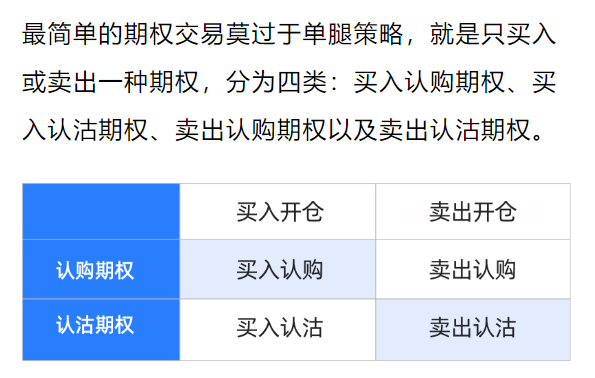

其中买入认购与卖出认沽是看涨策略，买入认沽与卖出认购是看跌策略。四个策略应对不同的策略，看大涨买认购，看大跌买认沽，不看涨卖认购，不看跌卖认沽。

#### 买认购，盼股涨，下跌可能全亏光
小明一觉醒来突然觉得牛市要来了，于是买入一张50ETF的认购期权，行权价为2.3元，权利金为0.06元/份。当到期日股价高于2.3元，为2.5元时，小明可以以2.3元的行权价买入50ETF，再以2.5元将其抛售，到期日盈亏为2.5-2.3=0.2元扣除权利金0.06元，总盈亏0.14元
当到期日股价小于2.3元，小明自然不会以更高的价格买入市值低于2.3元的证券，这样权利金就会归0。
如果我们把到期股价作为横轴，到期总盈亏作为纵轴，然后把每个点连起来，就能清楚的看到认购期权的到期盈亏图

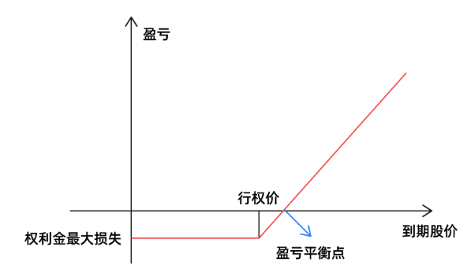

如上图所示，买入认购策略非常适合预期后市为大牛市的投资者，当标的价格长得越多，认购期权买方可以获得的收益也就越大，与此同时买入认购所承担的风险是有限的，无论标的价格跌多少，最终也就损失权利金。2019年那次单日192倍的奇迹，就来源于买入认购，

#### 卖认购，怕股涨，风险无限细思量
因为同一份期权的买卖双方是零和博变，买方到期所赚到的钱就是卖方所亏损的钱，卖出认购其实就是买入认购的对手盘，所以卖认购的盈亏图如下。
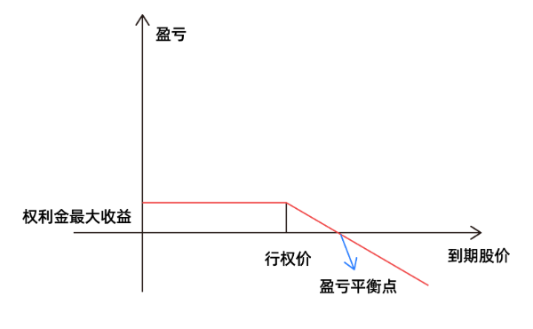

对于预期后市不会上涨的投资者而言，可以选择卖出认购策略收割买方权利金，不过当标的价格上涨时，卖出认购期权的会出现亏损，且越长亏得越多。
也就是说，这是一个收益有限最多赚到权利金却承担着无限风险的交易，现实生活中更多是机构、做市商在参与卖权交易。
#### 买认沽，盼股跌，上涨或许皆湮灭
小明等到了今年年初不再看好市场，觉得未来可能要大跌，于是买入了一张中证500ETF的认沽期权，行权价为5.00元，权利金为0.01元。
等到期日股价低于5.00元为4.80元时，小明可以以市场价4.80元买入，再以5.00元卖出，因此到期日盈亏为5.00-4.80=0.2元，扣除权利金0.01元，总盈利0.19元，盈利19倍
当到期日股价高于5.00元时，小明自然不会以5.00元的价格卖出高于5.00元价格的股票，因此通常会放弃行驶权力，也就是权利金归0
同样把到期股价作为横轴，到期总盈亏作为纵轴，把每个点连起来，就能清楚的看到认沽期权的到期盈亏图。

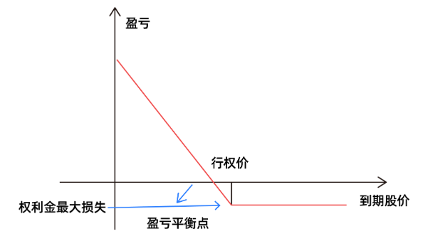

买入认沽跟卖出认购很像，预期未来会进入大熊市，可以考虑。当标的价格跌的越多，认沽期权的买方赚的就越多，极端情况下标的价格跌到0时，买方赚的最多。与此同时，买入认沽的投资者承担的风险同样有限，最多损失掉权利金。

#### 卖认沽，怕股跌，损失巨大空悲切

同理，卖出认沽其实就是买入认沽的对手盘，所以卖认沽的盈亏图如下

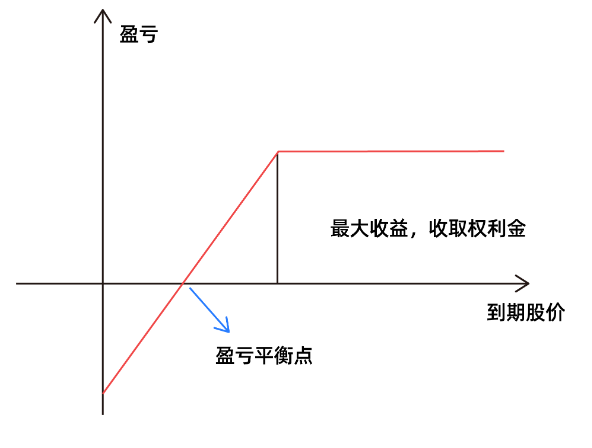

对于预期眼下已经跌不动了，后期不会再跌的投资者，可以选择卖出认沽策略，不过于卖出认购相似，这都是收益有限，风险无限的策略。

### 组合策略
组合策略弥补股票市场的投资空白。回顾A股历史，牛短熊长是显著特征，也就是说A股很喜欢短期暴涨暴跌，长期横盘调整或慢慢阴跌，如果只投资股票，在漫长的调整时，总会闲的无所事事。
有没有什么方法，能够应对更多的行情?期权组合策略为我们提供更多可能。
#### 买入跨式策略
当投资者总觉得要有大事发生，预期未来市场会出现大幅变动，但又无法判断方向时，最好的策略就是买跨策略，同时买入相同数量、相同标的、相同到期日、相同行权价格的看涨期权和看跌期权，这个策略只需付出有限的权利金，潜在收益却可能巨大。

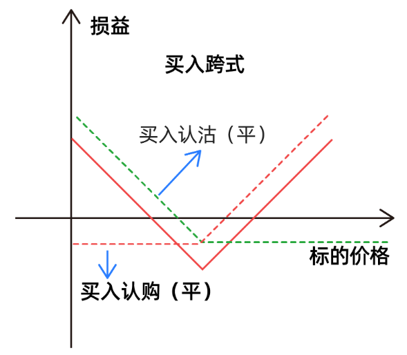

买入跨式策略的盈亏平衡点有两个，到期时当标的价格低于低盈亏平衡点或标的价格高于高盈亏平衡点时，买入跨式策略才能盈利。
#### 卖出跨式策略
投资中并非常有风浪，大风大浪过后总会有很长时间的平静，当投资者预期未来市场只会有小幅波动时，可以卖出相同数量、相同行权价的同月认购、认沽期权来构成卖出跨式策略。在市场小幅波动时获取收益，该策略在卖出开仓时可以获得权利金收入，不过收益有限，却承担了很大风险。

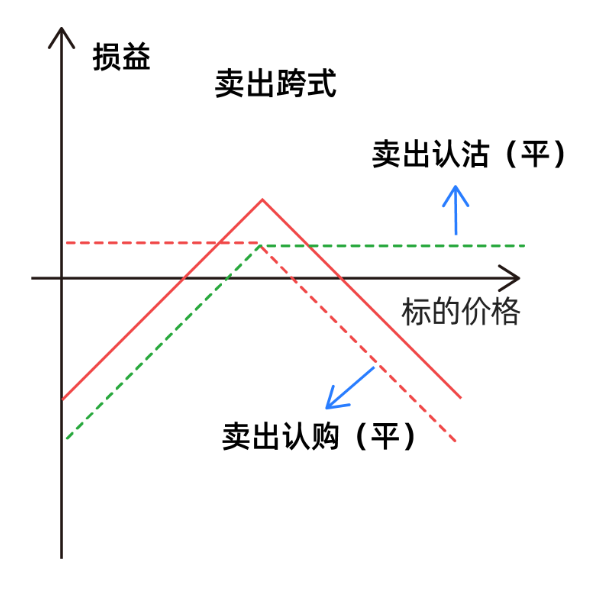

最大的收益就是卖出认购期权的权利金与卖出认沽期权的权利金，但最大的损失接近于无限。当标的价格在盈亏平衡点之间，组合处于盈利状态，一旦波动超过盈亏平衡点，则组合开始亏损。