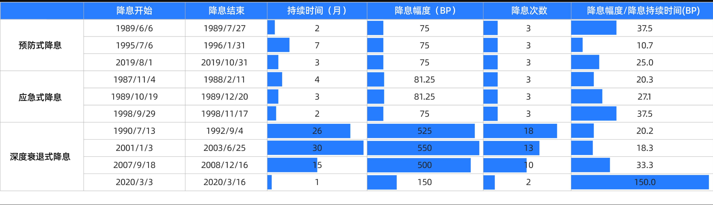
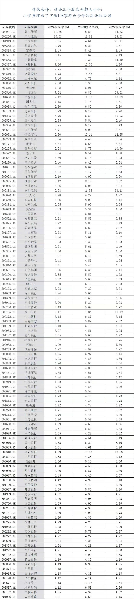

- [半导体](#半导体)
  - [背景分析](#背景分析)
  - [近期分析](#近期分析)
    - [2026-1-25 近期存储芯片价格大涨，背后是哪些“周期”在驱动？](#2026-1-25-近期存储芯片价格大涨背后是哪些周期在驱动)
- [新消费](#新消费)
  - [港股](#港股)
- [房地产](#房地产)
  - [不同方向龙头](#不同方向龙头)
- [建材行业](#建材行业)
  - [消费建材](#消费建材)
- [新能源](#新能源)
  - [背景分析](#背景分析-1)
- [美联储](#美联储)
  - [参考指标](#参考指标)
    - [美联储点阵图](#美联储点阵图)
  - [背景分析](#背景分析-2)
  - [近期分析](#近期分析-1)
    - [2025-12-10 美联储如期实施第三次降息](#2025-12-10-美联储如期实施第三次降息)
    - [关于2026年美联储降息](#关于2026年美联储降息)
- [石油石化](#石油石化)
  - [背景分析](#背景分析-3)
  - [近期分析](#近期分析-2)
    - [2026-1-20 分析](#2026-1-20-分析)
- [贵金属](#贵金属)
- [化工](#化工)
- [红利](#红利)
  - [红利ETF分类](#红利etf分类)
- [高股息](#高股息)
  - [股息是什么？](#股息是什么)
  - [可供参考的100家高股息公司](#可供参考的100家高股息公司)
  - [背景分析](#背景分析-4)
  - [高股息个股交易策略](#高股息个股交易策略)
  - [高股息投资组合策略](#高股息投资组合策略)
- [电力](#电力)
  - [水电](#水电)
    - [定价模式](#定价模式)

# 半导体

## 背景分析
1. 为什么半导体不只是成长？
   - 半导体不等同于成长，半导体赛道同样存在强周期属性，而且是长、中、短三周期嵌套。半导体行业是一个长期成长趋势向上，中短期存在周期变化的行业。
   - 长周期看技术创新，又称创新周期，通常为8-10年一轮。长期层面核心在于新技术周期带来的新生需求，通过高预期、高景气寻找趋势向上的机会；
   - 中周期看产能，又称产能周期，通常为3-5年一轮。主要受供给侧扩产节奏波动。半导体生产线从建设到量产需要1.5-2年左右，所以同下游需求波动通常存在错配；
   - 短周期看库存。又称库存周期，通常2-3年一轮。短期层面在于产业链库存变化及传导效应，跟踪短期供需变化产生预期差的机会。包括四个阶段：主动补库存，被动补库存，主动去库存，被动去库存。
2. 半导体的周期从何而来？
   - 为什么半导体有多周期叠加？主要有三个原因：
     - 首先是半导体产业链复杂且冗长，诸多子行业研发生产、供需周期时常错配而导致；
     - 其次是半导体产业需要多国协作，生产难度大，不确定性高；
     - 最后则来源于新技术诞生导致需求爆发，产业链各环节难以同步。
   - 周期背后的运行逻辑是什么？
     - 创新来源于技术。
     - 产能周期关联经济发展。经济周期对于半导体行业的影响可以划分为四个阶段。
        - 经济上行时，终端设备和整机需求回暖，半导体产品价格上涨，行业增速则上行;
        - 经济过热时，由于市场需求提升，各大半导体厂商加大资本开支，大幅度扩张产能，开始出现供给过剩的局面，行业增速出现疲缓态势，
        - 经济下行时，市场需求开始退化，但是扩张的产能由于惯性仍在继续，开始引发产品价格下降行业增速下行;
        - 经济衰退时，市场需求疲软，产能进入出清阶段，半导体厂商开始缩减开支，供给回落，增速见底。
      - 库存周期受制于扰动。
3. 如何顺应半导体的周期和趋势做投资？
   - 长期可以看看国产替代，毕竟作为不可避免地技术发展趋势。
   - 未来半导体投资逻辑分为长、短期两种：
     - 长期层面核心在于新技术周期带来的新生需求，通过高预期、高景气寻找趋势向上的机会；
     - 短期层面在于产业链库存变化及传导效应，跟踪短期供需变化产生预期差的机会。

## 近期分析
### 2026-1-25 近期存储芯片价格大涨，背后是哪些“周期”在驱动？
25年9月以来，美光、闪迪等存储芯片巨头股价大幅上涨，带动A股江波龙、香浓芯创均涨超150%。

这背后其实是半导体典型的 “多周期叠加” 现象在发挥作用。
1️⃣ 库存周期（短期供需错配）

之前：消费电子需求疲软，芯片厂库存高，大家都在降价清库存、减产。

现在：库存终于清得差不多了，但产能已经降下来了。需求一有回暖，立马物以稀为贵，价格自然触底反弹。
2️⃣ 创新周期（AI新需求爆发）

AI服务器需要海量高频数据，对内存（DRAM）和闪存（NAND）的容量和性能要求是指数级增长。

另外HBM（高频宽存储器） 成为“新宠”，大厂都把产能转向这些高端产品，导致传统芯片的供应也更紧张了。

现在半导体属于什么周期呢？理论结合实际，我来结合近期趋势讲讲当下的半导体行业：
- 技术周期方面，AI产业正从“训练”转向“推理与应用”双轮驱动，算力需求从云端向手机、PC等终端设备扩散，结构性拉动了对先进逻辑芯片、HBM存储和先进封装的强劲需求，技术演进路线更加清晰。
- 产能周期方面，全球半导体产能稳步扩张，但出现显著结构性分化。为满足AI芯片需求，先进制程（特别是≤7nm）产能增速远超行业平均
- 库存周期来看，行业库存调整已基本完成，整体水位回归健康。在AI需求与季节因素的驱动下，下游已进入主动补库存阶段，对制造端产能利用率形成支撑。

半导体产业存在周期共振的投资机会，结合当下估值水平来看，有较高的弹性空间，但半导体作为兼具周期和成长两大属性的板块，波动也较大，需要注意风险~

个股机会虽多，但许多优质半导体公司集中在科创板，投资门槛较高。对此，可以关注科创芯片ETF（588200）这类工具，一键布局科创板芯片龙头

# 新消费

## 港股

# 房地产

## 不同方向龙头
- 财务稳健的地产开发龙头，像保利发展、招商蛇口、滨江集团等，土储集中在核心城市、产品力强；
- 地产服务业态，比如二手房经纪，像我爱我家、贝壳等，受益于置换链条激活和市场活跃度提升；
- 商业地产运营，比如新城控股，主要受益于商办政策的松绑；
- 物业服务龙头，一般具备稳定现金流和较强的防御属性，像保利物业、绿城服务等

# 建材行业

## 消费建材
- 建材行业投资逻辑核心在于供给侧改善先于需求侧复苏。在反内卷等政策导向下，水泥等行业的价格协同初见成效，盈利水平持续修复。
- 防水、涂料等消费建材行业已步入最后的尾部出清阶段，竞争格局优化，部分细分赛道龙头的毛利率、费用率等已在积极变化，并有望率先迎来业绩拐点。

# 新能源

## 背景分析
1. 新能源为什么成为上轮牛市主线？
   1. 新能源成为上轮牛市的主线，主要依靠三个方面推动：第一个是政策催化，是产业景气度的主要来源；第二个是技术进步，扩大了市场增长空间；三是需求爆发，提高了产业盈利增速。
2. 新能源赛道也有周期吗？
   1. 新能源虽然是成长行业，但也同样具备周期属性性，这个周期主要体现在上游资源的供给层面上。过去几年，无论是光伏还是新能源汽车，本质上都是下游需求爆发，而产能释放速度较慢，导致供需失衡，从而出现了大幅的周期波动。
3. 从新能源看新兴成长行业投资
   1. 对于新能源的产业趋势，核心在于渗透率。渗透率的演绎，会经历三个阶段——导入期、加速期、减速期。我们可以通过观察渗透率，来定位行业现在的发展阶段，判断未来是会扩张得更快，还是已经过了最快的阶段。

# 美联储

## 参考指标
### 美联储点阵图

[text](工具/股票-美联储.md)

## 背景分析
1. 炒A股，为什么要盯紧美联储？
   1. 美联储的货币政策变化一向是做投资研究所关注的焦点，其影响着全球市场未来走向。美联储之所以能够影响全球市场，主要归因于美元的国际地位。
2. 美联储是如何影响全球市场的？
   1. 自二战之后，布雷顿森林体系建立，美元先后锚定黄金和石油。致使世界贸易以美元结算。美元汇率以及因货币政策产生流动性总会发生变化，就会产生相应套息及投资的机会，全球资本因此流入流出美国，从而产生热环流和冷环流。
3. 当下而言，该关注美联储哪些动作？
   1. 美联储的货币政策主要分为预防式降息、应急式降息、深度衰退式降息三种方式。
   2. 结合历史及现状，美联储在未来大概率会秉持边走边看的原则采取预防式降息。随着A股近年来受到美联储影响越来越大，我们对其未来走向应重点关注。
4. 什么是降息？
   1. 当美国为了提振本国经济，比较常规的会选我们都理解的降息，但也会特殊时期选择量化宽松，也就是我们常见的QE。
   2. QE的具体操作呢，就是美联储凭空定量的生成一笔钱，去从各大银行购买国债以及住房抵押贷款支持证券。就像是你拿着印钞机去逛超市一样，目的不是买什么，是为了支援超市。
   3. 而QE的具体时间，一般是在3月左右。因为3月是美国经济增长最快的月份，也是美国经济最不稳定的月份。
5. 什么是美元热环流？
   1. 过量的资金为了获取更高收益，率先涌入了本土的股市、债市和楼市，造成美股和房价齐刷刷的往上窜。同时，市场资金成本低，机构手里还有大笔钱，该怎么办?很多美国的金融机构就把目光移向了海外市场。
   2. 一方面，这些资本通过套息交易，把钱存入利差较大的新兴市场国家赚取超额收益
   3. 另一方面，它们通过直接投资海外市场的股票、债券、地产，或是通过成立合资公司、商业收并购、受让股权或增资的方式，投资海外建设项目。
   4. 这个过程由于过量资本的流入，凡是有增值空间的地方，就有资本来低买高卖赚差价，随后拉高海外资产的价格，这个过程就是美元热环流，**让美元流动起来的始作俑者，便是美联储**。
6. 什么是冷环流？
   1. 当美联储由降息周期转向加息周期时，便不再有新增美元涌入国际市场，同时海外资本回流美国避险或寻求更高的利息收益，导致美元越发稀缺，出现美元荒，进而推升美元走强。
   2. 同时由于美元变得稀缺，全球背负美元债的机构需要抛售资产，去挤兑央行的美元储备来偿还美元负债，造成急剧的本币紧缩，本币紧缩再叠加资本外流，新兴国家的股市或楼市往往会因失去流动性支撑而出现恐慌性抛售。
7. 降息方式：
   1. 
   2. 预防式降息。指美联储降息时美国基本面整体下行，但是仍维持韧性，美联储为了经济实现软着陆，采取预防式降息刺激经济，并且可能采取少量降息的方式来观察政策的效果，
   3. 应急式降息。指当突发性金融性风险导致美股等金融性资产阶段性大幅下跌，美联储为了防止流动性风险扩散而被迫实施快而急的降息措施缓解市场流动性压力，
   4. 深度衰退式降息。当美国经济快速回落的时候，美联储被迫开始较为连续的降息，这种情况下美国经济一般都将陷入到较为深度衰退短暂的降息很难稳定经济，因此通常降息连续性较强幅度也比较大，
## 近期分析
### 2025-12-10 美联储如期实施第三次降息

- 美联储已于2025年12月10日宣布实施年内的第三次降息，将联邦基金利率目标区间下调25个基点至3.50%-3.75%。
- 本次降息延续了美联储主席鲍威尔所定义的风险管理式政策框架，与9月、10月的降息逻辑一脉相承，凸显出美联储的政策重心已从单一的通胀管控全面转向平衡就业市场稳定与经济软着陆。
- 降息后，国际资本的成本低了，风险偏好会提升，会更愿意去港股这些被低估的资产。港股创新药、恒生互联网比较吃风偏，一旦流动性改善，修复的弹性可能更大~
- 对于未来的利率走向，美联储最新的点阵图暗示，2026年可能仅有一次降息。市场目前也倾向于认为政策将进入一个“观望期”，根据CME“美联储观察”工具的数据，市场预计1月立即再次降息的概率已降至5%。
### 关于2026年美联储降息
- **概率比较大的是采取预防式降息，美联储很早开启降息，上半年即启动首次降息，同时美联储不锁定明确的降息路线，而是秉持边走边看原则， 更多的玩擅长的预期管理，根据后续数据和风险的演变来推进货币政策**，如果是这样的降息方式，历史上往往会刺激全球股市整体大幅上行，对于A股而言，持续流出的外资也许会停下脚步，国内货币政策空间则越来越大。
- **有可能会衰退式降息，观察美联储的讲话不难发现，他们更多警惕的是提前降息带来的二次通胀等风险。**此情形下，美联储降息时点很可能晚于市场预期，降息节奏更多为持续性降息，如出现经济陷入衰退，10年期美债震荡中枢或下行至3.0%以下，与此同时美股可能会面临杀盈利的压力出现一定幅度回调。相比于预防式降息，衰退式降息的速度与幅度可能更快，更能解决A股这边流动性的燃眉之急，
- **小概率事件，应急式降息。**2008年金融危机爆发、2020年新冠疫情等突发事件下，为了缓解流动性冲击和隔离金融风险，美联储都会快速甚至非常规降息以防范风险进一步蔓延:此情形下，美联储通常快速且可能大幅降低利率，甚至不排除重启 QE。历史上看如果真的遭遇应急式降息，美股则可能经历一轮深度调整，在调整完成后会迎来强势反弹
- 那么A股呢?A股已经经历了好多轮深度调整目前A股此前的核心资产已经不再对标美股估值，美股那边的大跌对A股的影响理应越来越小，如果美债利率能够大幅降低，也许独立日的号角就在此时打响，

# 石油石化

## 背景分析
- 石化周期上行往往伴随三个主要条件
  1. 油价底部上行，利于库存收益，带动化工品价格上行。
  2. 供给端产能出清，例如2014、2015年日本乙烯关停产能退出，我国2015年开始供给侧改革。
  3. 需求端刺激，货币环境宽松，例如2009年我国4万亿元政策和美国量化宽松政策，2016年欧洲央行量化宽松政策带动欧洲补库等。
- “反内卷“提供重要支撑
  1. 政策有力牵引下产能控制逐步落实:国家明确炼油产能不超过10亿吨红线，扩产周期基本结束。炼化“反内卷“政策通过“关停小产能+限制新增+引导行业自律“三管齐下，改善行业竞争生态。
  2. 成本中枢回落，“反内卷“对产品价格托底。国内的“反内卷“促使产品价格传导机制向好，更利于行业实现“稳“增长。商品大周期共振，油价处于待涨左侧。原油价格仍是周期判断的关键变量。

## 近期分析

### 2026-1-20 分析
- 供给端
  -  国家已明确炼油产能上限，行业告别无序扩产。同时，日韩和欧洲的落后产能正在加速关闭，中国企业的市场份额进一步扩大
- 需求端
  - 随着原材料价格回归理性区间，企业的生产压力显著减轻。另外还有政策托底： “反内卷”政策引导行业进入有序竞争，产品利润空间在2025年底已实现转正并开始回升。

# 贵金属

# 化工

# 红利

## 红利ETF分类
- 红利指数一般分为四种，纯红利、红利低波、红利质量、央企/国企红利；后三者是在纯红利成分股基础上做调整。
  1. 纯红利：只按股息率排序+加权。如红利ETF（510880）；
  2. 红利低波：先高股息，再按近 1 年波动率“从低到高”留低波，用“股息率÷波动率”加权。如红利低波ETF（512890）；
  3. 红利质量：连分 3 年+股息率前 50%，再用 ROE、现金流、毛利率等质量得分×股息率加权，取 Top 50。如红利质量ETF（159758）；
  4. 央企/地方国企红利：先在央企或地方国企池子里按股息率排序，各取 Top 50/100，股息率加权且单行业≤20%。如央企红利50ETF（560700）；

# 高股息
> 高股息股票一般是指分红率要高于4%，并且公司质地好，能确定性持续分红的企业，聚集在银行、公用事业或者消费行业的比较多~
> 高股息策略，顾名思义，就是以股息率作为核心选股标准，选择业务经营稳定、现金流良好、长期高分红的股票，进行投资的策略。
> 这种策略更接近投资的本质，即获取稳定的现金流。长期持有高股息公司，通过分红，投资者能够切实分享到企业的经营成果

##  股息是什么？

这肯定不是呢，其实分红并不是公司白送钱，而是把你原本持有的公司资产，从“股票价值”变成“现金”。

举个例子，“小雪控股”总股本10股，每股10元，你持有1股。公司决定每股分红1元，你就会拿到1元现金。但注意，分红后股价会“除息”，从10元变成9元。你账户里变成了：1股9元的股票 + 1元现金，总资产没变，只是形式变了。

值得注意的是，如果公司每年都能每股分红1元，分红20年，那20年后我们就拥有了1股股票+20元的现金分红，这就是分红的力量。

实际上，很少有公司能够连续数年进行稳定的大额分红，因此能长期大额分红是判断公司好坏的一个有力证明。长期持有此类高股息公司，我们将充分享受公司经营带来的成果。

## 可供参考的100家高股息公司

## 背景分析
1. 高股息能否穿越牛熊？
   1. 高股息资产长期是可以穿越牛熊的，同时还有一定超额表现。
   2. 对比从2014-2023年间，中证红利指数与万得全A指数表现，可以发现中证红利指数表现更平稳，超额更强，高股息策略更为有效。
2. 如何挖掘高股息公司？
   1. 投资层面，主要通过上市公司分红能力和分红意愿两方面挖掘优质高股息资产。
   2. 分红能力主要体现在上市公司的盈利能力，比如长江电力自身的商业模式、盈利能力造就了其高股息的特性。
   3. 分红意愿主要通过分红比例、分红可持续性进行判断。
3. 高股息策略该如何做？
   1. 高股息策略分为个股策略和组合策略。
   2. 组合策略即用上述筛选方法筛出优质高股息标的进行组合投资，把握高股息的同事分散个股风险。
   3. 个股策略则是通过一只分红能力强、稳定性高的高股息个股，以股息率做适当的高抛低吸，长期把握股息价值，短期把握价差收益。
4. 高股息策略持续被机构看好，盈利能力稳定、具备分红能力和分红意愿的高股息板块也被认为是中长期的配置主线。
5. 如何判断分红意愿：
   1. 第一，看公司的历史分红情况。如果公司历史上已经连续多年高分红，那么，未来大概率还会延续高分红政策，
   2. 第二，看大股东的持股比例。如果大股东持股比例较高，又没有减持动机，那么，大股东从上市公司获利的途径只有一种，那就是现金分红。如果公司账上又有大量闲置现金，高分红就是大概率事件。这样，小股东们也可以跟着“吃肉”
   3. 第三，看公司有没有分红承诺。如果公司对未来几年的分红方案给出了承诺，就更没有问题了。

## 高股息个股交易策略
1. 投资高股息公司，行情好时，可以卖出赚股价上涨的钱;行情不好时，可以持股收息，赚分红的钱;还可以股息再投入，买到更多的股数，实现复利效应。所以，我们只需要从分红的角度，以股息率为标准制定交易策略，就可以了。
2. 因为股息率=每股分红:股价，当股息率高时，股价往往处于阶段低位，此时可以买入;而当股息率低时，股价已经涨上去了，就可以考虑卖出。这样，按照股息率进行交易，天然做到了“低买高卖”。
3. **那么，股息率多高时适合买入，多低时又适合卖出呢?**
   1. 实际上，对于A股上市公司，股息率大于3%，分红水平就算比较高了，如果股息率能达到4%以上，就是非常高的水平了。
   2. **落实到交易层面，就可以在股息率大于4%时买入，在股息率小于3%时卖出。**

## 高股息投资组合策略
- 常见的高股息资产，集中在水电、煤炭、钢铁,银行、交通运输等行业。有的行业周期性较弱比如水电、交通运输，而有的行业则有明显的周期属性，比如煤炭、钢铁、银行等。
- 可以根据股息率先选出一批高息股，建立股票池，再根据行业进行分类，从不同行业选出几只高息股，分散持有，进行组合投资。这样不仅避免了单只个股达不到买点，长期持币等待的问题，也可以起到分散行业风险、平抑周期波动的效果。
- 高股息策略不一定是收益最高的策略，但风格稳健，回撤较小，而且按照股息率这一单因子制定交易策略，不需要每天盯盘，操作简便，省时省力，对于收益预期不高、追求高胜率、也不准备在股市中投入过多时间的投资者，是比较合适的。

# 电力

## 水电
### 定价模式

水电的定价模式主要分为两大类，我国目前正处于从一种模式向另一种模式过渡的阶段。

⚖️ 水电定价的两种主要模式

1.  政府定价（成本加成模式）
    这是一种传统的定价方式。政府价格主管部门会以供水工程的“准许成本”为基础，再加上合理的收益和税金，来核定一个标准的供水价格。这种方式能保障工程的建设和稳定运行，但对供水效率的激励作用相对有限。

2.  市场化定价（供需博弈模式）
    这是一种更现代的改革方向。水电企业直接或通过电力市场，与用户协商确定价格，或者通过招投标等竞争方式来形成价格。这种方式能更好地反映市场真实的供需关系，激励企业提高效率。

🇨🇳 我国当前的水电定价情况

我国目前的水电定价并非“一刀切”，而是根据不同的环节和类型，采取了不同的模式，并且改革方向非常明确。

*   城镇供水（水龙头里的水）
    目前主要实行政府定价。根据《城镇供水价格管理办法》，我国城镇供水价格原则上实行政府定价，遵循“覆盖成本、合理收益、节约用水、公平负担”的原则。不过，部分地区（如济南、潮州）正在通过调整阶梯水价等方式，优化价格结构，更好地发挥价格杠杆的调节作用。

*   电力（水电卖出的价格）
    正在稳步推进市场化改革。根据国家部署，除了保障居民、农业用电的这部分水电外，其余的水电上网电量正全面进入电力市场，通过市场交易来形成价格。例如，甘肃省就出台了政策，推动装机容量在5万千瓦以下的水电站全部电量、以及大型水电站的部分电量进入市场交易。

*   水利工程供水（卖给其他方的水）
    采取政府定价与协商定价并存的模式。对于中央直属及跨省的重大水利工程，供水价格原则上实行政府定价。但对于供水力发电和生态用水等特定用途，价格则由供需双方协商确定。