## 新股关注建议

### 002531 天顺风能

- 目前上升仍有空间，如果回踩20日均线，可以考虑建仓

### 603698 航天工程

- 目前已经回踩30日均线，等待后续行情发展再决策

### 600151 航天机电

- 目前已经回踩30日均线，等待后续行情发展再决策

### 000029 深深房 A
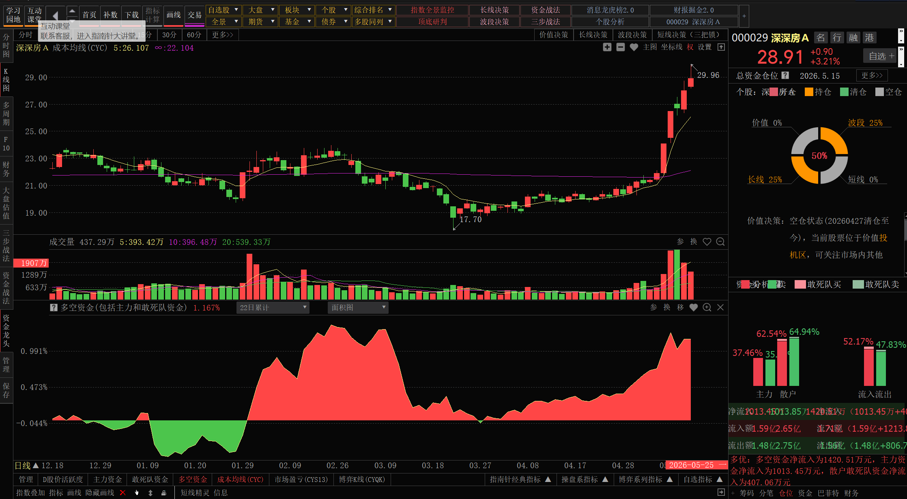
- 等待回调，目前政策利好，但已经上涨了

### 603938 三孚科技

- 等待回调，目前趋势已经打开，适当回调可以建仓

### 000695 滨海能源

- 观察机会，回调到20日均线15元左右可考虑

### 603278 大业股份

- 观察机会，回调到10日均线15元左右可考虑

### 000839 国安股份
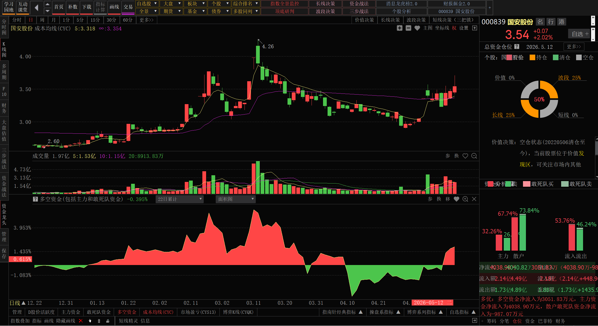
- 等待回踩3.2元左右，可考虑低吸

### 002173 创新医疗
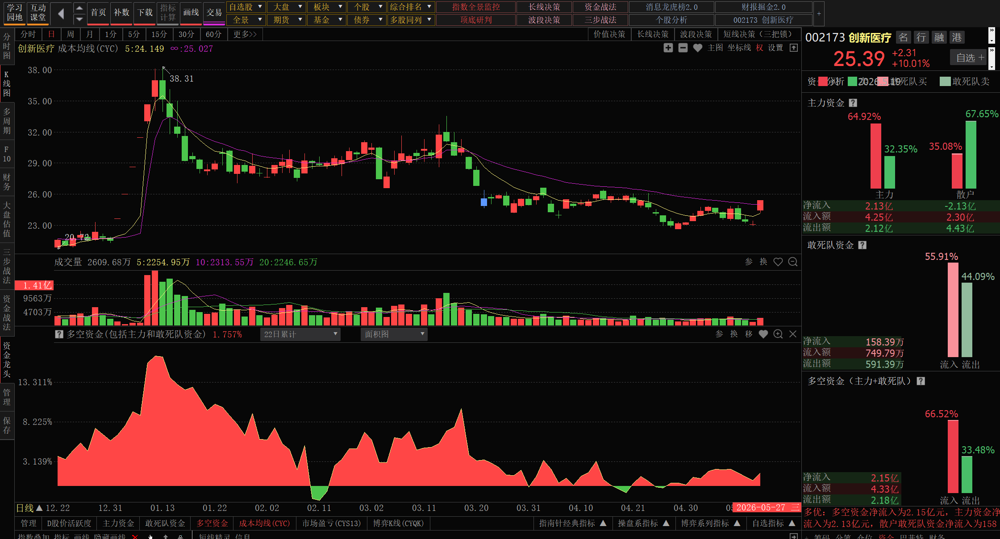
- 等待回踩后吸入
- 走长线逻辑

### 001896 豫能控股
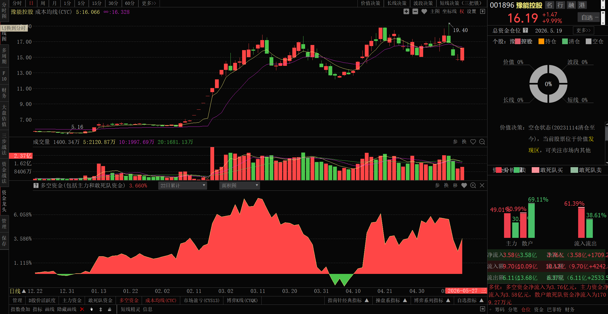
- 可以关注电力板块

## 近期关注逢高做T

### 002600 领益智造

- 目前处于趋势上升期间
- 继续持有，适当加仓，等待趋势继续上升
- 若是出现下跌收拢，可考虑做T出货

### 002196 方正电机
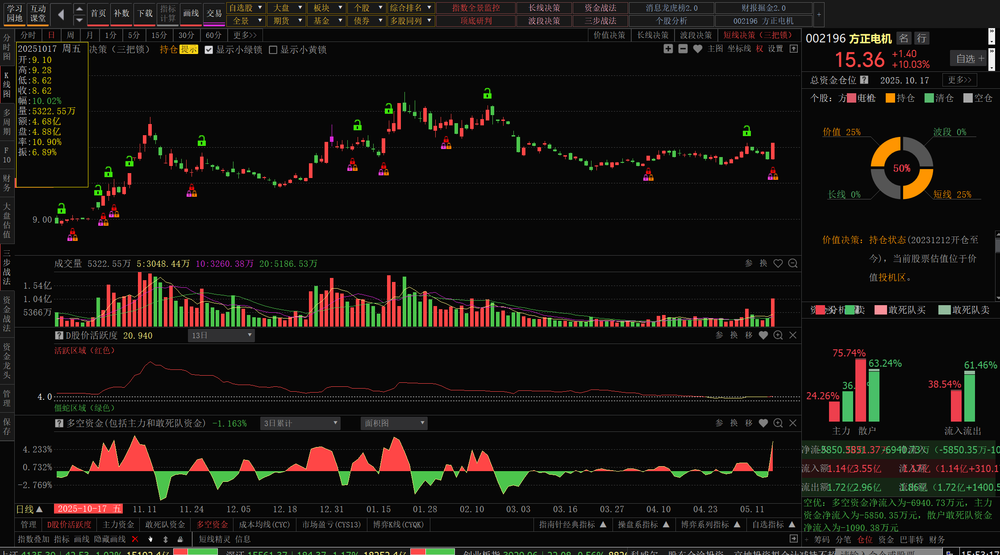
- 目前主趋势电机龙头
- 但是机器人板块表现不佳，后续也有消息，可以拿长线等待机会

### 601868 中国能建
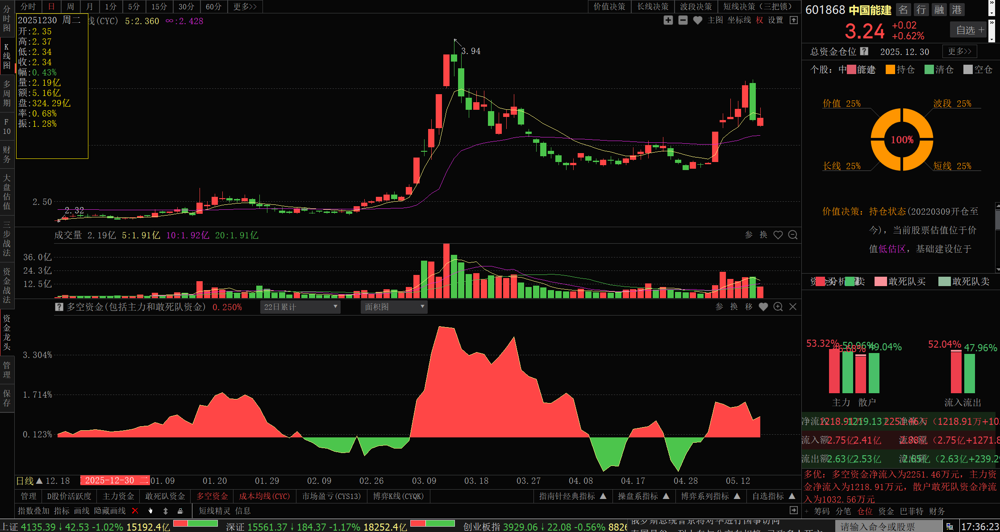
- 目前属于震荡上升期间
- 适当加仓，低买高卖，做T

### 002596 海南瑞泽
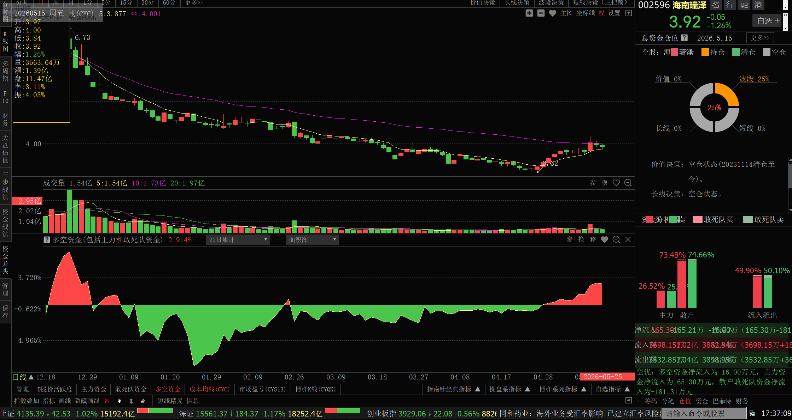
- 目前属于震荡上升期间
- 暂时拿着，估计短期没有突破。资金量正在涌入
- 适当加仓，等待海南板块轮动和是水泥周期上涨。

### 600666 奥瑞德
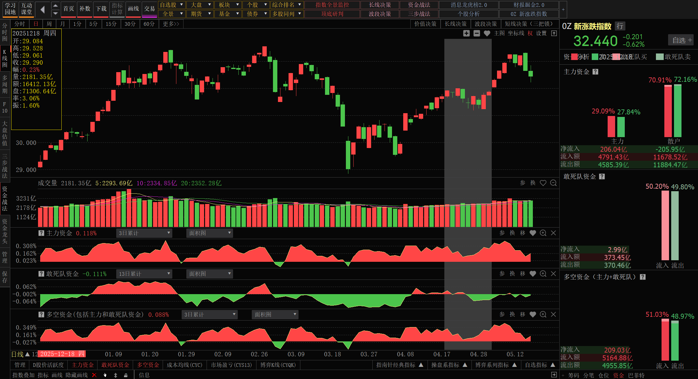
- 震荡下行
- 可以等回调后补仓在看机会
- 等待算力网络机会

## 000601 韶能股份
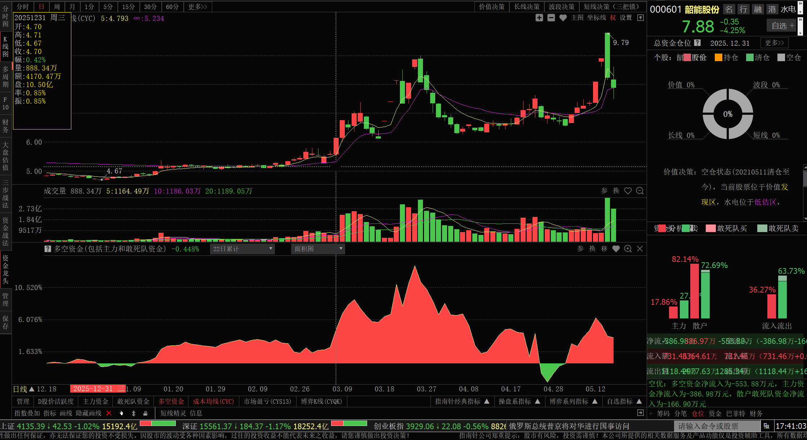
- 震荡区间，低吸高卖，但短线不看

## 000592 平潭发展

- 目前属于震荡期间
- 暂时拿着，估计短期没有突破。资金量正在涌入
- 适当加仓，等待台湾消息。

## 601398 工商银行

- 震荡期间，低吸高卖，但短线不看

## 600415 小商品城

- 出现买入资金增加
- 可以考虑长期持有，等待上涨周期，即使止盈出货

## 回本/止损

### 000738 航发控制
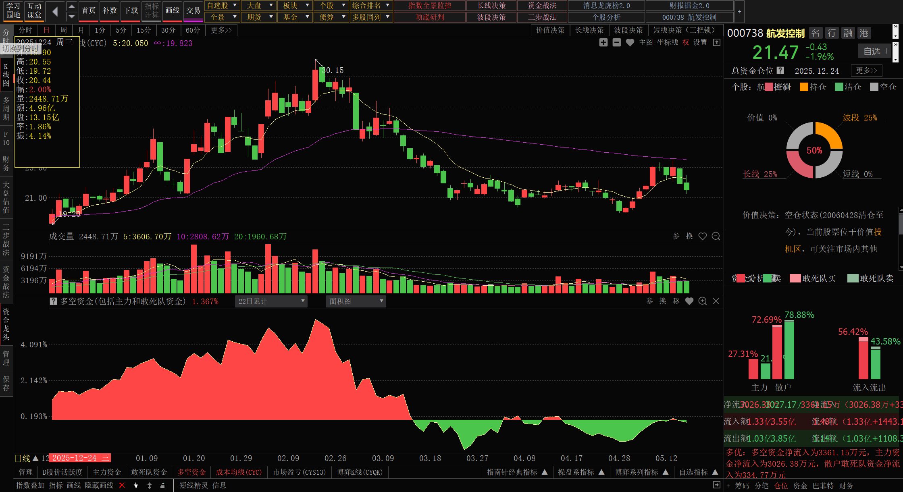
- 震荡下行
- 考虑回本止损后，及时出货

## 601669 中国电建
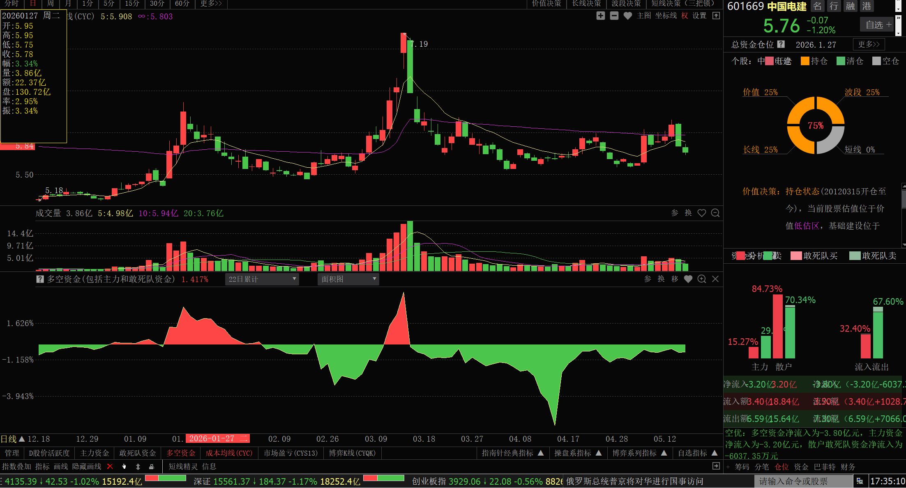
- 总体来看，资金处于流出，可能考虑及时止损，大方向可以看能建为主
- 如果存在回本，可考虑出货

## 000100 TCL科技
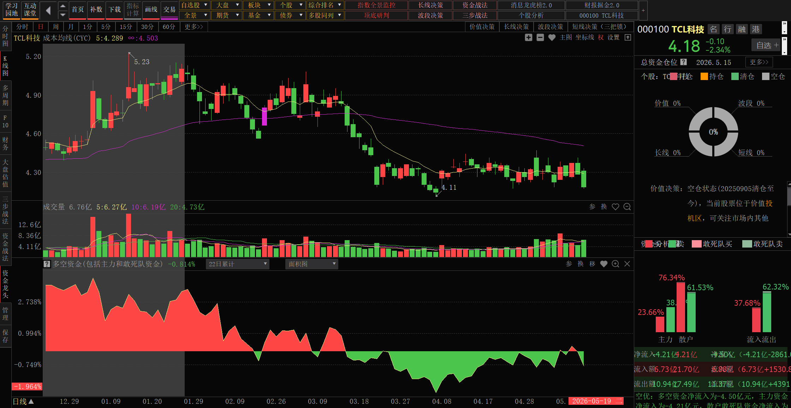
- 震荡下行时期
- 若是回本可及时出货