[toc]

---

# 前言

如果想在一个项目里面使用另一个项目的代码，那可以用 monorepo 的形式来组织，也就是一个项目下包含多个包，它们之间可以相互依赖。

这样确实可以频繁改动源码，然后另一个包里就直接可用了，但如果这个包是一个独立的 git 仓库，我希望它虽然在另一个项目里用了，但要保留 git 仓库的独立性呢?这种就可以用 git submodule 或者 git subtree 了。这俩都实现了一个 git 项日里引入了另一个 git 项目的功能。

那 submodule 和 subtree 都能做这个，它俩有什么区别呢?我该用哪个好呢?

# 准备

创建两个项目，可以直接在github上创建空白项目

1. Test-Submodules。子项目

2. Test-Submodules-Main。主项目

3. 给 Test-Submodules 项目添加3个文件，并提交

   ```shell
   echo "1" >> 1.md
   echo "2" >> 2.md
   echo "3" >> 3.md
   ```

此时项目Test-Submodules 如下

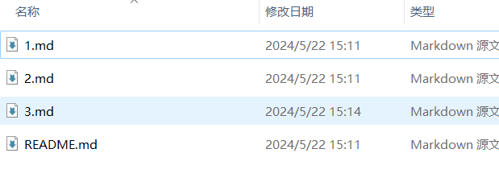

## 

# git submodule

## 测试

1. 进入 Test-Submoduels-Main 项目，将 Test-Submodules 作为子项目添加，命名为 child

   ```shell
   git submodule add git@github.com:smileluck/Test-SubModules.git child
   ```

   可以看到时clone到了项目下面。

   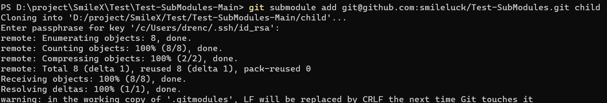

   此时项目结构如下：

    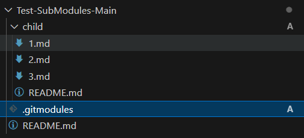

    同时出现 .gitmodules 文件指向了git

    ```toml
    [submodule "child"]
        path = child
        url = git@github.com:smileluck/Test-SubModules.git
    ```
   
   submodule 可以保留独立性，能从独立的.git文件和可以独立commit和push中看出。

2. 查看主项目的状态 `git status`

   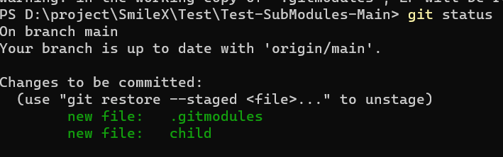

   在 `Test-Submodules-Main` 上传到git后

   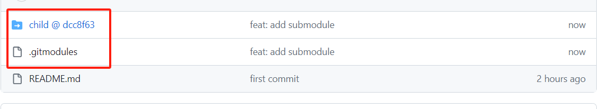

3. 在 `Test-Submodules-Main/child` 中，增加文件 4.md

   ```shell
   cd child
   echo "4" >> 4.md
   ```

   在 `Test-Submodules-Main` 中，查看 `git status`

   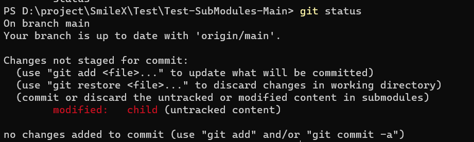

   在 `Test-Submodules-Main/child` 中，查看 `git status`

   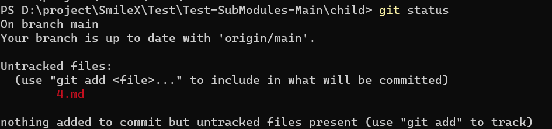

   在 `Test-Submodules-Main/child` 中，提交后，查看`Test-Submodules-Main` 中，查看 `git status`。此时的 `Test-Submodules-Main`  还是之前版本的

   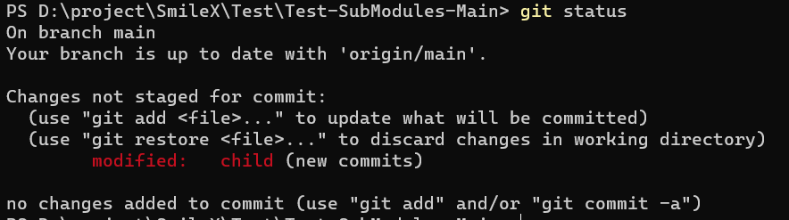

   在 `Test-Submodules-Main` 中，提交更新，才会更改 child

4. 重新 clone 一下项目，看看会是什么样的

   ```shell
   git clone git@github.com:smileluck/Test-SubModules-Main.git Test-SubModules-Main2
   
   # --recurse-submodules 包含所有字模块
   ```

   可以看到存在 child 文件夹，但是文件夹内部是空的，需要执行下面的代码。

   ```shell
   git submodule sync
   git submodule init 
   git submodule update
   
   
   # 或者
   git submodule update --init
   
   ## --recurse 递归拉取 
   ```

## 小结

1. 通过 git submodule add 在一个项目目录下添加另一个 git 项目作为 submodule
2. submodule 下可以单独 pul、push、add、commit 等
3. 父项目只是记录了 gitmodules 的 url 和它最新的 commit，并不管具体内容是什么
4. submodule 可以多层嵌套
5. git clone 的时候可以 -recursive-submodules 来递归初始化 submodules 或者单独执行 git submodule init 和 git submodule update

# git subtree

## 测试

1. 添加子项目

   ```shell
   git subtree ad --prefix=child  git@github.com:smileluck/Test-SubModules.git main
   ```

   可以发现child下面是没有.git，也不能在 child 下面单独提交。

   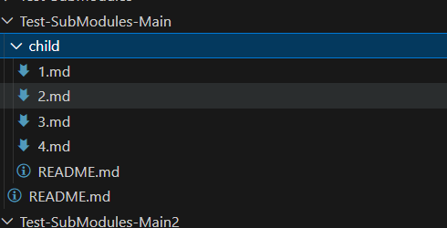

2. 在 `Test-Submodules-Main/child` 中，增加文件 4.md

   ```shell
   cd child
   echo "5" >> 5.md
   ```

   在 `Test-Submodules-Main` 中，查看 `git status`

   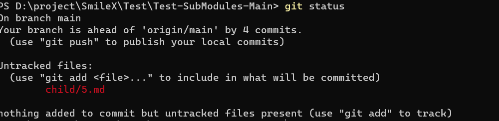

   在 `Test-Submodules-Main/child` 中，查看 `git status`

   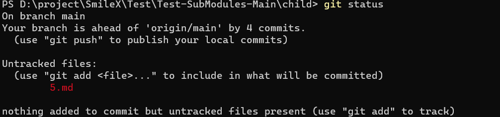

   在 `Test-Submodules-Main` 中，提交更新。可以看见  child对应的项目`Test-Submodules` 无更新。

   那我们看一下 `git log`。可以看到对应的的项目实际是增加了一个提交的。

   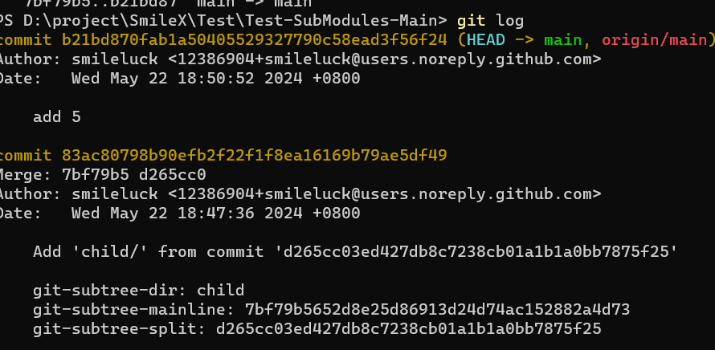

   将 subtree 的 child 更改 push 到 `Test-Submodules` 上

   ```shell
   git subtree push --prefix=child git@github.com:smileluck/Test-SubModules.git main
   ```

3. 在 `Test-Submodules` 中拉取更改后，并创建新的文件

   ```shell
   git pull origin main
   echo "6" >> 6.md
   ```

   在  `Test-Submodules-Main`  中看一下状态 git status

   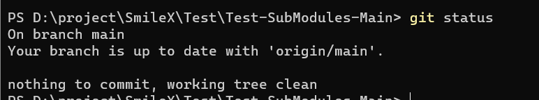

   明显没有追踪，那我们再通过命令拉取一下 child 的提交

   ```shell
   git subtree pull --prefix=child git@github.com:smileluck/Test-SubModules.git main
   ```

   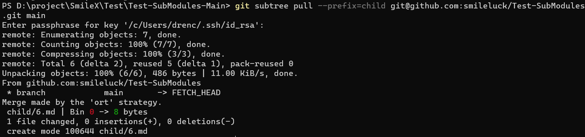

   也可以将url添加到remote管理

   ```shell
   git remote add child git@github.com:smileluck/Test-SubModules.git
   
   ## 就可以这么写
   ## git subtree pull --prefix=child child main
   ```

## 小结

1. git subtree add 可以在一个目录下添加另一个子项目
2. 子项目目录和别的目录没有区别，目录下改动会被 git 检测到
3. 可以用 git subtree pull 和 git subtree push 单独提交和拉取子项目代码
4. git subtree pull 加一个 -squash 可以合并拉下来的 commit

# 总结

- `git submodule` 会把子项目作为独立 `git` 仓库，你可以在这个目录下 pull、push、add、commit，父项目只记录着关联的 commit 是啥，并不关心子项目的具体变动。
- `git subtree` 则是把子项目作为普通目录来管理，和别的文件没啥区别，都可以 add、commit等。只不过依然保留了这个目录下的改动单独 pull、push 到子项目 git 仓库的能力。

# 注意事项

## submodule  Permission denied (publickey).

- 问题描述：子项目中使用了 git@github.com的格式，会提示无权限。
- 解决办法：
  - 替换成http
  - 直接使用  **TortoiseGit**:  会弹窗输入密码
  - 使用ssh-agent代理 