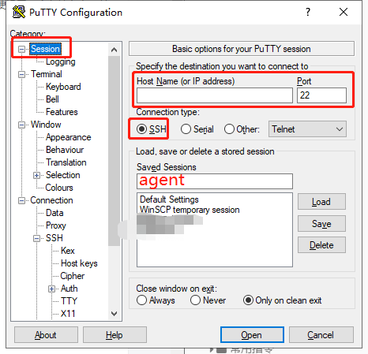

[toc]

---

# 1. 配置putty

1. 打开putty
2. 进入 Connect=>SSH=>Tunnels 面板。
3. 将目标设置成 Dynamic+Auto，添加一个自定义代理端口给，本例中设置为1080，点击ADD。上面输入框中出现D1080。


4. 进入Session
5. 配置自己的代理服务器地址，配置端口（默认22），类型选择ssh，设置一个存档地址并点击保存按钮。



6. 点击 Open连接。
7. 弹出的终端窗口中，输入服务器账号密码，登陆成功后，SSH隧道也建立成功了。代理上网期间，终端窗口不能关闭。

# 设置本地浏览器代理。

1. 以firefox为例，打开 FireFox->选项->常规->网络设置->设置 
2. 设置Socket主机
3. 保存即可。


# 最小账户问题

 我们之前用putty连接SSH时，使用的账户要考虑安全性问题，尽量避免使用root账户。大家都知道ssh在linux系统上的重要性,为了安全我们要使用最小权限的账号来做ssh代理,让其只能ssh转发却不能登录系统。

```shell
useradd -s /bin/false username #创建用户,-s参数可指定用户的shell,这里设置成了 /bin/false.这样用户就无法与系统进行交互.
passwd username #设置密码 
```


