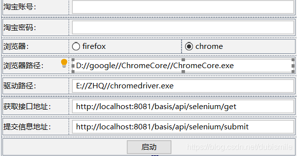
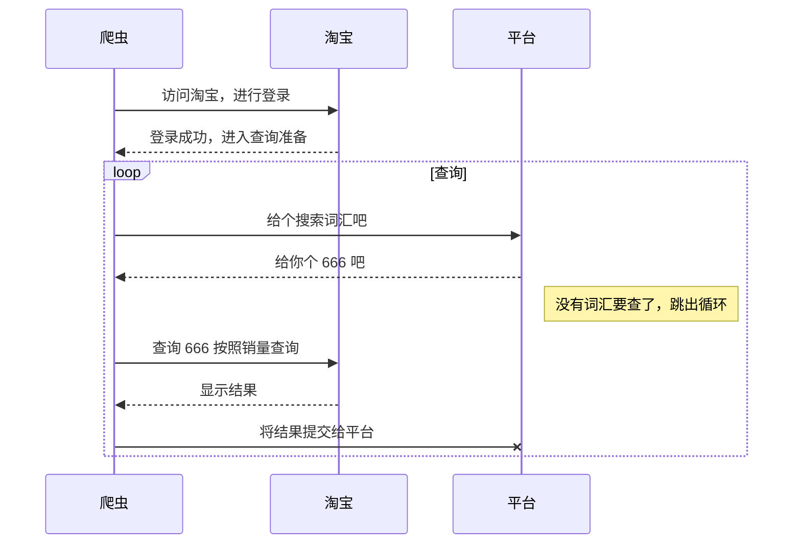
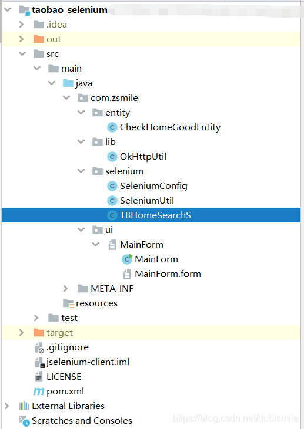

[toc]

----


# 前言

看了下网上关于淘宝数据爬取的，发现都是换取到token令牌后，然后去访问淘宝进行爬取的，感觉太麻烦了，换了一个比较傻瓜式的方法。

使用java+selenium+swing做的一个小桌面软件，用于爬取淘宝首页数据。


# 项目说明
## 界面说明
   

 1. 淘宝账号和淘宝密码是用来登陆账号使用的，可能中途需要输入手机验证码登录，建议第一次先输入验证码后；
 2. 浏览器、浏览器路径和驱动路径是以谷歌浏览器和火狐浏览器为主。**注意浏览器版本要和驱动对应**
	 - chrome浏览器使用chromedriver。
	 - firefox浏览器使用geckodriver
 3. 获取接口地址是用来获取查询搜索词汇。
 4. 提交信息地址是用来将查询到的商品数据上传到平台。

## 流程说明

## 项目结构

 1. /entity 存放实体类。CheckHomeGoodEntity是用来记录商品信息的类
 2. /lib 开发库
 3. /selenium 爬虫库。
	1. SeleniumConfig 爬虫配置
	2. SeleniumUtil 爬虫库，主要用于启动浏览器
	3. TBHomeSearchS 淘宝爬取规则
 4. /ui   界面

## 代码地址
[Github](https://github.com/smileluck/taobao_selenium)

# 代码说明
## selenium部分
### 登录淘宝
```java

    private void login() throws Exception {

        webDriver.get("https://login.taobao.com/member/login.jhtml?f=top&redirectURL=https://www.taobao.com");
        Thread.sleep(5000);
        WebElement usernameElement = webDriver.findElement(By.id("fm-login-id"));
        usernameElement.sendKeys(seleniumConfig.getTaobaoAccount());

        WebElement passwordElement = webDriver.findElement(By.id("fm-login-password"));
        passwordElement.sendKeys(seleniumConfig.getTaobaoPwd());
        webDriver.findElement(By.className("fm-submit")).click();
        Thread.sleep(5000);

        //需要滑块
        if (checkElement(webDriver, By.id("nc_1_n1z"))) {
            Actions action = new Actions(webDriver);
            WebElement hk = webDriver.findElement(By.id("nc_1_n1z"));
            action.moveToElement(hk).clickAndHold(hk);
//                action.moveByOffset(200, 0).perform();
            action.dragAndDropBy(hk
                    , 258,
                    0).pause(2000).perform();
            webDriver.findElement(By.className("fm-submit")).click();
        }
        Thread.sleep(5000);

        do {
            if (webDriver.getCurrentUrl().contains("login.taobao.com/member/login.jhtml")) {
                Thread.sleep(10000);
            } else if (webDriver.getCurrentUrl().contains("login.taobao.com/member/login_unusual.htm")) {
                //需要进行验证手机验证码
                Thread.sleep(5000);
                if (checkElement(webDriver, By.xpath("//*[@id=\"content\"]/div/div[1]/iframe"))) {
//                            Thread.sleep(2000)
                    WebElement iframe = webDriver.findElement(By.xpath("//*[@id=\"content\"]/div/div[1]/iframe"));
                    webDriver.switchTo().frame(iframe);
                    WebElement otherValidator = webDriver.findElement(By.id("otherValidator"));
                    otherValidator.click();
                    Thread.sleep(2000);
                    List<WebElement> liList = webDriver.findElements(By.xpath("//*[@id=\"content\"]/div/ol/li"));
                    for (WebElement webElement : liList) {
                        String text = webElement.findElement(By.className("text")).getText();
                        if (text.contains("手机验证码")) {
                            WebElement a = webElement.findElement(By.tagName("a"));
                            a.click();
                            break;
                        }
                    }
                    Thread.sleep(2000);
                    WebElement jGetCode = webDriver.findElement(By.id("J_GetCode"));
                    jGetCode.click();
                } else {
                    if (checkElement(webDriver, By.id("J_Phone_Checkcode"))) {
                        WebElement jPhoneCheckcode = webDriver.findElement(By.id("J_Phone_Checkcode"));
                        jPhoneCheckcode.click();
                        if (jPhoneCheckcode.getAttribute("value").length() == 6) {
                            WebElement submitBtn = webDriver.findElement(By.id("submitBtn"));
                            submitBtn.click();
                        }
                    }
                }
                Thread.sleep(10000);
            } else if (webDriver.getCurrentUrl().contains("www.taobao.com")) {
                break;
            } else {
                break;
            }
        } while (true);

    }
```
启动后，根据输入的名称，会进行自动登录操作。有2点需要注意以下：
1. 登陆后，可能需要滑块验证，所以我这里模拟了鼠标操作滑动；
2. 如果是非常用机器登录，会出现一个安全中心验证，这时就要进行手机验证码获取。只需收到验证码后填写，无需进行其他操作。


### 查询商品并提交

```java

    private void search(JSONObject info) {
        try {
            webDriver.get(searchHomeUrl + "&q=" + info.getString("name"));
            Thread.sleep(10000);
            
            // 没有找到与xxxx相关的宝贝
            Boolean cboolean = checkElement(webDriver, By.className("combobar-noquery"));
            Boolean aBoolean = checkElement(webDriver, By.className("item-not-found"));
            if (aBoolean || cboolean) {
                String res = OkHttpUtil.postJson(seleniumConfig.getApiSubmitPath(), info.toJSONString());
                if ("".equalsIgnoreCase(res)) {
                    return;
                }
                JSONObject jsonObject = JSON.parseObject(res);
                if (jsonObject.getInteger("code") == 0) {
                    return;
                }
                return;
            }

            List<CheckHomeGoodEntity> checkHomeGoodEntities = new ArrayList<>();
            WebElement items = webDriver.findElement(By.xpath("//div[@id=\"mainsrp-itemlist\"]/div[1]/div[1]/div[1]"));
            List<WebElement> mouserOnverReq = items.findElements(By.className("J_MouserOnverReq"));
            //便利商品数据
            for (WebElement webElement : mouserOnverReq) {
                CheckHomeGoodEntity checkHomeGoodEntity = new CheckHomeGoodEntity();

                WebElement picLink = webElement.findElement(By.className("pic-link"));
                String detailUrl = picLink.getAttribute("data-href");
                WebElement img = picLink.findElement(By.tagName("img"));
                String picUrl = img.getAttribute("src");
                String title = img.getAttribute("alt");

                String viewPrice = webElement.findElement(By.className("price")).findElement(By.tagName("strong")).getText();
                String viewSales = webElement.findElement(By.className("deal-cnt")).getText();
                if (viewSales.indexOf("+") > -1) {
                    String substring = viewSales.substring(0, viewSales.indexOf("+"));
//                    Matcher matcher = pattern.matcher(substring);
                    if (substring.indexOf("万") > -1) {
                        checkHomeGoodEntity.setViewSales2((int) (Double.parseDouble(substring.substring(0, substring.length() - 1)) * 10000));
                    } else {
                        checkHomeGoodEntity.setViewSales2(Integer.parseInt(substring.substring(0, substring.length() - 1)));
                    }
                } else if (viewSales.equalsIgnoreCase("")) {
                    checkHomeGoodEntity.setViewSales2(0);
                } else {
                    checkHomeGoodEntity.setViewSales2(Integer.parseInt(viewSales.replaceAll("\\D", "")));
                }
                String itemLoc = webElement.findElement(By.className("location")).getText();
//                String rawTitle = webElement.findElement(By.xpath("//*[@class=\"J_ClickStat\"]")).getText();
                String shopLink = webElement.findElement(By.className("shop")).findElement(By.tagName("a")).getAttribute("href");
                String nick = webElement.findElement(By.className("ww-small")).getAttribute("data-nick");
                checkHomeGoodEntity.setRawTitle(title);
                checkHomeGoodEntity.setViewPrice(new BigDecimal(viewPrice));
                checkHomeGoodEntity.setItemLoc(itemLoc);
                checkHomeGoodEntity.setViewSales(viewSales);
                checkHomeGoodEntity.setDetailUrl(detailUrl);
                if (detailUrl.indexOf("#detail") > -1) {
                    detailUrl = detailUrl.replaceAll("#detail", "");
                }
                checkHomeGoodEntity.setCommentUrl(detailUrl + "&on_comment=1");
                checkHomeGoodEntity.setNick(nick);
                checkHomeGoodEntity.setTitle(title);
                checkHomeGoodEntity.setShopLink(shopLink);
                checkHomeGoodEntity.setPicUrl(picUrl);
                checkHomeGoodEntities.add(checkHomeGoodEntity);
            }
            info.put("checkHomeGoodEntities", checkHomeGoodEntities);
            //提交到平台
            String res = OkHttpUtil.postJson(seleniumConfig.getApiSubmitPath(), info.toJSONString());
            if ("".equalsIgnoreCase(res)) {
                return;
            }
            JSONObject jsonObject = JSON.parseObject(res);
            if (jsonObject.getInteger("code") == 0) {
                return;
            }

        } catch (Exception ex) {
            ex.printStackTrace();
        }
    }
```
控制浏览器查询商品后，将显示的商品列表提交到指定的接口。

> 最近离职了，然后闲的发慌，就做了这个demo版本吧，虽然还有挺多问题的，但是能用。

---
老规矩写的不清晰的地方，可以指出，我会不定时更新和修改。一起加油.

所有的伟大，都来自于一个勇敢的开始。
