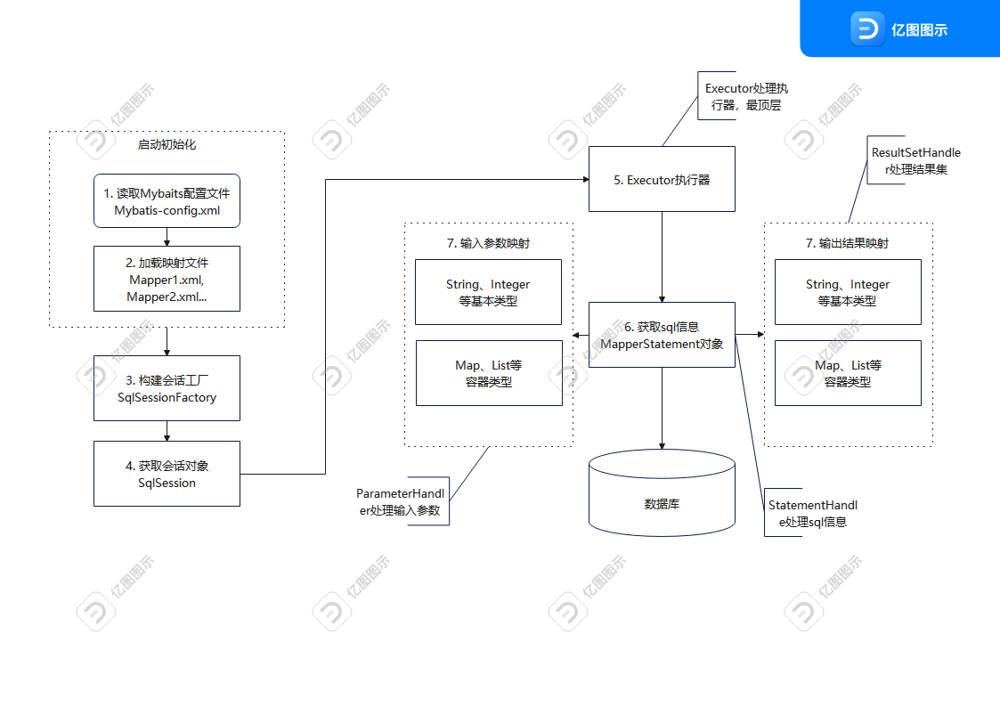

[toc]

---

# 前言

我们都知道 `Mybatis` 底层封装了 `JDBC API` ，`Mybatis` 的工作原理及核心流程与 `JDBC` 的使用有很多相似之处，基于 `JDBC` 可以方便我们更加深入学习 `Mybatis`

# JDBC 和 Mybatis

## 核心对象

我们先看 `JDBC` 我们会用到的5个核心对象：

1. `DriverManager`。驱动管理类，
   1. 注册驱动
   2. 获取连接
2. `Connection`。数据库连接对象
   1. 获取执行 `SQL` 的对象
   2. 事务管理
3. `Statement`。用来执行 `Sql` 语句，但是会存在 `Sql注入` 的问题
4. `PrepareStatement`。用来执行 `Sql` 语句，但是他的出现解决了 `Sql注入` 的问题并提高了性能，一次编译，到处使用。其底层是对特殊字符做了转义。
5. `ResultSet`。结果集对象，封装了 `Sql` 查询语句的结果并提供了操作查询结果数据的方法。

而 `Mybatis` 也有四大核心对象：

1. `SqlSession`。该对象包含了所有执行 `SQL` 语句的所有方法。
2. `Executor`。根据 `SqlSession` 传递的参数动态地生成需要执行的SQL语句，同时负责查询缓存的维护。
3. `MappedStatement`。该对象是对映射`SQL` 的封装， 用于存储要映射的SQL语句的id、参数等信息。
4. `ResultHandler`。用于对返回的结果进行处理，最终得到自己想要的数据格式。

>  额外说明

1.  在JDBC中，Connection不直接执行SQL方法，而是利用Statement或者PrepareStatement来执行方法。在使用JDBC建立了连接之后，可以使用Connection接口的createStatement()方法来获取Statement对象，也可以调用prepareStatement()方法获得PrepareStatement对象，通过executeUpdate()方法来执行SQL语句。而在MyBatis中，SqlSession对象包含了执行SQL语句的所有方法，但是它是委托Executor执行的。从某种意义上来看，MyBatis里面的SqlSession类似于JDBC中的Connection，他们都是委托给其他类去执行。 

2.  虽然SqlSession对象包含了执行SQL语句的所有方法，但是它同样包括了：

   ```java
   <T> T getMapper(Class<T> type);
   ```

   所以SqlSession也可以委托给映射器来执行数据的增删改查操作。如下代码所示：

   ```java
   // 获得mapper接口的代理对象
   PersonMapper pm = session.getMapper(PersonMapper.class);
   // 直接调用接口的方法，查询id为1的Peson数据
   Person p2 = pm.selectPersonById(1);
   ```

    这上面来看，SqlSession是不是也类似于JDBC中的Connection呢？ 


# 核心流程和工作原理



1. 读取`MyBatis`的配置文件。`mybatis-config.xml`为MyBatis的全局配置文件，用于配置数据库连接信息。
2. 加载映射文件。映射文件即SQL映射文件，该文件中配置了操作数据库的SQL语句，需要在MyBatis配置文件`mybatis-config.xml`中加载。`mybatis-config.xml` 文件可以加载多个映射文件，每个文件对应数据库中的一张表。
3.  构造会话工厂。通过MyBatis的环境配置信息构建会话工厂`SqlSessionFactory`。 
4.  创建会话对象。由`SqlSessionFactory`创建`SqlSession`对象，该对象中包含了执行SQL语句的所有方法。 
5.  `Executor`执行器。`MyBatis`底层定义了一个`Executor`接口来操作数据库，它将根据`SqlSession`传递的参数动态地生成需要执行的SQL语句，同时负责查询缓存的维护。 
6.  `MappedStatement`对象。在`Executor`接口的执行方法中有一个`MappedStatement`类型的参数，该参数是对映射信息的封装，用于存储要映射的`SQL`语句的id、参数等信息。 
7. 输入参数映射。输入参数类型可以是Map、List等集合类型，也可以是基本数据类型和POJO类型。输入参数映射过程类似于JDBC对preparedStatement对象设置参数的过程。
8. 输出结果映射。输出结果类型可以是Map、List等集合类型，也可以是基本数据类型和POJO类型。输出结果映射过程类似于JDBC对结果集的解析过程。

我们知道 `Mybatis Interceptor`  有四大核心对象。其实可以分别对应上上面核心流程的步骤5-8。

- Executor：MyBatis的执行器，用于执行增删改查操作 

- StatementHandler：数据库的处理对象，用于执行SQL语句

- ParameterHandler：处理SQL的参数对象

- ResultSetHandler：处理SQL的返回结果集

  

# 参考链接

[MyBatis的工作原理以及核心流程介绍]: http://www.mybatis.cn/archives/706.html


