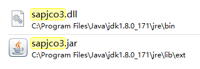
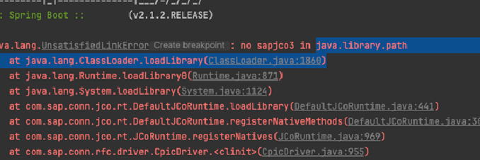

[toc]

---

# 关于出现no sapjco3 in java.library.path错误

- 问题描述：出现 `no sapjco3 in java.library.path` 异常时，可能是缺乏相应的文件，导致无法获取到 `sapjco` 的资源，导致异常。

- 解决办法：**引入 `jar和dll` 文件**。文件在 `Git仓库\src\资源文件下获取`。

  

  1. 将 `sapjco3.dll` 放入`jdk`目录下的 `\jre\bin` 文件夹
  2. 将 `sapjco3.jar` 放入`jdk`目录下的 `\jre\lib\ext` 文件夹

- 完整错误信息：

  