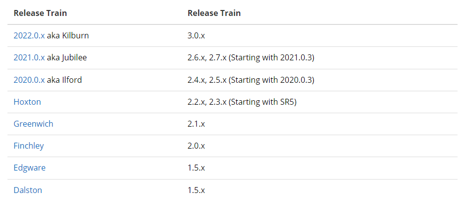
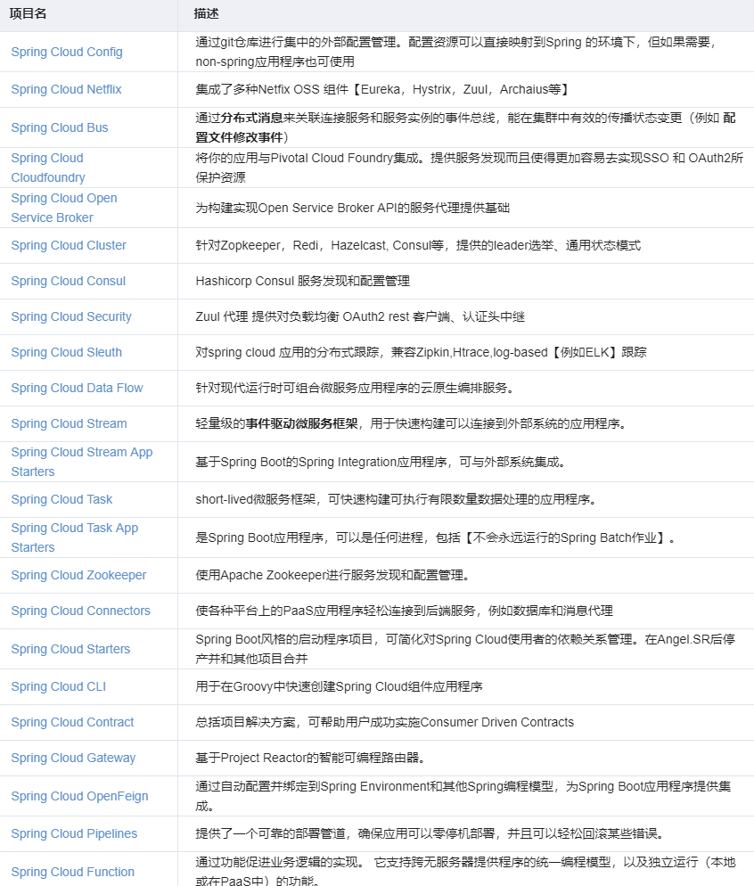

[toc]

---

# 前言

> 官网文档：https://spring.io/projects/spring-cloud

# 构建工程

## 构建新的SpringCloud工程

 最简单的方法是访问start.spring.io网站，选择合适的SpringBoot和SpringCloud版本，进行构建。 

## 添加Spring Cloud到现有的 Springboot 项目

如果你想要添加 `SpringCloud` 到一个现有的 `SpringBoot` 应用，第一步是确定你需要的 `SpringCloud`版本，这个版本将取决于你所使用的`SpringBoot`的版本。

>  更多详细的版本对应关系，可以访问网址： https://start.spring.io/actuator/info 



`Dalston`, `Edgware`, `Finchley`, `Greenwich` 都已到达终点将不再支持。

现在您已经知道了要使用哪个发布系列以及该发布系列的最新服务版本，您就可以将`Spring Cloud BOM`添加到应用程序中了。 

```xml
<properties>
    <spring-cloud.version>2022.0.1</spring-cloud.version>
</properties>
<dependencyManagement>
    <dependencies>
        <dependency>
            <groupId>org.springframework.cloud</groupId>
            <artifactId>spring-cloud-dependencies</artifactId>
            <version>${spring-cloud.version}</version>
            <type>pom</type>
            <scope>import</scope>
        </dependency>
    </dependencies>
</dependencyManagement>
```

## Spring Cloud Alibaba

各个版本适配请看alibaba：https://github.com/alibaba/spring-cloud-alibaba/wiki/%E7%89%88%E6%9C%AC%E8%AF%B4%E6%98%8E

```xml
<!--版本依赖示例-->
<properties>
    <spring-boot.version>2.3.12.RELEASE</spring-boot.version>
    <spring-cloud.version>Hoxton.SR12</spring-cloud.version>
    <spring-cloud-alibaba.version>2.2.9.RELEASE</spring-cloud-alibaba.version>
</properties>
<dependencyManagement>
    <!-- SpringCloud -->
    <dependencies>
        <dependency>
            <groupId>org.springframework.cloud</groupId>
            <artifactId>spring-cloud-dependencies</artifactId>
            <version>${spring-cloud.version}</version>
            <type>pom</type>
            <scope>import</scope>
        </dependency>
        <dependency>
            <groupId>com.alibaba.cloud</groupId>
            <artifactId>spring-cloud-alibaba-dependencies</artifactId>
            <version>${spring-cloud-alibaba.version}</version>
            <type>pom</type>
            <scope>import</scope>
        </dependency>
    </dependencies>
</dependencyManagement>
```

# 基础组件

  

