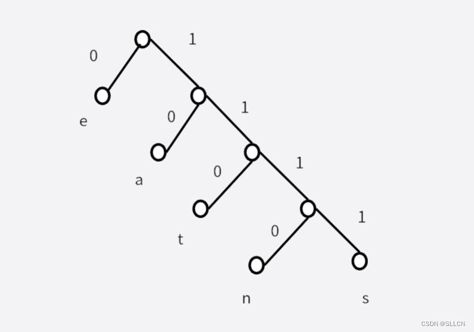

[toc]

---

# 树

## 哈夫曼树

用构造[哈夫曼树](https://baike.baidu.com/item/哈夫曼树/2305769?fromModule=lemma_inlink)的[过程生成](https://baike.baidu.com/item/过程生成/4661028?fromModule=lemma_inlink)的[二进制](https://baike.baidu.com/item/二进制/361457?fromModule=lemma_inlink)前缀编码。哈夫曼树是一类带权[路径长度](https://baike.baidu.com/item/路径长度/12734501?fromModule=lemma_inlink)最短的树。

特点：带权路径长度最短

## 前缀码

 一个简单的[二叉树](https://so.csdn.net/so/search?q=二叉树&spm=1001.2101.3001.7020)就可以实现空间的节约，如图所示 

  

上图就是标准的前缀码编码：

若我们想表示eat，则可以用010110表示，比上述编码少占用9位                                                                                                        0-e        10-a        110-t   
若我们想表示neat，则可以用1110010110表示