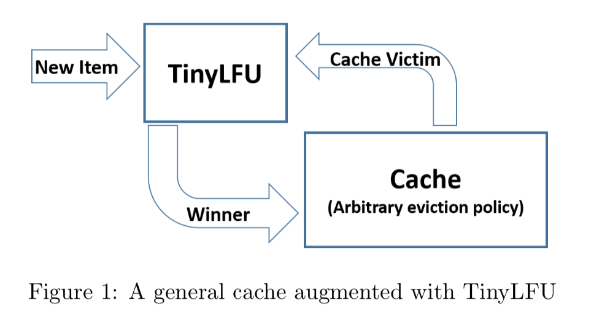
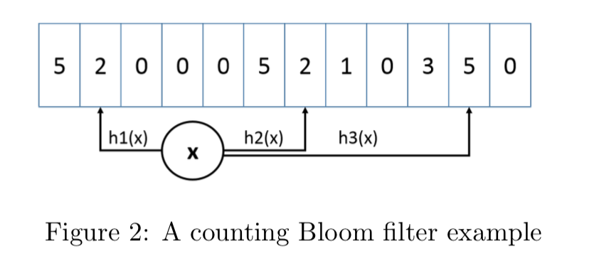
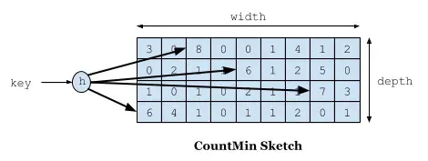

[toc]

---

# 前言

因为我们程序中的内存都是有限的，不可能无限制的往内存里存储数据。这时就需要使用适合的淘汰算法辅助淘汰价值更低的数据，为新的数据提供存储空间。

# 常见的算法

##  **FIFO(First In First Out)：先进先出。** 

FIFO 优先淘汰掉最先缓存的数据。

缺点是如果先缓存的数据使用频率比较高的话，那么该数据就不断地从缓存中存入又被移除，因此它的缓存命中率比较低。 

##  **LRU(Least Recently Used)：最近最久未使用。** 

LRU 优先淘汰掉最久未访问到的数据。

缺点在不能应对偶发的流量激增，当热点数据被频繁访问，但是最后几分钟几乎没有访问，此时有另一批数据突然插入并被访问，那么热点数据就会被淘汰掉。相当于一个链表，移除掉了链表最后的数据，将新的数据放入链表头。

##  **LFU(Least Frequently Used)：** 最近最少使用

LFU 优先淘汰掉最不经常使用的数据，需要维护一个使用频率的字段。

主要两个缺点：

1. 访问频率较高，那么频率字段会占据一定空间
2. 无法分辨是最近热点还是过去热点数据，因为前期访问高的数据已经固定下来，后续偶然数据也不太可能被保留下来。

## TinyLFU

 它是专门为了解决 LFU 上述提到的两个问题而被设计出来的。 

1. 第一个缺点采用的是 Count-Min Sketch算法。
2. 第二个缺陷是让数据保持相对的新鲜。

  

### 统计频率 Count-Min Stketch

如何对一个key进行统计，但又可以节约空间？如果采用 HashMap ，存储精确值，那么对于这个维护会很占用内存。说到这可能就容易联想到一个东西，布隆过滤器，都是产生hash值，存储近似值。

> [Redis-布隆过滤器](..\..\语言方向\java\框架\缓存\redis\Redis-布隆过滤器.md) 

近似频率的统计如下图所示。

 

对一个 key 进行多次 hash 函数后，index 到多个数组位置后进行累加，查询时取多个值中的最小值即可。

Caffeine 对这个算法的实现在`FrequencySketch`类。但 Caffeine 对此有进一步的优化，例如 Count–Min Sketch 使用了二维数组，Caffeine 只是用了一个一维的数组；再者，如果是数值类型的话，这个数需要用 int 或 long 来存储，但是 Caffeine 认为缓存的访问频率不需要用到那么大，只需要 15 就足够，一般认为达到 15 次的频率算是很高的了，而且 Caffeine 还有另外一个机制来使得这个频率进行衰退减半（下面就会讲到）。如果最大是 15 的话，那么只需要 4 个 bit 就可以满足了，一个 long 有 64bit，可以存储 16 个这样的统计数，Caffeine 就是这样的设计，使得存储效率提高了 16 倍。

 Caffeine 对缓存的读写（`afterRead`和`afterWrite`方法）都会调用`onAccess` 方法，而`onAccess`方法里有一句： 

```java
frequencySketch().increment(key);
```

我们看看 `FrequencySketch`。

```java
/*
 * Copyright 2015 Ben Manes. All Rights Reserved.
 *
 * Licensed under the Apache License, Version 2.0 (the "License");
 * you may not use this file except in compliance with the License.
 * You may obtain a copy of the License at
 *
 *     http://www.apache.org/licenses/LICENSE-2.0
 *
 * Unless required by applicable law or agreed to in writing, software
 * distributed under the License is distributed on an "AS IS" BASIS,
 * WITHOUT WARRANTIES OR CONDITIONS OF ANY KIND, either express or implied.
 * See the License for the specific language governing permissions and
 * limitations under the License.
 */
package com.github.benmanes.caffeine.cache;

import static com.github.benmanes.caffeine.cache.Caffeine.requireArgument;

import org.checkerframework.checker.index.qual.NonNegative;

/**
 * A probabilistic multiset for estimating the popularity of an element within a time window. The
 * maximum frequency of an element is limited to 15 (4-bits) and an aging process periodically
 * halves the popularity of all elements.
 *
 * @author ben.manes@gmail.com (Ben Manes)
 */
/** 
	一个概率多集来估算在时间窗口内流行的元素。
	一个元素最大频率是限制在15（4bit）和一个老化过程会周期性地使所有元素的流行程度减半。
 */
final class FrequencySketch<E> {

  /*
   * This class maintains a 4-bit CountMinSketch [1] with periodic aging to provide the popularity
   * history for the TinyLfu admission policy [2]. The time and space efficiency of the sketch
   * allows it to cheaply estimate the frequency of an entry in a stream of cache access events.
   *
   * The counter matrix is represented as a single-dimensional array holding 16 counters per slot. A
   * fixed depth of four balances the accuracy and cost, resulting in a width of four times the
   * length of the array. To retain an accurate estimation, the array's length equals the maximum
   * number of entries in the cache, increased to the closest power-of-two to exploit more efficient
   * bit masking. This configuration results in a confidence of 93.75% and an error bound of
   * e / width.
   *
   * To improve hardware efficiency, an item's counters are constrained to a 64-byte block, which is
   * the size of an L1 cache line. This differs from the theoretical ideal where counters are
   * uniformly distributed to minimize collisions. In that configuration, the memory accesses are
   * not predictable and lack spatial locality, which may cause the pipeline to need to wait for
   * four memory loads. Instead, the items are uniformly distributed to blocks, and each counter is
   * uniformly selected from a distinct 16-byte segment. While the runtime memory layout may result
   * in the blocks not being cache-aligned, the L2 spatial prefetcher tries to load aligned pairs of
   * cache lines, so the typical cost is only one memory access.
   *
   * The frequency of all entries is aged periodically using a sampling window based on the maximum
   * number of entries in the cache. This is referred to as the reset operation by TinyLfu and keeps
   * the sketch fresh by dividing all counters by two and subtracting based on the number of odd
   * counters found. The O(n) cost of aging is amortized, ideal for hardware prefetching, and uses
   * inexpensive bit manipulations per array location.
   *
   * [1] An Improved Data Stream Summary: The Count-Min Sketch and its Applications
   * http://dimacs.rutgers.edu/~graham/pubs/papers/cm-full.pdf
   * [2] TinyLFU: A Highly Efficient Cache Admission Policy
   * https://dl.acm.org/citation.cfm?id=3149371
   * [3] Hash Function Prospector: Three round functions
   * https://github.com/skeeto/hash-prospector#three-round-functions
   */

  static final long RESET_MASK = 0x7777777777777777L;
  static final long ONE_MASK = 0x1111111111111111L;

  int sampleSize;
  int blockMask;
  long[] table;
  int size;

  /**
   * Creates a lazily initialized frequency sketch, requiring {@link #ensureCapacity} be called
   * when the maximum size of the cache has been determined.
   */
  @SuppressWarnings("NullAway.Init")
  public FrequencySketch() {}

  /**
   * Initializes and increases the capacity of this <tt>FrequencySketch</tt> instance, if necessary,
   * to ensure that it can accurately estimate the popularity of elements given the maximum size of
   * the cache. This operation forgets all previous counts when resizing.
   *
   * @param maximumSize the maximum size of the cache
   */
    // 配置最大数量
  public void ensureCapacity(@NonNegative long maximumSize) {
    requireArgument(maximumSize >= 0);
    int maximum = (int) Math.min(maximumSize, Integer.MAX_VALUE >>> 1);
    if ((table != null) && (table.length >= maximum)) {
      return;
    }

    table = new long[Math.max(Caffeine.ceilingPowerOfTwo(maximum), 8)];
    sampleSize = (maximumSize == 0) ? 10 : (10 * maximum);
    blockMask = (table.length >>> 3) - 1;
    if (sampleSize <= 0) {
      sampleSize = Integer.MAX_VALUE;
    }
    size = 0;
  }

  /**
   * Returns if the sketch has not yet been initialized, requiring that {@link #ensureCapacity} is
   * called before it begins to track frequencies.
   */
  public boolean isNotInitialized() {
    return (table == null);
  }

  /**
   * Returns the estimated number of occurrences of an element, up to the maximum (15).
   *
   * @param e the element to count occurrences of
   * @return the estimated number of occurrences of the element; possibly zero but never negative
   */
    // 返回元素出现的估计次数，不超过最大次（15）
  @NonNegative
  public int frequency(E e) {
    if (isNotInitialized()) {
      return 0;
    }

    int[] count = new int[4];
      //重新将hashcode 均匀分散
    int blockHash = spread(e.hashCode());
// 应用新一轮hash,重新打散
    int counterHash = rehash(blockHash);
  //这个block 就是用来定位到是哪一个等分的，，再左移3位，得到一个小于16的值
    int block = (blockHash & blockMask) << 3;
    for (int i = 0; i < 4; i++) {
      int h = counterHash >>> (i << 3);
      int index = (h >>> 1) & 15;
      int offset = h & 1;
      count[i] = (int) ((table[block + offset + (i << 1)] >>> (index << 2)) & 0xfL);
    }
      // 取4个中最小的值
    return Math.min(Math.min(count[0], count[1]), Math.min(count[2], count[3]));
  }

  /**
   * Increments the popularity of the element if it does not exceed the maximum (15). The popularity
   * of all elements will be periodically down sampled when the observed events exceed a threshold.
   * This process provides a frequency aging to allow expired long term entries to fade away.
   *
   * @param e the element to add
   */
  @SuppressWarnings("ShortCircuitBoolean")
  public void increment(E e) {
    if (isNotInitialized()) {
      return;
    }

    int[] index = new int[8];
    int blockHash = spread(e.hashCode());
    int counterHash = rehash(blockHash);
    int block = (blockHash & blockMask) << 3;
    for (int i = 0; i < 4; i++) {
      int h = counterHash >>> (i << 3);
      index[i] = (h >>> 1) & 15;
      int offset = h & 1;
      index[i + 4] = block + offset + (i << 1);
    }
    boolean added =
          incrementAt(index[4], index[0])
        | incrementAt(index[5], index[1])
        | incrementAt(index[6], index[2])
        | incrementAt(index[7], index[3]);

    if (added && (++size == sampleSize)) {
      reset();
    }
  }

  /** Applies a supplemental hash functions to defends against poor quality hash. */
  static int spread(int x) {
    x ^= x >>> 17;
    x *= 0xed5ad4bb;
    x ^= x >>> 11;
    x *= 0xac4c1b51;
    x ^= x >>> 15;
    return x;
  }

  /** Applies another round of hashing for additional randomization. */
  static int rehash(int x) {
    x *= 0x31848bab;
    x ^= x >>> 14;
    return x;
  }

  /**
   * Increments the specified counter by 1 if it is not already at the maximum value (15).
   *
   * @param i the table index (16 counters)
   * @param j the counter to increment
   * @return if incremented
   */
  boolean incrementAt(int i, int j) {
    int offset = j << 2;
    long mask = (0xfL << offset);
    if ((table[i] & mask) != mask) {
      table[i] += (1L << offset);
      return true;
    }
    return false;
  }

  /** Reduces every counter by half of its original value. */
  void reset() {
    int count = 0;
    for (int i = 0; i < table.length; i++) {
      count += Long.bitCount(table[i] & ONE_MASK);
      table[i] = (table[i] >>> 1) & RESET_MASK;
    }
    size = (size - (count >>> 2)) >>> 1;
  }
}
```

  

### 保新机制

为了让缓存保新，过滤掉过往频率很高但之后不常使用的过期缓存，Caffeine 当整体的统计计数达到某一个值后，那么将记录的频率都除以2。

```java

    boolean added =
          incrementAt(index[4], index[0])
        | incrementAt(index[5], index[1])
        | incrementAt(index[6], index[2])
        | incrementAt(index[7], index[3]);

    if (added && (++size == sampleSize)) {
      reset();
    }


/** Reduces every counter by half of its original value. */
void reset() {
  int count = 0;
  for (int i = 0; i < table.length; i++) {
    count += Long.bitCount(table[i] & ONE_MASK);
    table[i] = (table[i] >>> 1) & RESET_MASK;
  }
  size = (size >>> 1) - (count >>> 2);
}
```

 为什么是除以 2，及其正确性，在 TinyLFU 论文中 3.3 章节给出了数学证明

```

The downside of this operation is an expensive infrequent operation that goes over all the counters
in the approximation scheme and divides them by 2.Yet, division by 2 can be implemented efficiently
in hardware using shift registers. Similarly, in software, shift and mask operations allow for performing
this operation for multiple (small) counter at once. Finally, its amortized complexity is constant making
it feasible for many applications.

# reset 误差问题
Since our reset operation uses integer division, it introduces truncation error. That is, after a reset
operation, the value of a counter can be as much as 0.5 lower than that of a floating point counter. If we
have to reset again, after the reset the truncation error of the previous reset operation is divided to 0.25,
but we accumulated a new truncation error of 0.5 resulting in a total error of 0.75. It is easy to see that
the worst case truncation error converges to at most one point lower than the accurate rate of the item.
Therefore, the truncation error affects the recorded occurrence rate of an item by as much as 2
W right
after a reset operation. This means that the larger the sample size, the smaller the truncation error.
```

# 参考

- caffeine：https://arxiv.org/pdf/1512.00727.pdf