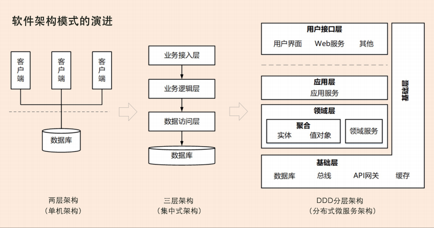

[toc]

---

# 前言

## 软件架构的演进

**第一阶段是单机架构：**采用面向过程的设计方法，系统包括客户端 UI 层和数据库两层，采用 C/S 架构模式，整个系统围绕数据库驱动设计和开发，并且总是从设计数据库和字段开始。 

**第二阶段是集中式架构：**采用面向对象的设计方法，系统包括业务接入层、业务逻辑层和数据库层，采用经典的三层架构，也有部分应用采用传统的 SOA 架构。这种架构容易使系统变得臃肿，可扩展性和弹性伸缩性差。 

**第三阶段是分布式微服务架构：**随着微服务架构理念的提出，集中式架构正向分布式微服务架构演进。微服务架构可以很好地实现应用之间的解耦，解决单体应用扩展性和弹性伸缩能力不足的问题。

**微服务拆分困境产生的根本原因就是不知道业务或者微服务的边界到底在什么地方。**确定了业务边界和应用边界，这个困境就迎刃而解了。

# 微服务设计和DDD

## 为什么DDD适合微服务

2004 年埃里克·埃文斯（Eric Evans）发表了《领域驱动设计》（Domain-Driven Design–Tackling Complexity in the Heart of Software）这本书，从此领域驱动设计（Domain-Driven Design，简称 DDD）诞生。**DDD 核心思想是通过领域驱动设计方法定义领域模型，从而确定业务和应用边界，保证业务模型与代码模型的一致性。**

DDD 是一种处理高度复杂领域的设计思想，它试图分离技术实现的复杂性，并围绕业务概 念构建领域模型来控制业务的复杂性，以解决软件难以理解，难以演进的问题。DDD 不是架构，而是一种架构设计方法论，它通过边界划分将复杂业务领域简单化，帮我们设计出清晰的领域和应用边界，可以很容易地实现架构演进。

##  DDD包括战略设计和战术设计两部分

**我们可以用三步来划定领域模型和微服务的边界。** 

1. 在事件风暴中梳理业务过程中的用户操作、事件以及外部依赖关系等，根据这些要素梳理出领域实体等领域对象。
2. 根据领域实体之间的业务关联性，将业务紧密相关的实体进行组合形成聚合，同时确定聚合中的聚合根、值对象和实体。在这个图里，聚合之间的边界是第一层边界，它们在同一个微服务实例中运行，这个边界是逻辑边界，所以用虚线表示。
3. 根据业务及语义边界等因素，将一个或者多个聚合划定在一个限界上下文内，形成领域模型。在这个图里，限界上下文之间的边界是第二层边界，这一层边界可能就是未来微服务的边界，不同限界上下文内的领域逻辑被隔离在不同的微服务实例中运行，物理上相互隔离，所以是物理边界，边界之间用实线来表示。 

**有了这两层边界，微服务的设计就不是什么难事了。**

## **DDD** 与微服务的关系

DDD 是一种架构设计方法，微服务是一种架构风格，两者从本质上都是为了追求高响应力，而从业务视角去分离应用系统建设复杂度的手段。两者都强调从业务出发，其核心要义是强调根据业务发展，合理划分领域边界，持续调整现有架构，优化现有代码，以保持架构和代码的生命力，也就是我们常说的演进式架构。 

DDD 主要关注：从业务领域视角划分领域边界，构建通用语言进行高效沟通，通过业务抽象，建立领域模型，维持业务和代码的逻辑一致性。

微服务主要关注：运行时的进程间通信、容错和故障隔离，实现去中心化数据管理和去中心化服务治理，关注微服务的独立开发、测试、构建和部署。

## 小结

**DDD 不仅可以用于微服务设计，还可以很好地应用于企业中台的设计。**

**总体来说，DDD 可以给你带来以下收获：**

1. DDD 是一套完整而系统的设计方法，它能带给你从战略设计到战术设计的标准设计过程，使得你的设计思路能够更加清晰，设计过程更加规范。 
2.  DDD 善于处理与领域相关的拥有高复杂度业务的产品开发，通过它可以建立一个核心而稳定的领域模型，有利于领域知识的传递与传承。 
3. DDD 强调团队与领域专家的合作，能够帮助你的团队建立一个沟通良好的氛围，构建一致的架构体系。
4. DDD 的设计思想、原则与模式有助于提高你的架构设计能力。 
5. 无论是在新项目中设计微服务，还是将系统从单体架构演进到微服务，都可以遵循DDD 的架构原则。 
6. DDD 不仅适用于微服务，也适用于传统的单体应用。

## 思考

你的公司是否在实施微服务架构，你在微服务设计过程中面临的最大问题是什么？

# 名词说明

## 领域和子域

汉语词典中对领域的解释：“领域是从事一种专门活动或事业的**范围**、部类或部门。”百度百科对领域的解释：“领域具体指一种特定的**范围**或区域”。**两个解释有一个共同点——范围。**

在研究和解决业务问题时，DDD 会按照一定的规则将业务领域进行细分，当领域细分到一定的程度后，DDD 会将问题范围限定在特定的边界内，在这个边界内建立领域模型，进而用代码实现该领域模型，解决相应的业务问题。简言之，**DDD 的领域就是这个边界内要解决的业务问题域。**

我们把划分出来的多个子领域称为**子域**，每个子域对应一个更小的问题域或更小的业务范围。 

我们知道细胞核、线粒体、细胞膜等物质共同构成细胞，这些物质一起协作让细胞具有这类细胞特定的生物功能。在这里你可以把细胞理解为 DDD 的聚合，细胞内的这些物质就可以理解为聚合里面的聚合根、实体以及值对象等，在聚合内这些实体一起协作完成特定的业务功能。这个过程类似 DDD 设计时，确定微服务内功能要素和边界的过程。 

**领域建模和微服务建设的过程和方法基本类似，其核心思想就是将问题域逐步分解，降低业务理解和系统实现的复杂度。**

## **核心域、通用域和支撑域**

- 决定产品和公司核心竞争力的子域是核心域，它是业务成功的主要因素和公司的核心竞争力。
- 没有太多个性化的诉求，同时被多个子域使用的通用功能子域是通用域。
- 还有一种功能子域是必需的，但既不包含决定产品和公司核心竞争力的功能，也不包含通用功能的子域，它就是支撑域。

举例来说的话，通用域则是你需要用到的通用系统，比如认证、权限等等，这类应用很容易买到，没有企业特点限制，不需要做太多的定制化。而支撑域则具有企业特性，但不具有通用性，例如数据代码类的数据字典等系统。

## 小结

领域的核心思想就是将问题域逐级细分，来降低业务理解和系统实现的复杂度。通过领域细分，逐步缩小微服务需要解决的问题域，构建合适的领域模型，而领域模型映射成系统就是微服务了。 

核心域、支撑域和通用域的主要目标是：通过领域划分，区分不同子域在公司内的不同功能属性和重要性，从而公司可对不同子域采取不同的资源投入和建设策略，其关注度也会不一样。 

## 思考

请结合你所在公司的业务情况，尝试给业务做一个领域拆分，看看哪些子域是核心域，哪些子域是通用域和支撑域？ 

# 限界上下文

在 DDD 领域建模和系统建设过程中，有很多的参与者，包括领域专家、产品经理、项目经理、架构师、开发经理和测试经理等。对同样的领域知识，不同的参与角色可能会有不同的理解，那大家交流起来就会有障碍，怎么办呢？因此，在 DDD 中就出现了“**通用语言**”和“**限界上下文**”这两个重要的概念。

这两者相辅相成，**通用语言定义上下文含义，限界上下文则定义领域边界**，以确保每个上下文含义在它特定的边界内都具有唯一的含义，领域模型则存在于这个边界之内。

思考两个问题：

1. 为什么要提出限界上下文的概念（也就是说除了解决交流障碍这个广义的原因，还有更具体的吗）？ 
2. 限界上下文在微服务设计中的作用和意义是什么？

## 通用语言

怎么理解通用语言这个概念呢？**在事件风暴过程中，通过团队交流达成共识的，能够简单、清晰、准确描述业务涵义和规则的语言就是通用语言**。

1. 在事件风暴的过程中，领域专家会和设计、开发人员一起建立领域模型，在领域建模的过程中会形成通用的业务术语和用户故事。事件风暴也是一个项目团队统一语言的过程。 
2. 通过用户故事分析会形成一个个的领域对象，这些领域对象对应领域模型的业务对象，每一个业务对象和领域对象都有通用的名词术语，并且一一映射。 
3. 微服务代码模型来源于领域模型，每个代码模型的代码对象跟领域对象一一对应。

**设计过程中我们可以用一些表格，来记录事件风暴和微服务设计过程中产生的领域对象及其属性。**

下面是一个微服务设计实例的部分数据，表格中的这些名词术语就是项目团队在事件风暴过程中达成一致、可用于团队内部交流的通用语言。在这个表格里面我们可以看到，DDD 分析过程中所有的领域对象以及它们的属性都被记录下来了，除了 DDD 的领域对象，我们还记录了在微服务设计过程中领域对象所对应的代码对象，并将它们一一映射。

DDD 分析和设计过程中的每一个环节都需要保证限界上下文内术语的统一，在代码模型设计的时侯就要建立领域对象和代码对象的一一映射，从而**保证业务模型和代码模型的一致，实现业务语言与代码语言的统一。** 