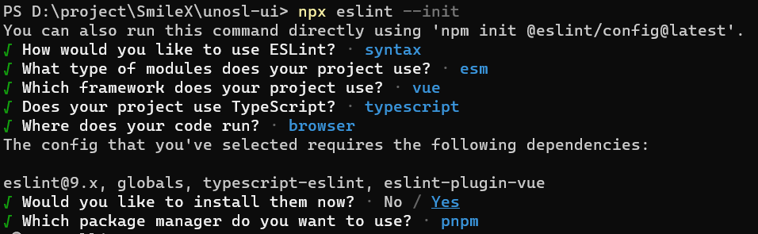
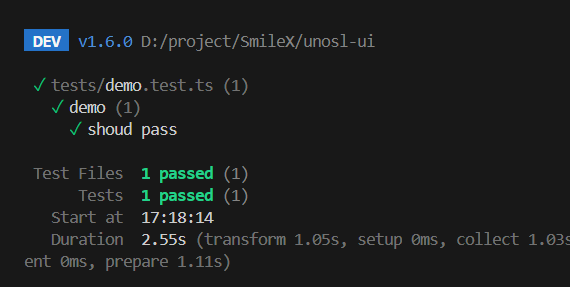
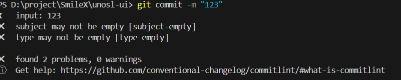
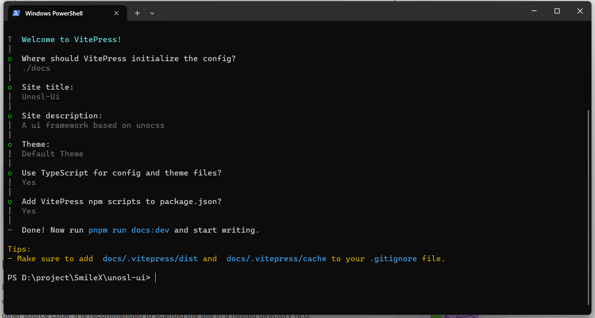

[toc]

---

# 前言

在前端开发中，经常会用到各种各样的UI组件库，比如Element-plus、Ant Design等等，这些组件库确实大大提升了开发效率，避免了很多的重复劳动。但是工作中难免会需要开发公司内部的UI组件库，或者基于已有组件库进行二开。那么这时应该怎么做呢？

本文主要将采用以下技术栈从零搭建一个UI组件库 `Uno-ui`

- Vue3
- Vite4
- Typescript
- unocss

该系列文章将从一下几个步骤实现。

1. 项目搭建

2. 组件封装

   - 布局
     1. container
     2. Layout
     3. Space
     4. Grid
     5. Flex

   - 通用
     1. Button
     2. icon
     3. Link
     4. ScrollBar
     5. ConfigProvider
     6. Loading 全局加载
     7. Spin 加载
     8. Ellipsis 文本缩略
     9. QRCode 二维码

   1. 表单

      1. Form
      2. Checkbox
      3. Radio
      4. Input
      5. Select
      6. Slider
      7. Upload
      8. Input-number

   2. 展示类

      1. Avatar
      2. Card
      3. Empty
      4. Image
      5. Pagination
      6. Progress
      7. Table
      8. Timeline 时间线
      9. Tree
      10. Tag

   3. BackTop

   4. Menu

   5. Dialog

   6. Alert

   7. Message

   8. Notification

   9. Modal

   10. Drawer

   11. Tooltip

       

# 搭建项目

项目直接通过vite脚手架搭建。

## 第一步：创建工程

使用环境

- node.version > 18 
- pnpm.version = 8.14.2
- 使用pnpm 进行包管理。pnpm很好的支持了`monorepo`项目

### 基础配置

1. 创建文件夹并进入文件夹

   ```shell
   mkdir unosl-ui
   cd unosl-ui
   ```

2. 在根目录初始化工程

   ```shell
   pnpm init
   pnpm add typescript eslint @mistjs/eslint-config-vue-jsx -D
   pnpm add prettier -D
   ```

3. 添加项目编辑配置 `.editorconfig`

   ```
   # http://editorconfig.org
   root = true
   
   # 表示所有文件适用
   [*]
   charset = utf-8 # 设置文件字符集为 utf-8
   end_of_line = lf # 控制换行类型(lf | cr | crlf)
   indent_style = space # 缩进风格（tab | space）
   indent_size = 2 # 缩进大小
   insert_final_newline = true # 始终在文件末尾插入一个新行
   
   # 表示仅 md 文件适用以下规则
   [*.md]
   max_line_length = off # 关闭最大行长度限制
   trim_trailing_whitespace = false # 关闭末尾空格修剪
   ```
   
4. 根目录添加文件 ` pnpm-workspace.yaml`

   ```shell
   packages:
     - "packages/**" # packages 存放 cli 和 components
     - "site" # docs vitepress 使用
   ```

5. 添加 git 忽略文件 `.gitignore`

   ```
   # Logs
   logs
   *.log
   npm-debug.log*
   yarn-debug.log*
   yarn-error.log*
   pnpm-debug.log*
   lerna-debug.log*
   
   node_modules
   dist
   dist-ssr
   *.local
   
   # Editor directories and files
   .vscode/*
   !.vscode/extensions.json
   .idea
   .DS_Store
   *.suo
   *.ntvs*
   *.njsproj
   *.sln
   *.sw?
   
   ```

6. 创建文件夹 `components`、主文件`index.ts`，以及初始化 `eslint.config.mjs`

   ```shell
   mkdir components
   cd components
   echo "" >> index.ts
   ```

   ```javascript
   import globals from "globals";
   import pluginJs from "@eslint/js";
   import tseslint from "typescript-eslint";
   import pluginVue from "eslint-plugin-vue";
   
   
   export default [
     {
       ignores: [
         "dist",
         "node_modules",
         "public",
         ".husky",
         ".vscode",
         ".idea",
         "*.sh",
         "*.md",
         "docs",
         "src/assets",
         ".eslintrc.cjs",
         ".prettierrc.cjs",
         ".stylelintrc.cjs"
       ]
     },
     {
       languageOptions: { globals: globals.browser },
     },
     pluginJs.configs.recommended,
     ...tseslint.configs.recommended,
     ...pluginVue.configs["flat/essential"],
   ];
   ```

7. 返回根目录，配置eslint 。可以看一下相关的笔记  [eslint-基础.md](..\..\..\语言方向\前端\前端工程化\eslint\eslint-基础.md) 

   ```shell
   npx eslint --init
   ```

   执行安装，完成后出现一个文件夹

   

   配置 eslint忽略文件 `eslintignore`

   ```
   dist
   node_modules
   public
   .husky
   .vscode
   .idea
   *.sh
   *.md
   d
   
   src/assets
   
   .eslintrc.cjs
   .prettierrc.cjs
   .stylelintrc.cjs
   ```

   

8. 创建 tsconfig.json

   ```shell
   npx tsc --init 
   ```

   更改文件内容

   ```json
   {
     "compilerOptions": {
       /* Visit https://aka.ms/tsconfig to read more about this file */
       /* Projects */
       // "incremental": true,                              /* Save .tsbuildinfo files to allow for incremental compilation of projects. */
       // "composite": true,                                /* Enable constraints that allow a TypeScript project to be used with project references. */
       // "tsBuildInfoFile": "./.tsbuildinfo",              /* Specify the path to .tsbuildinfo incremental compilation file. */
       // "disableSourceOfProjectReferenceRedirect": true,  /* Disable preferring source files instead of declaration files when referencing composite projects. */
       // "disableSolutionSearching": true,                 /* Opt a project out of multi-project reference checking when editing. */
       // "disableReferencedProjectLoad": true,             /* Reduce the number of projects loaded automatically by TypeScript. */
       /* Language and Environment */
       "target": "es2015", /* Set the JavaScript language version for emitted JavaScript and include compatible library declarations. */
       "lib": [
         "esnext",
         "dom"
       ], /* Specify a set of bundled library declaration files that describe the target runtime environment. */
       "jsx": "preserve", /* Specify what JSX code is generated. */
       // "experimentalDecorators": true,                   /* Enable experimental support for legacy experimental decorators. */
       // "emitDecoratorMetadata": true,                    /* Emit design-type metadata for decorated declarations in source files. */
       // "jsxFactory": "",                                 /* Specify the JSX factory function used when targeting React JSX emit, e.g. 'React.createElement' or 'h'. */
       // "jsxFragmentFactory": "",                         /* Specify the JSX Fragment reference used for fragments when targeting React JSX emit e.g. 'React.Fragment' or 'Fragment'. */
       // "jsxImportSource": "",                            /* Specify module specifier used to import the JSX factory functions when using 'jsx: react-jsx*'. */
       // "reactNamespace": "",                             /* Specify the object invoked for 'createElement'. This only applies when targeting 'react' JSX emit. */
       // "noLib": true,                                    /* Disable including any library files, including the default lib.d.ts. */
       // "useDefineForClassFields": true,                  /* Emit ECMAScript-standard-compliant class fields. */
       // "moduleDetection": "auto",                        /* Control what method is used to detect module-format JS files. */
       /* Modules */
       "module": "ESNext", /* Specify what module code is generated. */
       // "rootDir": "./",                                  /* Specify the root folder within your source files. */
       "moduleResolution": "Node", /* Specify how TypeScript looks up a file from a given module specifier. */
       // "baseUrl": "./",                                  /* Specify the base directory to resolve non-relative module names. */
       // "paths": {},                                      /* Specify a set of entries that re-map imports to additional lookup locations. */
       // "rootDirs": [],                                   /* Allow multiple folders to be treated as one when resolving modules. */
       // "typeRoots": [],                                  /* Specify multiple folders that act like './node_modules/@types'. */
       // "types": [],                                      /* Specify type package names to be included without being referenced in a source file. */
       // "allowUmdGlobalAccess": true,                     /* Allow accessing UMD globals from modules. */
       // "moduleSuffixes": [],                             /* List of file name suffixes to search when resolving a module. */
       // "allowImportingTsExtensions": true,               /* Allow imports to include TypeScript file extensions. Requires '--moduleResolution bundler' and either '--noEmit' or '--emitDeclarationOnly' to be set. */
       // "resolvePackageJsonExports": true,                /* Use the package.json 'exports' field when resolving package imports. */
       // "resolvePackageJsonImports": true,                /* Use the package.json 'imports' field when resolving imports. */
       // "customConditions": [],                           /* Conditions to set in addition to the resolver-specific defaults when resolving imports. */
       // "resolveJsonModule": true,                        /* Enable importing .json files. */
       // "allowArbitraryExtensions": true,                 /* Enable importing files with any extension, provided a declaration file is present. */
       // "noResolve": true,                                /* Disallow 'import's, 'require's or '<reference>'s from expanding the number of files TypeScript should add to a project. */
       /* JavaScript Support */
       // "allowJs": true,                                  /* Allow JavaScript files to be a part of your program. Use the 'checkJS' option to get errors from these files. */
       // "checkJs": true,                                  /* Enable error reporting in type-checked JavaScript files. */
       // "maxNodeModuleJsDepth": 1,                        /* Specify the maximum folder depth used for checking JavaScript files from 'node_modules'. Only applicable with 'allowJs'. */
       /* Emit */
       // "declaration": true,                              /* Generate .d.ts files from TypeScript and JavaScript files in your project. */
       // "declarationMap": true,                           /* Create sourcemaps for d.ts files. */
       // "emitDeclarationOnly": true,                      /* Only output d.ts files and not JavaScript files. */
       // "sourceMap": true,                                /* Create source map files for emitted JavaScript files. */
       // "inlineSourceMap": true,                          /* Include sourcemap files inside the emitted JavaScript. */
       // "outFile": "./",                                  /* Specify a file that bundles all outputs into one JavaScript file. If 'declaration' is true, also designates a file that bundles all .d.ts output. */
       // "outDir": "./",                                   /* Specify an output folder for all emitted files. */
       // "removeComments": true,                           /* Disable emitting comments. */
       // "noEmit": true,                                   /* Disable emitting files from a compilation. */
       // "importHelpers": true,                            /* Allow importing helper functions from tslib once per project, instead of including them per-file. */
       // "importsNotUsedAsValues": "remove",               /* Specify emit/checking behavior for imports that are only used for types. */
       // "downlevelIteration": true,                       /* Emit more compliant, but verbose and less performant JavaScript for iteration. */
       // "sourceRoot": "",                                 /* Specify the root path for debuggers to find the reference source code. */
       // "mapRoot": "",                                    /* Specify the location where debugger should locate map files instead of generated locations. */
       // "inlineSources": true,                            /* Include source code in the sourcemaps inside the emitted JavaScript. */
       // "emitBOM": true,                                  /* Emit a UTF-8 Byte Order Mark (BOM) in the beginning of output files. */
       // "newLine": "crlf",                                /* Set the newline character for emitting files. */
       // "stripInternal": true,                            /* Disable emitting declarations that have '@internal' in their JSDoc comments. */
       // "noEmitHelpers": true,                            /* Disable generating custom helper functions like '__extends' in compiled output. */
       // "noEmitOnError": true,                            /* Disable emitting files if any type checking errors are reported. */
       // "preserveConstEnums": true,                       /* Disable erasing 'const enum' declarations in generated code. */
       // "declarationDir": "./",                           /* Specify the output directory for generated declaration files. */
       // "preserveValueImports": true,                     /* Preserve unused imported values in the JavaScript output that would otherwise be removed. */
       /* Interop Constraints */
       // "isolatedModules": true,                          /* Ensure that each file can be safely transpiled without relying on other imports. */
       // "verbatimModuleSyntax": true,                     /* Do not transform or elide any imports or exports not marked as type-only, ensuring they are written in the output file's format based on the 'module' setting. */
       // "allowSyntheticDefaultImports": true,             /* Allow 'import x from y' when a module doesn't have a default export. */
       "esModuleInterop": true, /* Emit additional JavaScript to ease support for importing CommonJS modules. This enables 'allowSyntheticDefaultImports' for type compatibility. */
       // "preserveSymlinks": true,                         /* Disable resolving symlinks to their realpath. This correlates to the same flag in node. */
       "forceConsistentCasingInFileNames": true, /* Ensure that casing is correct in imports. */
       /* Type Checking */
       "strict": true, /* Enable all strict type-checking options. */
       // "noImplicitAny": true,                            /* Enable error reporting for expressions and declarations with an implied 'any' type. */
       // "strictNullChecks": true,                         /* When type checking, take into account 'null' and 'undefined'. */
       // "strictFunctionTypes": true,                      /* When assigning functions, check to ensure parameters and the return values are subtype-compatible. */
       // "strictBindCallApply": true,                      /* Check that the arguments for 'bind', 'call', and 'apply' methods match the original function. */
       // "strictPropertyInitialization": true,             /* Check for class properties that are declared but not set in the constructor. */
       // "noImplicitThis": true,                           /* Enable error reporting when 'this' is given the type 'any'. */
       // "useUnknownInCatchVariables": true,               /* Default catch clause variables as 'unknown' instead of 'any'. */
       // "alwaysStrict": true,                             /* Ensure 'use strict' is always emitted. */
       // "noUnusedLocals": true,                           /* Enable error reporting when local variables aren't read. */
       // "noUnusedParameters": true,                       /* Raise an error when a function parameter isn't read. */
       // "exactOptionalPropertyTypes": true,               /* Interpret optional property types as written, rather than adding 'undefined'. */
       // "noImplicitReturns": true,                        /* Enable error reporting for codepaths that do not explicitly return in a function. */
       // "noFallthroughCasesInSwitch": true,               /* Enable error reporting for fallthrough cases in switch statements. */
       // "noUncheckedIndexedAccess": true,                 /* Add 'undefined' to a type when accessed using an index. */
       // "noImplicitOverride": true,                       /* Ensure overriding members in derived classes are marked with an override modifier. */
       // "noPropertyAccessFromIndexSignature": true,       /* Enforces using indexed accessors for keys declared using an indexed type. */
       // "allowUnusedLabels": true,                        /* Disable error reporting for unused labels. */
       // "allowUnreachableCode": true,                     /* Disable error reporting for unreachable code. */
       /* Completeness */
       // "skipDefaultLibCheck": true,                      /* Skip type checking .d.ts files that are included with TypeScript. */
       "skipLibCheck": true /* Skip type checking all .d.ts files. */
     }
   }
   ```

9. 安装一些依赖库

   > https://cn.vitest.dev/

   ```shell
   pnpm add @types/node -D # 一些脚本的编写
   pnpm add vitest -D # 测试脚本
   pnpm add vite -D # 打包
   ```

### 测试vitest

创建测试文件夹

```shll
mkdir tests 
```

创建测试 `tests/demo.test.ts`

```typescript
import { describe, it, expect } from "vitest"

// 描述一个名称为demo
describe("demo", () => {
    // it是一个上下文函数
    it("shoud pass", () => {
        //期望1=1
        expect(1).toBe(1)
    })
})
```

修改 `package.json` 的`script test`

```json
{
    // ...
  "scripts": {
    "test": "vitest" // 改为vitest
  }
}

// pnpm run test 执行测试
```



### 代码格式化 prettier

1. 安装依赖库 `prettier`

   ```shell
   pnpn add prettier -D
   ```

2. 添加忽略配置文件 `.prettierignore`

   ```shell
   dist
   node_modules
   public
   .husky
   .vscode
   .idea
   *.sh
   *.md
   
   src/assets
   stats.html
   ```

3. 添加配置文件 `.prettierrc.cjs`

   ```json
   {
     "$schema": "https://json.schemastore.org/prettierrc",
     "semi": false,
     "tabWidth": 2,
     "singleQuote": true,
     "printWidth": 100,
     "trailingComma": "none"
   }
   ```

   或者用这份配置

   ```json
   module.exports = {
       // (x)=>{},单个参数箭头函数是否显示小括号。(always:始终显示;avoid:省略括号。默认:always)
       arrowParens: "always",
       // 开始标签的右尖括号是否跟随在最后一行属性末尾，默认false
       bracketSameLine: false,
       // 对象字面量的括号之间打印空格 (true - Example: { foo: bar } ; false - Example: {foo:bar})
       bracketSpacing: true,
       // 是否格式化一些文件中被嵌入的代码片段的风格(auto|off;默认auto)
       embeddedLanguageFormatting: "auto",
       // 指定 HTML 文件的空格敏感度 (css|strict|ignore;默认css)
       htmlWhitespaceSensitivity: "css",
       // 当文件已经被 Prettier 格式化之后，是否会在文件顶部插入一个特殊的 @format 标记，默认false
       insertPragma: false,
       // 在 JSX 中使用单引号替代双引号，默认false
       jsxSingleQuote: false,
       // 每行最多字符数量，超出换行(默认80)
       printWidth: 80,
       // 超出打印宽度 (always | never | preserve )
       proseWrap: "preserve",
       // 对象属性是否使用引号(as-needed | consistent | preserve;默认as-needed:对象的属性需要加引号才添加;)
       quoteProps: "as-needed",
       // 是否只格式化在文件顶部包含特定注释(@prettier| @format)的文件，默认false
       requirePragma: false,
       // 结尾添加分号
       semi: true,
       // 使用单引号 (true:单引号;false:双引号)
       singleQuote: false,
       // 缩进空格数，默认2个空格
       tabWidth: 2,
       // 元素末尾是否加逗号，默认es5: ES5中的 objects, arrays 等会添加逗号，TypeScript 中的 type 后不加逗号
       trailingComma: "es5",
       // 指定缩进方式，空格或tab，默认false，即使用空格
       useTabs: false,
       // vue 文件中是否缩进 <style> 和 <script> 标签，默认 false
       vueIndentScriptAndStyle: false,
     
       endOfLine: "auto",
       overrides: [
         {
           files: "*.html",
           options: {
             parser: "html",
           },
         },
       ],
     };
   ```

   

4. 通过命令格式化代码

   ```shell
   npx prettier --writer .
   ```

5. `package.json` 添加指令

   ```json
   {
       // ....
     "scripts": {
       "test": "vitest",
       "prepare": "husky",
       "lint": "eslint . --fix",
       "format":"prettier --write ."
     }
   }
   
   ```

### 代码提交检测

#### husky+commitlint

1. 下载依赖库

   ```shell
   pnpm add @commitlint/cli @commitlint/config-conventional husky -D
   ```

2. 创建提交配置文件 `commitlint.config.cjs`

   ```json
   module.exports = {
       "extends": [
           "@commitlint/config-conventional"
       ],
       "rules": {
           "type-enum": [
               2,
               "always",
               [
                   "feat",
                   "fix",
                   "refactor",
                   "test",
                   "build",
                   "docs",
                   "chore",
                   "project"
               ]
           ],
           "subject-max-length": [
               1,
               "always",
               150
           ]
       }
   }
   ```

3. 修改 `package.json`，增加`prepare`

   ```json
   {
     "scripts": {
       "prepare": "husky" // husky 9.0.1后 huksy install => husky
     },
   }
   
   ```

   执行命令

   ```shell
   pnpm prepare
   ```
   
4. 通过命令创建提交拦截

   ```shell
   pnpm exec husky add .husky/commit-msg "pnpm exec commitlint -e \"$1\""  
   ```

   如果失败，可以通过手动执行，创建文件 `.husky/commit-msg`

   ```sh
   #!/usr/bin/env sh
   . "$(dirname -- "$0")/_/husky.sh"
   
   pnpm exec commitlint -e "$1"
   ```

5. 测试一下

   ```shell
   git add .
   git commit -m "123123"
   
   # 正确格式
   git commit -m "project: msg"
   ```

   

#### husky+lint-staged

>  lint-staged 是**保证提交前检查lint(如eslint prettierlint stylelint)的主要工具**。 通过在提交前自动运行linters，它帮助开发者捕捉并修复潜在的代码问题，从而提高代码的整体质量。 结合 husky 使用，它可以轻松集成到任何现代前端项目中，成为自动化代码质量控制的重要一环 。
>
>  地址：https://www.npmjs.com/package/lint-staged

1. 安装 `lint-staged` 依赖库

   ```shell
   pnpm add lint-staged -D
   ```

2. 配置

   1. 方式一（推荐）：根目录新建 `.lintstagedrc`文件

      ```js
      {
        "*.{js,ts}": [
          "eslint --fix",
          "prettier --write"
        ],
        "*.{cjs,json}": [
          "prettier --write"
        ],
        "*.{vue,html}": [
          "eslint --fix",
          "prettier --write",
          "stylelint --fix"
        ],
        "*.{scss,css}": [
          "stylelint --fix",
          "prettier --write"
        ],
        "*.md": [
          "prettier --write"
        ]
      }
      
      ```

   2. 方式二：`package.json`增加配置

       ```json
       {
           // ...
         "lint-staged": {
           "*.{jx,jsx,ts,tsx,vue}": "eslint --fix"
         }
       }
       ```

   注意如果两边都配置了的话，会出现 `No staged files match any configured task.` 提示

3. 创建 hook

   ```shell
   pnpm exec husky add .husky/pre-commit "pnpm exec lint-staged"
   ```

   或者 手动创建文件 `.husky/pre-commit`

   ```
   #!/usr/bin/env sh
   . "$(dirname -- "$0")/_/husky.sh"
   
   pnpm exec lint-staged
   ```


### css检测 stylelint

1. 安装依赖库

    ```shell
    pnpm add stylelint stylelint-config-html stylelint-config-recess-order stylelint-config-recommended-scss stylelint-config-recommended-vue
stylelint-config-standard -D
    ```
	一些说明
    - stylelint: css样式lint工具
    - postcss: 转换css代码工具
    - postcss-less: 识别less语法
    - postcss-html: 识别html/vue 中的标签中的样式
    - stylelint-config-standard: Stylelint的标准可共享配置规则，详细可查看官方文档
    - stylelint-config-prettier: 关闭所有不必要或可能与Prettier冲突的规则
    - stylelint-config-recommended-less: less的推荐可共享配置规则，详细可查看官方文档
    - stylelint-config-standard-vue: lint.vue文件的样式配置
    - stylelint-less: stylelint-config-recommended-less的依赖，less的stylelint规则集合
    - stylelint-order: 指定样式书写的顺序，在.stylelintrc.js中order/properties-order指定顺序

2. 配置忽略文件 `.stylelintignore`

   ```shell
   dist
   node_modules
   public
   .husky
   .vscode
   .idea
   *.sh
   *.md
   
   src/assets
   stats.html
   ```

### 联动校验信息 cz-git

1. 安装依赖

   ```shell
   pnpm add commitizen -D
   pnpm add git-cz -D
   ```

2. 配置文件 `package.json`

   ```json
   {
       "config": {
           "commitizen": {
               "path": "node_modules/cz-git"
           }
       },
   
       "script":{
           "commit": "git-cz"
       }
   }
   ```

3. 配置

   1. **方式一（推荐）：**
      cz-git 与 commitlint 进行联动给予校验信息，所以可以编写于 commitlint 配置文件之中。 

      ```js
      module.exports = {
        // 继承的规则
        extends: ["@commitlint/config-conventional"],
        // 自定义规则
        rules: {
          // @see https://commitlint.js.org/#/reference-rules
      
          // 提交类型枚举，git提交type必须是以下类型
          "type-enum": [
            2,
            "always",
            [
              "feat", // 新增功能
              "fix", // 修复缺陷
              "docs", // 文档变更
              "style", // 代码格式（不影响功能，例如空格、分号等格式修正）
              "refactor", // 代码重构（不包括 bug 修复、功能新增）
              "perf", // 性能优化
              "test", // 添加疏漏测试或已有测试改动
              "build", // 构建流程、外部依赖变更（如升级 npm 包、修改 webpack 配置等）
              "ci", // 修改 CI 配置、脚本
              "revert", // 回滚 commit
              "chore", // 对构建过程或辅助工具和库的更改（不影响源文件、测试用例）
            ],
          ],
          "subject-case": [0], // subject大小写不做校验
        },
      
        prompt: {
          messages: {
            type: "选择你要提交的类型 :",
            scope: "选择一个提交范围（可选）:",
            customScope: "请输入自定义的提交范围 :",
            subject: "填写简短精炼的变更描述 :\n",
            body: '填写更加详细的变更描述（可选）。使用 "|" 换行 :\n',
            breaking: '列举非兼容性重大的变更（可选）。使用 "|" 换行 :\n',
            footerPrefixesSelect: "选择关联issue前缀（可选）:",
            customFooterPrefix: "输入自定义issue前缀 :",
            footer: "列举关联issue (可选) 例如: #31, #I3244 :\n",
            generatingByAI: "正在通过 AI 生成你的提交简短描述...",
            generatedSelectByAI: "选择一个 AI 生成的简短描述:",
            confirmCommit: "是否提交或修改commit ?",
          },
          // prettier-ignore
          types: [
            { value: "feat",     name: "特性:     ✨  新增功能", emoji: ":sparkles:" },
            { value: "fix",      name: "修复:     🐛  修复缺陷", emoji: ":bug:" },
            { value: "docs",     name: "文档:     📝  文档变更(更新README文件，或者注释)", emoji: ":memo:" },
            { value: "style",    name: "格式:     🌈  代码格式（空格、格式化、缺失的分号等）", emoji: ":lipstick:" },
            { value: "refactor", name: "重构:     🔄  代码重构（不修复错误也不添加特性的代码更改）", emoji: ":recycle:" },
            { value: "perf",     name: "性能:     🚀  性能优化", emoji: ":zap:" },
            { value: "test",     name: "测试:     🧪  添加疏漏测试或已有测试改动", emoji: ":white_check_mark:"},
            { value: "build",    name: "构建:     📦️  构建流程、外部依赖变更（如升级 npm 包、修改 vite 配置等）", emoji: ":package:"},
            { value: "ci",       name: "集成:     ⚙️  修改 CI 配置、脚本",  emoji: ":ferris_wheel:"},
            { value: "revert",   name: "回退:     ↩️  回滚 commit",emoji: ":rewind:"},
            { value: "chore",    name: "其他:     🛠️  对构建过程或辅助工具和库的更改（不影响源文件、测试用例）", emoji: ":hammer:"},
          ],
          useEmoji: true,
          emojiAlign: "center",
          useAI: false,
          aiNumber: 1,
          themeColorCode: "",
          scopes: [],
          allowCustomScopes: true,
          allowEmptyScopes: true,
          customScopesAlign: "bottom",
          customScopesAlias: "custom",
          emptyScopesAlias: "empty",
          upperCaseSubject: false,
          markBreakingChangeMode: false,
          allowBreakingChanges: ["feat", "fix"],
          breaklineNumber: 100,
          breaklineChar: "|",
          skipQuestions: [],
          issuePrefixes: [
            { value: "closed", name: "closed:   ISSUES has been processed" },
          ],
          customIssuePrefixAlign: "top",
          emptyIssuePrefixAlias: "skip",
          customIssuePrefixAlias: "custom",
          allowCustomIssuePrefix: true,
          allowEmptyIssuePrefix: true,
          confirmColorize: true,
          maxHeaderLength: Infinity,
          maxSubjectLength: Infinity,
          minSubjectLength: 0,
          scopeOverrides: undefined,
          defaultBody: "",
          defaultIssues: "",
          defaultScope: "",
          defaultSubject: "",
        },
      };
      ```

   2. 方式二 （不推荐）：配置在 `package.json` 下

      在 package.json 下 config.commitizen 下添加自定义配置，但过量的配置项会导致 package.json 臃肿，适合简单自定义。例如: 

      ```json
      {
        "scripts": {
          "commit": "git-cz"
        },
        "config": {
          "commitizen": {
            "path": "node_modules/cz-git",
            "useEmoji": true
          }
        }
      }
      
      ```

## 第二步：组件库站 vitepress

> https://vitepress.dev/

1. 新建文件夹 `site`，并初始化

   ```shell
   mkdir site
   cd site
   pnpm install
   ```

2. 安装依赖

   ```shell
   pnpm add vitepress -D
   ```

3. 执行初始化

   ```shell
   pnpm vitepress init
   ```

   

4. 在根目录 `package.json` 添加命令

   ```shell
   {
     "scripts": {
       "docs:dev": "pnpm run --filter site docs:dev",
       "docs:build": "pnpm run --filter site docs:build",
       "docs:deploy": "pnpm run --filter site docs:deploy"
     },
   }
   ```

## 第三步：组件开发 VUE

> https://cn.vuejs.org/guide/extras/web-components.html

### 基础

1. 安装依赖库
	> 这里用到 vue 和 unocss 作为开发架子

    ```shell
    pnpm add @vitejs/plugin-vue -D
    pnpm add vue
    
    # unocss
    pnpm add -D unocss
    ```


### 主题配置

## 第四步：脚手架开发

> https://npmtrends.com/
>
> https://mengyang.online/%E5%B7%A5%E7%A8%8B%E5%8C%96/cli/
>
> 

### 脚手架插件依赖

| 插件选择                      | 作用                |
| ----------------------------- | ------------------- |
| enquirer / prompts / Inquirer | 处理用户信息输入    |
| cac / commander / yargs       | 用于构建cli应用的库 |
| chalk                         | 美化控制台输出信息  |
| lodash.template               | 处理模板替换        |
| download-git-repo             | 下载远程模板        |
| ora                           | loading效果美化     |
| fast-glob                     | 读取文件名          |


开发思路demo

- 使用cac 或者 commander定义cli命令，例如 cli create
- 使用prompts或 Inquirer和用户进行交互，拿到用户输入信息
- 根据用户输入，download-git-repo下载远程模板，使用lodash.template将模板替换成用户输入信息

## 问题记录

### lint-staged 乱码问题

- 问题描述：执行  `lint-staged` 后，会产生乱码问题

  ```shell
  
  PS D:\project\SmileX\unosl-ui> pnpm exec lint-staged
  √ Preparing lint-staged...
  √ Hiding unstaged changes to partially staged files...
  ‼ Running tasks for staged files...
    > .lintstagedrc.mjs — 8 files
      > *.{js,jsx,ts,tsx} — 2 files
        × eslint --fix [KILLED]
        ■ prettier --write
      > {!(package)*.json,*.code-snippets,.!(browserslist)*rc} — 2 files
        × prettier --write--parser json [FAILED]
      > package.json — 1 file
        × prettier --write [FAILED]
      ↓ *.vue — no files
      ↓ *.{scss,less,styl,html} — no files
      ↓ *.md — no files
  ↓ Skipped because of errors from tasks.
  ↓ Skipped because of errors from tasks.
  √ Reverting to original state because of errors...
  √ Cleaning up temporary files...
  
  × prettier --write--parser json:
  'prettier' �����ڲ����ⲿ���Ҳ���ǿ����еij���
  ���������ļ���
  
  × prettier --write:
  'prettier' �����ڲ����ⲿ���Ҳ���ǿ����еij���
  ���������ļ���
  ```

- 解决办法：将 `package.json` 版本修改为以下版本

  ```json
  
    "devDependencies": {
      "@commitlint/cli": "^19.3.0",
      "@commitlint/config-conventional": "^19.2.2",
      "@eslint/js": "^9.3.0",
      "@types/node": "^20.12.12",
      "eslint": "^8.57.0",
      "eslint-config-prettier": "^9.1.0",
      "eslint-plugin-import": "^2.29.1",
      "eslint-plugin-prettier": "^5.1.3",
      "eslint-plugin-vue": "^9.26.0",
      "git-cz": "^4.9.0",
      "globals": "^15.3.0",
      "husky": "^9.0.11",
      "lint-staged": "^15.2.5",
      "prettier": "^3.2.5",
      "stylelint": "^16.6.0",
      "stylelint-config-html": "^1.1.0",
      "stylelint-config-recess-order": "^4.6.0",
      "stylelint-config-recommended-scss": "^14.0.0",
      "stylelint-config-recommended-vue": "^1.5.0",
      "stylelint-config-standard": "^36.0.0",
      "typescript": "^5.4.5",
      "typescript-eslint": "^7.11.0",
      "vite": "^5.2.11",
      "vitest": "^1.6.0"
    },
  ```

### commitlint error: Please add rules to your `commitlint.config.js`

- 问题说明：执行提交的时候，到了最后提示这个，是因为rules为空，可能是没有按照规范配置

- 解决办法：参照官网调整，或者使用下面的提交配置

   ```js
  module.exports = {
    // 继承的规则
    extends: ["@commitlint/config-conventional"],
    // 自定义规则
    rules: {
      // @see https://commitlint.js.org/#/reference-rules
  
      // 提交类型枚举，git提交type必须是以下类型
      "type-enum": [
        2,
        "always",
        [
          "feat", // 新增功能
          "fix", // 修复缺陷
          "docs", // 文档变更
          "style", // 代码格式（不影响功能，例如空格、分号等格式修正）
          "refactor", // 代码重构（不包括 bug 修复、功能新增）
          "perf", // 性能优化
          "test", // 添加疏漏测试或已有测试改动
          "build", // 构建流程、外部依赖变更（如升级 npm 包、修改 webpack 配置等）
          "ci", // 修改 CI 配置、脚本
          "revert", // 回滚 commit
          "chore", // 对构建过程或辅助工具和库的更改（不影响源文件、测试用例）
        ],
      ],
      "subject-case": [0], // subject大小写不做校验
    },
  
    prompt: {
      messages: {
        type: "选择你要提交的类型 :",
        scope: "选择一个提交范围（可选）:",
        customScope: "请输入自定义的提交范围 :",
        subject: "填写简短精炼的变更描述 :\n",
        body: '填写更加详细的变更描述（可选）。使用 "|" 换行 :\n',
        breaking: '列举非兼容性重大的变更（可选）。使用 "|" 换行 :\n',
        footerPrefixesSelect: "选择关联issue前缀（可选）:",
        customFooterPrefix: "输入自定义issue前缀 :",
        footer: "列举关联issue (可选) 例如: #31, #I3244 :\n",
        generatingByAI: "正在通过 AI 生成你的提交简短描述...",
        generatedSelectByAI: "选择一个 AI 生成的简短描述:",
        confirmCommit: "是否提交或修改commit ?",
      },
      // prettier-ignore
      types: [
        { value: "feat",     name: "特性:     ✨  新增功能", emoji: ":sparkles:" },
        { value: "fix",      name: "修复:     🐛  修复缺陷", emoji: ":bug:" },
        { value: "docs",     name: "文档:     📝  文档变更(更新README文件，或者注释)", emoji: ":memo:" },
        { value: "style",    name: "格式:     🌈  代码格式（空格、格式化、缺失的分号等）", emoji: ":lipstick:" },
        { value: "refactor", name: "重构:     🔄  代码重构（不修复错误也不添加特性的代码更改）", emoji: ":recycle:" },
        { value: "perf",     name: "性能:     🚀  性能优化", emoji: ":zap:" },
        { value: "test",     name: "测试:     🧪  添加疏漏测试或已有测试改动", emoji: ":white_check_mark:"},
        { value: "build",    name: "构建:     📦️  构建流程、外部依赖变更（如升级 npm 包、修改 vite 配置等）", emoji: ":package:"},
        { value: "ci",       name: "集成:     ⚙️  修改 CI 配置、脚本",  emoji: ":ferris_wheel:"},
        { value: "revert",   name: "回退:     ↩️  回滚 commit",emoji: ":rewind:"},
        { value: "chore",    name: "其他:     🛠️  对构建过程或辅助工具和库的更改（不影响源文件、测试用例）", emoji: ":hammer:"},
      ],
      useEmoji: true,
      emojiAlign: "center",
      useAI: false,
      aiNumber: 1,
      themeColorCode: "",
      scopes: [],
      allowCustomScopes: true,
      allowEmptyScopes: true,
      customScopesAlign: "bottom",
      customScopesAlias: "custom",
      emptyScopesAlias: "empty",
      upperCaseSubject: false,
      markBreakingChangeMode: false,
      allowBreakingChanges: ["feat", "fix"],
      breaklineNumber: 100,
      breaklineChar: "|",
      skipQuestions: [],
      issuePrefixes: [
        { value: "closed", name: "closed:   ISSUES has been processed" },
      ],
      customIssuePrefixAlign: "top",
      emptyIssuePrefixAlias: "skip",
      customIssuePrefixAlias: "custom",
      allowCustomIssuePrefix: true,
      allowEmptyIssuePrefix: true,
      confirmColorize: true,
      maxHeaderLength: Infinity,
      maxSubjectLength: Infinity,
      minSubjectLength: 0,
      scopeOverrides: undefined,
      defaultBody: "",
      defaultIssues: "",
      defaultScope: "",
      defaultSubject: "",
    },
  };
  ```

  

## 创建工程(废弃)

> 使用环境
>
> - node.version > 18 
> - 使用pnpm 

1. 执行下面命令行，创建工程。

```shell
pnpm create vite uno-ui --template vue-ts
```

2. 创建文件夹 `components`。用于存放组件
3. 将文件夹 `src` 重命名为 `examples`。用于存放示例文件

4. 改造为 `monorepo` 项目。【[monorepo介绍](..\..\..\语言方向\前端\前端工程化\monoRepo\monrepo.md)】

   1. 根目录创建文件 `pnpm-workspace.yaml`

      ```yaml
      packages:
        - "examples/*"
        - "components/*"
      ```

5. 修改根目录的 `package.json`，`name` 改为 `uno-ui`

   ```json
   {
     "name": "uno-ui",
     "private": true,
     "version": "0.0.0",
     "type": "module",
     "scripts": {
       "dev": "vite",
       "build": "vue-tsc && vite build",
       "preview": "vite preview"
     },
     "dependencies": {
       "vue": "^3.4.21"
     },
     "devDependencies": {
       "@vitejs/plugin-vue": "^5.0.4",
       "typescript": "^5.2.2",
       "vite": "^5.2.0",
       "vue-tsc": "^2.0.6"
     }
   }
   ```

## 参考

https://www.cnblogs.com/zdsdididi/p/16460802.html
https://github.com/onu-ui/onu-ui/blob/main/package.json
https://github.com/ikun-svelte/ikun-ui/blob/main/package.json
https://blog.csdn.net/G_ing/article/details/134496088
https://blog.csdn.net/xdididi/category_12421163.html
https://blog.csdn.net/qq_41885871/article/details/121415719
https://www.douyin.com/note/7298678914728070439


https://www.cnblogs.com/huangtq/p/17337352.html#1-%E5%AE%89%E8%A3%85-2