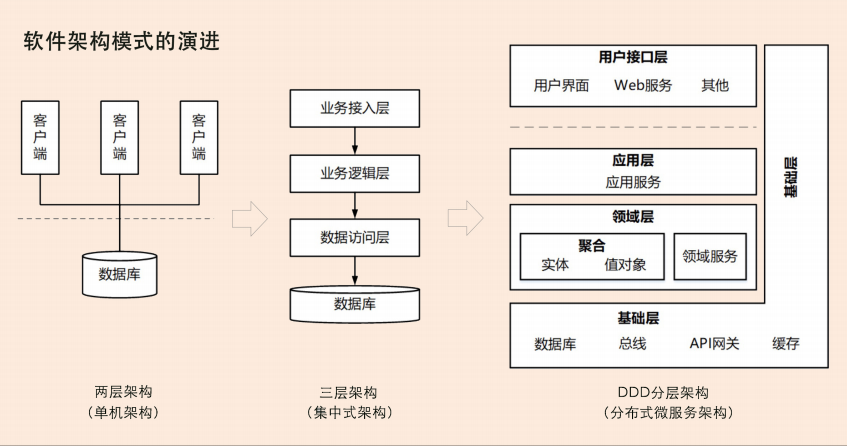
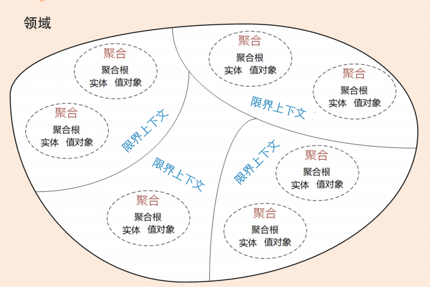
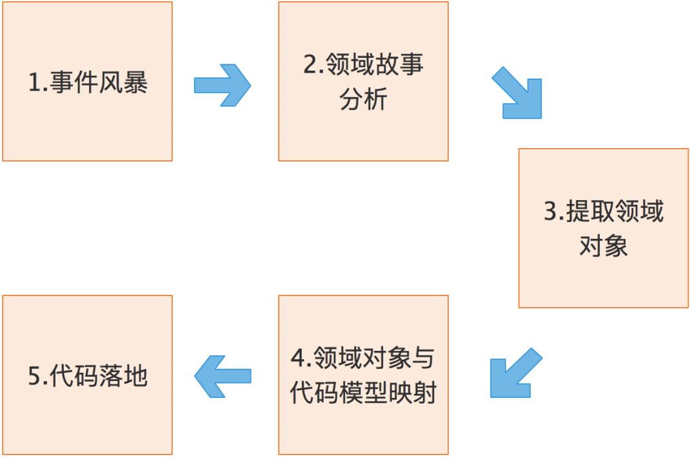
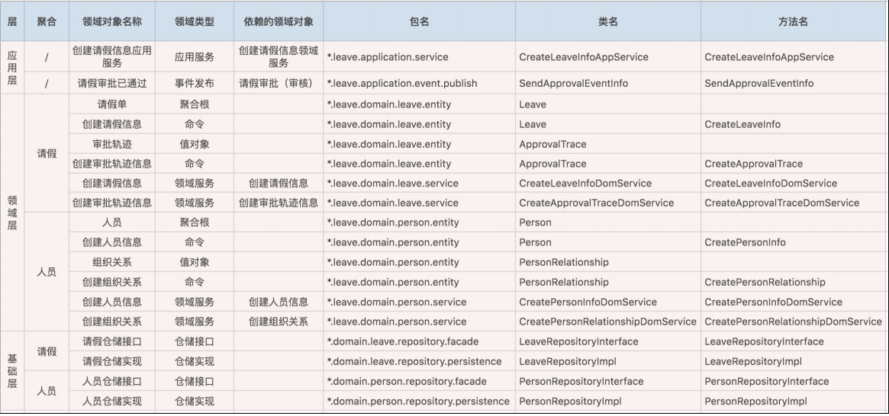
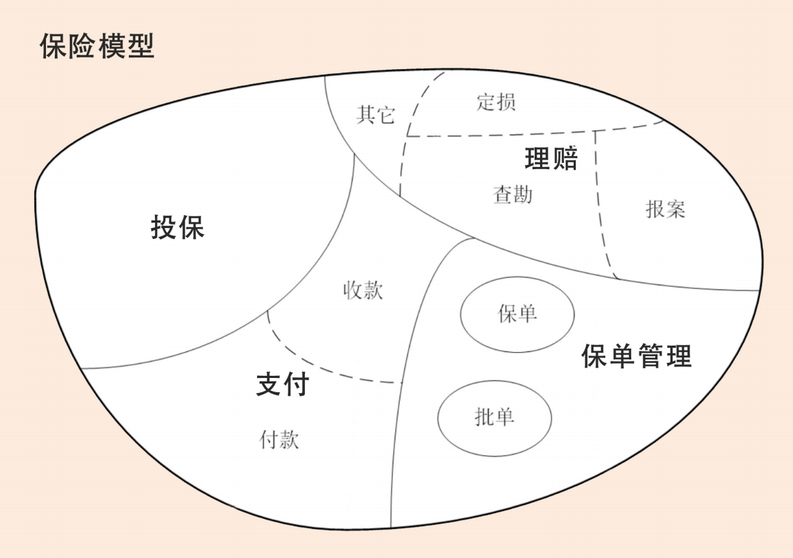
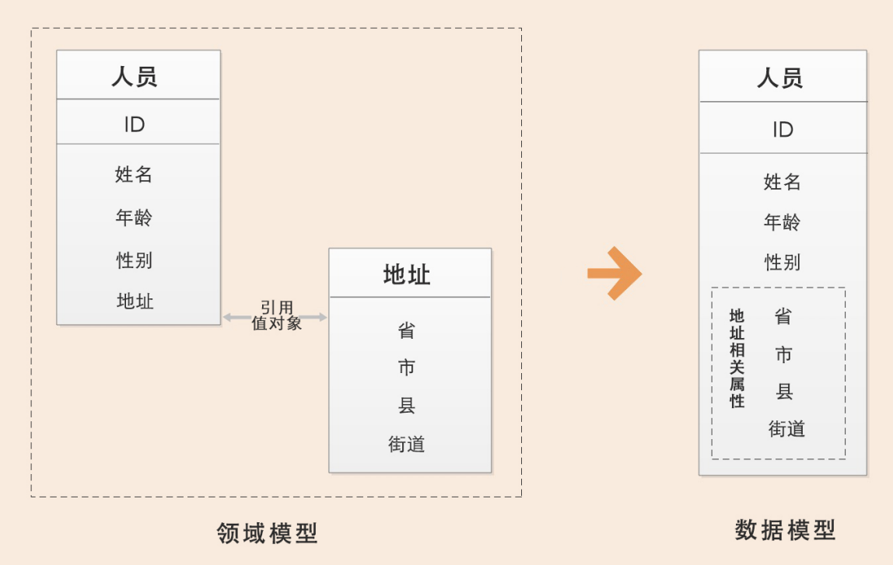
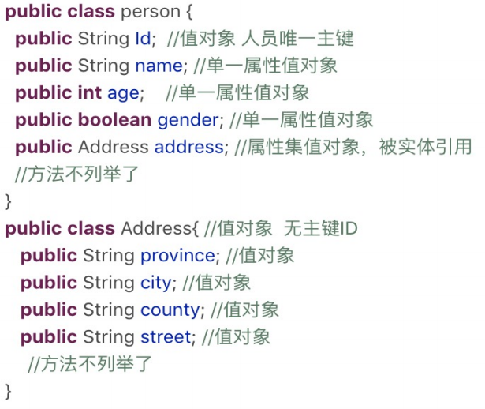
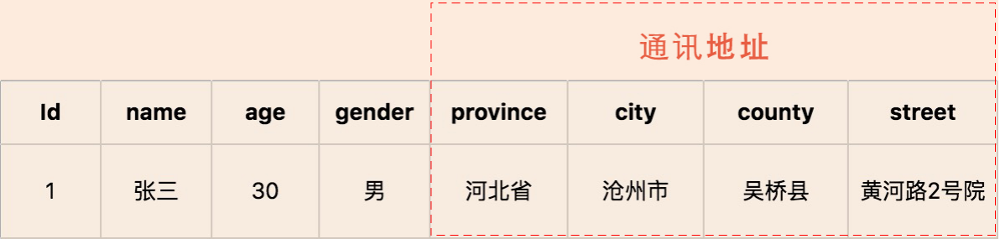
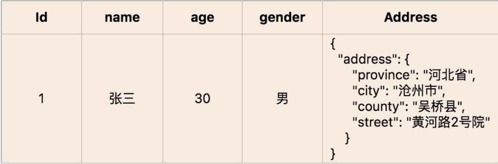

[toc]

---

# 前言

## 软件架构的演进

**第一阶段是单机架构：**采用面向过程的设计方法，系统包括客户端 UI 层和数据库两层，采用 C/S 架构模式，整个系统围绕数据库驱动设计和开发，并且总是从设计数据库和字段开始。 

**第二阶段是集中式架构：**采用面向对象的设计方法，系统包括业务接入层、业务逻辑层和数据库层，采用经典的三层架构，也有部分应用采用传统的 SOA 架构。这种架构容易使系统变得臃肿，可扩展性和弹性伸缩性差。 

**第三阶段是分布式微服务架构：**随着微服务架构理念的提出，集中式架构正向分布式微服务架构演进。微服务架构可以很好地实现应用之间的解耦，解决单体应用扩展性和弹性伸缩能力不足的问题。

**微服务拆分困境产生的根本原因就是不知道业务或者微服务的边界到底在什么地方。**确定了业务边界和应用边界，这个困境就迎刃而解了。

# 微服务设计和DDD

## 为什么DDD适合微服务

2004 年埃里克·埃文斯（Eric Evans）发表了《领域驱动设计》（Domain-Driven Design–Tackling Complexity in the Heart of Software）这本书，从此领域驱动设计（Domain-Driven Design，简称 DDD）诞生。**DDD 核心思想是通过领域驱动设计方法定义领域模型，从而确定业务和应用边界，保证业务模型与代码模型的一致性。**

DDD 是一种处理高度复杂领域的设计思想，它试图分离技术实现的复杂性，并围绕业务概 念构建领域模型来控制业务的复杂性，以解决软件难以理解，难以演进的问题。DDD 不是架构，而是一种架构设计方法论，它通过边界划分将复杂业务领域简单化，帮我们设计出清晰的领域和应用边界，可以很容易地实现架构演进。

##  DDD包括战略设计和战术设计两部分

**我们可以用三步来划定领域模型和微服务的边界。** 

1. 在事件风暴中梳理业务过程中的用户操作、事件以及外部依赖关系等，根据这些要素梳理出领域实体等领域对象。
2. 根据领域实体之间的业务关联性，将业务紧密相关的实体进行组合形成聚合，同时确定聚合中的聚合根、值对象和实体。在这个图里，聚合之间的边界是第一层边界，它们在同一个微服务实例中运行，这个边界是逻辑边界，所以用虚线表示。
3. 根据业务及语义边界等因素，将一个或者多个聚合划定在一个限界上下文内，形成领域模型。在这个图里，限界上下文之间的边界是第二层边界，这一层边界可能就是未来微服务的边界，不同限界上下文内的领域逻辑被隔离在不同的微服务实例中运行，物理上相互隔离，所以是物理边界，边界之间用实线来表示。 

**有了这两层边界，微服务的设计就不是什么难事了。**

## **DDD** 与微服务的关系

DDD 是一种架构设计方法，微服务是一种架构风格，两者从本质上都是为了追求高响应力，而从业务视角去分离应用系统建设复杂度的手段。两者都强调从业务出发，其核心要义是强调根据业务发展，合理划分领域边界，持续调整现有架构，优化现有代码，以保持架构和代码的生命力，也就是我们常说的演进式架构。 

DDD 主要关注：从业务领域视角划分领域边界，构建通用语言进行高效沟通，通过业务抽象，建立领域模型，维持业务和代码的逻辑一致性。

微服务主要关注：运行时的进程间通信、容错和故障隔离，实现去中心化数据管理和去中心化服务治理，关注微服务的独立开发、测试、构建和部署。

## 小结

**DDD 不仅可以用于微服务设计，还可以很好地应用于企业中台的设计。**

**总体来说，DDD 可以给你带来以下收获：**

1. DDD 是一套完整而系统的设计方法，它能带给你从战略设计到战术设计的标准设计过程，使得你的设计思路能够更加清晰，设计过程更加规范。 
2. DDD 善于处理与领域相关的拥有高复杂度业务的产品开发，通过它可以建立一个核心而稳定的领域模型，有利于领域知识的传递与传承。 
3. DDD 强调团队与领域专家的合作，能够帮助你的团队建立一个沟通良好的氛围，构建一致的架构体系。
4. DDD 的设计思想、原则与模式有助于提高你的架构设计能力。 
5. 无论是在新项目中设计微服务，还是将系统从单体架构演进到微服务，都可以遵循DDD 的架构原则。 
6. DDD 不仅适用于微服务，也适用于传统的单体应用。

## 思考

你的公司是否在实施微服务架构，你在微服务设计过程中面临的最大问题是什么？

# 领域、子域、核心域、通用域和支撑域

## 领域和子域

汉语词典中对领域的解释：“领域是从事一种专门活动或事业的**范围**、部类或部门。”百度百科对领域的解释：“领域具体指一种特定的**范围**或区域”。**两个解释有一个共同点——范围。**

在研究和解决业务问题时，DDD 会按照一定的规则将业务领域进行细分，当领域细分到一定的程度后，DDD 会将问题范围限定在特定的边界内，在这个边界内建立领域模型，进而用代码实现该领域模型，解决相应的业务问题。简言之，**DDD 的领域就是这个边界内要解决的业务问题域。**

我们把划分出来的多个子领域称为**子域**，每个子域对应一个更小的问题域或更小的业务范围。 

我们知道细胞核、线粒体、细胞膜等物质共同构成细胞，这些物质一起协作让细胞具有这类细胞特定的生物功能。在这里你可以把细胞理解为 DDD 的聚合，细胞内的这些物质就可以理解为聚合里面的聚合根、实体以及值对象等，在聚合内这些实体一起协作完成特定的业务功能。这个过程类似 DDD 设计时，确定微服务内功能要素和边界的过程。 

**领域建模和微服务建设的过程和方法基本类似，其核心思想就是将问题域逐步分解，降低业务理解和系统实现的复杂度。**

## **核心域、通用域和支撑域**

- 决定产品和公司核心竞争力的子域是核心域，它是业务成功的主要因素和公司的核心竞争力。
- 没有太多个性化的诉求，同时被多个子域使用的通用功能子域是通用域。
- 还有一种功能子域是必需的，但既不包含决定产品和公司核心竞争力的功能，也不包含通用功能的子域，它就是支撑域。

举例来说的话，通用域则是你需要用到的通用系统，比如认证、权限等等，这类应用很容易买到，没有企业特点限制，不需要做太多的定制化。而支撑域则具有企业特性，但不具有通用性，例如数据代码类的数据字典等系统。

## 小结

领域的核心思想就是将问题域逐级细分，来降低业务理解和系统实现的复杂度。通过领域细分，逐步缩小微服务需要解决的问题域，构建合适的领域模型，而领域模型映射成系统就是微服务了。 

核心域、支撑域和通用域的主要目标是：通过领域划分，区分不同子域在公司内的不同功能属性和重要性，从而公司可对不同子域采取不同的资源投入和建设策略，其关注度也会不一样。 

## 思考

请结合你所在公司的业务情况，尝试给业务做一个领域拆分，看看哪些子域是核心域，哪些子域是通用域和支撑域？ 

# 限界上下文：定义领域边界的利器

在 DDD 领域建模和系统建设过程中，有很多的参与者，包括领域专家、产品经理、项目经理、架构师、开发经理和测试经理等。对同样的领域知识，不同的参与角色可能会有不同的理解，那大家交流起来就会有障碍，怎么办呢？因此，在 DDD 中就出现了“**通用语言**”和“**限界上下文**”这两个重要的概念。

这两者相辅相成，**通用语言定义上下文含义，限界上下文则定义领域边界**，以确保每个上下文含义在它特定的边界内都具有唯一的含义，领域模型则存在于这个边界之内。

思考两个问题：

1. 为什么要提出限界上下文的概念（也就是说除了解决交流障碍这个广义的原因，还有更具体的吗）？ 
2. 限界上下文在微服务设计中的作用和意义是什么？

## 什么是通用语言

怎么理解通用语言这个概念呢？**在事件风暴过程中，通过团队交流达成共识的，能够简单、清晰、准确描述业务涵义和规则的语言就是通用语言**。

1. 在事件风暴的过程中，领域专家会和设计、开发人员一起建立领域模型，在领域建模的过程中会形成通用的业务术语和用户故事。事件风暴也是一个项目团队统一语言的过程。 
2. 通过用户故事分析会形成一个个的领域对象，这些领域对象对应领域模型的业务对象，每一个业务对象和领域对象都有通用的名词术语，并且一一映射。 
3. 微服务代码模型来源于领域模型，每个代码模型的代码对象跟领域对象一一对应。

**设计过程中我们可以用一些表格，来记录事件风暴和微服务设计过程中产生的领域对象及其属性。**

下面是一个微服务设计实例的部分数据，表格中的这些名词术语就是项目团队在事件风暴过程中达成一致、可用于团队内部交流的通用语言。在这个表格里面我们可以看到，DDD 分析过程中所有的领域对象以及它们的属性都被记录下来了，除了 DDD 的领域对象，我们还记录了在微服务设计过程中领域对象所对应的代码对象，并将它们一一映射。

DDD 分析和设计过程中的每一个环节都需要保证限界上下文内术语的统一，在代码模型设计的时侯就要建立领域对象和代码对象的一一映射，从而**保证业务模型和代码模型的一致，实现业务语言与代码语言的统一。** 

## 什么是限界上下文

**DDD 在战略设计上提出了“限界上下文”这个概念，用来确定语义所在的领域边界。**

限界上下文的定义就是：用来封装通用语言和领域对象，提供上下文环境，保证在领域之内的一些术语、业务相关对象等（通用语言）有一个确切的含义，没有二义性。这个边界定义了模型的适用范围，使团队所有成员能够明确地知道什么应该在模型中实现，什么不应该在模型中实现。

正如电商领域的商品一样，商品在不同的阶段有不同的术语，在销售阶段是商品，而在运输阶段则变成了货物。同样的一个东西，由于业务领域的不同，赋予了这些术语不同的涵义和职责边界，这个边界就可能会成为未来微服务设计的边界。看到这，我想你应该非常清楚了，**领域边界就是通过限界上下文来定义的。**

## **限界上下文和微服务的关系** 

保险领域还是很复杂的，在这里我用一个简化的保险模型来说明下限界上下文和微服务的关系。

首先，领域可以拆分为多个子领域。一个领域相当于一个问题域，领域拆分为子域的过程就是大问题拆分为小问题的过程。在这个图里面保险领域被拆分为：投保、支付、保单管理和理赔四个子域

子域还可根据需要进一步拆分为子子域，比如，支付子域可继续拆分为收款和付款子子域。拆到一定程度后，有些子子域的领域边界就可能变成限界上下文的边界了。

子域可能会包含多个限界上下文，如理赔子域就包括报案、查勘和定损等多个限界上下文（限界上下文与理赔的子子域领域边界重合）。也有可能子域本身的边界就是限界上下文边界，如投保子域。 

每个领域模型都有它对应的限界上下文，团队在限界上下文内用通用语言交流。领域内所有限界上下文的领域模型构成整个领域的领域模型。

理论上限界上下文就是微服务的边界。**我们将限界上下文内的领域模型映射到微服务，就完成了从问题域到软件的解决方案。**

可以说，限界上下文是微服务设计和拆分的主要依据。在领域模型中，如果不考虑技术异构、团队沟通等其它外部因素，一个限界上下文理论上就可以设计为一个微服务。 

## 小结

通用语言确定了项目团队内部交流的统一语言，而这个语言所在的语义环境则是由限界上下文来限定的，以确保语义的唯一性。 

领域专家、架构师和开发人员的主要工作就是通过事件风暴来划分限界上下文。限界上下文确定了微服务的设计和拆分方向，是微服务设计和拆分的主要依据。如果不考虑技术异构、团队沟通等其它外部因素，一个限界上下文理论上就可以设计为一个微服务。

我们只有理解了限界上下文的真正涵义以及它在微服务设计中的作用，才能真正发挥 DDD 的价值，这是基础也是前提。

## 思考

1. 你能找一找自己工作中的通用语言和限界上下文吗？
2. 为什么要提出限界上下文的概念（也就是说除了解决交流障碍这个广义的原因，还有更具体的吗）？ 
3. 限界上下文在微服务设计中的作用和意义是什么？

# 实体和值对象：从领域模型的基础单元看系统设计

这两个概念都是领域模型中的领域对象。它们在领域模型中起什么作用，战术设计时如何将它们映射到代码和数据模型中去？就是我们这一讲重点要关注的问题。

## 实体

在 DDD 中有这样一类对象，它们拥有唯一标识符，且标识符在历经各种状态变更后仍能保持一致。对这些对象而言，重要的不是其属性，而是其延续性和标识，对象的延续性和标识会跨越甚至超出软件的生命周期。我们把这样的对象称为实体。

### 实体的业务形态

在 DDD 不同的设计过程中，实体的形态是不同的。在战略设计时，实体是领域模型的一个重要对象。领域模型中的实体是多个属性、操作或行为的载体。在事件风暴中，我们可以根据命令、操作或者事件，找出产生这些行为的业务实体对象，进而按照一定的业务规则将依存度高和业务关联紧密的多个实体对象和值对象进行聚类，形成聚合。

**实体和值对象是组成领域模型的基础单元。**

### 实体的代码形态

在代码模型中，实体的表现形式是实体类，这个类包含了实体的属性和方法，通过这些方法实现实体自身的业务逻辑。在 DDD 里，**这些实体类通常采用充血模型**，与这个实体相关的所有业务逻辑都在实体类的方法中实现，跨多个实体的领域逻辑则在领域服务中实现。 

### 实体的运行形态

实体以 DO（领域对象）的形式存在，每个实体对象都有唯一的 ID。我们可以对一个实体对象进行多次修改，修改后的数据和原来的数据可能会大不相同。但是，由于它们拥有相同的 ID，它们依然是同一个实体。比如商品是商品上下文的一个实体，通过唯一的商品 ID 来标识，不管这个商品的数据如何变化，商品的 ID 一直保持不变，它始终是同一个商品。 

### 实体的数据库形态

与传统数据模型设计优先不同，DDD 是先构建领域模型，针对实际业务场景构建实体对象和行为，再将实体对象映射到数据持久化对象。 

## **值对象**

我们先看一下《实现领域驱动设计》一书中对值对象的定义：**通过对象属性值来识别的对象，它将多个相关属性组合为一个概念整体**。在 DDD 中用来描述领域的特定方面，并且是一个**没有标识符**的对象，叫作值对象。

值对象描述了领域中的一件东西，这个东西是不可变的，它将不同的相关属性组合成了一个概念整体。当度量和描述改变时，可以用另外一个值对象予以替换。

简单来说，**值对象本质上就是一个集**。那这个集合里面有什么呢？若干个用于描述目的、具有整体概念和不可修改的属性。那这个集合存在的意义又是什么？在领域建模的过程中，值对象可以保证属性归类的清晰和概念的完整性，避免属性零碎。

人员实体原本包括：姓名、年龄、性别以及人员所在的省、市、县和街道等属性。这样显示地址相关的属性就很零碎了对不对？现在，我们可以将“省、市、县和街道等属性”拿出来构成一个“地址属性集合”，这个集合就是值对象了。

### 值对象的业务形态

值对象是 DDD 领域模型中的一个基础对象，它跟实体一样都来源于事件风暴所构建的领域模型，都包含了若干个属性，它与实体一起构成聚合。

本质上，实体是看得到、摸得着的实实在在的业务对象，实体具有业务属性、业务行为和业务逻辑。而值对象只是若干个属性的集合，只有数据初始化操作和有限的不涉及修改数据的行为，基本不包含业务逻辑。值对象的属性集虽然在物理上独立出来了，但在逻辑上它仍然是实体属性的一部分，用于描述实体的特征。

在值对象中也有部分共享的标准类型的值对象，它们有自己的限界上下文，有自己的持久化对象，可以建立共享的数据类微服务，比如数据字典。

###  值对象的代码形态

值对象在代码中有这样两种形态。如果值对象是单一属性，则直接定义为实体类的属性；如果值对象是属性集合，则把它设计为 Class 类，Class 将具有整体概念的多个属性归集到属性集合，这样的值对象没有 ID，会被实体整体引用。 

我们看一下下面这段代码，person 这个实体有若干个单一属性的值对象，比如 Id、name等属性；同时它也包含多个属性的值对象，比如地址 address。 

### 值对象的运行形态

值对象嵌入到实体的话，有这样两种不同的数据格式，也可以说是两种方式，分别是**属性嵌入**的方式和**序列化大对象**的方式。

**如果你对这两种方式不够了解，可以看看下面的例子。** 

1. 以属性嵌入的方式形成的人员实体对象，地址值对象直接以属性值嵌入人员实体中。

   

2. 以序列化大对象的方式形成的人员实体对象，地址值对象被序列化成大对象 Json 串后，嵌入人员实体中。 

   

### 值对象的数据库形态

DDD 引入值对象是希望实现从“数据建模为中心”向“领域建模为中心”转变，减少数据库表的数量和表与表之间复杂的依赖关系，尽可能地简化数据库设计，提升数据库性能。

传统的数据建模大多是根据数据库范式设计的，每一个数据库表对应一个实体，每一个实体的属性值用单独的一列来存储，一个实体主表会对应 N 个实体从表。而值对象在数据库持久化方面简化了设计，它的数据库设计大多采用非数据库范式，值对象的属性值和实体对象的属性值保存在同一个数据库实体表中。 

举个例子，还是基于上述人员和地址那个场景，实体和数据模型设计通常有两种解决方案：

1. 把地址值对象的所有属性都放到人员实体表中，创建人员实体，创建人员数据表；
2. 创建人员和地址两个实体，同时创建人员和地址两张表。 

**那到底应该怎样设计，才能让业务含义清楚，同时又不让数据库变得复杂呢？**

我们可以综合这两个方案的优势，扬长避短。在领域建模时，我们可以把地址作为值对象，人员作为实体，这样就可以保留地址的业务涵义和概念完整性。而在数据建模时，我们可以将地址的属性值嵌入人员实体数据库表中，只创建人员数据库表。这样既可以兼顾业务含义和表达，又不增加数据库的复杂度。 

**在领域建模时，我们可以将部分对象设计为值对象，保留对象的业务涵义，同时又减少了实体的数量；在数据建模时，我们可以将值对象嵌入实体，减少实体表的数量，简化数据库设计。**

有 DDD 专家认为，要想发挥对象的威力，就需要优先做领域建模，弱化数据库的作用，只把数据库作为一个保存数据的仓库即可。即使**违反数据库设计原则**，也不用大惊小怪，只要**业务能够顺利运行**，就没什么关系。

### 值对象的优势和局限

值对象是一把双刃剑，它的优势是可以简化数据库设计，提升数据库性能。但如果值对象使用不当，它的优势就会很快变成劣势。

值对象采用序列化大对象的方法简化了数据库设计，减少了实体表的数量，可以简单、清晰地表达业务概念。这种设计方式虽然降低了数据库设计的复杂度，但却无法满足基于值对象的快速查询，会导致搜索值对象属性值变得异常困难。 

值对象采用属性嵌入的方法提升了数据库的性能，但如果实体引用的值对象过多，则会导致实体堆积一堆缺乏概念完整性的属性，这样值对象就会失去业务涵义，操作起来也不方便。

所以，你可以对照着以上这些优劣势，结合你的业务场景，好好想一想了。那如果在你的业务场景中，值对象的这些劣势都可以避免掉，那就请放心大胆地使用值对象吧。

### 实体和值对象的关系

实体和值对象是微服务底层的最基础的对象，一起实现实体最基本的核心领域逻辑。

值对象和实体在某些场景下可以互换，很多 DDD 专家在这些场景下，其实也很难判断到底将领域对象设计成实体还是值对象？可以说，值对象在某些场景下有很好的价值，但是并不是所有的场景都适合值对象。你需要根据团队的设计和开发习惯，以及上面的优势和局限分析，选择最适合的方法。

**DDD 提倡从领域模型设计出发，而不是先设计数据模型。**

### 小结

这个过程是从业务模型向系统模型落地的过程，比较复杂，很考验你的设计能力，很多时候我们都要结合自己的业务场景，选择合适的方法来进行微服务设计。强调一点，我们不避讳传统的设计方法，毕竟适合自己的才是最好的。

### 思考

请用自己的话总结下，实体和值对象的主要区别是什么？ 

- 实体是有唯一标识，而值对象没有。
- 实体是具有业务逻辑和属性及行为的对象，而值对象是实体下的属性集合，不具备行为。
- 实体消亡，则值对象随之消亡。

# 聚合和聚合根：怎样设计聚合

## 聚合

在 DDD 中，实体和值对象是很基础的领域对象。实体一般对应业务对象，它具有业务属性和业务行为；而值对象主要是属性集合，对实体的状态和特征进行描述。但实体和值对象都只是个体化的对象，它们的行为表现出来的是个体的能力

**领域模型内的实体和值对象就好比个体，而能让实体和值对象协同工作的组织就是聚合，它用来确保这些领域对象在实现共同的业务逻辑时，能保证数据的一致性。** 

聚合就是由业务和逻辑紧密关联的实体和值对象组合而成的，聚合是数据修改和持久化的基本单元，每一个聚合对应一个仓储，实现数据的持久化。 

聚合有一个聚合根和上下文边界，这个边界根据业务单一职责和高内聚原则，定义了聚合内部应该包含哪些实体和值对象，而聚合之间的边界是松耦合的。按照这种方式设计出来的微服务很自然就是“高内聚、低耦合”的。

聚合在 DDD 分层架构里属于**领域层**，领域层包含了多个聚合，共同实现核心业务逻辑。聚合内实体以**充血模型**实现个体业务能力，以及业务逻辑的高内聚。**跨多个实体的业务逻辑通过领域服务来实现，跨多个聚合的业务逻辑通过应用服务来实现**。比如有的业务场景需要同一个聚合的 A 和 B 两个实体来共同完成，我们就可以将这段业务逻辑用领域服务来实现；而有的业务逻辑需要聚合 C 和聚合 D 中的两个服务共同完成，这时你就可以用应用服务来组合这两个服务。

