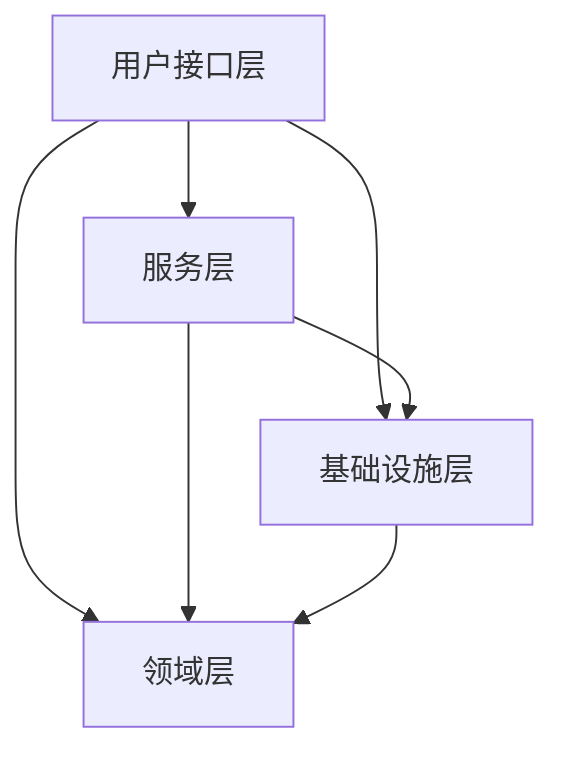

[toc]

---

# 贫血模型和充血模型

## 贫血模型（事务脚本模式）

### 概念

#### 事务脚本

事务脚本的核心是过程，通过过程的调用来组织业务逻辑，每个过程处理来自表现层的单个请求。大部分业务应用都可以被看成一系列事务，从某种程度上来说，通过事务脚本处理业务，就像执行一条条Sql语句来实现数据库信息的处理。事务脚本把业务逻辑组织成单个过程，在过程中直接调用数据库，业务逻辑在服务（Service）层处理。

#### 贫血模型

贫血模型是面向过程，基于数据库的建模——Database Modeling

通过数据抽象系统关系，即传统数据库分析设计。该种模式实际上就是一种典型的贫血模型，通过数据库映射的实体类只有对应的属性，成为了只有getter和setter方法的数据载体，而没有具体行为，相应的行为要通过Service层去实现，随着业务升级积累，会出现胖服务层和贫血的领域模型，维护起来会越发乏力。即便如此，该种模式仍是广泛应用在软件开发领域。

**总之，以常见的MVC架构的 `entity` 为例，这种只包含数据（set/get）不包含业务逻辑的类就叫做贫血模型。贫血模型将数据与操作分离，破坏了面向数据的封装性，是一种典型的面向过程的编程。**

### 场景

- 常见的MVC三层架构
  - Dao + Entity 
  - Service + DTO (Data Transfer Object)
  - Controller + VO (View Object)
  
  ```mermaid
  graph TD
  控制器-->服务层
  服务层-->数据层
  ```
  
  
  
  
### 优缺点

- 优点
  - **基于贫血模型的传统的开发模式，比较适合业务比较简单的系统开发**
  -  **贫血模型要比充血模型更加有简单、易上手**。 
- 缺点
  - 贫血模型的系统随着不断开发，会导致实体和 Service 层越来越冗余和复杂。
  - 与 `entity` 联系比较紧密的业务会被分离到 Service 层

### 代码实例


```java
/**
 * 账户业务对象
 */
public class AccountBO {

	/**
	 * 账户ID
	 */
	private String accountId;

	/**
	 * 账户余额
	 */
	private Long balance;
	/**
	 * 是否冻结
	 */
	private boolean isFrozen;

	public String getAccountId() {
		return accountId;
	}

	public void setAccountId(String accountId) {
		this.accountId = accountId;
	}

	public Long getBalance() {
		return balance;
	}

	public void setBalance(Long balance) {
		this.balance = balance;
	}

	public boolean isFrozen() {
		return isFrozen;
	}

	public void setFrozen(boolean isFrozen) {
		this.isFrozen = isFrozen;
	}
}

/**
 * 转账业务服务实现
 */
@Service
public class TransferServiceImpl implements TransferService {

	@Autowired
	private AccountService accountService;

	@Override
	public boolean transfer(String fromAccountId, String toAccountId, Long amount) {
		AccountBO fromAccount = accountService.getAccountById(fromAccountId);
		AccountBO toAccount = accountService.getAccountById(toAccountId);

		/** 检查转出账户 **/
		if (fromAccount.isFrozen()) {
			throw new Exception(ErrorCodeBiz.ACCOUNT_FROZEN);
		}
		if (fromAccount.getBalance() < amount) {
			throw new Exception(ErrorCodeBiz.INSUFFICIENT_BALANCE);
		}
		fromAccount.setBalance(fromAccount.getBalance() - amount);

		/** 检查转入账户 **/
		if (toAccount.isFrozen()) {
			throw new Exception(ErrorCodeBiz.ACCOUNT_FROZEN);
		}
		toAccount.setBalance(toAccount.getBalance() + amount);

		/** 更新数据库 **/
		accountService.updateAccount(fromAccount);
		accountService.updateAccount(toAccount);
		return Boolean.TRUE;
	}
}
```


## 充血模型（领域模型模式）

### 概念

#### 领域驱动设计

**领域驱动设计**（Domain Driven Design，简称 DDD）主要是用来**指导如何解耦业务系统，划分业务模块，定义业务领域模型及其交互**，注意：**做好领域驱动设计的关键是对业务的熟悉程度**，如果对业务不熟悉即使再熟悉领域驱动设计的概念也无法很好的设计出合理的领域设计。 

#### 领域模型模式

**领域模型的特点**也比较明显， 属于面向对象设计，领域模型具备自己的属性行为状态，并与现实世界的业务对象相映射。各类具备明确的职责划分，领域对象元素之间通过聚合和引用等关系配合解决实际业务应用和规则。可复用，可维护，易扩展，可以采用合适的设计模型进行详细设计。**缺点是相对复杂，要求设计人员有良好的抽象能力。**

#### 充血模型

充血模型是面向对象的建模——Object Modeling

在贫血模型中，数据和业务分割在实体和service层中。充血模型与之相反，**数据和对应的实体业务封装到同一个类中。因此，这充血模型满足面向对象的封装特性，是典型的面向对象编程风格。**

通过面向对象方式抽象系统关系，也就是面向对象设计。毫无疑问，在面向对象编程环境中，面向对象无疑是领域建模最佳方式。通过面向对象构建的领域模型，因为有类的继承、封装、多态等特性显得生动许多，不仅包含自身属性状态，还包括有方法行为等，即充血的领域模型。一些Service层的行为凝练为领域服务，Service层则变薄了，领域模型则丰富了行为。

### 场景

- 包含各种利息计算模型、还款模型等复杂业务的金融系统。



> 依赖倒置原则（DIP）：
>
> - 高层模块不依赖于低层模块，两者都依赖于抽象；
> - 抽象不应该依赖于细节，细节应依赖抽象

- 分层作用

  | 分层 | 描述 |
  | ---- | ---- |
  |   用户接口层   |  用户界面层，或者表现层，负责向用户显示解释用户命令     |
  |    服务层  |   定义软件要完成的任务，并且指挥协调领域对象进行不同的操作。该层不包含业务领域知识。   |
  |   领域层   |   或称为模型层，系统的核心，负责表达业务概念，业务状态信息以及业务规则。即包含了该领域（问题域）所有复杂的业务知识抽象和规则定义。该层主要精力要放在领域对象分析上，可以从实体，值对象，聚合（聚合根），领域服务，领域事件，仓储，工厂等方面入手   |
  |    基础设施层  |    主要有2方面内容，一是为领域模型提供持久化机制，当软件需要持久化能力时候才需要进行规划；一是对其他层提供通用的技术支持能力，如消息通信，通用工具，配置等的实现；  |

  

### 优缺点

- 优点
  
  - **基于充血模型的 DDD 开发模式，更适合业务复杂的系统开发**。
  - 面向对象，将对象关联的逻辑放入实体中，而不是放入Service层
- 缺点
  
  - 对于开发团队要求更高，对领域模型需要熟练划分，否则会造成更大的负担。
  - 如何划分业务逻辑呢？按照Rod johnson提出远测是 “case by case”，可重用度高的，和实体密切关联的放在实体中，反之，放在service中。简单来说，**放在实体中的应该只和这个实体有关，而不应该涉及多个实体。**当逻辑放在实体中，这个实体应该仍然独立在持久层之外，可以脱离持久层框架进行单元测试，这个**实体才是一个完整的，不依赖外部实体的领域对象，这个情况下，这个逻辑才是实体逻辑**。

### 代码示例

```java
/**
 * 账户业务对象
 */
public class AccountBO {

	/**
	 * 账户ID
	 */
	private String accountId;

	/**
	 * 账户余额
	 */
	private Long balance;
	/**
	 * 是否冻结
	 */
	private boolean isFrozen;
	/**
	 * 出借策略
	 */
	private DebitPolicy debitPolicy;

	/**
	 * 入账策略
	 */
	private CreditPolicy creditPolicy;

	public String getAccountId() {
		return accountId;
	}

	public void setAccountId(String accountId) {
		this.accountId = accountId;
	}

	public Long getBalance() {
		return balance;
	}

	public void setBalance(Long balance) {
		this.balance = balance;
	}

	public boolean isFrozen() {
		return isFrozen;
	}

	public void setFrozen(boolean isFrozen) {
		this.isFrozen = isFrozen;
	}
    
    /**
	 * 出借方法
	 * 
	 * @param amount 金额
	 */
	public void debit(Long amount) {
		debitPolicy.preDebit(this, amount);
		this.balance -= amount;
		debitPolicy.afterDebit(this, amount);
	}

	/**
	 * 转入方法
	 * 
	 * @param amount 金额
	 */
	public void credit(Long amount) {
		creditPolicy.preCredit(this, amount);
		this.balance += amount;
		creditPolicy.afterCredit(this, amount);
	}

	/**
	 * BO和DO转换必须加set方法这是一种权衡
	 */
	public DebitPolicy getDebitPolicy() {
		return debitPolicy;
	}

	public void setDebitPolicy(DebitPolicy debitPolicy) {
		this.debitPolicy = debitPolicy;
	}

	public CreditPolicy getCreditPolicy() {
		return creditPolicy;
	}

	public void setCreditPolicy(CreditPolicy creditPolicy) {
		this.creditPolicy = creditPolicy;
	}
}


/**
 * 入账策略实现
 */
@Service
public class CreditPolicyImpl implements CreditPolicy {

	@Override
	public void preCredit(AccountBO account, Long amount) {
		if (account.isFrozen()) {
			throw new MyBizException(ErrorCodeBiz.ACCOUNT_FROZEN);
		}		
	}

	@Override
	public void afterCredit(AccountBO account, Long amount) {
		System.out.println("afterCredit");
	}
}

/**
 * 出借策略实现
 */
@Service
public class DebitPolicyImpl implements DebitPolicy {

	@Override
	public void preDebit(AccountBO account, Long amount) {
		if (account.isFrozen()) {
			throw new MyBizException(ErrorCodeBiz.ACCOUNT_FROZEN);
		}
		if (account.getBalance() < amount) {
			throw new MyBizException(ErrorCodeBiz.INSUFFICIENT_BALANCE);
		}
	}

	@Override
	public void afterDebit(AccountBO account, Long amount) {
		System.out.println("afterDebit");
	}
}

/**
 * 转账业务服务实现
 */
@Service
public class TransferServiceImpl implements TransferService {

	@Resource
	private AccountService accountService;
	@Resource
	private CreditPolicy creditPolicy;
	@Resource
	private DebitPolicy debitPolicy;

	@Override
	public boolean transfer(String fromAccountId, String toAccountId, Long amount) {
		AccountBO fromAccount = accountService.getAccountById(fromAccountId);
		AccountBO toAccount = accountService.getAccountById(toAccountId);
		fromAccount.setDebitPolicy(debitPolicy);
		toAccount.setCreditPolicy(creditPolicy);

		fromAccount.debit(amount);
		toAccount.credit(amount);
		accountService.updateAccount(fromAccount);
		accountService.updateAccount(toAccount);
		return Boolean.TRUE;
	}
}
```

## 总结

基于贫血模型的传统开发架构MVC，只是将 entity 作为数据载体，重 service 层业务代码；而基于充血模型的DDD开发模式，将高复用和实体相关的业务逻辑放到实体里面，不同实体聚合形成领域层，不同领域聚合形成应用层。

充血模型下：

- Service 层主要功能：
  - 负责与持久层交流。为了保证领域实体的独立性，不与其它层的的耦合，一般都会以交由Service处理。
  - 负责与跨领域实体的业务聚合功能。比如转账会涉及两个钱包的操作，所以会在service层调用。
  - 负责一些非功能性与三方系统的交互工作。比如幂等，发邮件，记录日志等。

## 参考

- [领域驱动设计-贫血模型VS充血模型](https://blog.csdn.net/yangyanping20108/article/details/119905513)

- [领域驱动设计-贫血模型VS充血模型](https://zhuanlan.zhihu.com/p/464914100)

- [领域驱动设计-贫血模型VS充血模型](https://php-note.com/2219.html)

