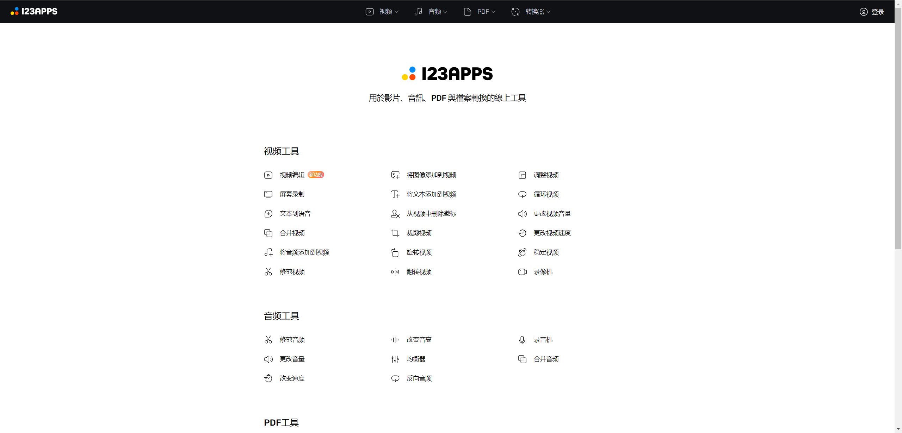
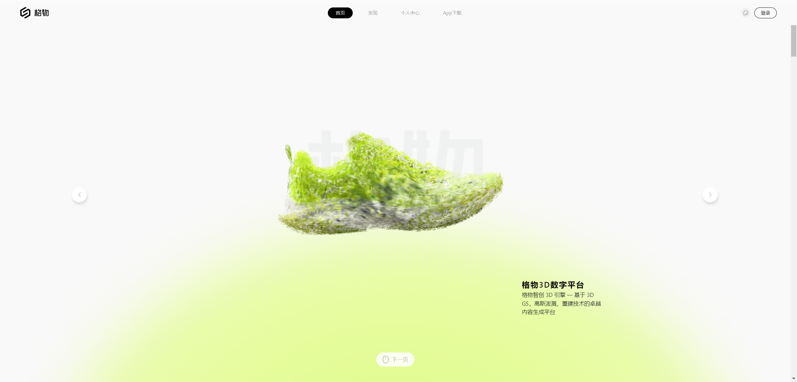
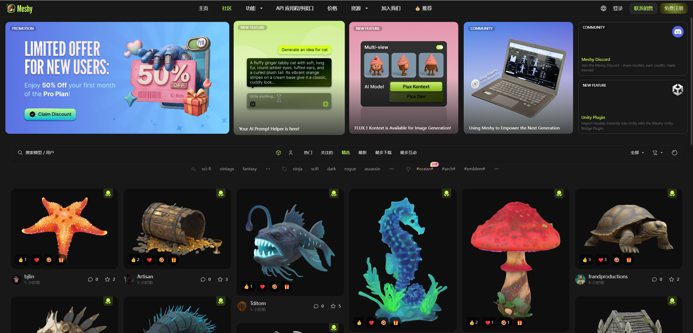

- [集成类](#集成类)
  - [即时工具](#即时工具)
- [音视频](#音视频)
  - [123apps](#123apps)
  - [aoqiv](#aoqiv)
- [图形渲染](#图形渲染)
  - [online 3d viewer](#online-3d-viewer)
- [AI](#ai)
  - [3D建模渲染](#3d建模渲染)
    - [商汤格物](#商汤格物)
    - [meshy](#meshy)
    - [neural4d](#neural4d)
  - [模型可视化工具](#模型可视化工具)
- [临时网盘](#临时网盘)
  - [文叔叔](#文叔叔)
  - [临时盘](#临时盘)

---

# 集成类

## 即时工具
> https://www.67tool.com/category/5f56fb0664935e78271fd5a2

# 音视频
## 123apps
> https://123apps.com/cn/

## aoqiv 
> https://www.aoqiv.com/

# 图形渲染

## online 3d viewer
> http://3dviewer.bimant.com/

# AI

## 3D建模渲染
### 商汤格物
> https://things-ent.shyuhuankj.com/home

### meshy
> https://www.meshy.ai/discover

### neural4d
> https://www.neural4d.com/home

## 模型可视化工具

以下是Cyclone 3DR Viewer、Trimble RealWorks、MeshLab和Blender之间的优缺点对比：
- **Cyclone 3DR Viewer**
    - **优点**：具有高质量的数据准备功能，可通过完整灵活的工具盒清理3D数据，减少噪声和误差，确保模型准确；AI驱动的自动化功能强大，AI分割工具和脚本可提高数据处理的准确性和效率；具备详细的3D可视化功能，先进的3DR网格化和纹理引擎可生成逼真的3D网格，便于可视化和分析；支持所有行业格式，包括BIM（IFC、RVT、FBX、BCF）等，互操作性强；用户友好，有在线文档、教程和电子学习课程，学习曲线较平缓。
    - **缺点**：作为Viewer版本，功能可能相对Trimble RealWorks等专业软件较为基础，在高级建模、复杂数据处理等方面存在限制；可能需要搭配Leica的其他软件或硬件使用，才能发挥最大功效，独立性稍弱。
- **Trimble RealWorks**
    - **优点**：能从各种三维激光扫描仪导入丰富的数据，可有效管理、处理和分析庞大数据集，通过部分加载技术提升数据处理效率；提供点云全自动配准功能，还有无目标配准等高级配准工具，配准精度高；测量功能强大，可轻松量测出平距、斜距、垂距等多种数据；能产生多种二维和三维成果，如断面图、三角网模型、等高线等；可将天宝GNSS、光学仪器和三维扫描仪的数据有效结合，兼容性好；有不同版本，可根据用户需求选择，如基本版、高级版、高级建模版等。
    - **缺点**：对于特别大的项目，可能会出现性能问题，如加载时间长、软件响应慢等；软件价格可能相对较高，增加了使用成本；功能复杂，对于初学者来说，需要一定时间来熟悉和掌握。
- **MeshLab**
    - **优点**：开源、可移植且可扩展，是处理3D三角形网格的强大工具；支持多种文件格式，如PLY、STL、OFF、OBJ等，格式兼容性好；具备先进的网格优化功能，如重新网格化和简化、平滑和孔填充、纹理映射和颜色绘画等；有测量工具，可直接在模型上准确测量距离；界面直观，工具分类合理，工作流程结构化，适合初学者和专业人士使用；支持插件，可通过插件扩展核心功能，满足特定项目需求。
    - **缺点**：与一些付费的网格处理软件相比，可能缺少某些高级功能；对于新手来说，其界面和一些复杂的功能可能仍然具有一定的挑战性，学习曲线较陡；在处理大规模数据时，可能会出现性能问题或容易出错。
- **Blender**
    - **优点**：免费开源，用户可以自由获取和使用，成本低；功能非常全面，提供了从建模、动画、材质、渲染到音频处理、视频剪辑等一系列的解决方案；支持多种建模工具，包括多边形建模、曲面建模和细分建模等，建模能力强大；动画制作功能优秀，内置了骨骼绑定、权重绘制和运动追踪等工具；有强大的渲染引擎，如Cycles渲染器和实时渲染引擎EEVEE，支持多种渲染技术；以Python为内建脚本语言，支持多种第三方插件和工具，可定制性和扩展性强。
    - **缺点**：由于功能丰富，学习曲线陡峭，对于初学者来说上手难度较大；用户界面在一些方面不够直观，需要花费时间熟悉；在渲染大型场景时，可能需要较长时间，对计算机硬件配置要求较高；在导入和导出其他三维软件的文件格式时，可能会遇到兼容性问题。

# 临时网盘

## 文叔叔
> https://www.wenshushu.cn/
> 不限制大小，24小时有效

'

## 临时盘
> https://linshipan.com/
> 500M免费

