- 零息债券估值法

$$
V=M/(1+r)^2 \\
V=M(1-t*r/360)
$$

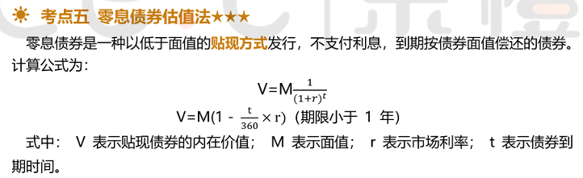

- 固定利率债券估值法

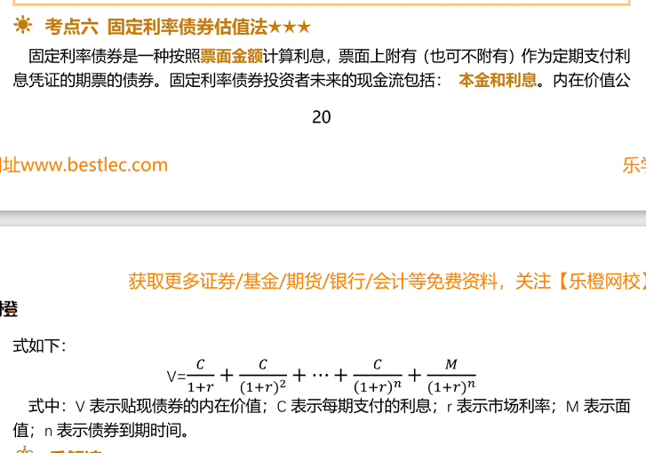

- 统一公债估值法

V = 现值；C=每期利息；r=利率
$$
V =C/r
$$

- 当期收益率

- 到期收益率 

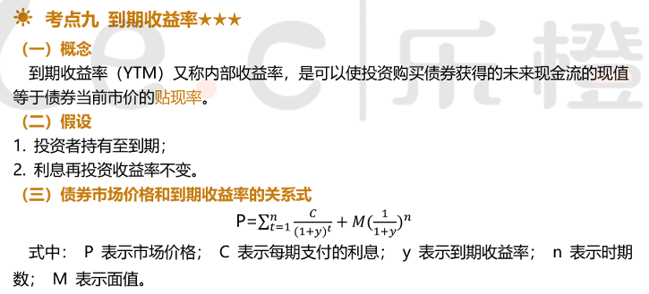

- 修正久期计算公式

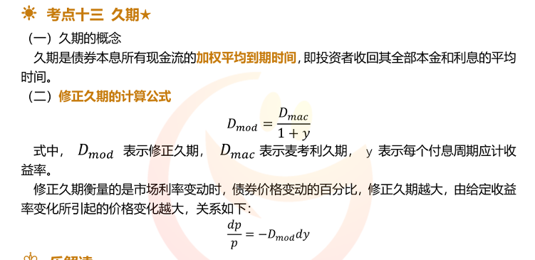

- 效用

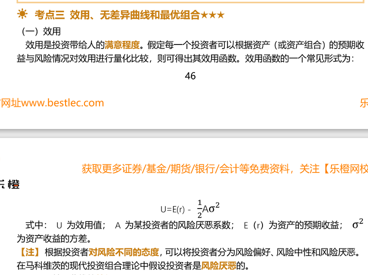

- 市场资本线

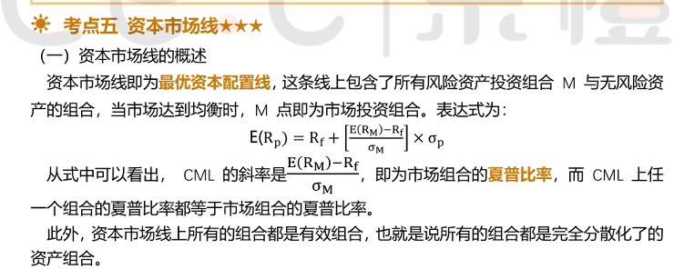

- 投资资产定价模型

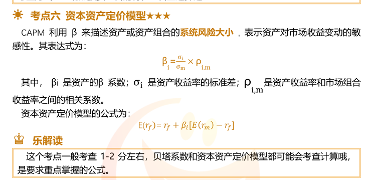

- 贝塔系数

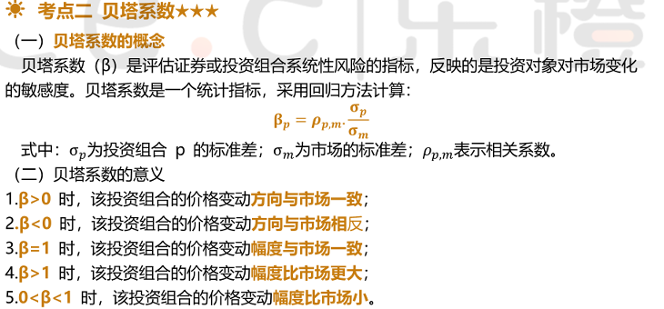

- 主动比重

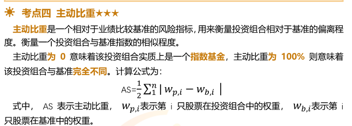

- 下行标准差

- 股票基金风险指数

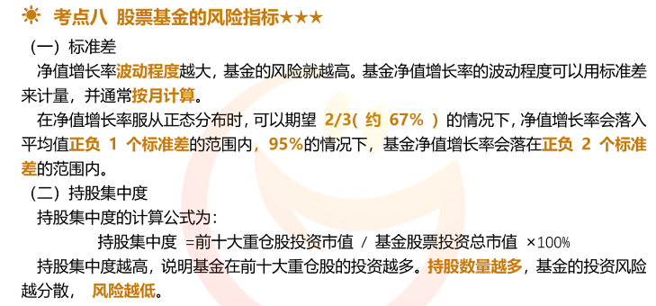

- 持有区间收益率

- 平均收益率

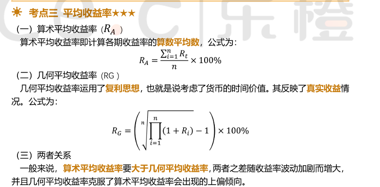

- 时间加权收益率

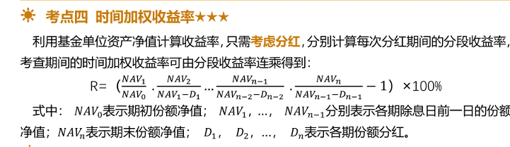

- 相对收益

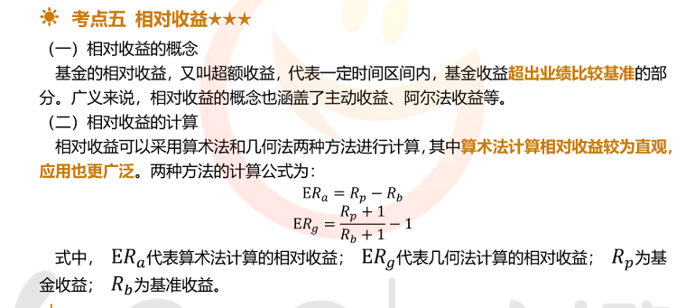

- 夏普比率

- 特雷诺比率

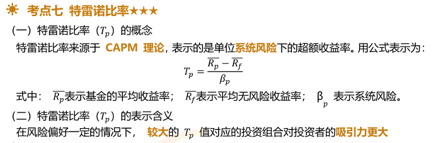

- 詹森

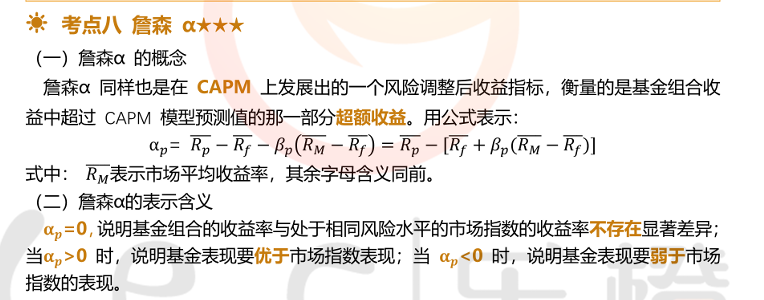

- 信息比率与跟踪误差

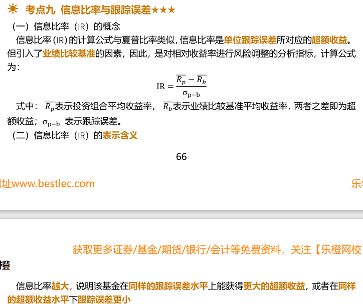

- 绝对收益归因

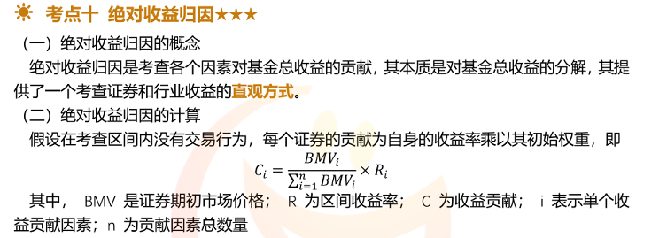

- 除权和除息

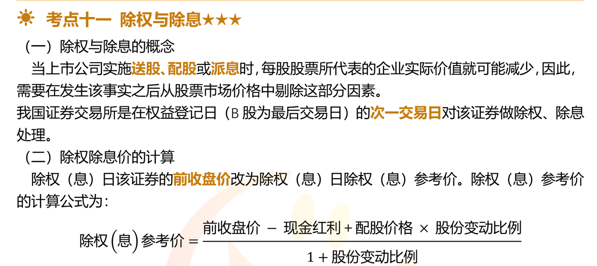

- 基金资产估值

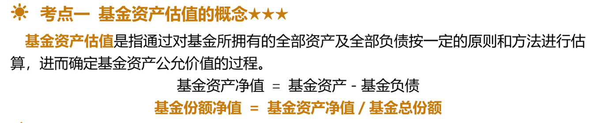

- 各项费用计提标准

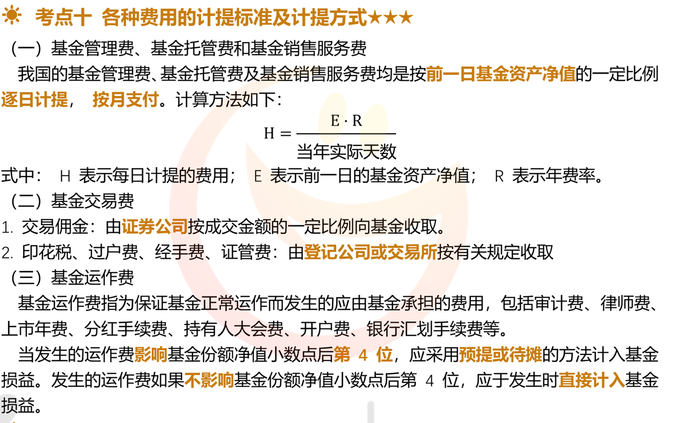