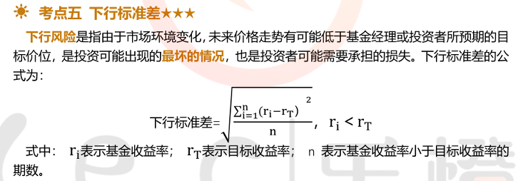
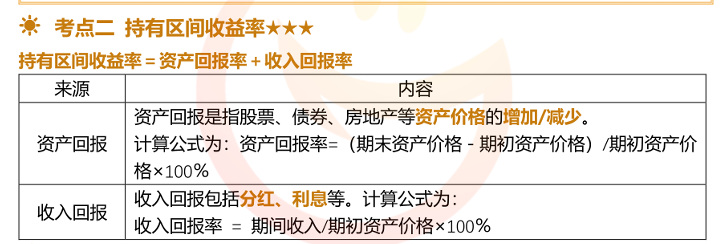
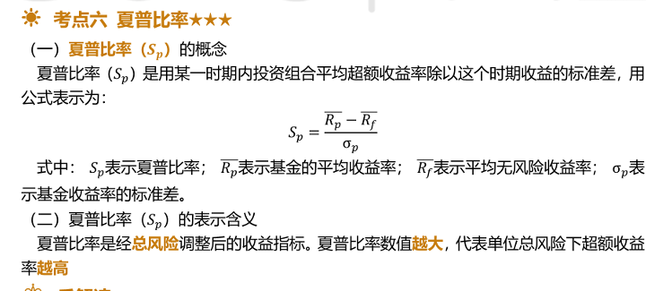

- 零息债券估值法

$$
V=M/(1+r)^2 \\
V=M(1-t*r/360)
$$

- 固定利率债券估值法

- 统一公债估值法

V = 现值；C=每期利息；r=利率
$$
V =C/r
$$

- 当期收益率

- 到期收益率 

- 修正久期计算公式

- 效用

- 市场资本线

- 投资资产定价模型

- 贝塔系数

- 主动比重

- 下行标准差

- 股票基金风险指数

- 持有区间收益率

- 平均收益率

- 时间加权收益率

- 相对收益

- 夏普比率

- 特雷诺比率

- 詹森

- 信息比率与跟踪误差

- 绝对收益归因

- 除权和除息

- 基金资产估值

- 各项费用计提标准

