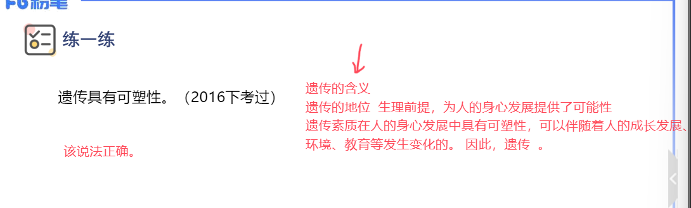

# 辨析题

## 考察特点及评分标准

### 考察特点

### 评分标准

> 注意事项

## 考察类型及作答方法

### 概念混淆型

### 概念释义型

### 理论关系型

### 正误混合型

## 答题思路

## 示例题

### 教育的社会属性

### 政治经济制度与教育的关系

### 影响人身心发展的因素

### 新课程改革的课程结构

### 教学过程的基本规律

<mark>mark 背</mark>

 

### 教学方法

### 学习动机与效率的关系

### 学习迁移的分类

### 个别差异与因材施教

### 气质

### 群体的分类

## 总结

