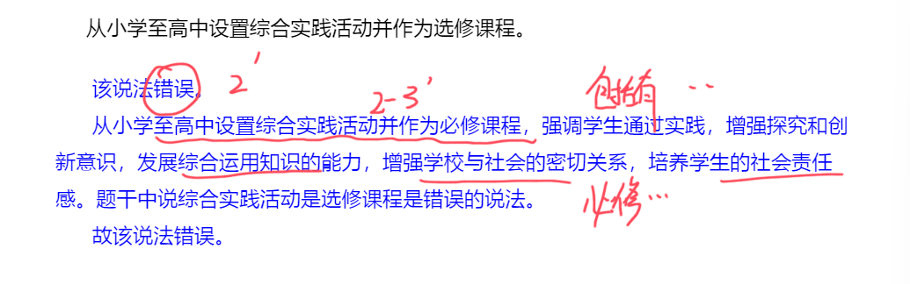
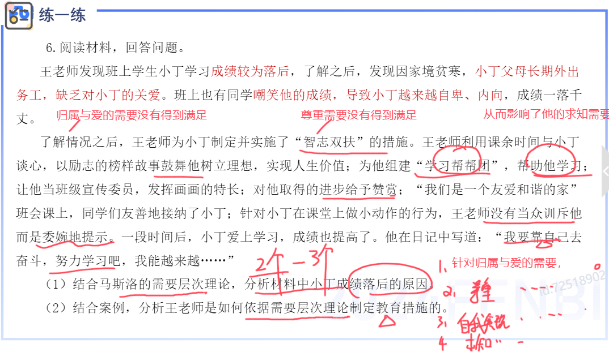

- [辨析题](#辨析题)
  - [考察特点及评分标准](#考察特点及评分标准)
    - [考察特点](#考察特点)
    - [评分标准](#评分标准)
  - [考察类型及作答方法](#考察类型及作答方法)
    - [概念混淆型](#概念混淆型)
    - [概念释义型](#概念释义型)
    - [理论关系型](#理论关系型)
    - [正误混合型](#正误混合型)
  - [答题思路](#答题思路)
  - [示例题](#示例题)
    - [教育的社会属性](#教育的社会属性)
    - [政治经济制度与教育的关系](#政治经济制度与教育的关系)
    - [影响人身心发展的因素](#影响人身心发展的因素)
    - [新课程改革的课程结构](#新课程改革的课程结构)
    - [教学过程的基本规律](#教学过程的基本规律)
    - [教学方法](#教学方法)
    - [学习动机与效率的关系](#学习动机与效率的关系)
    - [学习迁移的分类](#学习迁移的分类)
    - [个别差异与因材施教](#个别差异与因材施教)
    - [气质](#气质)
    - [群体的分类](#群体的分类)
  - [总结](#总结)
- [材料分析](#材料分析)
  - [考察特点及评分标准](#考察特点及评分标准-1)
    - [考察特点](#考察特点-1)
    - [评分标准](#评分标准-1)
  - [考题类型及做题方法](#考题类型及做题方法)
    - [考题类型](#考题类型)
      - [考点明确类](#考点明确类)
      - [考点不明确类](#考点不明确类)
    - [作答方法](#作答方法)
  - [示例题](#示例题-1)
    - [教学原则](#教学原则)
      - [示例](#示例)
      - [练一练](#练一练)
      - [模板](#模板)
    - [德育原则](#德育原则)
      - [示例](#示例-1)
      - [模板](#模板-1)
    - [德育方法](#德育方法)
      - [示例](#示例-2)
      - [模板](#模板-2)
    - [班主任的个别教育工作](#班主任的个别教育工作)
      - [示例](#示例-3)
    - [备考指南](#备考指南)
    - [需要层次理论](#需要层次理论)
      - [示例](#示例-4)
    - [学习动机](#学习动机)
      - [示例](#示例-5)
    - [气质类型](#气质类型)
      - [示例](#示例-6)
    - [中学生心理辅导](#中学生心理辅导)
      - [示例](#示例-7)
  - [技巧详解](#技巧详解)
    - [影响因素类](#影响因素类)
    - [措施建议类](#措施建议类)
  - [考点汇总](#考点汇总)
  - [答题——小提示](#答题小提示)

# 辨析题

## 考察特点及评分标准

### 考察特点

### 评分标准

> 注意事项

## 考察类型及作答方法

### 概念混淆型

### 概念释义型

### 理论关系型

### 正误混合型

## 答题思路

## 示例题

### 教育的社会属性

### 政治经济制度与教育的关系

### 影响人身心发展的因素

### 新课程改革的课程结构

### 教学过程的基本规律

<mark>mark 背</mark>

### 教学方法

### 学习动机与效率的关系

### 学习迁移的分类

### 个别差异与因材施教

### 气质

### 群体的分类

## 总结

# 材料分析

## 考察特点及评分标准

### 考察特点

### 评分标准

## 考题类型及做题方法

### 考题类型

#### 考点明确类

#### 考点不明确类

### 作答方法

## 示例题

### 教学原则

#### 示例

#### 练一练

#### 模板

### 德育原则

#### 示例

#### 模板

### 德育方法

#### 示例

#### 模板

### 班主任的个别教育工作

#### 示例

### 备考指南

### 需要层次理论

#### 示例

### 学习动机

#### 示例

### 气质类型

#### 示例

### 中学生心理辅导

#### 示例

## 技巧详解

### 影响因素类

### 措施建议类

## 考点汇总

## 答题——小提示

