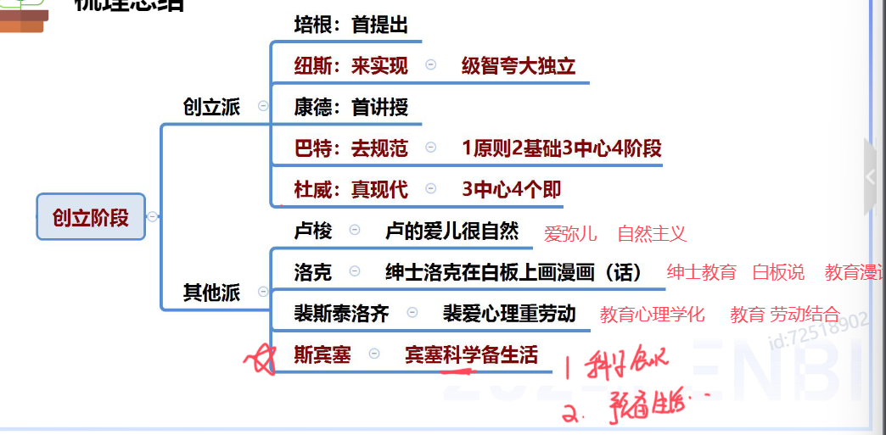

####学校教育

# 答题思路

## 1. 辨析题

> 总——分——总

1. 判断正确/错误

2. 提炼关键词，展开解释

3. 总结，回扣观点

## 2. 简单题

1. **按条写**，有条理，顺序可变。

2. 言简意赅，**不需长篇论述**。

3. 关键词和**沾边**的词都得分。

4. 遇到没有背过的，**不能空**，条理清晰、写满。

# 一、教育基础知识

## 1. 教育的产生与发展

### 教育的含义

1. “教育”一词的由来
   
   “教育”一词最早见于《孟子·尽心上》“得天下英才而教育之”

### 教育的概念

- 广义:（家校社）
  教育**三合力**”，包括**社会教育、学校教育(主导)和家庭**教育。**泛指一切**增进人的知识和技能、发展人的智力和体力、影响人的思想和品德的活动。

- 狭义:
  **学校教育**，是教育者根据一定的社会要求，**有目的、有计划、有组织**地对受教育者施加影响，把他们培养成一定社会所需要的人的活动。

### 教育的属性

1. 本质属性
   
   
   
   <mark>教育是一种**有目的**培养**人**的**社会活动（后天）**</mark>(非偶然、非动物、非本能)
   
   - 区别于其他事物现象的根本特征
   
   - 教育的质的规定性

2. 社会属性
   
   
   
   1. 永恒性:人在教育在
   
   2. 历史性:古今不同
   
   3. 继承性:古今相同
   
   4. 长期性:人才培养周期长
   
   5. 相对独立性:自身规律、不平衡
      
      （受到政治经济文化的影响，可能超前/滞后）
   
   6. 生产性:潜在的投资

3. 教育的功能
   
   
   
   1. 作用对象
      
      
      
      1. 个体发展功能（本体功能）
         
         1. 个体个性化
         
         2. 个体社会化（自然人——社会人）
      
      2. 社会发展功能（派生功能）
         
         1. 变迁（宏观/大范围）。政治经济文化等
         
         2. 流动（小范围）。区域和职业
   
   2. 性质
      
      1. 正向功能：积极促进
      
      2. 负面功能：消极阻碍
   
   3. 呈现形式（是否有计划）
      
      1. 显性功能：计划内
      
      2. 隐性功能：计划外

4. 教育的发展
   
   
   
   1. 原始社会（简单、无阶级、公平）
   
   2. 古代社会
      
      
      
      1. 奴隶社会
         
         - 最早的教育学校——夏庠
         
         - 六艺——**礼乐**射御书数（礼仪、音乐/舞蹈、射箭、驾驭马车、写字、数学）
         
         
      
      2. 封建社会
         
         - 四书（孟中大论）
         
         - 五经（诗书礼易春秋）
         
         
      
      3. 西方
         
         
      
      4. 总体特征
         
         <mark>口诀：劳教脱离有阶级</mark>
         
         

### 总结

## 2. 教育学的产生与发展

### 教育学的发展

#### 萌芽阶段

  

#### 创立阶段

<mark>口诀</mark>

1. 培根首提出

2. 纽斯来实现

3. 康德首讲授

4. 巴特来规范  

5. 杜威真现代 
   
   

#### 发展阶段

## 3. 教育与社会发展

> 大环境

### 生产力与教育的关系

- 生产力对教育的制约作用--**决定教育发展水平
  
  1. 决定教育的**速度和规模**
  
  2. 制约着人才培养的规格和教育**结构**
  
  3. 制约着教学的内容、方法、组织形式和手段

. 教育对生产力的反作用--经济功能

1. 劳动力再生产的**基本途径**

2. 科学知识再生产的最有效形式

3. 进行技术创新的一个重要手段

### 社会政治经济制度与教育的关系

- 社会政治经济制度对教育的制约（五个决定）关键词：国家、人民、政治、统治阶级
  
  1. 社会政治经济制度的性质决定着教育的**性质**
  
  2. 社会政治经济制度决定教育的宗旨与**目的**
  
  3. 社会政治经济制度决定教育的**领导权**
  
  4. 社会政治经济制度决定**受教育权**
  
  5. 社会政治经济制度决定着教育**内容**和教育管理**体制**

. 教育对政治经济制度的影响作用一**政治功能**

1. 教育培养出政治经济制度所需要的人才一**主要途径**

2. 教育促进政治民主化

3. 宣传统治阶级的思想意识，创造社会舆论

4. 传播一定的社会政治意识形态，完成年轻一代的政治社会化

### 文化与教育的关系

- 文化对教育的制约（都是影响、而不是决定）
  
  1. 对教育具有价值定向作用
  
  2. 影响教育教学方法的应用
  
  3. 影响教育环境与教育模式
  
  4. 影响教育的内容与水平
  
  5. 影响教育目的的确立

. 教育对文化的作用——文化功能
  
  . 传递、保存文化(传承)
  
  . 传播、交流文化
  
  . 选择、提升文化(选取)
  
  . 更新、创造文化(创新)

## 4. 教育与人发展

### 个体身心发展的一般规律

#### 顺序性

1. 循序渐进

2. 顺序不可跨越

3. 方向不可逆

#### 阶段性

1. 分阶段学

2. 针对每个阶段的特点

#### 阶段性VS顺序性

#### 不平衡性

1. 同一方面不同速

2. 不同方面不同步

3. 抓关键期

#### 不平衡性VS阶段性

#### 互补性

1. 扬长避短

#### 个别差异性

1. 因材施教

#### 总结

### 影响人身心发展的因素

> mark重点

#### 遗传（先天）

1. 生理前提/基础、可能性

2. 具有可塑性

#### 环境（外在）

1. 为个体的发展提供了**多种可能**

2. 使遗传提供的发展可能性**变成现实**

#### 学校教育

 

1. 主导作用

2. 起主导作用的原因、表现

#### 个体主观能动

1. **决定**性因素(只有这里是决定)

2. 内在动力

#### 辨析题

#### 总结

