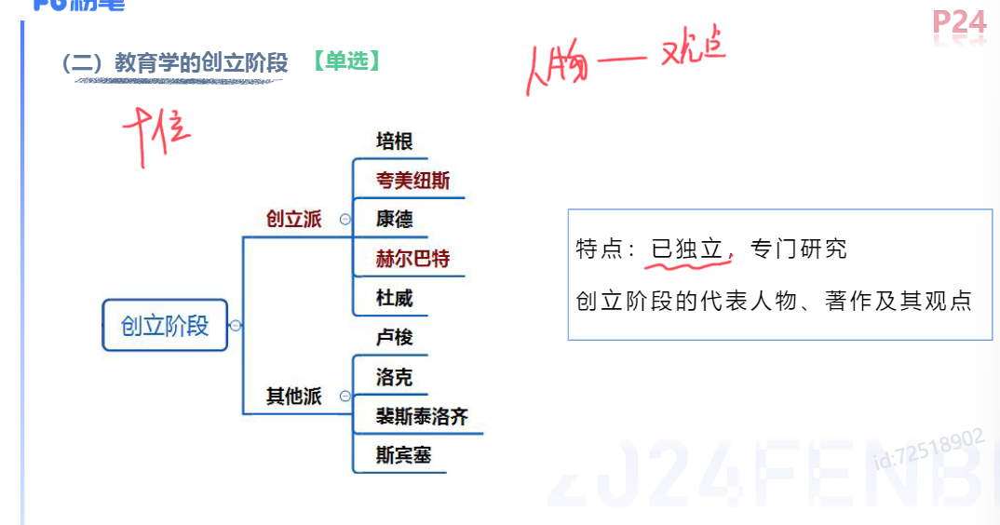
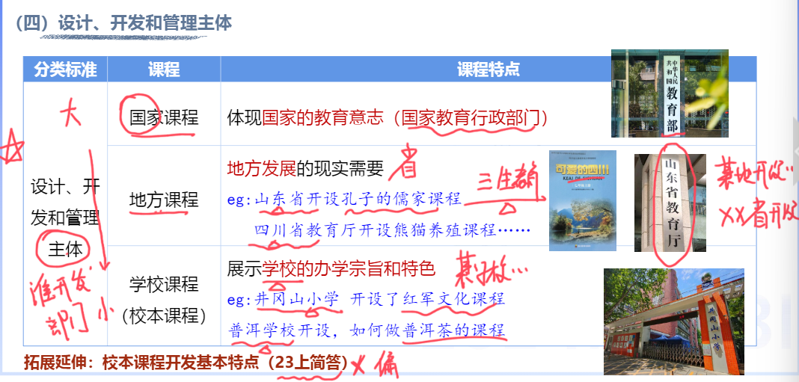
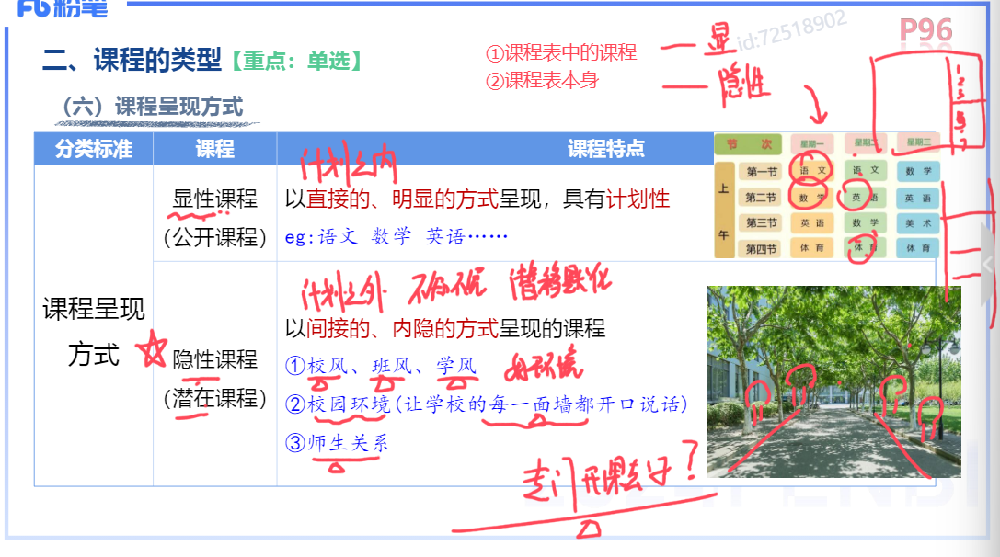

- [答题思路](#答题思路)
  - [1. 辨析题](#1-辨析题)
  - [2. 简答题](#2-简答题)
  - [3. 重要简答题背诵目录](#3-重要简答题背诵目录)
- [一、教育基础知识](#一教育基础知识)
  - [1. 教育的产生与发展](#1-教育的产生与发展)
    - [教育的含义](#教育的含义)
    - [教育的概念](#教育的概念)
    - [教育的属性](#教育的属性)
    - [总结](#总结)
  - [2. 教育学的产生与发展](#2-教育学的产生与发展)
    - [教育学的发展](#教育学的发展)
      - [萌芽阶段](#萌芽阶段)
      - [创立阶段](#创立阶段)
      - [发展阶段](#发展阶段)
  - [3. 教育与社会发展](#3-教育与社会发展)
    - [生产力与教育的关系](#生产力与教育的关系)
    - [社会政治经济制度与教育的关系](#社会政治经济制度与教育的关系)
    - [文化与教育的关系](#文化与教育的关系)
  - [4. 教育与人发展](#4-教育与人发展)
    - [个体身心发展的一般规律](#个体身心发展的一般规律)
      - [顺序性](#顺序性)
      - [阶段性](#阶段性)
      - [阶段性VS顺序性](#阶段性vs顺序性)
      - [不平衡性](#不平衡性)
      - [不平衡性VS阶段性](#不平衡性vs阶段性)
      - [互补性](#互补性)
      - [个别差异性](#个别差异性)
      - [总结](#总结-1)
    - [影响人身心发展的因素](#影响人身心发展的因素)
      - [遗传（先天）](#遗传先天)
      - [环境（外在）](#环境外在)
      - [学校教育](#学校教育)
      - [个体主观能动](#个体主观能动)
      - [辨析题](#辨析题)
      - [总结](#总结-2)
- [二、课程分类](#二课程分类)
  - [1. 课程概述](#1-课程概述)
    - [课程类型](#课程类型)
      - [按照内容属性划分](#按照内容属性划分)
      - [按照组织方式划分](#按照组织方式划分)
      - [按照实施要求划分](#按照实施要求划分)
      - [设计、开发和管理主体](#设计开发和管理主体)
      - [课程呈现方式](#课程呈现方式)
      - [古德莱德的划分](#古德莱德的划分)
      - [课程任务](#课程任务)
      - [口诀](#口诀)
    - [课程理论流派](#课程理论流派)
  - [2. 课程组织](#2-课程组织)
  - [3. 我国基础教育新课程改革](#3-我国基础教育新课程改革)
    - [新课程改革的具体目标](#新课程改革的具体目标)
      - [简答](#简答)
    - [新课程改革的课程结构](#新课程改革的课程结构)
    - [总结](#总结-3)
- [三、教学原则及方法](#三教学原则及方法)
  - [教学原则](#教学原则)
    - [直观性原则](#直观性原则)
    - [启发性原则](#启发性原则)
    - [循序渐进原则（系统性原则）](#循序渐进原则系统性原则)
    - [巩固性原则](#巩固性原则)
    - [量力性原则](#量力性原则)
    - [思想性（教育性）和科学性相统一原则](#思想性教育性和科学性相统一原则)
    - [理论联系实际原则](#理论联系实际原则)
    - [因材施教原则](#因材施教原则)
    - [伦理性原则](#伦理性原则)
    - [总结](#总结-4)
    - [材料分析题](#材料分析题)
  - [中小学常用的教学方法](#中小学常用的教学方法)
    - [语言传递](#语言传递)
      - [讲授法](#讲授法)
      - [谈话法](#谈话法)
      - [讨论法](#讨论法)
      - [读书指导法](#读书指导法)
    - [直观感知](#直观感知)
      - [演示法](#演示法)
      - [参观法](#参观法)
    - [实际训练](#实际训练)
      - [练习法](#练习法)
      - [实验法](#实验法)
      - [实习作业法](#实习作业法)
      - [实践活动法](#实践活动法)
    - [情感陶冶](#情感陶冶)
      - [欣赏教学法](#欣赏教学法)
      - [情景教学法](#情景教学法)
    - [总结](#总结-5)
    - [材料分析题](#材料分析题-1)
- [四、中学生学习心理](#四中学生学习心理)
  - [1. 学习动机](#1-学习动机)
    - [学习动机的分类](#学习动机的分类)
      - [一般分类](#一般分类)
      - [奥苏贝尔成就动机的分类](#奥苏贝尔成就动机的分类)
    - [学习动机与学习效率的相互作用](#学习动机与学习效率的相互作用)
      - [简答](#简答-1)
      - [辨析](#辨析)
    - [学习动机理论](#学习动机理论)
      - [强化理论](#强化理论)
      - [需求层次理论](#需求层次理论)
        - [简答](#简答-2)
      - [成就动机理论](#成就动机理论)
      - [成败归因理论](#成败归因理论)
      - [自我效能感理论](#自我效能感理论)
  - [2. 学习迁移](#2-学习迁移)
  - [3. 学习策略](#3-学习策略)

---

# 答题思路

## 1. 辨析题

> 总——分——总

1. 判断正确/错误

2. 提炼关键词，展开解释

3. 总结，回扣观点

## 2. 简答题

## 3. 重要简答题背诵目录

1. **按条写**，有条理，顺序可变。

2. 言简意赅，**不需长篇论述**。

3. 关键词和**沾边**的词都得分。

4. 遇到没有背过的，**不能空**，条理清晰、写满。

# 一、教育基础知识

## 1. 教育的产生与发展

### 教育的含义

1. “教育”一词的由来
   
   “教育”一词最早见于《孟子·尽心上》“得天下英才而教育之”

### 教育的概念

- 广义:（家校社）
  教育**三合力**”，包括**社会教育、学校教育(主导)和家庭**教育。**泛指一切**增进人的知识和技能、发展人的智力和体力、影响人的思想和品德的活动。

- 狭义:
  **学校教育**，是教育者根据一定的社会要求，**有目的、有计划、有组织**地对受教育者施加影响，把他们培养成一定社会所需要的人的活动。

### 教育的属性

1. 本质属性
   
   
   
   <mark>教育是一种**有目的**培养**人**的**社会活动（后天）**</mark>(非偶然、非动物、非本能)
   
   - 区别于其他事物现象的根本特征
   
   - 教育的质的规定性

2. 社会属性
   
   
   
   1. 永恒性:人在教育在
   
   2. 历史性:古今不同
   
   3. 继承性:古今相同
   
   4. 长期性:人才培养周期长
   
   5. 相对独立性:自身规律、不平衡
      
      （受到政治经济文化的影响，可能超前/滞后）
   
   6. 生产性:潜在的投资

3. 教育的功能
   
   
   
   1. 作用对象
      
      
      
      1. 个体发展功能（本体功能）
         
         1. 个体个性化
         
         2. 个体社会化（自然人——社会人）
      
      2. 社会发展功能（派生功能）
         
         1. 变迁（宏观/大范围）。政治经济文化等
         
         2. 流动（小范围）。区域和职业
   
   2. 性质
      
      1. 正向功能：积极促进
      
      2. 负面功能：消极阻碍
   
   3. 呈现形式（是否有计划）
      
      1. 显性功能：计划内
      
      2. 隐性功能：计划外

4. 教育的发展
   
   
   
   1. 原始社会（简单、无阶级、公平）
   
   2. 古代社会
      
      
      
      1. 奴隶社会
         
         - 最早的教育学校——夏庠
         
         - 六艺——**礼乐**射御书数（礼仪、音乐/舞蹈、射箭、驾驭马车、写字、数学）
         
         
      
      2. 封建社会
         
         - 四书（孟中大论）
         
         - 五经（诗书礼易春秋）
         
         
      
      3. 西方
         
         
      
      4. 总体特征
         
         <mark>口诀：劳教脱离有阶级</mark>
         
         

### 总结

## 2. 教育学的产生与发展

### 教育学的发展

#### 萌芽阶段

  

#### 创立阶段

<mark>口诀</mark>

1. 培根首提出

2. 纽斯来实现

3. 康德首讲授

4. 巴特来规范  

5. 杜威真现代 
   
   

#### 发展阶段

## 3. 教育与社会发展

> 大环境

### 生产力与教育的关系

- 生产力对教育的制约作用--**决定教育发展水平
  
  1. 决定教育的**速度和规模**
  
  2. 制约着人才培养的规格和教育**结构**
  
  3. 制约着教学的内容、方法、组织形式和手段

. 教育对生产力的反作用--经济功能

1. 劳动力再生产的**基本途径**

2. 科学知识再生产的最有效形式

3. 进行技术创新的一个重要手段

### 社会政治经济制度与教育的关系

- 社会政治经济制度对教育的制约（五个决定）关键词：国家、人民、政治、统治阶级
  
  1. 社会政治经济制度的性质决定着教育的**性质**
  
  2. 社会政治经济制度决定教育的宗旨与**目的**
  
  3. 社会政治经济制度决定教育的**领导权**
  
  4. 社会政治经济制度决定**受教育权**
  
  5. 社会政治经济制度决定着教育**内容**和教育管理**体制**

. 教育对政治经济制度的影响作用一**政治功能**

1. 教育培养出政治经济制度所需要的人才一**主要途径**

2. 教育促进政治民主化

3. 宣传统治阶级的思想意识，创造社会舆论

4. 传播一定的社会政治意识形态，完成年轻一代的政治社会化

### 文化与教育的关系

- 文化对教育的制约（都是影响、而不是决定）
  
  1. 对教育具有价值定向作用
  
  2. 影响教育教学方法的应用
  
  3. 影响教育环境与教育模式
  
  4. 影响教育的内容与水平
  
  5. 影响教育目的的确立

. 教育对文化的作用——文化功能

  . 传递、保存文化(传承)

  . 传播、交流文化

  . 选择、提升文化(选取)

  . 更新、创造文化(创新)

## 4. 教育与人发展

### 个体身心发展的一般规律

#### 顺序性

1. 循序渐进

2. 顺序不可跨越

3. 方向不可逆

#### 阶段性

1. 分阶段学

2. 针对每个阶段的特点

#### 阶段性VS顺序性

#### 不平衡性

1. 同一方面不同速

2. 不同方面不同步

3. 抓关键期

#### 不平衡性VS阶段性

#### 互补性

1. 扬长避短

#### 个别差异性

1. 因材施教

#### 总结

### 影响人身心发展的因素

> mark重点

#### 遗传（先天）

1. 生理前提/基础、可能性

2. 具有可塑性

#### 环境（外在）

1. 为个体的发展提供了**多种可能**

2. 使遗传提供的发展可能性**变成现实**

#### 学校教育

 

1. 主导作用

2. 起主导作用的原因、表现

#### 个体主观能动

1. **决定**性因素(只有这里是决定)

2. 内在动力

#### 辨析题

#### 总结

# 二、课程分类

## 1. 课程概述

### 课程类型

#### 按照内容属性划分

#### 按照组织方式划分

#### 按照实施要求划分

#### 设计、开发和管理主体

#### 课程呈现方式

#### 古德莱德的划分

#### 课程任务

#### 口诀

### 课程理论流派

- 学科中心课程(赫尔巴特、布鲁纳)

  1. **知识是课程**的以为核心
  2. **学校课程以学科**分类为基础
  3. 主张**分科**教学
  4. **学科基本结构**的掌握为目标
  5. 学科专家在课程开发起重要作用
  - **结构主义课程论--布鲁纳**
- 活动中心课程(杜威)
   1. 以**儿童活动**为中心(做中学)
   2. 考虑儿童的**需要和兴趣**
   3. 课程组织应**心理学化**
- 社会中心课程
  1. 社会问题为中心

## 2. 课程组织

## 3. 我国基础教育新课程改革
### 新课程改革的具体目标

#### 简答

### 新课程改革的课程结构

### 总结

# 三、教学原则及方法
## 教学原则
### 直观性原则
- 正确选择直观教具和现代化教学手段
- 直观与讲解结合
- 重视运用语言直观
- 要防止直观不当与滥用

### 启发性原则

### 循序渐进原则（系统性原则）
- 教师的教学要有系统性
- 注意主要矛盾，解决好重点与难点的教学。
- 按照学生的认识顺序，由浅入深、由易到难地进行教学
- 将系统连贯性与灵活多样性结合起来。

### 巩固性原则

### 量力性原则

### 思想性（教育性）和科学性相统一原则

- 确保教学的科学性。
- 发掘教材的思想性，注意在教学中对学生进行品德教育
- 重视补充有价值的资料、事例和录像。
- 教师要不断提高自己的专业水平和思想修养。

### 理论联系实际原则
- 书本知识的教学要注重联系实
- 重视培养学生运用知识的能力
- 正确处理知识教学与技能训练的关系
- 补充必要的乡土教材

### 因材施教原则

### 伦理性原则

### 总结

### 材料分析题

## 中小学常用的教学方法

1. 语言传递:讲授法、谈话法、讨论法、读书指导法
2. 直观感知:演示法、参观法
3. 实际训练:练习法、实验法、实习作业法、实践活动法
4. 情感陶冶:欣赏教学法、情景教学法

### 语言传递
#### 讲授法
1. 讲授内容要有科学性、系统性、思想性
2. 注意启发
3. 讲究语言艺术
4. 要组织学生听讲

#### 谈话法
> 师问生答

1. 做好提问准备。要准备好问题和谈话计划。
2. 提出的问题要明确，能引起思维兴奋，即富有挑战性和启发性。
3. 要善于启发诱导
4. 要做好归纳、小结

#### 讨论法
> 生生讨论

#### 读书指导法

### 直观感知
#### 演示法
> 师做生看

#### 参观法
> 实地

### 实际训练
#### 练习法

#### 实验法
> 学生做

#### 实习作业法
1. 练习法是为了巩固知识
2. 实习作业法师运用所学的知识在真实场景实际操作
3. 实验法运用仪器设备

#### 实践活动法
> 社会实践、公益性

### 情感陶冶

#### 欣赏教学法

#### 情景教学法

### 总结

1. 背模板
   1. 做好...的准备，明确目的、制定计划
   2. 做好...指导、合理安排、积极思考、启发诱导
   3. 做好...的总结、小结、归纳
2. 讲授法需要单独背诵

### 材料分析题

# 四、中学生学习心理
## 1. 学习动机
### 学习动机的分类
#### 一般分类
1. 动力来源
  - 内部动机:内在需要、好奇心、求知欲、学习兴趣
  - 外部动机:外部诱因，外部奖励
2. 社会意义
   - 高尚动机:利他主义，国家、社会
   - 低级动机:利已主义，自己的利益
3. 与学习活动的远近关系
   - 远景动机:长远目标，未来、将来、以后
   - 近景动机:近期目标，当下、现在 
4. 与学习活动的关系
   - 直接动机:学习活动本身，直接兴趣和爱好
   - 间接动机:社会意义、父母意愿、教师期望

#### 奥苏贝尔成就动机的分类

### 学习动机与学习效率的相互作用
<mark>mark 背</mark>

#### 简答

#### 辨析

### 学习动机理论

#### 强化理论

#### 需求层次理论

##### 简答

#### 成就动机理论
// TOOD

#### 成败归因理论

#### 自我效能感理论

## 2. 学习迁移
## 3. 学习策略