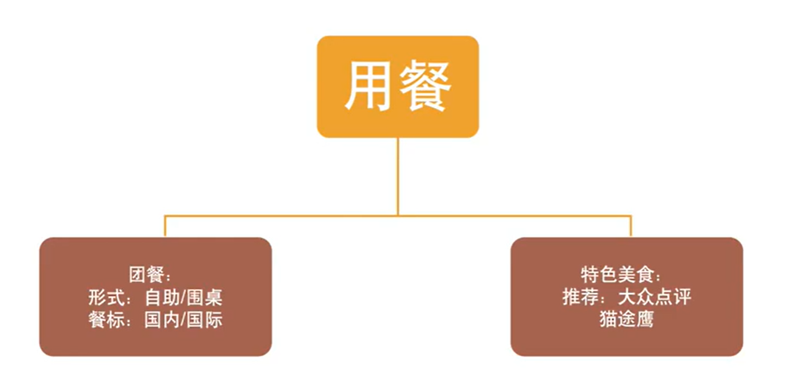

# 日程

## 第一天

欢迎大家参加第一天的培训
好的开始是成功的一半，只要行动，就一定会有收获，祝大家满载而归！
今日2个课程：一是：抢单理论及成团技巧，二是：绘制地图
温馨提示：培训前大家准备好纸笔做笔记，带着这几个问题去听视频录音：
①旅游定制师是做什么的？
②优先接什么样的订单？应该关注哪些标签？
③想要客户选择你的方案，有哪7个技巧（规范流程7要素）
④为什么要绘制地图？
⑤如何绘制地图？
课程链接一： [新途旅行社内部培训资料-初识定制游-教育-高清完整正版视频在线观看-优酷](https://v.youku.com/v_show/id_XNjM3ODcyMzg4MA==.html) 密码：XINTU666
课程链接二： [新途旅行社内部培训资料-如何绘制地图-教育-高清完整正版视频在线观看-优酷](https://v.youku.com/v_show/id_XNjM4NjU5OTk1Ng==.html) 密码：DTHZ0406
考核链接（次日09：00前提交）：https://www.wjx.cn/vm/mD0YKxZ.aspx

今日培训学习建议：
1，阅读并记录考核问题题目
2，带着考核问题看1-2遍培训视频
3，完成考核题目并进行提交
4，通过地图了解江浙沪区域
5，百度百科学习江浙沪基本情况
6，完成今日作业并进行提交

附1：参考地图：标准地图服务网[http://bzdt.ch.mnr.gov.cn/](http://bzdt.ch.mnr.gov.cn/) 附2：考核提交截止次日9：00
附3：请大家合理安排时间，按照要求进行考核及作业提交

（此信息无需回复）@所有人

### Q&A

①旅游定制师是做什么的？

给客户做定制化旅游服务的

②优先接什么样的订单？应该关注哪些标签？

六个字 `走不走、值不值`。

1、 备注
2、 出行人员
3、 出发地
4、 往返
5、 评分

③想要客户选择你的方案，有哪7个技巧（规范流程7要素）

1、 第一抢单

2、 首呼

3、 im

4、 方案

5、 报价

6、 回访

7、 及时响应

④为什么要绘制地图？

目的地整体印象

⑤如何绘制地图？

看详情

## 第二天

相信经过昨天的培训，小伙伴们对旅游定制都有了新的认识，那么就让我们趁热打铁，开启第二天的课程，好记性不如烂笔头，记得一定做好笔记哟！
今日课程：一是方案构架，二是地接知识
接下来让我们带着下面六个问题开始今天的学习：

课程链接一：https://v.youku.com/v_show/id_XNjM4NTA5NTU4NA==.html
密码：FAGJ0406
课程链接二：https://v.youku.com/v_show/id_XNjM4MDU3NjA1Ng==.html
密码：QYDJ0407

作业链接（次日09：00前完成）：https://www.wjx.cn/vm/Q02tdUw.aspx
（请使用以下Excel空白模板完成今日作业并上传）@所有人 此消息无需回复

### Q&A

1.方案构架的目标是什么？

让客户满意，满足客户需求，满足盈利

2.方案构架的原则是什么？

- 符合客户需求

- 报价低

- 保障利润

3.通过哪些调整来降低方案成本？

推荐美食，不包餐食；用车只接送或者只负责部分接送；导游配置；日游选择；

4.方案构架的三个内容？

机票；酒店；地接
5.方案构思过程中酒店要考虑哪些因素？
星级标准、位置、特色、地段、景点距离等

6.在和客户沟通的过程中，客户有了明确的时间，为什么要问客户是否可以更改出行时间？

确保出行安排，看能否协调减少成本等。

7、地接里面包含哪些内容？

车队、导游、酒店、用餐、景点、特色体验。

8、安排餐要注意什么？

成本、口味、特色、最好搭配导游。体验才能好。

9、用车表是成本价还是对外报价？

成本价

### 检查

## 第三天

今日课程：对客话术（首呼）
课程资源：对客话术规范
https://appzjgmq7x05705.h5.xiaoeknow.com/p/course/video/v_5e6660877f7e3_kndV8376?app_id=appzjgmq7X05705&available=1&cacheclean=1616111325469&entry=2&entry_type=2002&share_user_id=u_64008d2b42a0f_rGUwcQU8Pq&share_type=5&scene=%E5%88%86%E4%BA%AB
首呼话术培训
https://docs.qq.com/slide/DZm5Bc2tLVmpNR1dZ

考核链接：https://www.wjx.cn/vm/eDVAREY.aspx

# 基础概念

## 旅游形态

### 四种形态

### 区别

## 工作流程

### 私家团

### 定制师

## 抢单理论

1. 备注作为第一权重，出行意愿最强烈

2. 有老人、儿童出行概率更高。孩童更想要一些体验类的项目=。

3. 熟悉出发地和目的地情况，天气气候

4. 往返时间，可以获悉淡旺季对价格影响等。以及当地特色。

什么信息都没有，称作三五单，这种是不好判断的

1. 尽可能抢人数多的单子

2. 把多个目的地方案做给客户。

3. 找尽可能近的单，变数比较少。

## 前期准备

### 1. 成单因素

1. 手绘点线面图(熟悉目的地)
   
   1. 目的地整体情况和印象
   
   2. 标注景点
      
      1. 景点游玩时间
      
      2. 景点活动信息
      
      3. 景点之间的距离
      
      4. 出行方式、出行时间
      
      5. 

2. 了解机酒价格
   
   1. 比如飞天津便宜，飞北京贵，可以看看飞天津再包车去北京。
   
   2. 酒店差异，以及一些特殊化的东西。比如私人沙滩，早茶，酒店位置等

3. 建资源库
   
   1. 整理已经做过的方案
   
   2. 以及一些联系渠道等。

### 2. 规范化流程

1. 首呼
   
   1. 介绍清楚自己是谁，账号是什么

2. im沟通
   
   1. 在哪里沟通，
   
   2. 账号名称

3. 发方案
   
   1. 从完整方案中做减法和筛选

4. 报价
   
   1. 保证利润情况下最低点

5. 定期回访
   
   1. 做好前三次回访

6. IM响应
   
   1. 及时响应

### 3. 职业素养

1. 渠道
   
   1. 小红书
   
   2. 马蜂窝
   
   3. 百度
   
   4. 组长分享

# 地图绘制

1. 如何绘制地图
   
   1. 打开作业模板链接
   
   2. 百度/谷歌/兰图绘搜索区域地图，绘制区域轮廓
      
      1. 搜索xx省地图
      
      2. 根据地图上的轮廓描绘一下
      
      3. 搜索哈尔冰区域划分地图
      
      4. 在轮廓上画出主要的景点区
         
         
   
   3. 在地图中找到景点位置，并标注
      
      1. 使用蓝图绘或其它工具
      
      2. 搜索景点，找到目标景点向外扩散
      
      3. 找到附近景区的中心点，然后把附近的景点画出来（标记不同天的路线）
         
         
   
   4. 根据作业模板内行程安排，将景点连线

# 方案架构

1. 主体

2. 提纲

3. 内容

## 基本原则

1. 符合客户需求
   
   1. 了解清楚客户的需求

2. 报价低
   
   1. 压缩成本，并不是牺牲利润
   
   2. 可以调整航班或者路线等的方式，使价格看起来更低。
   
   3. 比如去海岛可能就是想去海边放松，可以设置自由活动

3. 保障利润
   
   1. 如果利润不够，发生意外风险时不愿意处理。

## 构思

1. 具体内容
   
   1. 根据实际调整，比如有老人就不要安排太满，劳逸结合
   
   2. 有儿童，需要注意作息时间，增长见识的景点

2. 时间轴

### 具体内容

1. 机票/高铁
   
   1. 区域选择，考虑酒店/机票/渠道/时间等因素
   
   2. 机票时间。不同时间
   
   3. 机票渠道。携程、航司

2. 酒店
   
   1. 等级。对于五星级是当地五星还是国际五星，以及价格
   2. 位置。接受的通行
   3. 房型。

3. 地接
   
   1. 餐标。推荐美食
   2. 服务费。
   3. 用车。预算低可以只送某程什么的
   4. 导游。掐头去尾，搭配一些特色。
   5. 景点。要沟通什么地区
   6. 日游。可以拼行程，降低费用。

### 前提

1. 熟悉目的地
   
   1. 划地图，熟悉整体规划，可以把相关的景点关联一起，可以一起去的。

2. 熟悉成本
   
   1. 比如机票什么的，酒店成本等。
   
   2. 淡旺季的价格。

3. 用心

# 区域地接

1. 注意座位

2. 价格和时间安排

3. 一般都是10小时时限

1. 景区导游和线路导游。线路导游更整体市区一些

1. 含餐一定要有导游，不然就推荐客户

2. 国内用大众点评，国际用猫头鹰

、马蜂窝也能了解

1. 区域

2. 时间点

3. 要注意日游的内容，接送范围等。

# 首呼话术

## 语言工程

1. 合适的语言和词汇

2. 一致的语言风格

3. 创建推荐用语
   
   1. 什么词语在什么场合适合
   
   2. 在什么场合不适合用

## 首呼概念及目的

概念:接单后与客户的首次电话沟通

1. 确认信息。确认客户个人信息，深入挖据出游目的以及出游需求

2. 赢得信任。通过专业的业务知识和优秀的沟通能力为客户答疑解惑，赢得客户信任

3. 形象塑造。给客户留下良好的第一印象，便于客户关系的维护

### 通话技巧

### 话术原则

### 首呼内容

### 沟通回复

## 具体说明

### 知识储备

1. 熟悉目的地

2. 熟悉成本

3. 了解当地酒店等级、价格

4. 熟悉当地常见的景点

5. 熟悉高铁站等位置

### 首呼前准备

1. 抢首呼

2. 20分钟内发方案

3. 3天2次回访

### 话术

#### 开头

情形外情况

#### 内容

- 出行人员
  
  1. 时间
  
  2. 人数
  
  3. 人员关系、成分
  
  4. 是否有老人以及身体状况
  
  5. 是否有儿童年龄和身高

- 出行要求
  
  1. 交通方式
  
  2. 大交通预算

- 住宿要求
  
  1. 酒店要求
  
  2. 时间安排

- 客户需求
  
  1. 具体景点
  
  2. 美食推荐
  
  3. 打卡店铺

- 出行
  
  1. 导游要求

- 预算
  
  1. 总预算询问

#### 结束

### Im留言

### 沟通方案

