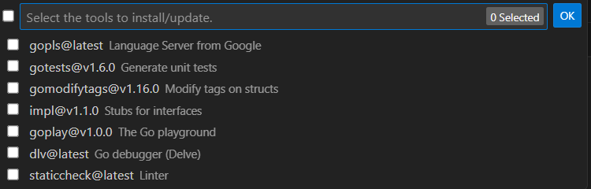

[TOC]

---

# 安装

> https://go.dev/dl/

## win10

1. 下载go版本到本地
   
   

2. 安装后，将安装路径\bin 添加到环境变量path即可

3. 验证go 是否安装成功
   
   ```shell
   go -version
   ```

4. `GOPATH`是Go语言的工作目录。执行安装的全局包路径
   
   > https://go.dev/wiki/SettingGOPATH
   
   ```shell
   # win
   GOPATH=D:\dev\go\local
   ```
   
   go env -w GOPATH=$HOME/go

```
# 配置

## vscode 推荐安装

1. 在vscode 环境安装 go 插件

 

2. 安装 go 插件需要的 go tools。 `Ctrl+Shift+P` 调用命令面板。输入 `go install tools`




3. 国内安装失败，无法访问国外网站

 ```shell
 golang.org/x/tools/gopls@latest: module golang.org/x/tools/gopls: Get \"https://proxy.golang.org/golang.org/x/tools/gopls/@v/list\": dial tcp 142.250.217.81:443: connectex: A connection attempt failed because the connected party did not properly respond after a period of time, or established connection failed because connected host has failed to respond.
```

 解决办法：

1. 使用代理翻墙

2. 使用代理网站 `goproxy.cn`
   
   ```shell
   go env -w GOPROXY=goproxy.cn 
   ```

3. 清空缓存
   
   ```shell
   go clean --modcache
   ```

4. gopls
   
   ```shell
   go install -v golang.org/x/tools/gopls@latest
   ```

5. goimports
   
   ```shell
   go install golang.org/x/tools/cmd/goimports@latest
   ```
