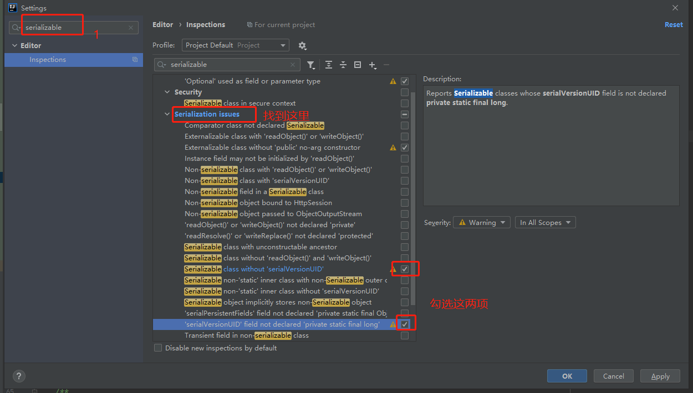
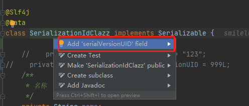

[toc]

---

# 前言

正常情况下，`Java` 对象都是保存在 `Jvm` 的堆内存中的，也就是 `Jvm` 不在了后，对象也会跟着销毁了。

而序列化相当于提供了一种解决方案，让我们可以在 `Jvm` 停止前，将对象持久化到磁盘上。这样当再次需要这个对象的时候，我们可以从磁盘中读取出来，反序列化为对象使用。

但是序列化和反序列化，不仅要求类实现了 `Serializable` 或 `Externalizable` 序列化接口，还取决于类路径以及类属性是否一致，此外还有一个非常重要的一点就是 序列化ID 要求一致，这个序列化ID就是 `SerialVersionUID` 

# 作用

>  在进⾏反序列化时， JVM会把传来的字节流中的`serialVersionUID`与本地相应实体类的`serialVersionUID`进⾏⽐较， 如果相同就认为是⼀致的， 可以进⾏反序列化， 否则就会出现序列化版本不⼀致的异常， 即是`InvalidCastException`。 


当实现`java.io.Serializable`接口的类没有显式地定义⼀个`serialVersionUID`变量时候， Java序列化机制会根据编译的Class⾃动⽣成⼀个 `serialVersionUID `作序列化版本⽐较⽤， 这种情况下， 如果Class⽂件没有发⽣变化， 就算再编译多次， `serialVersionUID` 也不会变化的。 但是如果一个Class文件发生变化，那么`serialVersionUID` 就会发生变化。


也就是说，我们的类实现了 `SerialVersion` 接口，但是没有定义 `SerialVersionUID` ，然后序列化。在序列化后，由于某些原因，对类做了变更（比如增加了一个字段），那么重启应用后，对之前序列化的类做反序列化，就会抛出异常。


# 显式定义

如果我们没有在Class中明确定义一个`SerialVersionUID` 会有什么问题呢？

先上我们序列化和反序列化代码：

```java

    @Test
    public void serializationTest() {
        SerializationIdClazz serializationClazz = new SerializationIdClazz("SerializationIdClazz", 20);
        try {
            //序列化
            ObjectOutputStream objectOutputStream = new ObjectOutputStream(new FileOutputStream("out.txt"));
            objectOutputStream.writeObject(serializationClazz);
            objectOutputStream.close();
        } catch (IOException e) {
            e.printStackTrace();
        } 
    }

    @Test
    public void deserializationTest() {
        try {
            // 反序列化
            ObjectInputStream objectInputStream = new ObjectInputStream(new FileInputStream("out.txt"));
            SerializationIdClazz newClazz = (SerializationIdClazz) objectInputStream.readObject();
            log.info("反序列化后对象：{}", newClazz);
            objectInputStream.close();
        } catch (IOException e) {
            e.printStackTrace();
        } catch (ClassNotFoundException exception) {
            exception.printStackTrace();
        }
    }

```

然后是我们测试类。r

```java
@Slf4j
@Data
class SerializationIdClazz implements Serializable {
    /**
     * 名称
     */
    private String name;
    /**
     * 年龄
     */
    private Integer age;

    /**
     * 构造器
     */
    public SerializationIdClazz(String name) {
        log.info("SerializationIdClazz Construct：name={}", name);
        this.name = name;
    }
    public SerializationIdClazz(String name, Integer age) {
        log.info("SerializationIdClazz Construct：name={},age={}", name, age);
        this.name = name;
        this.age = age;
    }
}

```

不定义 `SerialVersionUID` ，我们直接进行序列化操作，然后对该类增加一个属性（性别sex）。

```java

@Slf4j
@Data
class SerializationIdClazz implements Serializable {
    /**
     * 名称
     */
    private String name;
    /**
     * 年龄
     */
    private Integer age;
    /**
     * 性别
     */
    private int sex;

    /**
     * 构造器
     */
    public SerializationIdClazz(String name) {
        log.info("SerializationIdClazz Construct：name={}", name);
        this.name = name;
    }

    public SerializationIdClazz(String name, Integer age) {
        log.info("SerializationIdClazz Construct：name={},age={}", name, age);
        this.name = name;
        this.age = age;
    }
}
```

执行结果：

```
java.io.InvalidClassException: SerializationIdClazz; local class incompatible: stream classdesc serialVersionUID = 3361313294555402592, local class serialVersionUID = -4142228557208270752
```

抛出了 `InvalidClassException` 并且前后自动生成的 `serialVersionUID` 是不一样的。

所以，一旦类实现了`Serializable`，就**建议明确的定义一个`serialVersionUID`**。不然在修改类的时候，就会发生异常。 

## 设置字段不参加序列化

对于不想进行序列化的变量，可以使用 transient 关键字修饰。

transient 关键字的作用是：阻止实例中那些用此关键字修饰的的变量序列化；当对象被反序列化时，被 transient 修饰的变量值不会被持久化和恢复。

关于 transient 还有几点注意：

- transient 只能修饰变量，不能修饰类和方法。
- transient 修饰的变量，在反序列化后变量值将会被置成类型的默认值。例如，如果是修饰 int 类型，那么反序列后结果就是 0。
- static 变量因为不属于任何对象(Object)，所以无论有没有 transient 关键字修饰，均不会被序列化。

# 原理分析

我们看一下源码针对于读取时，`serialVersionUID` 不一致抛 `InvalidClassException`异常。

```flow
s=>start: 开始
e=>end: 结束
readObject=>operation: readObject
readObject0=>operation: readObject0
readOrdinaryObject=>operation: readOrdinaryObject
readClassDesc=>operation: readClassDesc
readNonProxyDesc=>operation: readNonProxyDesc
initNonProxy=>operation: initNonProxy

s->readObject->readObject0->readOrdinaryObject->readClassDesc->readNonProxyDesc->initNonProxy->e
```

我们直接看异常抛出的关键代码

```java
/**
  * Initializes class descriptor representing a non-proxy class.
  */
void initNonProxy(ObjectStreamClass model,
                  Class<?> cl,
                  ClassNotFoundException resolveEx,
                  ObjectStreamClass superDesc)
    throws InvalidClassException
{
    // 当前model的序列化ID,如果为空则重新计算。
    long suid = Long.valueOf(model.getSerialVersionUID());

    // 省略部分代码
    
    if (model.serializable == osc.serializable &&
        !cl.isArray() &&
        suid != osc.getSerialVersionUID()) {
        throw new InvalidClassException(osc.name,
                                        "local class incompatible: " +
                                        "stream classdesc serialVersionUID = " + suid +
                                        ", local class serialVersionUID = " +
                                        osc.getSerialVersionUID());
    }
}
```

比较两个`serialVersionUID` 是否一致。如果不相等则抛出异常。


## SerialVersionUID不是被static变量修饰了吗

static 修饰的变量是静态变量，位于方法区，本身是不会被序列化的。 static 变量是属于类的而不是对象。你反序列之后，static 变量的值就像是默认赋予给了对象一样，看着就像是 static 变量被序列化，实际只是假象罢了。

# 生成serialVersionUID

生成`serialVersionUID` 的方式主要有2种：

1. 使用默认的1L。

   ```
   private static final Long serialVersionUID = 999L;
   ```

2.  根据类名、接口名、成员方法及属性等来生成一个64位的哈希字段 。可以借助IDE工具生成。

## IDEA设置后，才能自动生成

1. 进入 Settings 设置。



2. 在实现了 `Serializable` 的类使用快捷键 `Alt + Enter`。



# 总结

1. 当一个类实现`serializable`接口时，最好定义`serialVersionUID`
2. `serialVersionUID`主要是用来验证版本一致性的。所以兼容升级时，不要修改`serialVersionUID`。
3. 非兼容升级时，要修改`serialVersionUID`。但是要做好异常处理。

