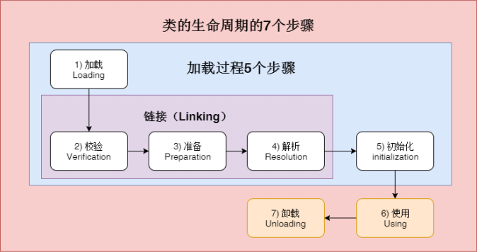
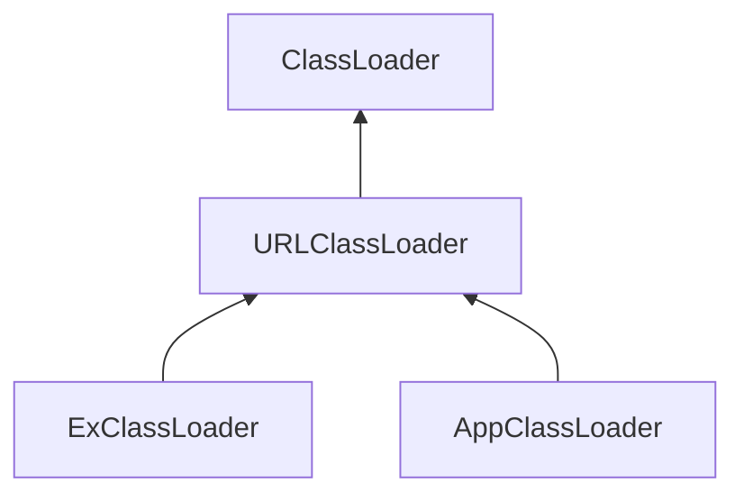
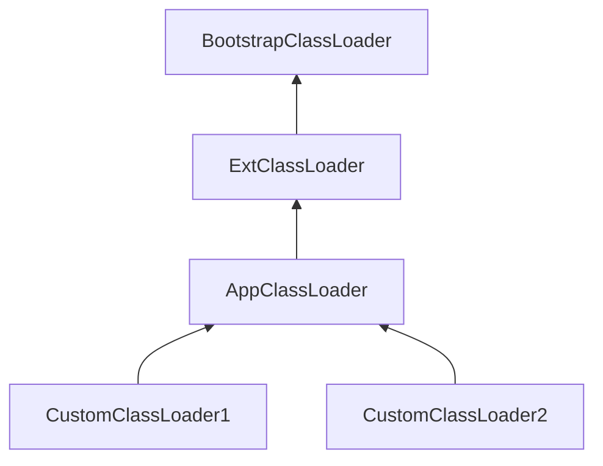

[toc]

---

# 前言
写好的代码经过编译变成了字节码，并且可以打包成Jar 文件。   
然后就可以让JVM去加载需要的字节码，变成持久代/元数据区上的Class对象，接着 才会执行我们的程序逻辑。  
我们可以用java命令指定主启动类，或者是Jar包，通过约定好的机制，JVM就会自动去加载对应的字节码（可能是class文件，也可能是Jar包）。  
我们知道Jar包打开后实际上就等价于一个文件夹，里面有很多class文件和资源文件，但是为了方便就打包成zip格式。 当然解压了之后照样可以直接用java命令来执 行。


把Hello.class和依赖的其他文件一起打包成jar文件
> 示例 1: 将 class 文件和java源文件归档到一个名为hello.jar 的档案中:   
> jar cvf hello.jar Hello.class Hello.java   
> 示例 2: 归档的同时，通过 e 选项指定jar的启动类 Hello :   
> jar cvfe hello.jar Hello Hello.class Hello.java

然后通过 ‐jar 选项来执行jar包:
> $ java ‐jar hello.jar


按照Java语言规范和Java虚拟机规范的定义, 我们用 “ **类加载** (Class Loading)” 来表示: 将class/interface名称映射为Class对象的一整个过程。 这个过程还可以划分为更具体的阶段: 加载，链接和初始化(loading, linking and initializing)。


# 类的声明周期和加载过程


（加载，验证，准备，解析，初始化）统称为**类加载**，（验证、准备、解析）链接

1. 加载：找 Class 文件
2. 校验：验证格式、依赖。验证字节码文件格式(java版本等)
3. 准备：静态字段、方法表
4. 解析：符号解析为引用
5. 初始化：构造器、静态变量复制、静态代码块
6. 使用
7. 卸载

## 加载
加载阶段也可以称为“装载”阶段。

1. 根据明确知道的class完全限定名, 来获取二进制classfile格式的字节流，简单点说就是 找到文件系统中/jar包中/或存在于任何地方的“ class文件 ”。 如果找不到二进制表示 形式，则会抛出 NoClassDefFound 错误。
2. 装载阶段并不会检查 classfile 的语法和格式。
3. 类加载的整个过程主要由JVM和Java 的类加载系统共同完成， 当然具体到loading 阶 段则是由JVM与具体的某一个类加载器（java.lang.classLoader）协作完成的。


## 校验
**链接过程**的第一个阶段是 **校验* ，确保class文件里的字节流信息符合当前虚拟机的要 求，不会危害虚拟机的安全。

1. 校验过程检查 classfile 的语义，判断常量池中的符号，并执行类型检查
2. 主要目的是判断字节码的合法性，比如 magic number, 对版本号进行验证。 
3. 这些检查 过程中可能会抛出 VerifyError ， ClassFormatError 或 UnsupportedClassVersionError 。

因为classfile的验证属是链接阶段的一部分，所以这个过程中可能需要加载其他类， **在某个类的加载过程中，JVM必须加载其所有的超类和接口**。
- 如果类层次结构有问题（例如，该类是自己的超类或接口,死循环了），则JVM将抛出 ClassCircularityError
- 而如果实现的接口并不是一个 interface，或者声明的超类是一个 interface，也会抛出 IncompatibleClassChangeError 。

## 准备
这个阶段将会创建静态字段, 并将其初始化为标准默认值(比如 null 或者 0值 )，并分配方法表，**即在方法区中分配这些变量所使用的内存空间**。

==请注意，准备阶段并未执行任何Java代码。==

> public static int i = 1；

***在准备阶段 i 的值会被初始化为0，后面在类初始化阶段才会执行赋值为1**； 但是下面如果**使用final作为静态常量**，某些**JVM的行为就不一样**了：

> public static final int i = 1；

**对应常量i，在准备阶段就会被赋值1**，其实这样还是比较puzzle，例如其他语言 （C#）有直接的常量关键字const，让告诉编译器在编译阶段就替换成常量，类似于宏指令，更简单。

## 解析
进入可选的解析符号引用阶段。解析常量池，主要有以下四种：
- 类或接口的解析
- 字段解析
- 类方法解析
- 接口方法解析

简单的来说就是我们编写的代码中，**当一个变量引用某个对象的时候，这个引用在 .class 文件中是以符号引用来存储的**（相当于做了一个索引记录）。 

在**解析阶段就需要将其解析并链接为直接引用**（相当于指向实际对象）。如果有了直接引用，那**引用的目标必定在堆中存在**。

加载一个class时,需要加载所有的super类和super接口。

## 初始化
==JVM规范明确规定, 必须在类的首次“主动使用”时才能执行类初始化==

初始化的过程包括执行： 
- 类构造器方法 
- static静态变量赋值语句
- static静态代码块

如果是一个子类进行初始化会先对其父类进行初始化，保证其父类在子类之前进行初 始化。所以其实在java中初始化一个类，那么必然先初始化过 java.lang.Object 类，因为所有的java类都继承自java.lang.Object。

> 只要我们尊重语言的语义，在执行下一步操作之前完成装载，链接和初始化这些 步骤, 如果出错就按照规定抛出相应的错误，类加载系统完全可以根据自己的策略，灵活地进行符号解析等链接过程。  
> 为了提高性能，HotSpot JVM 通常要等到类初始化时才去装载和链接类。 因此， 如果A类引用了B类，那么加载A类并不一定会去加载B类（除非需要进行验证）。  
> 主动对B类执行第一条指令时才会导致B类的初始化，这就需要先完成对B类的装载和链接。

# 类加载时机
了解了类的加载过程，我们再看看类的初始化何时会被触发呢？JVM 规范枚举了下述 多种触发情况：

- 显式调用类加载
  - 当虚拟机启动时，初始化用户指定的主类，就是启动执行的 main方法所在的类；
  - 当遇到用以新建目标类实例的 new 指令时，初始化 new 指令的目标类，就是new一个类的时候要初始化；
  - 当遇到调用静态方法的指令时，初始化该静态方法所在的类； 
  - 当遇到访问静态字段的指令时，初始化该静态字段所在的类； 
- 隐式调用类加载
  - 子类的初始化会触发父类的初始化；
  - 如果一个接口定义了 default 方法，那么直接实现或者间接实现该接口的类的初 始化，会触发该接口的初始化； 
  - 使用反射 API 对某个类进行反射调用时，初始化这个类，其实跟前面一样，反射调用要么是已经有实例了，要么是静态方法，都需要初始化；
  - 当初次调用 MethodHandle 实例时，初始化该 MethodHandle 指向的方法所在的类。

以下几种情况不会执行类初始化：（可能会加载）
- 通过子类引用父类的静态字段，只会触发父类的初始化，而不会触发子类的初始 化。
- 定义对象数组，不会触发该类的初始化。
- 常量在编译期间会存入调用类的常量池中，本质上并没有直接引用定义常量的类，不会触发定义常量所在的类。 
- 通过类名获取Class对象，不会触发类的初始化，Hello.class不会让Hello类初始化。
- 通过Class.forName加载指定类时，如果指定参数initialize为false时，也不会触发类初始化，其实这个参数是告诉虚拟机，是否要对类进行初始化。Class.forName(“jvm.Hello”)默认会加载Hello类。 
- 通过ClassLoader默认的loadClass方法，也不会触发初始化动作（加载了，但是不初始化）。

示例：
- 诸如 Class.forName(), classLoader.loadClass() 等Java API, 反射API, 以及 JNI_FindClass 都可以启动类加载。
- JVM本身也会进行类加载。比如在JVM启动时加载核心类，java.lang.Object, java.lang.Thread 等等。

# 类加载器机制
类加载过程可以描述为“通过一个类的全限定名a.b.c.XXClass来获取描述此类的Class对象”，这个过程由“类加载器（ClassLoader）”来完成。

这样的好处在于，子类加载器可以复用父加载器加载的类。

系统自带的类加载器分为三种：
- 启动类加载器（BootstrapClassLoader）
- 扩展类加载器（ExtClassLoader）
- 应用类加载器（AppClassLoader）

==**一般启动类加载器是由JVM内部实现的，在Java的API里无法拿到，但是我们可以侧面看到和影响它**。==

后2种类加载器在Oracle Hotspot JVM里，都 是在中 --sun.misc.Launcher-- 定义的，扩展类加载器和应用类加载器一般都**继承自 URLClassLoader 类**，这个类也默认实现了从各种不同来源加载class字节码转换成 Class的方法。





1. 启动类加载器（bootstrap class loader）: 它用来加载 Java 的核心类，是用原生C++代码来实现的，并不继承自java.lang.ClassLoader（负责加载JDK中jre/lib/rt.jar里所有的class）。**它可以看做是JVM自带的，我们再代码层面无法直接获取到启动类加载器的引用，所以不允许直接操作它， 如果打印出来就是个 null** 。举例来说，java.lang.String是由启动类加载器加载的，所以 String.class.getClassLoader()就会返回null。但是后面可以看到可以通过命令行参数影响它加载什么。 
2. 扩展类加载器（extensions class loader）：它负责加载JRE的扩展目录，lib/ext 或者由java.ext.dirs系统属性指定的目录中的JAR包的类，代码里直接获取它的父类加载器为null（因为无法拿到启动类加载器）。**可以将多个项目共有的jar包放扩展类目录下**
3. 应用类加载器（app class loader）：它负责在JVM启动时加载来自Java命令的­ classpath或者­cp选项、java.class.path系统属性指定的jar包和类路径。在应用程序代码里可以通过ClassLoader的静态方法getSystemClassLoader()来获取应用 类加载器。如果没有特别指定，则在没有使用自定义类加载器情况下，用户自定义的类都由此加载器加载。


此外还可以自定义类加载器。如果用户自定义了类加载器，则自定义类加载器都以应 用类加载器作为父加载器。应用类加载器的父类加载器为扩展类加载器。这些类加载 器是有层次关系的，启动加载器又叫根加载器，是扩展加载器的父加载器，但是直接 从ExClassLoader里拿不到它的引用，同样会返回null。



类加载机制有三个特点：

1. **双亲委托**：当一个自定义类加载器需要加载一个类，比如java.lang.String，它很懒，不会一上来就直接试图加载它，而是先委托自己的父加载器去加载，父加载 器如果发现自己还有父加载器，会一直往前找，这样只要上级加载器，比如启动类加载器已经加载了某个类比如java.lang.String，所有的子加载器都不需要自己加载了。如果几个类加载器都没有加载到指定名称的类，那么会抛出ClassNotFountException异常。 
2.  **负责依赖**：如果一个加载器在加载某个类的时候，发现这个类依赖于另外几个类或接口，也会去尝试加载这些依赖项。
3.  **缓存加载**：为了提升加载效率，消除重复加载，一旦某个类被一个类加载器加载，那么它会缓存这个加载结果，不会重复加载。

## 添加引用类的几种方式

1. 放到 Jdk 目录下的 lib/ext（这是扩展类加载器的加载路径） 或者 -Djava.ext.dirs 指定一个扩展类的目录
2. java -cp/classpath 或者 class文件放到当前路径（应用类加载器）
3. 自定义Classloader加载
4. 拿到当前执行类的classLoader，反射掉哦那个addUrl 方法添加jar或者路径（JDK9无效）

```java
public class JvmAppClassLoaderAddUrl {
    public static void main(String[] args) {
        String appPath = "file:/d:/app/";
        URLClassLoader urlClassLoader = (URLClassLoader) JvmAppClassLoaderAddUrl.class.getClassLoader();
        try {
            Method addURL = URLClassLoader.class.getDeclaredMethod("addURL", URL.class);

            addURL.setAccessible(true);
            URL url = new URL(appPath);
            addURL.invoke(urlClassLoader, url);
            Class.forName("top.zsmile.jvm.classloader.Hello"); // 效果跟Class.forName("jvm.Hello").newInstance()一样
        } catch (Exception e) {
            e.printStackTrace();
        }
    }
}
```

jdk9以后应用类加载器、扩展类加载器和URL加载器，这三个是平级的了。不能存在一个继承关系。所以无法将应用类加载器和扩展类加载器转换成URLClassLoader。

但是呢提供了另一种方式，将上面繁杂的代码变得更简单了。

```java
class.forName("top.zsmile.jvm.classloader.Hello")",new UrlClassLoader());
```

**在JDK9中，整个JDK都基于模块化进行构建，以前的rt.jar, tool.jar被拆分成数十个模块，编译的时候只编译实际用到的模块，同时各个类加载器各司其职，只加载自己负责的模块。** 

# 打印三类加载器的信息

```java
public class JvmClassLoaderPrintPath {
    public static void main(String[] args) {
        // 启动类加载器
        URL[] urls = sun.misc.Launcher.getBootstrapClassPath().getURLs();
        System.out.println("启动类加载器");
        for (URL url : urls) {
            System.out.println(" ==> " + url.toExternalForm());
        }

        // 扩展类加载器
        printClassLoader("扩展类加载器", JvmClassLoaderPrintPath.class.getClassLoader().getParent());

        // 应用类加载器
        printClassLoader("应用类加载器", JvmClassLoaderPrintPath.class.getClassLoader());
    }


    public static void printClassLoader(String name, ClassLoader CL) {
        if (CL != null) {
            System.out.println(name + " ClassLoader ‐> " + CL.toString());
            printURLForClassLoader(CL);
        } else {
            System.out.println(name + " ClassLoader ‐> null");
        }
    }

    public static void printURLForClassLoader(ClassLoader CL) {
        Object ucp = insightField(CL, "ucp");
        Object path = insightField(ucp, "path");
        ArrayList ps = (ArrayList) path;
        for (Object p : ps) {
            System.out.println(" ==> " + p.toString());
        }
    }

    private static Object insightField(Object obj, String fName) {
        try {
            Field f = null;
            if (obj instanceof URLClassLoader) {
                f = URLClassLoader.class.getDeclaredField(fName);
            } else {
                f = obj.getClass().getDeclaredField(fName);
            }
            f.setAccessible(true);
            return f.get(obj);
        } catch (Exception e) {
            e.printStackTrace();
            return null;
        }
    }
}

```
其中启动类加载器，只能在oraclejdk和 openjdk中获取，其他版本jdk可能不提供这样的接口。

# 自定义类加载示例
同时我们可以自行实现类加载器来加载其他格式的类，对加载方式、加载数据的格式进行自定义处理，只要能通过classloader返回一个Class实例即可。这就大大增强了加 载器灵活性。


比如我们试着实现一个可以用来处理简单加密的字节码的类加载器，用 来保护我们的class字节码文件不被使用者直接拿来破解。

我们先来看看我们希望加载的一个Hello类：

```java
package jvm; 
public class Hello { 
    static {
        System.out.println("Hello Class Initialized!"); 
    } 
} 

```

假设这个类的内容非常重要，我们不想把编译到得到的Hello.class给别人，但是我们还是想别人可以调用或执行这个类，应该怎么办呢？一个简单的思路是，我们把这个类的class文件二进制作为字节流先加密一下，然后尝试通过自定义的类加载器来加载加密后的数据。

```java
package jvm; 
import java.util.Base64; 
public class HelloClassLoader extends ClassLoader { 
    public static void main(String[] args) { 
        try { 
            new HelloClassLoader().findClass("jvm.Hello").newInstance(); // 加载并初始化Hello类 
        } catch (ClassNotFoundException e) {      
            e.printStackTrace(); 
        } catch (IllegalAccessException e) { 
            e.printStackTrace(); 
        } catch (InstantiationException e) { 
            e.printStackTrace(); 
        } 
    } 
    @Override 
    protected Class<?> findClass(String name) throws ClassNotFoundException {
        String helloBase64 = "yv66vgAAADQAHwoABgARCQASABMIABQKABUAFgcAFwcAGAEABjxpbml0PgEAAygpVgEABENvZGUBAA9MaW5lTnVtYmVyVGFibGUBABJMb2N"+ "hbFZhcmlhYmxlVGFibGUBAAR0aGlzAQALTGp2bS9IZWxsbzsBAAg8Y2xpbml0PgEAClNvdXJjZUZpbGUBAApIZWxsby5qYXZhDAAHAAgHABkMABoAGwEAGEhlb" + "GxvIENsYXNzIEluaXRpYWxpemVkIQcAHAwAHQAeAQAJanZtL0hlbGxvAQAQamF2YS9sYW5nL09iamVjdAEAEGphdmEvbGFuZy9TeXN0ZW0BAANvdXQBABVMamF2" + "YS9pby9QcmludFN0cmVhbTsBABNqYXZhL2lvL1ByaW50U3RyZWFtAQAHcHJpbnRsbgEAFShMamF2YS9sYW5nL1N0cmluZzspVgAhAAUABgAAAAAAAgABAAcACA" + "ABAAkAAAAvAAEAAQAAAAUqtwABsQAAAAIACgAAAAYAAQAAAAMACwAAAAwAAQAAAAUADAANAAAACAAOAAgAAQAJAAAAJQACAAAAAAAJsgACEgO2AASxAAAAAQAK" + "AAAACgACAAAABgAIAAcAAQAPAAAAAgAQ"; 
    
        byte[] bytes = decode(helloBase64); 
        return defineClass(name,bytes,0,bytes.length); 
    } 
    
    public byte[] decode(String base64){
        return Base64.getDecoder().decode(base64);  
    }  
    
}
```

> $ java jvm.HelloClassLoader   
> Hello Class Initialized!

==需要说明的是两个没有关系的自定义类加载器之间加载的类是**不共享**的（**只共享父类加载器，兄弟之间不共享**）==，这样就可以实现不同的类型沙箱 的隔离性，我们可以用多个类加载器，各自加载同一个类的不同版本，大家可以相互之间不影响彼此，从而在这个基础上可以实现类的动态加载卸载，热插拔的插件机制等，具体信息大家可以参考OSGi等模块化技术。