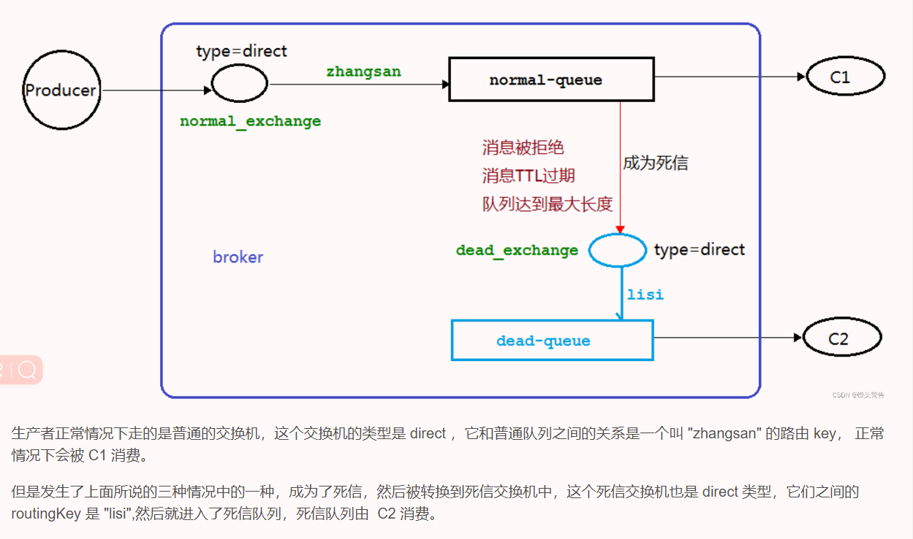

[TOC]

---

# 什么是死信队列

**死信，顾名思义就是无法被消费的消息**。

一般来说，producer 将消息投递到 broker 或者直接到 queue 里了，consumer 从 queue 取出消息进行消费，但某些时候由于特定的原因导致 queue 中的某些消息无法被消费，这样的消息如果没有后续的处理，就变成了死信，有死信自然就有了死信队列。

应用场景:为了保证订单业务的消息数据不丢失，需要使用到 RabbitMQ 的死信队列机制，当消费发生异常时，将消息投入死信队列中.还有比如说: 用户在商城下单成功并点击去支付后在指定时间未支付时自动失效。

# 死信的来源

1. 消息 TTL 过期  

2. 队列达到最大长度(队列满了，无法再添加数据到 mq 中)  

3. 消息被拒绝(basic.reject 或 basic.nack)并且 requeue=false.

4. 消息消费发生异常后，多次重试失败，抛出到死信队列，如果未配置死信队列将会丢失。

# 实战

## 架构图（TODO）



## 实际使用

### 使用说明


在RabbitMQ中设置死信队列的步骤如下：

1. 创建一个正常的队列作为死信的目的地。

2. 创建一个具有死信交换机（Dead Letter Exchange，DLX）的队列，并将这个队列设置为使用上述目的地队列的DLX。

3. 当源队列中的消息成为死信时，它们会被发送到设置了DLX的队列。


### 配置死信队列和交换机

```java
public class RabbitMqConstant {


    /************** 死信队列 ****************/
    public static final String DEAD_EXCHANGE = "dead_exchange";

    public static final String DEAD_QUEUE = "dead_queue";
    public static final String DEAD_BIND = "dead_bind";

    public static final String DEAD_ROUTE = "dead_route";


}
```

```java
/**
 * rabbitmq 死信队列相关配置
 */
@Configuration
public class RabbitMqDeadConfig {

    //以下为死信队列
    @Bean(RabbitMqConstant.DEAD_EXCHANGE)
    public Exchange deadExchange() {
        return ExchangeBuilder.directExchange(RabbitMqConstant.DEAD_EXCHANGE).durable(true).build();
    }

    @Bean(RabbitMqConstant.DEAD_QUEUE)
    public Queue deadQueue() {
        return QueueBuilder.durable(RabbitMqConstant.DEAD_QUEUE).build();
    }

    @Bean(RabbitMqConstant.DEAD_BIND)
    public Binding deadBind(@Qualifier(RabbitMqConstant.DEAD_QUEUE) Queue queue, @Qualifier(RabbitMqConstant.DEAD_EXCHANGE) Exchange exchange) {
//        return BindingBuilder.bind(queue).to(exchange).with(RabbitMqConstant.DEAD_ROUTE).noargs();
        return BindingBuilder.bind(deadQueue()).to(exchange).with(RabbitMqConstant.DEAD_ROUTE).noargs();
    }

}
```

### 配置消费队列

> 如果队列已经存在，需要删除重新创建。

```java
/**
     * 上传任务的队列
     *
     * @return 队列
     */
    @Bean("RabbitResultQueue")
    public Queue ResultQueue() {
        return QueueBuilder.durable("result_queue")
                .deadLetterExchange(RabbitMqConstant.DEAD_EXCHANGE)
                .deadLetterRoutingKey(RabbitMqConstant.DEAD_ROUTE)
                .build();
    }
```
