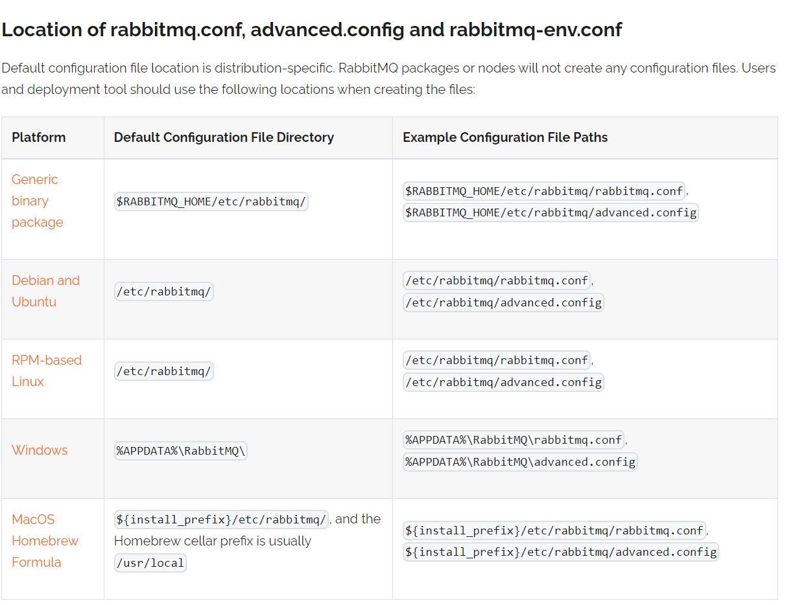

[toc]

----

# 前言
在当今互联网时代，消息中间件已成为实现分布式系统和微服务架构的关键组件之一。RabbitMQ作为最受欢迎的消息队列之一，不仅提供强大的消息传递功能，还隐藏了一系列神秘的端口。这些端口扮演着关键的角色，影响着RabbitMQ的性能和安全性。本文将深入研究RabbitMQ的不同端口，揭示它们的用途，以及如何更好地利用它们来构建可靠的消息架构。

## 第一部分：AMQP默认端口(5672/5671)
AMQP（高级消息队列协议）是一种网络协议，用于在应用程序之间传递消息，通常用于消息队列系统。在RabbitMQ中，AMQP协议是消息传递的核心协议，它定义了消息的格式、传递方法和消息队列的行为。下面是您提到的问题的解答：

1. AMQP 协议是什么以及它在RabbitMQ中的重要性：

   AMQP（Advanced Message Queuing Protocol）是一种网络协议，用于消息传递。它定义了消息的格式和传递规则，允许不同应用程序之间进行异步通信。在RabbitMQ中，AMQP是主要的通信协议，用于生产者将消息发送到队列，消费者从队列中接收消息，以及在消息代理（如RabbitMQ）中进行消息路由和处理。AMQP的重要性在于它提供了一种标准的方法，使不同的应用程序能够可靠地交换消息，从而构建强大的分布式系统。

2. 为什么5672端口是默认端口：

   5672端口是AMQP协议的默认端口，通常用于与RabbitMQ建立非加密连接。这个端口之所以成为默认端口，是因为它是AMQP协议的标准端口号，开发者可以方便地配置其应用程序来连接到此端口，而无需手动指定端口号。当您创建一个与RabbitMQ的连接时，如果没有指定端口号，客户端库通常会默认使用5672端口。

3. 如何通过5672端口与RabbitMQ建立非加密连接：

   为了通过5672端口与RabbitMQ建立非加密连接，您可以使用适当的AMQP客户端库。以下是通常的步骤：

   - 安装并配置适当的AMQP客户端库（例如，pika for Python、RabbitMQ Java Client等）。
   - 在您的应用程序中，创建一个AMQP连接对象，通常需要指定RabbitMQ服务器的主机名或IP地址、端口（5672）、虚拟主机、用户名和密码。
   - 创建一个通道（channel）来进行消息的发布和订阅。
   - 使用通道来发送和接收消息。

   请注意，5672端口是非加密的，默认情况下消息在网络上传输时不会被加密。如果您需要加密连接，可以考虑使用5671端口，它通常用于AMQPS（AMQP over SSL/TLS）协议，这将提供加密的通信。加密连接需要配置证书等安全设置。

## 第二部分：RabbitMQ管理界面端口（15672）
RabbitMQ管理界面是一个Web应用程序，用于管理和监控RabbitMQ消息代理。下面是有关RabbitMQ管理界面（通常运行在15672端口）的信息：

1. 管理界面的作用和重要性：

   RabbitMQ管理界面是一个用于管理和监控RabbitMQ服务器的用户界面。它对于RabbitMQ的管理和监控是非常重要的，因为它提供了易于使用的图形化界面，允许管理员执行以下任务：

   - 创建、删除和管理消息队列。
   - 查看和管理交换机（exchanges）和绑定（bindings）。
   - 查看当前连接到RabbitMQ的客户端应用程序。
   - 监视消息传递情况，包括消息发布和消费的速率。
   - 查看节点信息、集群状态和性能指标。
   - 设置用户权限和虚拟主机（virtual host）的配置。

2. 如何通过15672端口访问RabbitMQ管理控制台：

   默认情况下，RabbitMQ管理界面运行在15672端口。要通过浏览器访问管理控制台，您需要确保RabbitMQ服务器正在运行，并且已经启用了管理插件。以下是访问管理控制台的步骤：

   - 打开Web浏览器，并输入以下URL：http://your-rabbitmq-server:15672/
   - 替换"your-rabbitmq-server"为实际运行RabbitMQ服务器的主机名或IP地址。
   - 您将被重定向到登录页面，输入您的RabbitMQ用户名和密码，通常是"guest"（默认用户名和密码）。
   - 登录后，您将能够访问RabbitMQ管理控制台。

3. 管理界面提供的功能和监控选项：

   RabbitMQ管理控制台提供了多种功能和监控选项，包括但不限于：

   - 队列和交换机的创建和删除。
   - 查看连接到服务器的客户端。
   - 查看队列中的消息数量、消费者数量以及消息的详细信息。
   - 查看节点的性能指标，例如内存使用情况和CPU利用率。
   - 配置虚拟主机、用户、权限和策略。
   - 查看集群状态和节点信息。
   - 查看日志和错误报告，以进行故障排除。
   - RabbitMQ管理界面是一个强大的工具，用于轻松管理和监控RabbitMQ服务器，以确保消息队列系统的正常运行。

## 

# 自定义端口和安全性

自定义RabbitMQ端口以满足特定需求并确保端口的安全性是很重要的，特别是在需要满足特定安全标准或限制访问的情况下。以下是关于如何自定义RabbitMQ端口以及确保端口安全性的步骤。

##  自定义RabbitMQ端口

1. 打开RabbitMQ的配置文件。配置文件通常命名为rabbitmq.config，但具体的文件名和位置可能会因您的RabbitMQ安装方式和操作系统而异。



2. 编辑配置文件以指定您想要使用的自定义端口。在配置文件中，您可以定义监听端口和协议，例如：

```conf 
%% this is a comment
[
  {rabbit, [
      {tcp_listeners, [5673]}
    ]
  }
].
```

或者是这样

```conf
# this is a comment
listeners.tcp.default = 5673
```

3. 保存并重启服务

##  **端口的安全性** 

1. 防火墙设置：

   配置防火墙规则，以确保只有受信任的IP地址可以访问自定义端口。这有助于限制未经授权的访问。

2. 访问控制：

   - 在RabbitMQ中，您可以使用虚拟主机、用户、权限和策略来进行访问控制。确保只有授权的用户和客户端可以连接到自定义端口。
   - 设置用户权限，限制他们的访问范围。例如，您可以为不同的虚拟主机配置不同的用户权限，以确保只能访问其所需的资源。

3. SSL/TLS加密：

   - 对于敏感数据传输，强烈建议使用SSL/TLS加密。配置RabbitMQ以使用加密连接，确保数据在传输过程中受到保护。
   - 要配置SSL/TLS，您需要生成或获得有效的证书，然后在RabbitMQ配置文件中指定证书的路径和其他安全设置。

4. 定期更新和监控：

   - 定期更新RabbitMQ以及操作系统，以获取最新的安全修复程序和更新。
   - 进行安全审计和监控以检测潜在的威胁和异常活动。

5. 强密码策略：

   设置强密码策略，确保用户密码的复杂性和安全性。