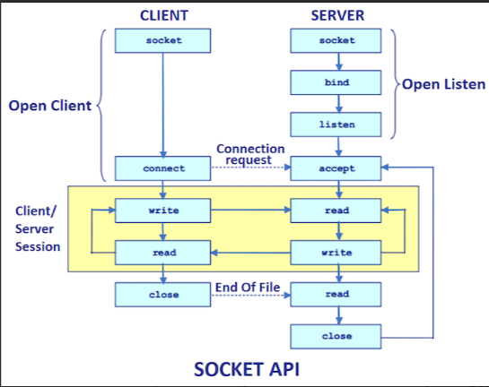

[toc]

---

# Socket通信

Socket 是一个抽象概念，应用程序可以通过它发送或接收数据。在使用 Socket 进行网络通信的时候，通过 Socket 就可以让我们的数据在网络中传输。操作套接字的时候，和我们读写文件很像。套接字是 IP 地址与端口的组合，套接字 Socket=（IP 地址：端口号）。

要通过互联网进行通信，至少需要一对套接字：

1. 运行于服务器端的 Server Socket。
2. 运行于客户机端的 Client Socket。

在 Java 开发中使用 Socket 时会常用到两个类，都在 java.net 包中：

1. Socket: 一般用于客户端
2. ServerSocket :用于服务端

## 通信过程

> https://www.javatpoint.com/socket-programming

 

**Socket 网络通信过程简单来说分为下面 4 步：**

1. 建立服务端并且监听客户端请求
2. 客户端请求，服务端和客户端建立连接
3. 两端之间可以传递数据
4. 关闭资源

**服务器端：**

1. 创建 `ServerSocket` 对象并且绑定地址（ip）和端口号(port)：`server.bind(new InetSocketAddress(host, port))`
2. 通过 `accept()`方法监听客户端请求
3. 连接建立后，通过输入流读取客户端发送的请求信息
4. 通过输出流向客户端发送响应信息
5. 关闭相关资源

**客户端：**

1. 创建`Socket` 对象并且连接指定的服务器的地址（ip）和端口号(port)：`socket.connect(inetSocketAddress)`
2. 连接建立后，通过输出流向服务器端发送请求信息
3. 通过输入流获取服务器响应的信息
4. 关闭相关资源

## 网络通信实战

