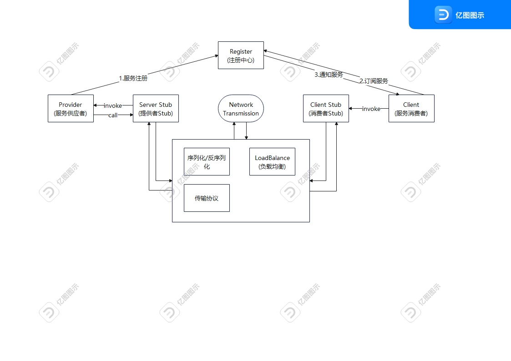

[toc]

---

# 设计自己的RPC框架

## 相关技术

-  Java 

  1. 动态代理机制；
  2. 序列化机制以及各种序列化框架的对比，比如 hession2、kryo、protostuff；
  3. 线程池的使用；
  4. CompletableFuture 的使用；

- Netty

  1. 使用 Netty 进行网络传输；
  2. ByteBuf 介绍；
  3. Netty 粘包拆包；
  4. Netty 长连接和心跳机制；

- Zookeeper 

  1. 基本概念；
  2. 数据结构；
  3. 如何使用 Netflix 公司开源的 Zookeeper 客户端框架 Curator 进行增删改查；

## 参考Dubbo

> 官网：https://cn.dubbo.apache.org/zh-cn/overview/home/

Dubbo节点简单说明：

- Provider： 暴露服务的服务提供方
- Consumer： 调用远程服务的服务消费方
- Registry： 服务注册与发现的注册中心
- Monitor： 统计服务的调用次数和调用时间的监控中心
- Container： 服务运行容器

Duboo 调用关系说明：

1. 服务容器负责启动，加载，运行服务提供者。
2. 服务提供者在启动时，向注册中心注册自己提供的服务。
3. 服务消费者在启动时，向注册中心订阅自己所需的服务。
4. 注册中心返回服务提供者地址列表给消费者，如果有变更，注册中心将基于长连接推送变更数据给消费者。
5. 服务消费者，从提供者地址列表中，基于软负载均衡算法，选一台提供者进行调用，如果调用失败，再选另一台调用。
6. 服务消费者和提供者，在内存中累计调用次数和调用时间，定时每分钟发送一次统计数据到监控中心。

# 功能

- [ ] 注册中心 ：注册中心负责服务地址的注册与查找，相当于目录服务。
- [ ] 网络传输 ：既然我们要调用远程的方法，就要发送网络请求来传递目标类和方法的信息以及方法的参数等数据到服务提供端。
- [ ] 序列化和反序列化 ：要在网络传输数据就要涉及到序列化。
- [ ] 动态代理 ：屏蔽远程方法调用的底层细节。
- [ ] 负载均衡 ： 避免单个服务器响应同一请求，容易造成服务器宕机、崩溃等问题。
- [ ] 传输协议 ：这个协议是客户端（服务消费方）和服务端（服务提供方）交流的基础。

# 注册中心

> 注册中心主要提供服务地址的注册和查找功能。服务端启动时将服务名称及地址注册到注册中心，消费端通过服务名称找到对应的服务地址。有了服务地址之后，消费端就可以通过网络请求服务端。

框架选型：

- zookeeper
- nacos
- apollo
- redis

## zookeeper

ZooKeeper 为我们提供了高可用、高性能、稳定的分布式数据一致性解决方案，通常被用于实现诸如数据发布/订阅、负载均衡、命名服务、分布式协调/通知、集群管理、Master 选举、分布式锁和分布式队列等功能。并且，ZooKeeper 将数据保存在内存中，性能是非常棒的。 在“读”多于“写”的应用程序中尤其地高性能，因为“写”会导致所有的服务器间同步状态。（“读”多于“写”是协调服务的典型场景）。

> https://javaguide.cn/distributed-system/distributed-process-coordination/zookeeper/zookeeper-intro.html
>
> https://curator.apache.org/docs/about/
>
> https://zhuanlan.zhihu.com/p/603185454

# 序列化/反序列化

要在网络传输数据就要涉及到序列化。为什么需要序列化和反序列化呢？  因为网络传输的数据必须是二进制的。因此，我们的 Java 对象没办法直接在网络中传输。为了能够让 Java 对象在网络中传输我们需要将其序列化为二进制的数据。我们最终需要的还是目标 Java 对象，因此我们还要将二进制的数据“解析”为目标 Java 对象，也就是对二进制数据再进行一次反序列化。

另外，不仅网络传输的时候需要用到序列化和反序列化，将对象存储到文件、数据库等场景都需要用到序列化和反序列化。

JDK 自带的序列化，只需实现 java.io.Serializable接口即可，不过这种方式不推荐，因为不支持跨语言调用并且性能比较差。

常见序列化：
- hessian
- kryo
- protostuff

# 负债均衡
负载均衡就是为了避免单个服务器响应同一请求，容易造成服务器宕机、崩溃等问题。从单机的角度提升服务器处理能力，无论是提升 CPU 处理能力，还是增加内存、磁盘等空间，都不能满足日益增长的大流量、高并发、海量数据在高性能、高可用性等方面的需求。因此，只能通过横向扩展，增加服务器，即采用集群和负载均衡架构，来共同分担访问压力、提升业务处理能力。

简单来说，就是数据中心内部会以集群模式构建各种服务，通过在入口部署负载均衡，对外提供高访问量服务，提高应用程序的可用性、可靠性和可扩展性。这就是负载均衡的产生背景，也是负载均衡技术架构设计的来源。 

> https://c.biancheng.net/view/9823.html
>
> https://help.aliyun.com/document_detail/132403.html

# 传输协议

**通过设计协议，我们定义需要传输哪些类型的数据， 并且还会规定每一种类型的数据应该占多少字节。这样我们在接收到二进制数据之后，就可以正确的解析出我们需要的数据**。

通常一些标准的 RPC 协议包含下面这些内容：

- 魔数 ： 通常是 4 个字节。这个魔数主要是为了筛选来到服务端的数据包，有了这个魔数之后，服务端首先取出前面四个字节进行比对，能够在第一时间识别出这个数据包并非是遵循自定义协议的，也就是无效数据包，为了安全考虑可以直接关闭连接以节省资源。 
- 序列化器编号 ：标识序列化的方式，比如是使用 Java 自带的序列化，还是 json，kryo 等序列化方式。 
- 消息体长度 ： 运行时计算出来。 

# 动态代理

代理模式就是： 我们给某一个对象提供一个代理对象，并由代理对象来代替真实对象做一些事情。你可以把代理对象理解为一个幕后的工具人。 举个例子：我们真实对象调用方法的时候，我们可以通过代理对象去做一些事情比如安全校验、日志打印等等。但是，这个过程是完全对真实对象屏蔽的。

**RPC 的主要目的就是让我们调用远程方法像调用本地方法一样简单，我们不需要关心远程方法调用的细节比如网络传输。**

那如何屏蔽远程方法的调用细节呢？那就是**动态代理**。

> https://javaguide.cn/java/basis/proxy.html

# 网络传输

**既然我们要调用远程的方法，就要发送网络请求来传递目标类和方法的信息以及方法的参数等数据到服务提供端。**

常见通信框架：
- Java Socket(不推荐)
- Java Nio（不推荐）
- Netty(推荐使用)

## Netty

Netty 是一个基于 NIO 的 client-server(客户端服务器)框架，使用它可以快速简单地开发网络应用程序。
2它极大地简化并简化了 TCP 和 UDP 套接字服务器等网络编程,并且性能以及安全性等很多方面甚至都要更好。
3支持多种协议如 FTP，SMTP，HTTP 以及各种二进制和基于文本的传统协议。