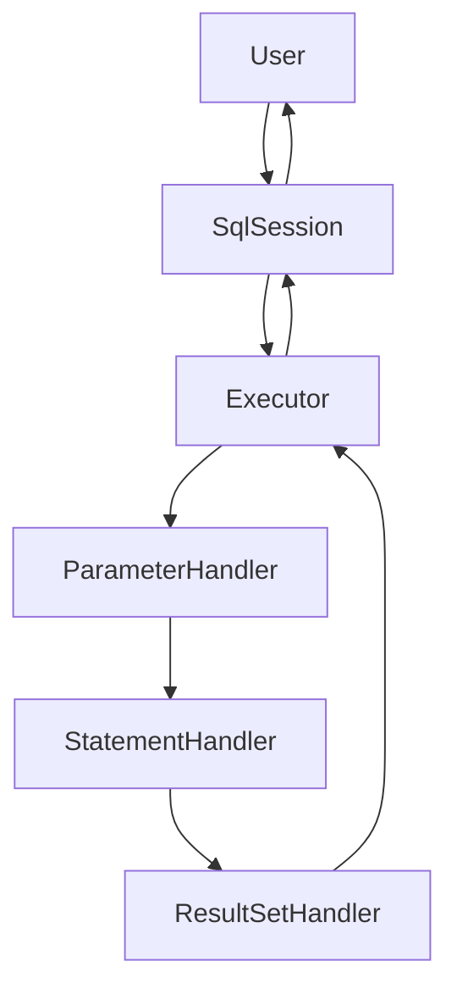

[toc]

---

# Mybatis 拦截器

## 核心组件

- Configuration：初始化基础配置，比如MyBatis的别名等，一些重要的类型对象，如插件，映射器，ObjectFactory和typeHandler对象，MyBatis所有的配置信息都维持在Configuration对象之中。
- SqlSessionFactory：SqlSession工厂。
- SqlSession：作为MyBatis工作的主要顶层API，表示和数据库交互的会话，完成必要的数据库增删改查功能。
- Executor： MyBatis的执行器，用于执行增删改查操作。负责调用StatementHandler操作数据库，并把结果集通过ResultSetHandler进行自动映射，另外，它还处理二级缓存的操作。
- StatementHandler：MyBatis直接在数据库执行SQL脚本的对象。另外它也实现了MyBatis的一级缓存。
- ParameterHandler：负责将用户传递的参数转换成JDBC Statement所需要的参数。是MyBatis实现SQL入参设置的对象。
- ResultSetHandler：负责将JDBC返回的ResultSet结果集对象转换成List类型的集合。是MyBatis把ResultSet集合映射成POJO的接口对象。
- TypeHandler：负责Java数据类型和JDBC数据类型之间的映射和转换。
- MappedStatement：MappedStatement维护了一条<select|update|delete|insert>节点的封装。
- SqlSource ：负责根据用户传递的parameterObject，动态地生成SQL语句，将信息封装到BoundSql对象中，并返回。
- BoundSql：表示动态生成的SQL语句以及相应的参数信息。

## 生命周期

`Mybatis` 插件原理： **使用动态代理对以下四个目标对象进行包装，然后再有针对性的进行拦截，其生命周期分为包装和拦截。** 

- ParameterHandler：处理SQL的参数对象
- ResultSetHandler：处理SQL的返回结果集
- StatementHandler：数据库的处理对象，用于执行SQL语句
- Executor：MyBatis的执行器，用于执行增删改查操作 

`Mybatis` 插件的周期：

1. 通过 `setProperties` 将配置好的 `Properties` 设置到插件上使用，
2. 通过 `plugin.wrap(target,this)` 对插件对象进行拦截后，生成代理对象返回。
3. 通过 `intercept` 方法对代理 。**注意：再上面四大对象创建的时候，对象都不是直接返回的，而且会生成他的代理，然后返回其代理对象。**




## 如何使用

自定义 `Mybatis` 的拦截器步骤如下：

1. 定义一个实现了 `Interceptor` 接口的拦截器类，并实现其方法.
2. 添加 `@Interceptors` 和 `@Signature` 注解，标记需要拦截的对象和方法，以及传入的方法参数
3. 配置插件
   1. 在 `Mybatis` 的全局配置XML 中 配置插件Plugin
   2. 对于去XML文件的 `SpringBoot` 项目，使用 `@Component` 注册；或者使用 `SqlSessionFactory.addInterceptor` 注入拦截器 

### Interceptor

```java
public interface Interceptor {
    Object intercept(Invocation invocation) throws Throwable;

    default Object plugin(Object target) {
        return Plugin.wrap(target, this);
    }

    default void setProperties(Properties properties) {
    }
}
```

- Object intercept(Invocation invocation) throws Throwable;
  - 实现拦截的地方
  - 通过 `invocation.proceed()` 显式推进责任链的执行。
- Object plugin(Object target) ;
  - 生成当前拦截器对该目标对象的代理。
- void setProperties(Properties properties) 
  - 用于设置拦截器的自定义参数。

此外对于自定义的 `Interceptor` 有两个重要的注解：

1. `@Intercepts`，用于表明当前对象是一个 `Interceptor`。其值是一个 `@Signature` 数组，用于标识需要拦截的方法。
2. `@Signature` ，用于表明要拦截的接口、方法以及对应的参数类型。

下面是一个官方示例：

```java
// ExamplePlugin.java
@Intercepts({@Signature(
  type= Executor.class,
  method = "update",
  args = {MappedStatement.class,Object.class})})
public class ExamplePlugin implements Interceptor {
  private Properties properties = new Properties();

  @Override
  public Object intercept(Invocation invocation) throws Throwable {
    // implement pre processing if need
    Object returnObject = invocation.proceed();
    // implement post processing if need
    return returnObject;
  }

  @Override
  public void setProperties(Properties properties) {
    this.properties = properties;
  }
}
```

## 执行过程


# 拦截器注入的方式

## Mybatis

1. 使用 @Component 注入 SpringBoot 容器。但无法控制执行顺序

```java
@Component
@Intercepts({
        @Signature(type = Executor.class, method = "update", args = {MappedStatement.class, Object.class}),
})
public class UpdateInterceptor implements Interceptor {
}
```

2. 使用 xml 配置。mybatis-config.xml

```xml
<plugins>
    <plugin interceptor="UpdateInterceptor">
        <property name="args1" value="参数示例"/>
    </plugin>
</plugins>	
```

3. 使用 `SqlSessionFactory`。需要注意的是，这是**倒序执行，后加入的先执行**

```java

@Resource
private List<SqlSessionFactory> sqlSessionFactories;

@PostConstruct
public void addInterceptor() {
    sqlSessionFactories.forEach(item -> {
        item.getConfiguration().addInterceptor(new DataScopeInterceptor());
        item.getConfiguration().addInterceptor(new DataScopeInterceptor2());
    });
}

```

## Mybatis-Plus

1. 使用 `ConfigurationCustomizer`  设置执行顺序，需要注意的是**倒序执行，后加入的先执行**

```java

@Configuration
public class MybatisConfig {
// 注册插件方式
    @Bean
    public ConfigurationCustomizer configurationCustomizer() {
        return configuration -> {
            //插件拦截链采用了责任链模式，执行顺序和加入连接链的顺序有关
            configuration.addInterceptor(new UpdateInterceptor());
        };
    }
}

```

2. 使用设置 `Mybatis-Plus` 下的 `Innerterceptor`

```java
@Bean
public MybatisPlusInterceptor mybatisPlusInterceptor() {
    MybatisPlusInterceptor interceptor = new MybatisPlusInterceptor();
    //     数据权限过滤
    interceptor.addInnerInterceptor(new DataScopeInnerInterceptor());
    interceptor.addInnerInterceptor(new PaginationInnerInterceptor());
    interceptor.addInnerInterceptor(new OptimisticLockerInnerInterceptor());
    return interceptor;
}
```


# 拦截器使用案例

## 拦截填充创建时间和更新时间

```java

@Intercepts({
        @Signature(type = Executor.class, method = "update", args = {MappedStatement.class, Object.class}),
})
public class UpdateInterceptor implements Interceptor {
    @Autowired
    private CommonAuthApi commonAuthApi;

    @Override
    public Object intercept(Invocation invocation) throws Throwable {
        if (invocation.getTarget() instanceof Executor) {
            MappedStatement mappedStatement = (MappedStatement) invocation.getArgs()[0];
            Object params = invocation.getArgs()[1];
            SqlCommandType sqlCommandType = mappedStatement.getSqlCommandType();
            operateTime(params, sqlCommandType);
        }
        return invocation.proceed();
    }

    private void operateTime(Object params, SqlCommandType sqlCommandType) {
        Map<String, Object> userInfo = commonAuthApi.queryUserInfo();
        if (sqlCommandType == SqlCommandType.UPDATE || sqlCommandType == SqlCommandType.DELETE) {
            if (params instanceof BaseEntity) {
                BaseEntity baseEntity = (BaseEntity) params;
                LocalDateTime now = LocalDateTime.now();
                String username = userInfo.get("username").toString();
                baseEntity.setUpdateTime(now);
                baseEntity.setUpdateBy(username);
            } else if (params instanceof Map) {
                Map baseMap = (Map) params;
                LocalDateTime now = LocalDateTime.now();
                String username = userInfo.get("username").toString();
                baseMap.put("updateTime", now);
                baseMap.put("updateBy", username);
            }
        } else if (sqlCommandType == SqlCommandType.INSERT) {
            if (params instanceof BaseEntity) {
                BaseEntity baseEntity = (BaseEntity) params;
                LocalDateTime now = LocalDateTime.now();
                String username = userInfo.get("username").toString();
                baseEntity.setCreateTime(now);
                baseEntity.setCreateBy(username);
                baseEntity.setUpdateTime(now);
                baseEntity.setUpdateBy(username);
            } else if (params instanceof Map) {
                Map baseMap = (Map) params;
                LocalDateTime now = LocalDateTime.now();
                String username = userInfo.get("username").toString();
                baseMap.put("createTime", now);
                baseMap.put("createBy", username);
                baseMap.put("updateTime", now);
                baseMap.put("updateBy", username);
            }
        }
    }

    @Override
    public Object plugin(Object target) {
        return Plugin.wrap(target, this);
    }
}
```

