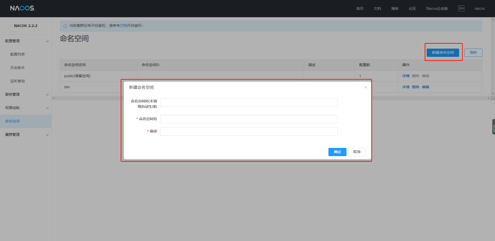
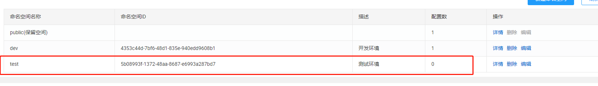

[TOC]

---

> 基于版本 nacos server 2.2.2

# 什么是命名空间

`namespace`(命名空间)是`nacos`针对于企业级开发设计用来针对于不同环境的区分，比如企业开发时有测试环境、生产环境，因此为了保证不同环境配置实现隔离提出了`namespace`的概念。-

- 默认在`nacos`中存在一个`public`命名空间，所有配置在没有指定命名空间时都在这个命名空间中获取配置。

- 在实际开发时可以针对于不同环境创建不同的`namespace`。

- **默认空间不能删除**

# 基本使用

## 新增命名空间





**“命名空间ID”**如果在新增时没有填写的话，则Nacos服务端会自动随机产生一个命名空间ID。 

每个命名空间都有一个唯一ID，这个ID是读取配置时指定空间的唯一标识。

## 使用命名空间

 `nacos` 与 `Spring Cloud`  整合时，其配置文件中命令空间ID的使用配置如下： 

```yaml
spring:
  cloud:
    nacos:
      discovery:
        # 命名空间
        namespace: dev
      config:
        # 命名空间
        namespace: dev
```

注意： **`namespace`字段的值必须是命名空间ID（可以进行自定义名称），不能是命名空间名称** 
