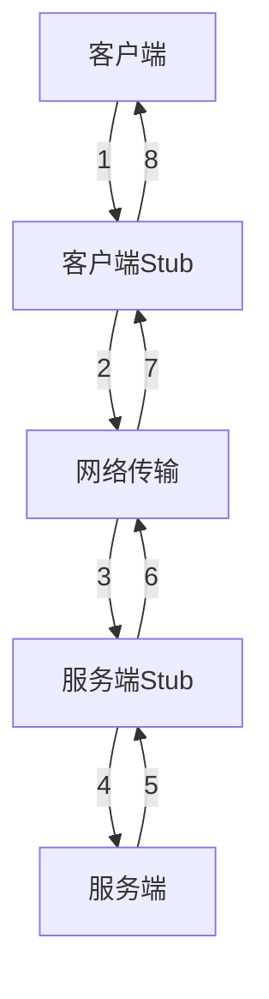

[toc]

---

# 理论
## 什么是RPC?

RPC (Remote Procedure Call) 即远程过程调用。

RPC能够帮助我门将两个不同的服务器上的服务提供的方法，所需要的网络编程调用实现，使得将远程服务的方法像本地调用一样简单，并且忽略具体的底层网络实现细节。

## RPC原理是什么？

RPC的核心功能组成大致可以看作以下几个部分：

1. 客户端（消费者）。调用远程方法的一端。
2. 客户端 Stub(桩)。代理类，将调用的服务的类，方法，参数和类型等信息传输到服务端。
3. 网络传输。就是通过什么样的网络形式和数据协议进行传输，常见的实现方式有基于Socket、HTTP或Netty框架。
4. 服务端  Stub(桩)。实际接收到的请求信息后，调取对应的方法返回处理结果给客户端。
5. 服务端（提供者）。提供远程方法的一端。

流程大致如下：

1. 服务消费端（Client）以本地调用的方式调用远程服务（Service）
2. 消费端Stub（Client stub）接收到调用后负责将方法、参数等组装成能够进行网络传输的消息体（序列化）：RpcRequest
3. 消费端Stub（Client stub）找到远程服务地址，并将序列化后的消息发送给服务端Stub
4. 服务端Stub（Server Stub）收到消息后，将消息反序列化为Java对象：RpcRequest
5. 服务端Stub（Server Stub）根据对象中的类、方法、参数等信息调用本地方法。
6. 服务端Stub（Server Stub）得到方法执行的结果并将其组装成能够进行网络传输的消息体：RpcResponse（序列化）发送至消费端
7. 消费端Stub（Client Stub）接收到消息并将消息反序列化为Java对象：RpcResponse，这样就执行完整个调用流程了。