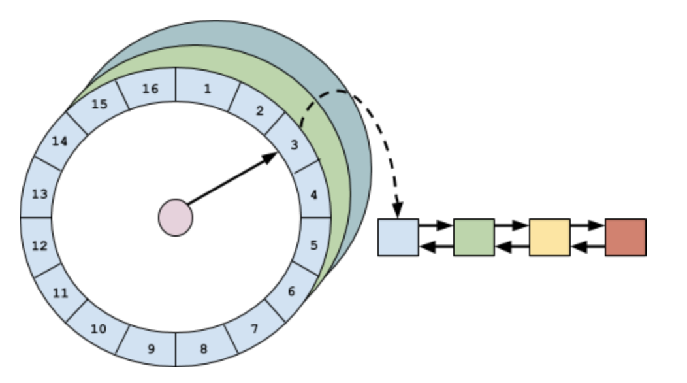

[toc]

---

# 淘汰算法

 [算法-淘汰算法.md](..\..\..\..\..\算法\淘汰算法\算法-淘汰算法.md) 


# 异步高性能读写

一般的缓存每次对数据处理完之后（读的话，已经存在则直接返回，不存在则 load 数据，保存，再返回；写的话，则直接插入或更新），但是因为要维护一些淘汰策略，则需要一些额外的操作，诸如：

- 计算和比较数据的是否过期
- 统计频率（像 LFU 或其变种）
- 维护 read queue 和 write queue
- 淘汰符合条件的数据
- 等等。。。

这种数据的读写伴随着缓存状态的变更，Guava Cache 的做法是把这些操作和读写操作放在一起，在一个同步加锁的操作中完成，虽然 Guava Cache 巧妙地利用了 JDK 的 ConcurrentHashMap（分段锁或者无锁 CAS）来降低锁的密度，达到提高并发度的目的。但是，对于一些热点数据，这种做法还是避免不了频繁的锁竞争。Caffeine 借鉴了[数据库](https://cloud.tencent.com/solution/database?from_column=20065&from=20065)系统的 WAL（Write-Ahead Logging）思想，即先写日志再执行操作，这种思想同样适合缓存的，执行读写操作时，先把操作记录在缓冲区，然后在合适的时机异步、批量地执行缓冲区中的内容。但在执行缓冲区的内容时，也是需要在缓冲区加上同步锁的，不然存在并发问题，只不过这样就可以把对锁的竞争从缓存数据转移到对缓冲区上。

## 读缓冲

 在 Caffeine 的内部实现中，为了很好的支持不同的 Features（如 Eviction，Removal，Refresh，Statistics，Cleanup，Policy 等等），扩展了很多子类，它们共同的父类是`BoundedLocalCache`，而`readBuffer`就是作为它们共有的属性，即都是用一样的 readBuffer，看定义： 

```java
readBuffer = evicts() || collectKeys() || collectValues() || expiresAfterAccess()
        ? new BoundedBuffer<>()
        : Buffer.disabled();
```

每次读后，都会调用 afterReader 做读取后的处理操作

```java

  /**
   * Performs the post-processing work required after a read.
   * 执行读以后的所需要的后置处理操作
   * @param node the entry in the page replacement policy
   * @param now the current time, in nanoseconds
   * @param recordHit if the hit count should be incremented
   * @return the refreshed value if immediately loaded, else null
   */
  @Nullable V afterRead(Node<K, V> node, long now, boolean recordHit) {
    if (recordHit) {
      statsCounter().recordHits(1);
    }
      
      //把记录加入到readBuffer
  //判断是否需要立即处理readBuffer
  //注意这里无论offer是否成功都可以走下去的，即允许写入readBuffer丢失
    boolean delayable = skipReadBuffer() || (readBuffer.offer(node) != Buffer.FULL);
      // 是否需要执行维护操作
    if (shouldDrainBuffers(delayable)) {
      scheduleDrainBuffers();
    }
      // 如果符合条件， 则异步刷新条目
    return refreshIfNeeded(node, now);
  }

```

需要看一下关于 BoundBuffer 类 和父类 StripedBuffer

```java

/**
 * A striped, non-blocking, bounded buffer.
 	一个有条纹的，非阻塞，有界的缓冲
 *
 * @author ben.manes@gmail.com (Ben Manes)
 * @param <E> the type of elements maintained by this buffer
 */
final class BoundedBuffer<E> extends StripedBuffer<E> {
    
    
/**
 * A base class providing the mechanics for supporting dynamic striping of bounded buffers. This
 * implementation is an adaption of the numeric 64-bit <i>java.util.concurrent.atomic.Striped64</i>
 * class, which is used by atomic counters. The approach was modified to lazily grow an array of
 * buffers in order to minimize memory usage for caches that are not heavily contended on.
 *
 * @author dl@cs.oswego.edu (Doug Lea)
 * @author ben.manes@gmail.com (Ben Manes)
 */
abstract class StripedBuffer<E> implements Buffer<E> {
```

这个`StripedBuffer`设计的思想是`Striped64`的一种改进，通过扩展结构把竞争热点分离。

具体实现是这样的，`StripedBuffer`维护一个`Buffer[]`数组，每个元素就是一个`RingBuffer`，每个线程用自己`threadLocalRandomProbe`属性作为 hash 值，这样就相当于每个线程都有自己“专属”的`RingBuffer`，就不会产生竞争啦，而不是用 key 的`hashCode`作为 hash 值，因为会产生热点数据问题。

看看`StripedBuffer`的属性

```javascript
/** Table of buffers. When non-null, size is a power of 2. */
//RingBuffer数组
transient volatile Buffer<E> @Nullable[] table;

//当进行resize时，需要整个table锁住。tableBusy作为CAS的标记。
static final long TABLE_BUSY = UnsafeAccess.objectFieldOffset(StripedBuffer.class, "tableBusy");
static final long PROBE = UnsafeAccess.objectFieldOffset(Thread.class, "threadLocalRandomProbe");

/** Number of CPUS. */
static final int NCPU = Runtime.getRuntime().availableProcessors();

/** The bound on the table size. */
//table最大size
static final int MAXIMUM_TABLE_SIZE = 4 * ceilingNextPowerOfTwo(NCPU);

/** The maximum number of attempts when trying to expand the table. */
//如果发生竞争时（CAS失败）的尝试次数
static final int ATTEMPTS = 3;

/** Table of buffers. When non-null, size is a power of 2. */
//核心数据结构
transient volatile Buffer<E> @Nullable[] table;

/** Spinlock (locked via CAS) used when resizing and/or creating Buffers. */
transient volatile int tableBusy;

/** CASes the tableBusy field from 0 to 1 to acquire lock. */
final boolean casTableBusy() {
  return UnsafeAccess.UNSAFE.compareAndSwapInt(this, TABLE_BUSY, 0, 1);
}

/**
 * Returns the probe value for the current thread. Duplicated from ThreadLocalRandom because of
 * packaging restrictions.
 */
static final int getProbe() {
  return UnsafeAccess.UNSAFE.getInt(Thread.currentThread(), PROBE);
}
```

`offer`方法，当没初始化或存在竞争时，则扩容为 2 倍。

实际是调用`RingBuffer`的 offer 方法，把数据追加到`RingBuffer`后面。

```javascript
@Override
public int offer(E e) {
  int mask;
  int result = 0;
  Buffer<E> buffer;
  //是否不存在竞争
  boolean uncontended = true;
  Buffer<E>[] buffers = table
  //是否已经初始化
  if ((buffers == null)
      || (mask = buffers.length - 1) < 0
      //用thread的随机值作为hash值，得到对应位置的RingBuffer
      || (buffer = buffers[getProbe() & mask]) == null
      //检查追加到RingBuffer是否成功
      || !(uncontended = ((result = buffer.offer(e)) != Buffer.FAILED))) {
    //其中一个符合条件则进行扩容
    expandOrRetry(e, uncontended);
  }
  return result;
}

/**
 * Handles cases of updates involving initialization, resizing, creating new Buffers, and/or
 * contention. See above for explanation. This method suffers the usual non-modularity problems of
 * optimistic retry code, relying on rechecked sets of reads.
 *
 * @param e the element to add
 * @param wasUncontended false if CAS failed before call
 */

//这个方法比较长，但思路还是相对清晰的。
@SuppressWarnings("PMD.ConfusingTernary")
final void expandOrRetry(E e, boolean wasUncontended) {
  int h;
  if ((h = getProbe()) == 0) {
    ThreadLocalRandom.current(); // force initialization
    h = getProbe();
    wasUncontended = true;
  }
  boolean collide = false; // True if last slot nonempty
  for (int attempt = 0; attempt < ATTEMPTS; attempt++) {
    Buffer<E>[] buffers;
    Buffer<E> buffer;
    int n;
    if (((buffers = table) != null) && ((n = buffers.length) > 0)) {
      if ((buffer = buffers[(n - 1) & h]) == null) {
        if ((tableBusy == 0) && casTableBusy()) { // Try to attach new Buffer
          boolean created = false;
          try { // Recheck under lock
            Buffer<E>[] rs;
            int mask, j;
            if (((rs = table) != null) && ((mask = rs.length) > 0)
                && (rs[j = (mask - 1) & h] == null)) {
              rs[j] = create(e);
              created = true;
            }
          } finally {
            tableBusy = 0;
          }
          if (created) {
            break;
          }
          continue; // Slot is now non-empty
        }
        collide = false;
      } else if (!wasUncontended) { // CAS already known to fail
        wasUncontended = true;      // Continue after rehash
      } else if (buffer.offer(e) != Buffer.FAILED) {
        break;
      } else if (n >= MAXIMUM_TABLE_SIZE || table != buffers) {
        collide = false; // At max size or stale
      } else if (!collide) {
        collide = true;
      } else if (tableBusy == 0 && casTableBusy()) {
        try {
          if (table == buffers) { // Expand table unless stale
            table = Arrays.copyOf(buffers, n << 1);
          }
        } finally {
          tableBusy = 0;
        }
        collide = false;
        continue; // Retry with expanded table
      }
      h = advanceProbe(h);
    } else if ((tableBusy == 0) && (table == buffers) && casTableBusy()) {
      boolean init = false;
      try { // Initialize table
        if (table == buffers) {
          @SuppressWarnings({"unchecked", "rawtypes"})
          Buffer<E>[] rs = new Buffer[1];
          rs[0] = create(e);
          table = rs;
          init = true;
        }
      } finally {
        tableBusy = 0;
      }
      if (init) {
        break;
      }
    }
  }
}
```

最后看看`RingBuffer`，注意`RingBuffer`是`BoundedBuffer`的内部类。

```javascript
/** The maximum number of elements per buffer. */
static final int BUFFER_SIZE = 16;

// Assume 4-byte references and 64-byte cache line (16 elements per line)
//256长度，但是是以16为单位，所以最多存放16个元素
static final int SPACED_SIZE = BUFFER_SIZE << 4;
static final int SPACED_MASK = SPACED_SIZE - 1;
static final int OFFSET = 16;
//RingBuffer数组
final AtomicReferenceArray<E> buffer;

 //插入方法
 @Override
 public int offer(E e) {
   long head = readCounter;
   long tail = relaxedWriteCounter();
   //用head和tail来限制个数
   long size = (tail - head);
   if (size >= SPACED_SIZE) {
     return Buffer.FULL;
   }
   //tail追加16
   if (casWriteCounter(tail, tail + OFFSET)) {
     //用tail“取余”得到下标
     int index = (int) (tail & SPACED_MASK);
     //用unsafe.putOrderedObject设值
     buffer.lazySet(index, e);
     return Buffer.SUCCESS;
   }
   //如果CAS失败则返回失败
   return Buffer.FAILED;
 }

 //用consumer来处理buffer的数据
 @Override
 public void drainTo(Consumer<E> consumer) {
   long head = readCounter;
   long tail = relaxedWriteCounter();
   //判断数据多少
   long size = (tail - head);
   if (size == 0) {
     return;
   }
   do {
     int index = (int) (head & SPACED_MASK);
     E e = buffer.get(index);
     if (e == null) {
       // not published yet
       break;
     }
     buffer.lazySet(index, null);
     consumer.accept(e);
     //head也跟tail一样，每次递增16
     head += OFFSET;
   } while (head != tail);
   lazySetReadCounter(head);
 }
```

注意，ring buffer 的 size（固定是 16 个）是不变的，变的是 head 和 tail 而已。

总的来说`ReadBuffer`有如下特点：

- 使用 `Striped-RingBuffer`来提升对 buffer 的读写
- 用 thread 的 hash 来避开热点 key 的竞争
- 允许写入的丢失

## 写缓存

 与读缓冲类似，写缓冲是为了储存写事件。读缓冲中的事件主要是为了优化驱逐策略的命中率，因此读缓冲中的事件完整程度允许一定程度的有损。但是写缓冲并不允许数据的丢失，因此其必须实现为一个安全的队列。Caffeine 写是把数据放入MpscGrowableArrayQueue 阻塞队列中，它参考了JCTools里的MpscGrowableArrayQueue ，是针对 MPSC- 多生产者单消费者（Multi-Producer & Single-Consumer）场景的高性能实现。多个生产者同时并发地写入队列是线程安全的，但是同一时刻只允许一个消费者消费队列。 

##### **WriteBuffer**

`writeBuffer`跟`readBuffer`不一样，主要体现在使用场景的不一样。本来缓存的一般场景是读多写少的，读的并发会更高，且 afterRead 显得没那么重要，允许延迟甚至丢失。写不一样，写`afterWrite`不允许丢失，且要求尽量马上执行。Caffeine 使用MPSC（Multiple Producer / Single Consumer）作为 buffer 数组，实现在`MpscGrowableArrayQueue`类，它是仿照`JCTools`的`MpscGrowableArrayQueue`来写的。

MPSC 允许无锁的高并发写入，但只允许一个消费者，同时也牺牲了部分操作。

#### **TimerWheel**

除了支持`expireAfterAccess`和`expireAfterWrite`之外（Guava Cache 也支持这两个特性），Caffeine 还支持`expireAfter`。因为`expireAfterAccess`和`expireAfterWrite`都只能是固定的过期时间，这可能满足不了某些场景，譬如记录的过期时间是需要根据某些条件而不一样的，这就需要用户自定义过期时间。

先看看`expireAfter`的用法

```javascript
private static LoadingCache<String, String> cache = Caffeine.newBuilder()
        .maximumSize(256L)
        .initialCapacity(1)
        //.expireAfterAccess(2, TimeUnit.DAYS)
        //.expireAfterWrite(2, TimeUnit.HOURS)
        .refreshAfterWrite(1, TimeUnit.HOURS)
        //自定义过期时间
        .expireAfter(new Expiry<String, String>() {
            //返回创建后的过期时间
            @Override
            public long expireAfterCreate(@NonNull String key, @NonNull String value, long currentTime) {
                return 0;
            }

            //返回更新后的过期时间
            @Override
            public long expireAfterUpdate(@NonNull String key, @NonNull String value, long currentTime, @NonNegative long currentDuration) {
                return 0;
            }

            //返回读取后的过期时间
            @Override
            public long expireAfterRead(@NonNull String key, @NonNull String value, long currentTime, @NonNegative long currentDuration) {
                return 0;
            }
        })
        .recordStats()
        .build(new CacheLoader<String, String>() {
            @Nullable
            @Override
            public String load(@NonNull String key) throws Exception {
                return "value_" + key;
            }
        });
```

通过自定义过期时间，使得不同的 key 可以动态的得到不同的过期时间。

注意，我把`expireAfterAccess`和`expireAfterWrite`注释了，因为这两个特性不能跟`expireAfter`一起使用。

而当使用了`expireAfter`特性后，Caffeine 会启用一种叫“时间轮”的算法来实现这个功能。更多关于时间轮的介绍，可以看我的文章**HashedWheelTimer 时间轮原理分析[6]**。

好，重点来了，为什么要用时间轮？

对`expireAfterAccess`和`expireAfterWrite`的实现是用一个`AccessOrderDeque`双端队列，它是 FIFO 的，因为它们的过期时间是固定的，所以在队列头的数据肯定是最早过期的，要处理过期数据时，只需要首先看看头部是否过期，然后再挨个检查就可以了。但是，如果过期时间不一样的话，这需要对`accessOrderQueue`进行排序&插入，这个代价太大了。于是，Caffeine 用了一种更加高效、优雅的算法-时间轮。

时间轮的结构：



因为在我的对时间轮分析的文章里已经说了时间轮的原理和机制了，所以我就不展开 Caffeine 对时间轮的实现了。

Caffeine 对时间轮的实现在`TimerWheel`，它是一种多层时间轮（hierarchical timing wheels ）。

看看元素加入到时间轮的`schedule`方法：

```javascript
/**
 * Schedules a timer event for the node.
 *
 * @param node the entry in the cache
 */
public void schedule(@NonNull Node<K, V> node) {
  Node<K, V> sentinel = findBucket(node.getVariableTime());
  link(sentinel, node);
}

/**
 * Determines the bucket that the timer event should be added to.
 *
 * @param time the time when the event fires
 * @return the sentinel at the head of the bucket
 */
Node<K, V> findBucket(long time) {
  long duration = time - nanos;
  int length = wheel.length - 1;
  for (int i = 0; i < length; i++) {
    if (duration < SPANS[i + 1]) {
      long ticks = (time >>> SHIFT[i]);
      int index = (int) (ticks & (wheel[i].length - 1));
      return wheel[i][index];
    }
  }
  return wheel[length][0];
}

/** Adds the entry at the tail of the bucket's list. */
void link(Node<K, V> sentinel, Node<K, V> node) {
  node.setPreviousInVariableOrder(sentinel.getPreviousInVariableOrder());
  node.setNextInVariableOrder(sentinel);

  sentinel.getPreviousInVariableOrder().setNextInVariableOrder(node);
  sentinel.setPreviousInVariableOrder(node);
}
```

#### **其他**

Caffeine 还有其他的优化性能的手段，如使用软引用和弱引用、消除伪共享、`CompletableFuture`异步等等。

### **总结**

**Caffeien 是一个优秀的本地缓存，通过使用 W-TinyLFU 算法， 高性能的 readBuffer 和 WriteBuffer，时间轮算法等，使得它拥有高性能，高命中率（near optimal），低内存占用等特点。**