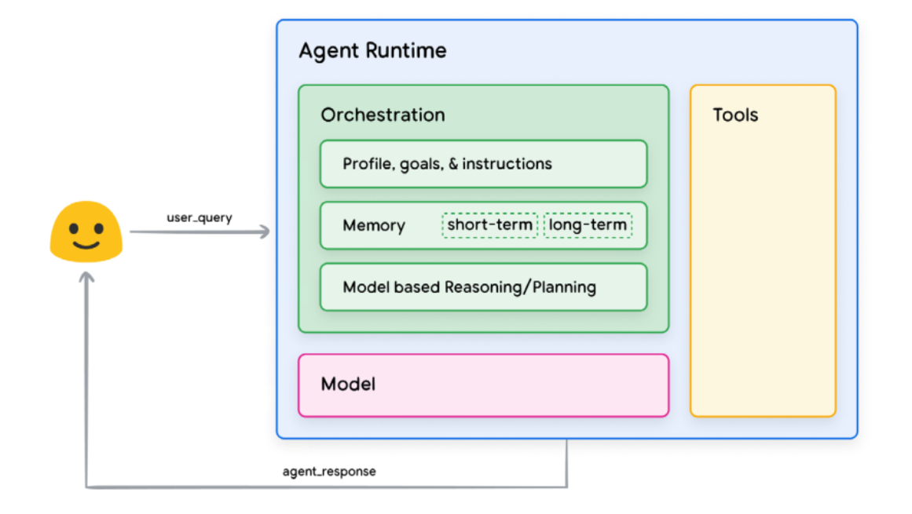
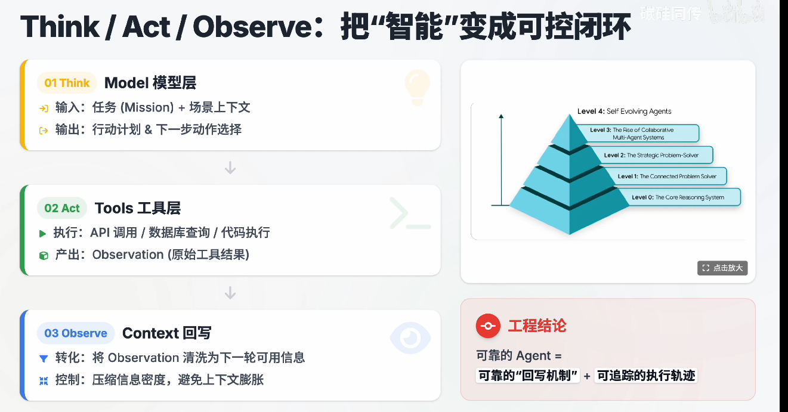
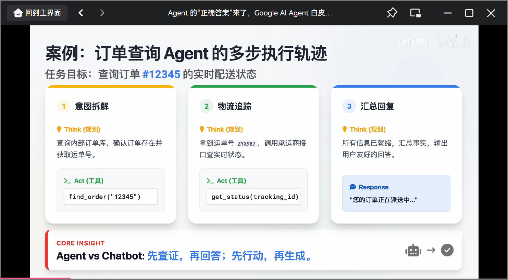
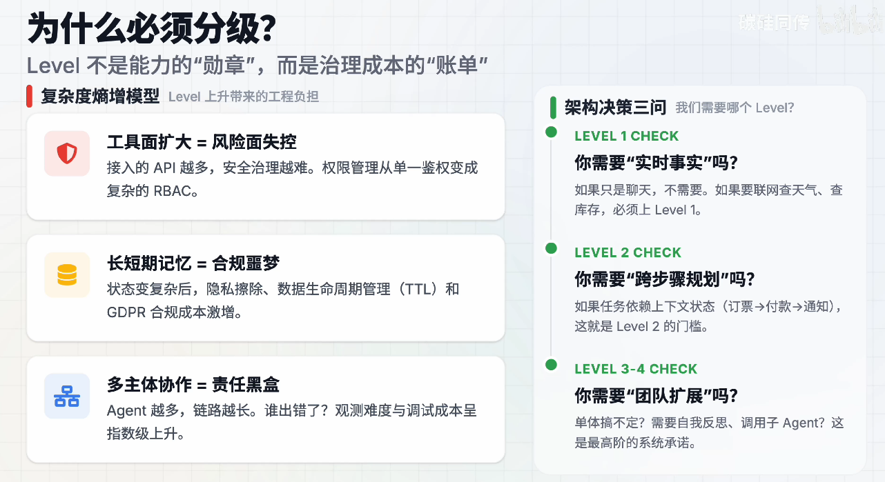
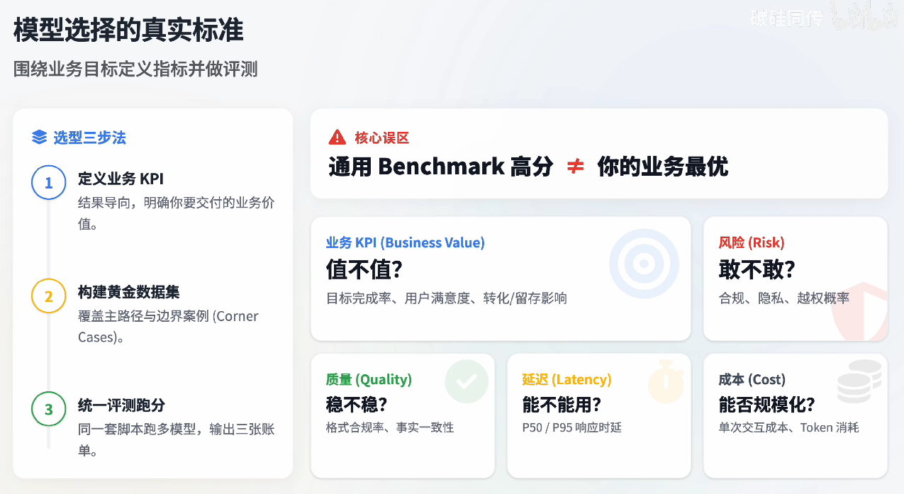
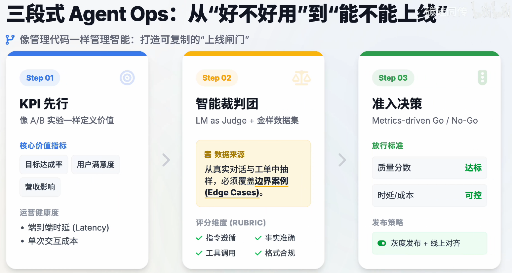

- [前言](#前言)
- [google\_agent\_2025](#google_agent_2025)
  - [核心导航](#核心导航)
    - [01：架构定义](#01架构定义)
    - [02：工具互联](#02工具互联)
    - [03：记忆工程](#03记忆工程)
    - [04：质量内建](#04质量内建)
    - [05：生产交付](#05生产交付)
- [Intro to Agent](#intro-to-agent)
  - [Agent 四要素](#agent-四要素)
    - [模型（Model）——Brain](#模型modelbrain)
    - [工具（Tools）——Hands](#工具toolshands)
    - [编排层（Orchestration layer）——Nervous System](#编排层orchestration-layernervous-system)
    - [部署(Deployment)——Body](#部署deploymentbody)
  - [Agent 五步循环](#agent-五步循环)
    - [流程拆解](#流程拆解)
    - [核心特点](#核心特点)
    - [Think/Act/Observe：智能可控闭环体系](#thinkactobserve智能可控闭环体系)
      - [三层闭环架构](#三层闭环架构)
        - [1. Think（模型层）](#1-think模型层)
        - [2. Act（工具层）](#2-act工具层)
        - [3. Observe（Context回写）](#3-observecontext回写)
      - [智能体能力进化层级](#智能体能力进化层级)
        - [工程结论](#工程结论)
      - [案例：订单查询Agent的多读](#案例订单查询agent的多读)
        - [执行步骤拆解](#执行步骤拆解)
          - [1. 意图拆解](#1-意图拆解)
          - [2. 物流追踪](#2-物流追踪)
          - [3. 汇总回复](#3-汇总回复)
        - [核心价值](#核心价值)
    - [“为什么必须对智能体分级？”：治理成本视角的解析](#为什么必须对智能体分级治理成本视角的解析)
      - [层级上升带来的工程负担（复杂度熵增模型）](#层级上升带来的工程负担复杂度熵增模型)
      - [架构决策三问：如何选择合适的Level？](#架构决策三问如何选择合适的level)
    - [层级定位](#层级定位)
      - [Level 0→Level 1：智能体的“能力换代”：从“纯推理”到“连接型解题者”](#level-0level-1智能体的能力换代从纯推理到连接型解题者)
        - [Level 0（孤岛模式：Core Reasoning System）](#level-0孤岛模式core-reasoning-system)
        - [Level 1（破壁模式：Connected Problem-Solver）](#level-1破壁模式connected-problem-solver)
        - [Agent工程视角的关键](#agent工程视角的关键)
      - [Level 2（智能体的核心分水岭：Context Engineering）](#level-2智能体的核心分水岭context-engineering)
        - [上下文管理的三个核心动作](#上下文管理的三个核心动作)
          - [1. 选（Select）](#1-选select)
          - [2. 装（Pack）](#2-装pack)
          - [3. 控（Control）](#3-控control)
        - [常见失败模式](#常见失败模式)
        - [工程落地要点](#工程落地要点)
      - [Level3-4：智能体从“单体能力”到“组织能力”的进化](#level3-4智能体从单体能力到组织能力的进化)
        - [Level 3：协作多智能体（Collaborative Multi-Agent System）](#level-3协作多智能体collaborative-multi-agent-system)
        - [Level 4：自进化系统（Self-Evolving System）](#level-4自进化系统self-evolving-system)
        - [工程代价与治理重点](#工程代价与治理重点)
  - [Model 选择](#model-选择)
    - [模型选择的真实标准：以业务目标为核心的选型逻辑](#模型选择的真实标准以业务目标为核心的选型逻辑)
      - [选型三步法](#选型三步法)
      - [核心误区](#核心误区)
      - [选型评估维度](#选型评估维度)
    - [Agentic Fundamentals：智能体的核心双要素](#agentic-fundamentals智能体的核心双要素)
      - [核心双要素拆解](#核心双要素拆解)
        - [1. 复杂多步推理能力（Complex Reasoning）](#1-复杂多步推理能力complex-reasoning)
        - [2. 可靠工具使用能力（Reliable Tool Use）](#2-可靠工具使用能力reliable-tool-use)
      - [质量拆解：可观测指标与常见问题](#质量拆解可观测指标与常见问题)
    - [工程权衡与策略：生产级Agent架构的三大支柱](#工程权衡与策略生产级agent架构的三大支柱)
      - [1. 工程不可能三角：核心取舍逻辑](#1-工程不可能三角核心取舍逻辑)
      - [2. 多模型路由策略：精准匹配需求](#2-多模型路由策略精准匹配需求)
      - [3. Agent Ops闭环：可持续迭代](#3-agent-ops闭环可持续迭代)
  - [Tools：链接现实世界](#tools链接现实世界)
    - [检索Grounding：将回答锚定在事实之上](#检索grounding将回答锚定在事实之上)
      - [核心目标](#核心目标)
      - [主流落地方式](#主流落地方式)
      - [工程落地关键](#工程落地关键)
    - [结构化与执行：Agent从“思考”到“改变世界”的落地能力](#结构化与执行agent从思考到改变世界的落地能力)
      - [1. 结构化数据访问](#1-结构化数据访问)
      - [2. 执行类工具封装](#2-执行类工具封装)
      - [3. 代码沙箱执行](#3-代码沙箱执行)
    - [HITL：为Agent自动化加装“安全控制装置”](#hitl为agent自动化加装安全控制装置)
      - [1. 必停时刻：明确需要人工介入的场景](#1-必停时刻明确需要人工介入的场景)
      - [2. 工具化接入：将人工介入标准化](#2-工具化接入将人工介入标准化)
      - [3. 落地价值](#3-落地价值)
  - [Function Calling \& 协议：工具调用的工程化升级](#function-calling--协议工具调用的工程化升级)
    - [三大核心维度](#三大核心维度)
    - [可靠工具调用三要素：实现长期稳定的工具交互](#可靠工具调用三要素实现长期稳定的工具交互)
      - [1. 清晰指令：明确工具调用的规则](#1-清晰指令明确工具调用的规则)
      - [2. 安全连接：保障工具调用的合规与风险可控](#2-安全连接保障工具调用的合规与风险可控)
      - [3. 编排保证：实现工具调用的流程可控](#3-编排保证实现工具调用的流程可控)
    - [契约与互操作：OpenAPI、MCP、原生工具的选型与协同](#契约与互操作openapimcp原生工具的选型与协同)
      - [1. OpenAPI：标准化契约型工具](#1-openapi标准化契约型工具)
      - [2. MCP：互操作连接型工具](#2-mcp互操作连接型工具)
      - [3. Native（原生工具）：快速集成型工具](#3-native原生工具快速集成型工具)
  - [Orchestration Layer：智能体系统的行为中枢](#orchestration-layer智能体系统的行为中枢)
    - [核心定位与架构](#核心定位与架构)
    - [核心职能](#核心职能)
    - [编排层的职责：智能体系统的“状态机”与“调度器”](#编排层的职责智能体系统的状态机与调度器)
      - [1. 驱动运行循环](#1-驱动运行循环)
      - [2. 管理State与Memory](#2-管理state与memory)
      - [3. 决策策略与成本控制](#3-决策策略与成本控制)
    - [核心设计取舍：自治度与生产级治理](#核心设计取舍自治度与生产级治理)
      - [一、自治度谱系：两种模式的取舍](#一自治度谱系两种模式的取舍)
      - [二、生产级硬标准](#二生产级硬标准)
  - [Context Engineering：Agent的“上下文策展”逻辑](#context-engineeringagent的上下文策展逻辑)
    - [Context Window的结构化组成](#context-window的结构化组成)
    - [上下文全景：一轮LM调用的信息组成](#上下文全景一轮lm调用的信息组成)
      - [上下文模块拆解](#上下文模块拆解)
    - [记忆工程化：短期为轨迹，长期为可检索资产](#记忆工程化短期为轨迹长期为可检索资产)
      - [短期记忆（Short-term / Scratchpad）](#短期记忆short-term--scratchpad)
      - [长期记忆（Long-term / Persistent）](#长期记忆long-term--persistent)
  - [Multi-Agent Systems：构建“专家团队”而非“全能Agent”](#multi-agent-systems构建专家团队而非全能agent)
    - [两种模式的对比](#两种模式的对比)
    - [专家团队Agent分工模板](#专家团队agent分工模板)
    - [团队化的价值：从“全能但脆”到“分工且稳”](#团队化的价值从全能但脆到分工且稳)
      - [Super-Agent的问题：复杂度耦合陷阱](#super-agent的问题复杂度耦合陷阱)
      - [团队化的核心价值](#团队化的核心价值)
    - [Multi-Agent协同模式全景图谱](#multi-agent协同模式全景图谱)
      - [1. Coordinator（拆解者）](#1-coordinator拆解者)
      - [2. Sequential（串行者）](#2-sequential串行者)
      - [3. Iterative Refinement（优化者）](#3-iterative-refinement优化者)
      - [4. HITL停顿点（刹车者）](#4-hitl停顿点刹车者)
  - [Agent Ops：用“可观测+评测”驯服Agent的不确定性](#agent-ops用可观测评测驯服agent的不确定性)
    - [Agent Ops的定位（GenAIOps体系）](#agent-ops的定位genaiops体系)
    - [Agent Ops的核心价值](#agent-ops的核心价值)
    - [传统单测在Agent系统中失效的原因：从“确定性”到“概率性”的评估转变](#传统单测在agent系统中失效的原因从确定性到概率性的评估转变)
      - [传统软件 vs Agent系统的测试逻辑对比](#传统软件-vs-agent系统的测试逻辑对比)
      - [核心转变：从“结果断言”到“全链路评估”](#核心转变从结果断言到全链路评估)
    - [三段式Agent Ops：从“好不好用”到“能不能上线”](#三段式agent-ops从好不好用到能不能上线)
      - [Step 01：KPI先行——定义价值标准](#step-01kpi先行定义价值标准)
      - [Step 02：智能裁判团——量化质量表现](#step-02智能裁判团量化质量表现)
      - [Step 03：准入决策——Metrics驱动的上线判断](#step-03准入决策metrics驱动的上线判断)
    - [可观测+闭环：让Agent的问题从“不可解”到“可修复”](#可观测闭环让agent的问题从不可解到可修复)
      - [1. OpenTelemetry Traces：用轨迹替代“玄学”](#1-opentelemetry-traces用轨迹替代玄学)
      - [2. Human Feedback→Golden Dataset：用Bad Case做“疫苗”](#2-human-feedbackgolden-dataset用bad-case做疫苗)
      - [3. 最终闭环：Go/No-Go的免疫机制](#3-最终闭环gono-go的免疫机制)
  - [Interoperability：从单体Agent到生态化协同](#interoperability从单体agent到生态化协同)
    - [三大互操作维度](#三大互操作维度)
    - [Agents and Humans：交互形态的四级跃迁](#agents-and-humans交互形态的四级跃迁)
      - [1. Chatbot（文本对话）](#1-chatbot文本对话)
      - [2. 结构化输出（JSON驱动）](#2-结构化输出json驱动)
      - [3. Computer Use（操作遗留UI）](#3-computer-use操作遗留ui)
      - [4. Live Mode（实时多模态）](#4-live-mode实时多模态)
    - [Agents and Agents：A2A将“蜘蛛网集成”重构为“标准协作”](#agents-and-agentsa2a将蜘蛛网集成重构为标准协作)
      - [一、规模化痛点：私有API的“蜘蛛网陷阱”](#一规模化痛点私有api的蜘蛛网陷阱)
      - [二、A2A核心协议：解决两大难题](#二a2a核心协议解决两大难题)
      - [三、关键支撑：Agent Card与通信边界](#三关键支撑agent-card与通信边界)
    - [Agents and Money：交易场景的核心是“信任层”](#agents-and-money交易场景的核心是信任层)
      - [一、核心冲突：Agent交易的授权危机](#一核心冲突agent交易的授权危机)
      - [二、信任层的核心支撑方案](#二信任层的核心支撑方案)
      - [三、核心原则：先信任治理，再自动交易](#三核心原则先信任治理再自动交易)
    - [核心张力与风险：Agent的“效用-风险”安全悖论](#核心张力与风险agent的效用-风险安全悖论)
      - [三大核心风险](#三大核心风险)
      - [工程铁律：安全靠系统级约束](#工程铁律安全靠系统级约束)
    - [防御纵深（Defense-in-Depth）：硬规则+智能审查的双层安全体系](#防御纵深defense-in-depth硬规则智能审查的双层安全体系)
      - [LAYER 01：确定性Guardrails（硬规则防线）](#layer-01确定性guardrails硬规则防线)
      - [LAYER 02：推理型Guard Models（智能审查防线）](#layer-02推理型guard-models智能审查防线)
    - [平台化治理：从单体到规模化的Agent管控](#平台化治理从单体到规模化的agent管控)
      - [核心痛点：Agent Sprawl](#核心痛点agent-sprawl)
      - [治理三件套](#治理三件套)
      - [最终交付：可信赖的基础设施](#最终交付可信赖的基础设施)
  - [Deployment：把Agent当“长期运行服务”交付](#deployment把agent当长期运行服务交付)
    - [核心认知：Agent = Service](#核心认知agent--service)
    - [部署的目标：把Agent交付成“可运营服务”](#部署的目标把agent交付成可运营服务)
      - [四大核心能力](#四大核心能力)
    - [两条部署路径：平台化运行时vs容器化自部署](#两条部署路径平台化运行时vs容器化自部署)
      - [PATH 01：平台化运行时（Vertex AI Agent Engine）](#path-01平台化运行时vertex-ai-agent-engine)
      - [PATH 02：容器化自部署（Cloud Run/GKE）](#path-02容器化自部署cloud-rungke)
      - [核心结论：是速度与控制的权衡](#核心结论是速度与控制的权衡)
    - [生产级工程投入：CI/CD + 自动化测试——Agent系统的“工程双翼”](#生产级工程投入cicd--自动化测试agent系统的工程双翼)
      - [为什么必须做？](#为什么必须做)
      - [一、CI/CD流水线：拒绝“人手点按钮”](#一cicd流水线拒绝人手点按钮)
      - [二、自动化测试：三道守门员](#二自动化测试三道守门员)
- [Agent tools \& Interoperability](#agent-tools--interoperability)

# 前言
- google_agent_2025
  - 原文：[google_agent_ai](https://www.kaggle.com/whitepaper-agents)
  - pdf: [google_agent](./google_agent_2025.pdf)

# google_agent_2025

## 核心导航

### 01：架构定义
- **核心内容**：Agent 定义与架构语言
- **模块标识**：Introduction
- **简易说明**：明确智能体（Agent）的功能边界、交互逻辑，用标准化的“架构语言”统一设计规则，是整个工程的基础框架搭建。

### 02：工具互联
- **核心内容**：工具调用与互操作标准（MCP）
- **模块标识**：Tools & MCP
- **简易说明**：制定工具之间的调用、协作规范（MCP是互操作标准），让不同工具能高效对接、数据互通，避免“信息孤岛”。

### 03：记忆工程
- **核心内容**：会话状态与长期记忆系统
- **模块标识**：Sessions & Memory
- **简易说明**：搭建能记录会话过程（临时状态）、存储历史信息（长期记忆）的系统，让智能体具备“上下文延续”和“经验复用”的能力。

### 04：质量内建
- **核心内容**：可观测性与评测（LM as Judge）
- **模块标识**：Quality & Eval
- **简易说明**：通过“可观测”实时监控系统运行状态，同时用大语言模型（LM）作为“裁判”，自动评估输出结果的质量，提前发现问题。

### 05：生产交付
- **核心内容**：部署扩展、协作与企业治理
- **模块标识**：Proto to Prod
- **简易说明**：把原型系统落地到实际生产环境，支持规模扩展、团队协作，同时建立企业级的管理规则（如权限、安全），保障系统稳定运行。

# Intro to Agent

## Agent 四要素

在白皮书的图中，Agent 实际至少有三要素分别是：Tools, Model 和 Orchestration

大脑负责思考，双手负责行动，神经系统负责调度，身体负责长期运行。

### 模型（Model）——Brain
> 推理与决策引擎。
> 决定系统的**智力上限与能力边界**

在Agent的范围内，模型指的是将被用作集中决策者的语言模型（LM）。
- Agent使用的模型可以是任何大小的小型/大型的任意数量的LM，这些LM都可以遵循基于指令的推理和逻辑框架，如ReAct、Chain-of-Thought或Tree-of-Thought。
- 模型可以是一般用途、多模态或根据您特定Agent架构的需求进行微调的。
- 为了获得最佳生产结果，你应该利用最适合你所期望的应用程序的模型，并且最好是在使用计划用于认知架构中的工具的数据签名上进行了训练。
- 值得注意的是，该模型通常不会与Agent的具体配置设置（即工具选择、编排/推理设置）一起进行训练。然而，通过向它提供展示Agent能力的例子来进一步细化模型也是可能的，包括Agent使用特定工具或各种上下文下的推理步骤实例。

### 工具（Tools）——Hands
> 连接现实世界
> 提供**API调用、检索与数据读写能力**

基础模型，尽管其文本和图像生成令人印象深刻，但仍然受到无法与外部世界交互的限制。工具填补了这一差距，使Agent能够与外部数据和服务进行交互，并解锁了单一的基础模型所不能实现的一系列更广泛的操作。
- 工具可以采取多种形式，并具有不同的复杂程度，但通常会遵循常见的Web API方法，如GET、POST、PATCH 和DELETE等。例如，一个工具可以更新数据库中的客户信息或获取天气数据以影响Agent向用户提供的旅行推荐。
- 借助工具，Agent可以访问并处理现实世界的资讯。这赋予他们支持更多专门系统的能力，如检索增强生成（RAG），该系统显著扩展了Agent在自身能力之外所能实现的可能性。
- 最重要的是要理解，**工具是连接Agent内部能力和外部世界的桥梁**，从而解锁了一种更广泛的可能。

### 编排层（Orchestration layer）——Nervous System
> 驱动循环与策略
> 管理**记忆（Memory）、状态（State）与规划（Planning）**

协调层描述了一个循环过程，它规定了Agent如何获取信息、进行一些内部推理，并使用这种推理来告知其下一步行动或决策。一般来说，这个循环会持续到一个Agent达到目标或停止点为止。

协调层的复杂性取决于执行的任务和Agent本身。有些循环可以是简单的计算与决策规则，而其他可能包含连锁逻辑、涉及额外的机器学习算法或其他概率推理技术。在认知架构部分我们将讨论更多关于Agent协调层的具体实现细节。

### 部署(Deployment)——Body
> 交付为在线系统
> 确保**监控、治理、安全与可扩展性**

## Agent 五步循环

> 核心逻辑是**让智能体从“单次推理”升级为“多轮循环直到完成目标”的系统**，而非单纯的聊天工具。

### 流程拆解
1. **任务接收（Get the Mission）**
   智能体接收用户或系统下发的高层级目标，明确核心任务方向。

2. **环境感知（Scan the Scene）**
   自动获取任务相关的上下文信息、可用工具列表及历史交互记忆，为后续行动做信息铺垫。

3. **推理规划（Think It Through）**
   将抽象的大目标拆解为可执行的具体步骤序列，明确行动路径。

4. **工具执行（Take Action）**
   通过调用API、运行代码、查询数据库等方式，执行规划好的步骤。

5. **观察迭代（Observe & Iterate）**
   将执行结果回写到上下文，进入下一轮循环（重复“感知-规划-执行”），直到目标完成。

### 核心特点
该流程的关键是“闭环循环”——智能体并非单次响应，而是持续根据反馈调整行动，具备自主推进任务的能力，适用于复杂、多步骤的场景（如自动化办公、复杂问题求解等）。

### Think/Act/Observe：智能可控闭环体系
这是一套让智能体实现“可控自主运行”的三层闭环架构，同时包含智能体的能力进化层级，核心是通过“思考-执行-反馈”的循环，让智能从“单次响应”升级为“持续可控的任务推进”。

#### 三层闭环架构
##### 1. Think（模型层）
- **输入**：任务目标 + 场景上下文（包含历史信息、环境约束等）
- **输出**：行动规划（拆分任务步骤）+ 下一步具体动作选择
- **作用**：作为智能体的“大脑”，负责决策与规划，是闭环的起点。

##### 2. Act（工具层）
- **执行动作**：调用API、查询数据库、运行代码等具体操作
- **产出**：工具执行后的原始结果（Observation）
- **作用**：将模型层的决策落地为实际操作，是闭环的“执行环节”。

##### 3. Observe（Context回写）
- **转化**：将工具执行的原始结果“清洗”为下一轮可复用的信息（如提炼关键数据、总结执行状态）
- **控制**：压缩信息密度，避免上下文冗余膨胀
- **作用**：把执行结果反馈回系统，为下一轮“思考”提供新的上下文，实现闭环循环。

#### 智能体能力进化层级
从基础到高阶分为5个层级：
1. **Level 0**：核心推理系统（具备基础逻辑推理能力）
2. **Level 1**：连接型问题解决者（可对接外部工具）
3. **Level 2**：策略型问题解决者（能拆分任务、规划步骤）
4. **Level 3**：协作型多智能体系统（多个智能体协同完成复杂任务）
5. **Level 4**：自进化智能体（可自主优化能力、适应新场景）

##### 工程结论
可靠的智能体需满足两个核心条件：
- 具备**可靠的“回写机制”**：能有效将执行结果转化为可用上下文，支撑循环；
- 拥有**可追踪的执行轨迹**：每一步动作、决策都可记录追溯，实现“可控”。

#### 案例：订单查询Agent的多读

该案例展示了智能体（Agent）完成“查询订单#12345实时配送状态”任务的全流程，体现了Agent“先查证、再回答；先行动、再生成”的核心逻辑（区别于传统Chatbot的直接回复）。

##### 执行步骤拆解
###### 1. 意图拆解
- **规划（Think）**：先查询内部订单库，确认订单存在并获取对应的运单号（确保后续操作有准确的追踪标识）；
- **工具执行（Act）**：调用`find_order("12345")`接口完成订单信息校验与运单号提取。

###### 2. 物流追踪
- **规划（Think）**：基于获取的运单号ZYX987，调用承运商接口查询实时配送状态（对接外部系统获取真实数据）；
- **工具执行（Act）**：调用`get_status(tracking_id)`接口获取物流信息。

###### 3. 汇总回复
- **规划（Think）**：整合已获取的订单、物流信息，将事实性内容转化为用户友好的自然语言；
- **输出（Response）**：向用户反馈“您的订单正在派送中...”。

##### 核心价值
此流程的关键是**“行动前置”**：Agent不依赖预设信息或模糊回复，而是通过主动调用工具、查证真实数据，再输出结果，既保证了信息的准确性，也体现了智能体“自主完成任务”的能力（适用于需要对接真实业务系统的场景，如电商、物流等）。

### “为什么必须对智能体分级？”：治理成本视角的解析

智能体的Level（层级）并非能力的“勋章”，而是治理成本的“账单”——层级越高，工程复杂度与治理负担呈指数级增长，分级的核心是平衡能力需求与成本投入。

#### 层级上升带来的工程负担（复杂度熵增模型）
1. **工具面扩大 = 风险面失控**
   接入的API越多，安全治理难度越高：权限管理从单一鉴权升级为复杂的RBAC（基于角色的访问控制），需投入更多资源管控数据安全、接口风险。

2. **长短期记忆 = 合规噩梦**
   智能体的状态（上下文、记忆）越复杂，合规成本越高：需处理隐私擦除、数据生命周期管理（TTL），同时满足GDPR等合规要求，治理难度大幅提升。

3. **多主体协作 = 责任黑盒**
   多Agent协同时，链路变长、参与方增多，故障定位与调试成本呈指数级上升，“谁出错”“如何追溯”会成为难以明确的责任问题。

#### 架构决策三问：如何选择合适的Level？
通过3个问题匹配需求与层级：
1. **LEVEL 1 CHECK：是否需要“实时事实”？**
   仅聊天无需；若需联网查数据（如查天气、库存），需启用Level 1（连接型智能体）。

2. **LEVEL 2 CHECK：是否需要“跨步骤规划”？**
   若任务依赖上下文状态（如订票→付款→通知），需启用Level 2（策略型智能体）。

3. **LEVEL 3-4 CHECK：是否需要“团队扩展”？**
   单体智能体无法完成，需多Agent协作、自主反思时，才启用Level 3-4（协作/自进化型智能体）。

### 层级定位
在智能体能力金字塔中，Level 0是基础推理层，Level 1是“连接型解题者”的入门层，是智能体从“仅能思考”到“能对接现实世界”的关键门槛。

#### Level 0→Level 1：智能体的“能力换代”：从“纯推理”到“连接型解题者”

Level 0到Level 1的升级，核心是为智能体补上“连接外部工具的手”，实现从“闭门推理”到“基于事实解题”的跨越。

##### Level 0（孤岛模式：Core Reasoning System）
- **模式**：仅依赖内置的上下文与推理能力，“闭门造车”式输出建议；
- **缺陷**：无实时性，对外部最新事实完全“盲区”（比如无法获取实时数据、外部系统信息）。

##### Level 1（破壁模式：Connected Problem-Solver）
- **核心升级**：接入外部工具（Search搜索、RAG检索、DB数据库等）；
- **价值**：实现“先查再答”，用外部真实事实替代主观推理，消除信息“幻觉”。

##### Agent工程视角的关键
工具调用的核心并非单纯打通API，而是保障**工具契约的稳定性**（工具接口、返回格式的可靠），以及**结果的回写闭环**（工具执行结果需写入上下文，支撑后续决策）。

#### Level 2（智能体的核心分水岭：Context Engineering）
Level 2智能体的核心区别并非“聊天”，而是对上下文的**主动选、装、控**——通过精细化管理上下文，实现跨步骤的任务推进。**Level 2才是一个基本的Agent智能体**

##### 上下文管理的三个核心动作
###### 1. 选（Select）
- 核心逻辑：每一步仅提取与当前任务最相关的信息
- 关键原则：拒绝全量回填冗余信息，避免上下文无效膨胀

###### 2. 装（Pack）
- 核心逻辑：将信息组织为结构化的可用格式
- 包含要素：任务状态（State）、关键事实（Facts）、工具执行结果摘要

###### 3. 控（Control）
- 核心逻辑：控制上下文的噪声与长度
- 关键目标：避免上下文“撑爆”（信息过载导致模型推理失效）

##### 常见失败模式
- 工具结果原样回填（未提炼关键信息）
- 历史信息无限累积（上下文冗余膨胀）

##### 工程落地要点
1. 设计“状态与工件”结构（State/Session/Artifacts），标准化上下文格式
2. 对工具结果做摘要与归档（Summarize & Archive），压缩信息密度

#### Level3-4：智能体从“单体能力”到“组织能力”的进化

Level3-4是智能体从“单一工具”升级为“专家团队/自进化生态”的阶段，核心是突破单体能力边界，实现复杂任务的协作与自主拓展。

##### Level 3：协作多智能体（Collaborative Multi-Agent System）
1. **核心思想**：专家团队化
   不再依赖单个“超级模型”，而是由协调者（Orchestrator）拆解任务，分派给垂类专家智能体（如“数据查询Agent”“文案生成Agent”）协作完成。
2. **架构价值**：并行与复用
   每个智能体更小、更专业、易维护，通过组织分工解决单体无法处理的复杂问题。

##### Level 4：自进化系统（Self-Evolving System）
1. **核心思想**：动态创造能力
   系统可自主识别能力缺口，自动编写新工具或实例化新智能体来补齐短板（如缺少“图表生成”能力时，自主调用代码工具生成对应Agent）。
2. **本质跃迁**：从“使用固定资源”到“动态扩展资源”
   突破资源边界限制，具备自主拓展能力，拥有无限的任务适配可能性。

##### 工程代价与治理重点
Level3-4并非“免费升级”，需配套强治理体系避免失控：
- 身份鉴权：明确各智能体的权限边界；
- 策略约束：规范协作规则与行为边界；
- 跨Agent可观测性：追踪多智能体的协作链路；
- 避免Agent Sprawl：防止智能体无序扩张导致管理混乱。

这一阶段的智能体已从“工具”升级为“组织/生态”，适用于超复杂、高动态的任务场景，但也对工程治理提出了极高要求。

## Model 选择

### 模型选择的真实标准：以业务目标为核心的选型逻辑

模型选择的关键并非“通用跑分高低”，而是围绕业务目标定义指标并评测，匹配自身业务的实际需求。

#### 选型三步法
1. **定义业务KPI**
   以结果为导向，明确模型需交付的业务价值（如提升某流程效率、优化用户体验），避免脱离业务的“技术优先”。

2. **构建黄金数据集**
   覆盖业务的核心路径与边界案例（Corner Cases），确保评测数据能真实反映模型在实际场景中的表现。

3. **统一评测跑分**
   用同一套评测脚本测试多模型，输出包含业务价值、风险、成本等维度的“账单”，对比选型。

#### 核心误区
**通用Benchmark高分 ≠ 你的业务最优**
通用基准测试的成绩仅代表模型在通用场景的能力，无法直接匹配特定业务的需求，需结合自身业务指标评估。

#### 选型评估维度
需从5个维度综合判断：
- **业务KPI（值不值？）**：目标完成率、用户满意度、转化/留存影响；
- **风险（敢不敢？）**：合规、隐私、越权等风险概率；
- **质量（稳不稳？）**：格式合规率、事实一致性；
- **延迟（能不能用？）**：P50/P95响应时延；
- **成本（能否规模化？）**：单次交互成本、Token消耗。

这一选型逻辑的核心是“业务适配”，让模型选择从“技术跑分”回归到“业务价值交付”。

### Agentic Fundamentals：智能体的核心双要素
智能体的核心能力由“复杂多步推理能力”与“可靠工具使用能力”共同支撑，二者结合决定了智能体能否完成复杂任务。

#### 核心双要素拆解
##### 1. 复杂多步推理能力（Complex Reasoning）
- 核心表现：
  - 长任务不跑偏：能持续对齐目标，避免任务流程偏离；
  - 能自我修正：发现推理错误时，可自主调整路径。

##### 2. 可靠工具使用能力（Reliable Tool Use）
- 核心表现：
  - 函数/参数正确：调用工具时能准确匹配函数与参数；
  - 能消费返回结果：有效利用工具返回的数据，支撑后续决策。

#### 质量拆解：可观测指标与常见问题
| 维度               | 关键指标                     | 常见翻车点               |
|--------------------|------------------------------|--------------------------|
| 多步推理稳定性     | 任务完成率、计划漂移率       | 走弯路、陷入死循环       |
| 工具调用正确性     | Call成功率、参数校验通过率   | 参数缺失、类型错误       |
| 工具结果消费       | 结果是否被有效利用           | 无视返回数据、重复调用   |
| 失败恢复能力       | 重试成功率、降级路径命中率   | 失败后胡编乱造           |

### 工程权衡与策略：生产级Agent架构的三大支柱
生产级Agent架构需围绕“可控、可算、可持续”构建，核心策略包含**取舍、路由、Agent Ops**三个维度。

#### 1. 工程不可能三角：核心取舍逻辑
需在三个目标中做平衡，无法同时最优：
- **质量（Quality）**：任务完成率、事实一致性（核心业务价值）；
- **速度（Speed）**：P95延迟、长任务耗时（用户体验）；
- **成本（Price）**：单次交互成本、吞吐成本（规模化可行性）。

#### 2. 多模型路由策略：精准匹配需求
通过Router/Classifier对任务分类，调用对应模型：
- **强模型**：处理复杂规划类任务，降低计划漂移，保障完成率；
- **快模型**：处理高频轻任务（如分类、摘要），实现极致低延迟；
- **Guard（安全审核）**：高风险动作前置拦截，保障合规与安全。

#### 3. Agent Ops闭环：可持续迭代
通过持续迭代实现能力优化：
- 将失败案例沉淀为新样本，让Agent的升级成为常规动作，持续提升可靠性。

这三大策略共同支撑生产级Agent的落地：既通过取舍控制边界，又通过路由提升效率，最终通过Ops实现长期可持续。

## Tools：链接现实世界

### 检索Grounding：将回答锚定在事实之上
检索Grounding的核心是通过连接真实数据，解决模型“幻觉”问题，实现回答的实时对齐与企业级事实支撑。

#### 核心目标
拒绝模型“瞎猜”，强制将生成内容严格绑定在真实数据基础上，保障回答的准确性与可信度。

#### 主流落地方式
| 方式               | 核心逻辑                  | 适用场景                     |
|--------------------|---------------------------|------------------------------|
| **RAG（关联检索）** | 连接向量数据库（Vector Database） | 企业私有文档、知识库查询     |
| **知识图谱（Knowledge Graph）** | 连接结构化事实（实体-关系-属性） | 复杂关联推理、实体关系查询   |
| **Google Search（实时检索）** | 连接公开实时信息          | 最新新闻、股票、天气等动态数据 |

#### 工程落地关键
1. **摘要与裁剪**：提取数据精华，避免上下文膨胀；
2. **来源可追溯**：记录信息来源，便于审计与信任建立；
3. **最小够用集**：优先将关键片段加入上下文，保障效率与精准性。

这一机制是企业级智能体避免信息错误、实现可靠输出的核心支撑。

### 结构化与执行：Agent从“思考”到“改变世界”的落地能力
这一模块是Agent从“信息交互”升级为“实际操作”的核心，通过三种能力让Agent具备“动手改造现实”的能力。

#### 1. 结构化数据访问
- **核心技术**：NL2SQL（自然语言转SQL查询）
- **应用场景**：查询季度销量、异常订单等结构化数据
- **风险控制**：需严格审计，防止越权写入数据

#### 2. 执行类工具封装
- **核心形式**：API/Function（将业务能力接口化）
- **应用场景**：发邮件、排会议、写入CRM等实际业务操作
- **关键要素**：需满足“可契约（接口规范）、可观测（操作可追踪）、可回滚（错误可恢复）”

#### 3. 代码沙箱执行
- **核心形式**：Python/Script运行
- **应用场景**：自动化处理复杂逻辑（如数据清洗、自定义计算）
- **工程底线**：通过沙箱隔离、超时熔断保障安全，避免失控

这三类能力让Agent从“仅能输出信息”转变为“能操作业务系统、处理复杂任务”，是企业级Agent创造实际业务价值的关键。

### HITL：为Agent自动化加装“安全控制装置”
HITL（Human-in-the-Loop，人机协同）是Agent从“概率黑盒”转向“工程化交付”的安全阀门，通过人机协作避免Agent“裸奔”式失控。

#### 1. 必停时刻：明确需要人工介入的场景
- **信息模糊**：缺失关键参数（如日期、收件人）时，禁止模型“瞎猜”，必须向用户追问；
- **高危动作**：涉及外发、写库、支付、批量操作等风险行为时，需等待人工授权（System 2介入）。

#### 2. 工具化接入：将人工介入标准化
- **ask_for_confirmation**：执行前的最终确认环节，防止Agent“手滑”误操作；
- **ask_for_date_input**：将“信息缺失”转化为主动反问，明确获取必要参数。

#### 3. 落地价值
- **Rogue Actions归零**：杜绝AI胡操作，保障业务安全；
- **明确责任边界**：人机协作模式下，权责划分清晰；
- **上线通过率UP**：安全可控的机制让业务方更敢使用Agent。

HITL的核心是在“自动化效率”与“安全可控”之间找到平衡，是企业级Agent大规模落地的必要保障。

## Function Calling & 协议：工具调用的工程化升级
“工具能用≠工具可上线”，要让工具调用从“Demo级运行”升级为“工程化系统”，核心是解决“可契约、可互操作”的标准与协议问题。

### 三大核心维度
1. **契约（Contract）**
   定义工具调用的标准化规范（如入参格式、返回结构、错误码），确保工具与Agent之间的交互“有章可循”，避免参数不匹配、结果解析失败等问题。

2. **互操作（Interop）**
   制定跨工具、跨系统的协作协议，让不同工具能高效对接、数据互通，避免“信息孤岛”，支撑复杂任务的多工具协同。

3. **编排（Orchestration）**
   设计工具调用的流程规则（如执行顺序、依赖关系、异常分支），实现工具的有序调度，保障任务的稳定推进。

这三个维度共同解决了工具调用的“无序性”问题，是Agent从“单次工具调用”转向“多工具协同完成复杂任务”的基础，也是工程化系统的核心保障。

### 可靠工具调用三要素：实现长期稳定的工具交互
可靠工具调用的核心是“清晰指令+安全连接+编排保证”，通过这三个维度让工具调用从“单次可用”升级为“长期稳定可靠”，支撑生产级Agent的落地。

#### 1. 清晰指令：明确工具调用的规则
- 明确“何时调用、选择哪个工具”的判断逻辑；
- 工具参数与Schema严格对齐，避免格式错误；
- 预设失败处理与异常兜底方案，防止流程中断。

#### 2. 安全连接：保障工具调用的合规与风险可控
- 执行鉴权（AuthN）与授权（AuthZ），明确调用主体与权限；
- 遵循最小权限原则（Least Privilege），仅开放必要权限；
- 对参数做校验，并留存审计痕迹，便于追溯与合规。

#### 3. 编排保证：实现工具调用的流程可控
- 基于Think/Act/Observe状态机管理调用流程；
- 接入HITL人机协同刹车点，高危操作人工介入；
- 全链路可观测（Tracing），跟踪调用轨迹与状态。

其核心逻辑是“模型负责提议，系统负责批准”——模型仅提供调用建议，最终由系统层的规则保障调用的可靠与安全，这是Agent从“Demo能跑”到“生产可用”的关键。

### 契约与互操作：OpenAPI、MCP、原生工具的选型与协同
工程目标并非“选边站”，而是构建**契约化、生态化、可治理**的工具体系，三类工具各有优势，需结合场景协同使用。

#### 1. OpenAPI：标准化契约型工具
- **核心价值**：通过Schema明确工具定义，让模型调用更准确；
- **工程收益**：参数易校验、便于测试、版本管理稳定；
- **额外关注**：需平衡Schema的维护成本与兼容性。

#### 2. MCP：互操作连接型工具
- **核心价值**：解决工具的发现与复用问题，降低系统接入成本；
- **工程收益**：生态可扩展、一次接入即可多处调用；
- **额外关注**：需明确工具治理规则与权限边界。

#### 3. Native（原生工具）：快速集成型工具
- **核心价值**：如Gemini原生搜索，调用链路极短，体验顺滑；
- **工程收益**：速度快、流程顺、无需“胶水代码”；
- **额外关注**：缺乏统一审计与可观测性，需补充治理能力。

三类工具的协同，本质是用OpenAPI做“标准化契约”、MCP做“生态连接”、原生工具做“体验补充”，最终实现工具体系的可靠与高效。

## Orchestration Layer：智能体系统的行为中枢
Orchestration Layer（编排层）并非简单的“数据管道”，而是智能体系统的核心控制中枢，负责**调度、状态管理、治理**三大核心职能。

### 核心定位与架构
编排层以“Orchestration System Hub”为核心，连接三大模块：
- **Model Inference（模型推理）**：接收模型的决策建议；
- **Tools Execution（工具执行）**：调度工具完成操作；
- **State & Memory（状态与记忆）**：管理系统上下文、任务状态与历史记忆。

### 核心职能
1. **调度**：决定何时调用模型、何时触发工具，协调各模块的执行顺序；
2. **状态**：维护任务全生命周期的状态（如“待执行”“执行中”“已完成”），保障流程的连续性；
3. **治理**：嵌入安全、合规、权限等规则，控制系统行为的风险边界。

这一层的价值是将“模型推理”“工具执行”“状态记忆”整合为一个可控的闭环系统，让智能体从“零散的功能组合”升级为“有统一行为逻辑的智能体”。

### 编排层的职责：智能体系统的“状态机”与“调度器”
编排层是智能体系统的核心控制模块，通过三大职责支撑“Agentic Problem-Solving Loop”（智能体问题解决循环），实现任务的自主推进。

#### 1. 驱动运行循环
构建“Think→Act→Observe”的闭环，将大语言模型（LM）纳入可重复的控制回路：
流程为“收集任务目标→触发推理→调用工具→回写执行结果”，让智能体持续推进任务直至完成。

#### 2. 管理State与Memory
让系统从“单次对话”升级为“永远在线”的持续服务：
- **State（状态）**：跟踪任务进度、操作序列与关键信息，保障流程连续性；
- **Memory（记忆）**：将历史信息作为“可查询工具”，实现长期记忆的召回与复用。

#### 3. 决策策略与成本控制
平衡“智能推理”与“效率成本”：
优先用确定性规则解决简单逻辑；仅在需要复杂规划或信息不全时，才让LM（大语言模型）参与决策，既保障效果，也控制推理成本。

这三大职责让编排层成为智能体的“大脑中枢”——既驱动任务循环，又维护系统状态，同时优化资源投入，是智能体实现自主、高效、可控运行的核心保障。

### 核心设计取舍：自治度与生产级治理
其核心是在“模型灵活性”与“系统确定性”之间找平衡，通过自治度选择与生产级规则，实现智能体的可用与可控。

#### 一、自治度谱系：两种模式的取舍
| 模式               | 核心逻辑                  | 优势                  | 不足                  |
|--------------------|---------------------------|-----------------------|-----------------------|
| **确定性工作流**   | LM仅作局部点缀，流程由硬规则控制 | 极度可预期            | 难以适配复杂任务      |
| **动态规划驱动**   | LM自主拆解任务、调度工具         | 高弹性、泛化能力强    | 易漂移、治理成本高    |

**推荐方案：混合式编排**
关键节点用硬规则/HITL卡口（如高危操作、参数校验），非关键区域允许模型动态决策，兼顾可控性与灵活性。

#### 二、生产级硬标准
1. **质量闭环**：通过Generator（生成）、Quality evaluator（质量评估）、Prompt enhancer（提示优化）的循环，保障输出符合要求；
2. **内建可观测性**：必须产出Traces/Logs，记录Prompt内容、工具选择、参数细节，实现全链路追溯；
3. **硬规则治理不确定性**：模型提议≠系统批准，权限、预算、重试等规则由系统强制执行，避免失控。

这一设计的本质是“在灵活中加约束”——既利用模型的智能性处理复杂任务，又通过系统规则保障生产环境的稳定性与安全性。

## Context Engineering：Agent的“上下文策展”逻辑
Context Engineering的核心是将Context Window从“信息垃圾桶”升级为精心设计的“进料条”——Agent并非盲目“思考”，而是通过结构化的上下文组合，精准支撑决策。

### Context Window的结构化组成
Context Window包含6类核心信息，各模块承担不同职能：
1. **指令（System Prompt）**：定义Agent的角色、规则与任务目标，是决策的基础约束；
2. **记忆（Long-term）**：长期知识沉淀，支撑跨场景的经验复用；
3. **历史（Chat Log）**：当前对话的交互记录，保障上下文的连续性；
4. **Grounding（RAG Data）**：通过检索获取的真实数据，锚定回答的事实性；
5. **用户（Current Query）**：用户当前的需求或问题，是决策的直接触发点；
6. **工具结果（Tool Output）**：工具执行后的反馈数据，为后续步骤提供依据。

这一结构化设计的价值在于：让Agent获取的信息是“精准、有序、必要”的，既避免信息过载，又保障决策所需的所有要素都被覆盖，是Agent实现可靠推理的关键基础。

### 上下文全景：一轮LM调用的信息组成
这是Agent调用大语言模型（LM）时的完整上下文结构，包含6类核心信息，共同支撑LM的精准推理与决策。

#### 上下文模块拆解
| 模块分类          | 内容及作用                                                                 |
|-------------------|----------------------------------------------------------------------------|
| **CONSTITUTION（规则）** | System Instructions：定义Agent的角色、输出格式、工具调用条件，是行为的基础约束 |
| **TRIGGER（触发）**     | User Input：包含任务目标、约束条件、用户偏好，是本轮调用的直接触发点         |
| **CONTINUITY（连续）**  | Session History：最近对话快照、关键决策节点、需求变更记录，保障上下文连贯   |
| **RECALLABLE（记忆）**  | Long-term Memory：跨会话的用户偏好、业务事实、历史结论，支撑经验复用       |
| **TRUTH（事实）**       | Grounding：RAG检索结果、知识图谱片段、事实校验数据，锚定回答的真实性       |
| **HANDS & RECEIPTS（工具）** | Tools & Results：可用工具清单、上轮执行结果、API状态，支撑工具调用决策     |

这一全景结构的价值是让LM获得“完整、精准、必要”的信息输入——既避免信息过载，又确保推理所需的规则、触发、上下文、记忆、事实、工具等要素全部覆盖，是Agent输出可靠结果的核心保障。

### 记忆工程化：短期为轨迹，长期为可检索资产
记忆工程化将智能体的记忆分为“短期”与“长期”两类，分别承担不同职能，共同支撑智能体的持续决策。

#### 短期记忆（Short-term / Scratchpad）
- **核心维护内容**：(Action, Observation)序列（即“调用工具→获取结果→基于结果推理”的操作轨迹）；
- **主要价值**：保障多步任务的一致性，同时支持轨迹复盘（Debug）；
- **生命周期**：仅覆盖单次会话或单个任务。

#### 长期记忆（Long-term / Persistent）
- **工程实现方式**：通过RAG+向量库（作为工具调用）实现；
- **存储内容**：用户偏好、历史事实等跨会话信息；
- **主要价值**：实现跨会话个性化服务，同时避免上下文（Context）过度膨胀；
- **注入方式**：按需检索后再注入上下文（On-Demand），保障信息精准性。

这种记忆分层设计的核心是“按需管理信息”：短期记忆保障当前任务的连续性，长期记忆则将历史信息转化为可复用的资产，既提升了智能体的体验，又控制了上下文的复杂度。

## Multi-Agent Systems：构建“专家团队”而非“全能Agent”
多智能体系统的核心设计思路是“拆分复杂任务为专家分工”，让系统具备生产级软件的可维护、可扩展性，而非追求单一“全能Agent”。

### 两种模式的对比
| 模式           | 特点                  | 问题/优势                     |
|----------------|-----------------------|-------------------------------|
| **Super-agent（全能Agent）** | 单Agent覆盖所有能力   | 不推荐：难以调试、黑盒化、维护成本高 |
| **Expert Team（专家团队）**  | 多Agent分工协作       | 最佳实践：聚焦（Focus）、可测试（Testable）、可观测（Observable） |

这一思路的本质是“分而治之”：将复杂任务拆解为各Agent的专业模块（如“查询Agent”“计算Agent”“输出Agent”），既降低了单个Agent的复杂度，又让整个系统的调试、维护、扩展更可控，是多智能体系统落地的关键原则。

我帮你整理了一份专家团队的Agent分工模板，聚焦“用户需求分析→执行→输出”的全流程，适配常见业务场景：

### 专家团队Agent分工模板
| Agent角色          | 核心职责                     | 能力要求                     | 协作接口                     |
|-------------------|------------------------------|------------------------------|------------------------------|
| **需求解析Agent**  | 拆解用户需求、提取关键参数     | 意图识别、实体抽取           | 向任务调度Agent输出“任务清单+参数” |
| **工具调度Agent**  | 匹配工具、调用外部资源         | 工具映射、权限校验           | 向执行Agent传递“工具结果+上下文” |
| **执行Agent（垂类）** | 完成单一专业任务（如计算/检索） | 领域能力（如SQL查询/数据清洗） | 向结果整合Agent返回“执行结果摘要” |
| **结果整合Agent**  | 整理多Agent结果、生成结构化内容 | 内容聚合、格式对齐           | 向输出Agent传递“整合内容” |
| **输出Agent**      | 适配用户偏好、输出最终回复     | 风格调整、合规校验           | 向用户反馈最终结果 |

比如用户请求“查本季度华东区销量并生成图表”，分工为：
1. 需求解析Agent提取“季度=本季度、区域=华东、任务=查销量+生成图表”；
2. 工具调度Agent匹配“销量查询工具+图表生成工具”；
3. 执行Agent（销量）返回数据，执行Agent（图表）生成图片；
4. 结果整合Agent整理数据+图片链接；
5. 输出Agent按用户习惯排版回复。

### 团队化的价值：从“全能但脆”到“分工且稳”
多Agent团队化的核心是将复杂任务拆解为可复用的职能组件，让每个Agent独立观测与迭代，解决Super-Agent的“复杂度耦合陷阱”。

#### Super-Agent的问题：复杂度耦合陷阱
当推理、工具、生成、质检等能力被塞进单个Agent时，会出现：
- Prompt牵一发而动全身（修改一处影响整体）；
- 故障定位像“开盲盒”（难以确定问题环节）；
- 不确定性指数级堆叠（各能力的风险相互放大）。

#### 团队化的核心价值
1. **聚焦（Focus）**
   每个Agent只承担一种职能，上下文更短、工具范围更小、决策空间收敛，显著降低信息幻觉率。

2. **可测试（Independent Eval）**
   为每个Agent设定独立KPI（如ResearchAgent测召回率、Writer测内容结构化程度），便于精准评估与优化。

3. **可维护（Fault Localization）**
   线上问题可直接定位到具体Agent；迭代升级只需替换单个模块，无需重构整个链路，降低维护成本。

这种团队化模式让多Agent系统从“黑盒式的全能脆体”，转变为“模块化的分工稳体”，是生产级多Agent系统落地的核心保障。

### Multi-Agent协同模式全景图谱
多Agent系统的协同模式分为四类，分别承担“拆、跑、变好、刹车”的职能，适配不同场景的需求。

#### 1. Coordinator（拆解者）
- **定位**：像项目经理，负责将非线性任务拆解并路由给专家Agent；
- **适用场景**：需求不完整、需要动态分解的任务；
- **风险**：拆解错误会逐级放大，需保障拆解逻辑的准确性。

#### 2. Sequential（串行者）
- **定位**：像流水线，上游产出直接作为下游输入，单向串行执行；
- **适用场景**：SOP固定、易审计的链路（如标准化流程任务）；
- **风险**：中间件的Schema必须稳定，否则会导致流程中断。

#### 3. Iterative Refinement（优化者）
- **定位**：通过“Generator生成 + Critic评审”建立质量闭环，持续优化结果；
- **流程**：Generator生成内容→Quality evaluator评估→Prompt enhancer优化提示→循环至结果达标；
- **核心价值**：提升输出内容的质量与精准度。

#### 4. HITL停顿点（刹车者）
- **定位**：生产系统的责任边界，在关键节点强制人工介入确认；
- **适用场景**：支付、发信、修改数据等高危操作；
- **代价**：体验会变慢，但能换来流程的可控与安全。

这四类模式可组合使用（如Coordinator拆解后，用Sequential串行执行，关键节点加HITL停顿点），既保障效率，又兼顾质量与安全，是多Agent系统灵活落地的核心框架。

## Agent Ops：用“可观测+评测”驯服Agent的不确定性
Agent Ops是GenAIOps体系的子模块，核心是通过工程化运维手段，让Agent从“依赖运气的黑盒”转变为“稳定可控的生产系统”。

### Agent Ops的定位（GenAIOps体系）
Agent Ops属于GenAIOps的子范畴，与PromptOps、RAGOps共同支撑生成式AI的运维：
- 上游继承DevOps的工程规范；
- 基于大模型（FM），衔接模型生产（Producers）、调优（Fine-tuners）与应用消费（Consumers）环节。

### Agent Ops的核心价值
通过“可观测性”（跟踪Agent的执行轨迹、工具调用、上下文变化）和“评测体系”（量化任务完成率、事实准确率等指标），解决Agent的不确定性问题，实现：
- 故障可追溯；
- 性能可量化；
- 迭代有依据。

其核心逻辑是“Agent上线靠运维，不靠运气”——只有建立完善的Ops体系，才能让Agent在生产环境中稳定、持续地创造价值。

### 传统单测在Agent系统中失效的原因：从“确定性”到“概率性”的评估转变
传统单测基于“输入固定→输出唯一”的确定性逻辑，而Agent系统是“概率性输出+多样化路径”的动态系统，二者的核心逻辑差异导致传统单测失效。

#### 传统软件 vs Agent系统的测试逻辑对比
| 维度               | 传统软件                          | Agent系统                          |
|--------------------|-----------------------------------|-----------------------------------|
| 输出特性           | 输入固定则输出唯一                | 输入固定仍可能产生多样化输出（概率分布） |
| 测试方式           | 二元判定（Assert“等于某值”）| 分布评估（统计输出的达标概率）|
| 关注重点           | 最终结果是否符合预期              | 中间步骤（工具调用、推理路径）+ 最终结果 |

#### 核心转变：从“结果断言”到“全链路评估”
Agent系统的质量问题常出现在**中间步骤（如工具调用错误、推理路径偏离）**，而非仅最终文本。因此需要从“仅测结果”升级为“测路径+测概率分布”，比如统计多次执行中“工具调用正确的比例”“推理路径符合预期的比例”等。

这一转变的本质是适配Agent的“非确定性”特性——用概率化、全链路的评估，替代传统软件的确定性断言，才能有效保障Agent系统的质量。

### 三段式Agent Ops：从“好不好用”到“能不能上线”
这一流程将Agent的上线管理转化为可复制的“闸口机制”，像管理代码一样管理智能体，保障上线质量。

#### Step 01：KPI先行——定义价值标准
像A/B实验一样明确Agent的核心价值指标，分为两类：
- **核心价值指标**：目标达成率、用户满意度、营收影响（衡量业务价值）；
- **运营健康度**：端到端时延、单次交互成本（衡量运行效率）。

#### Step 02：智能裁判团——量化质量表现
通过“LM as Judge + 金样数据集”评估Agent质量：
- **数据来源**：从真实对话、工单中抽样，必须覆盖边界案例（Edge Cases），避免评估片面；
- **评分维度**：指令遵循、事实准确、工具调用、格式合规（全链路评估质量）。

#### Step 03：准入决策——Metrics驱动的上线判断
基于指标数据做“Go/No-Go”决策：
- **放行标准**：质量分数达标、时延/成本可控；
- **发布策略**：采用灰度发布+线上对齐，降低上线风险。

这三段式流程的核心是“用数据替代主观判断”，让Agent的上线从“凭经验”转变为“凭指标”，是生产级Agent稳定落地的关键保障。

### 可观测+闭环：让Agent的问题从“不可解”到“可修复”
这一机制通过“轨迹记录→反馈沉淀→闭环决策”，把Agent的问题从“凭感觉猜测”转化为“基于数据修复”，是生产级Agent持续优化的核心逻辑。

#### 1. OpenTelemetry Traces：用轨迹替代“玄学”
- 核心逻辑：记录每一轮的决策（Decision）和工具选择（Tool Choice），让问题定位基于“高保真轨迹”而非主观感觉；
- 价值：避免“凭感觉调Prompt”，精准定位Root Cause（如工具调用错误、推理路径偏离）。

#### 2. Human Feedback→Golden Dataset：用Bad Case做“疫苗”
- 核心逻辑：将线上出现的Bad Case（错误案例）复现、沉淀为永久评测样例；
- 价值：让系统从错误中学习，避免同类问题重复出现，相当于给Agent打“免疫补丁”。

#### 3. 最终闭环：Go/No-Go的免疫机制
流程为：**Traces定位问题→修复优化→评测集固化验证→达标后放行**，形成生产级系统的“免疫循环”——每解决一个问题，系统的鲁棒性就提升一层。

这一机制是GenAIOps体系的关键环节，让Agent从“单次上线的工具”转变为“持续进化的系统”，保障其在生产环境中稳定、可靠地运行。

## Interoperability：从单体Agent到生态化协同
互操作性的核心是“打破孤岛、建立连接”，构建**人类（Humans）、Agent、价值（Money）**的互操作网络，让Agent从“单一工具”升级为“生态化系统”。

### 三大互操作维度
| 维度          | 定位                | 核心载体       | 价值                          |
|---------------|---------------------|----------------|-------------------------------|
| **Humans（人类）** | 交互接口            | UI（用户界面） | 让人类能便捷、自然地与Agent协作 |
| **Agents（Agent）** | 协议连接            | A2A（Agent间协议） | 实现Agent之间的标准化通信，支撑多Agent分工协作 |
| **Money（价值）** | 信任与交易基础      | Trust（信任） | 建立价值交换的信任机制，让Agent的服务可量化、可交易 |

这一生态的本质是“连接不同角色”：通过UI连接人类，通过A2A协议连接Agent，通过信任机制连接价值，最终让Agent从“单体工具”转变为“支撑复杂场景的生态网络”，拓展其应用边界与价值空间。

### Agents and Humans：交互形态的四级跃迁
这是AI与人类交互能力的演进路线，从基础的文本对话逐步升级为实时、自然的人机协同体验。

#### 1. Chatbot（文本对话）
- **核心形态**：基于文本的回复；
- **特点**：易上手，但仅能处理简单需求，难以支撑复杂流程联动。

#### 2. 结构化输出（JSON驱动）
- **核心形态**：以JSON格式输出内容，驱动丰富UI展示；
- **特点**：状态可编排、可校验，系统稳定性显著提升，能支撑更复杂的信息呈现。

#### 3. Computer Use（操作遗留UI）
- **核心形态**：将传统UI作为工具，由Agent直接操作；
- **特点**：可覆盖无API的遗留系统，但操作风险较高，通常需要人类监督。

#### 4. Live Mode（实时多模态）
- **核心形态**：低延迟、可打断的实时多模态交互；
- **特点**：实现原生的人机协作体验，是当前交互形态的最高级阶段。

这一演进的核心是“从‘单向信息传递’到‘双向实时协作’”——交互形态的升级，本质是AI从“被动响应工具”转变为“主动协同伙伴”，拓展了人机协作的场景与效率。

### Agents and Agents：A2A将“蜘蛛网集成”重构为“标准协作”
A2A（Agent2Agent）协议的核心是解决多Agent生态中的“发现”与“通信”难题，把杂乱的私有API拼接（脆弱蜘蛛网）升级为标准化协作，支撑Level 3多智能体生态。

#### 一、规模化痛点：私有API的“蜘蛛网陷阱”
私有API随意拼接会让系统变成脆弱的蜘蛛网：难以治理、维护成本高，无法实现真正的互操作性，属于不可持续的集成方式。

#### 二、A2A核心协议：解决两大难题
| 难题                | 问题描述                          | 解决方案                  |
|---------------------|-----------------------------------|---------------------------|
| **DISCOVERY（发现）** | 如何找到其他Agent？它具备什么能力？ | Agent Card标准化发布（用JSON名片声明能力、接口、鉴权方式） |
| **COMMUNICATION（通信）** | 如何用统一“任务语言”协作？| 异步Task协议（长连接/流式更新，适配高延迟场景） |

#### 三、关键支撑：Agent Card与通信边界
- **Agent Card（JSON名片）**：包含`capabilities`（能力）、`endpoint`（接口）、`credentials`（鉴权），是Agent的“标准化身份标识”；
- **通信边界**：Agent偏向“协作推理”，而工具偏向“事务执行”，二者通过A2A协议明确分工。

A2A的价值是让多Agent从“零散拼接”转变为“生态化协作”——通过标准化协议，实现Agent的自动发现、有序通信，是构建大规模多智能体系统的基础。

### Agents and Money：交易场景的核心是“信任层”
当Agent参与交易（拥有钱包）时，传统Web交互的“点击确权”逻辑不再适用，核心是构建解决“授权、责任、审计”问题的信任层，支撑机器经济（Machine Economy）的落地。

#### 一、核心冲突：Agent交易的授权危机
传统Web交易是为人设计的“点击即确权”，但Agent交易带来了新的难题：
- **谁授权（AuthZ）**：是人主动授权，还是Agent自主决策？
- **授权边界（Scope）**：单次交易的限额、调用范围如何限制？
- **追责与审计（Audit）**：出错后责任如何归属，审计链如何追溯？

#### 二、信任层的核心支撑方案
| 方案               | 定位                | 价值                          |
|--------------------|---------------------|-------------------------------|
| **AP2 Protocol（Agent支付协议）** | 加密签名Mandate | 将用户意图转化为不可抵赖的数字契约，确保Agent仅在授权范围内行动，建立可信审计链 |
| **HTTP 402（基础设施层）** | Payment Required | 基于Web标准的机器间微支付，支持API调用“按次计费”，是机器经济的基础支付设施 |

#### 三、核心原则：先信任治理，再自动交易
工程化的核心认知是“先做信任与治理，再谈自动交易”——只有解决了授权、边界、审计等信任问题，Agent参与的交易才能安全、可控地落地。

这一逻辑的本质是“将人类的信任规则转化为机器可执行的协议”，让Agent从“被动工具”转变为“可参与价值交换的经济主体”，是机器经济生态的基础。
### 核心张力与风险：Agent的“效用-风险”安全悖论
Agent系统的核心矛盾是“Utility（效用）与Risk（风险）正相关”——功能越强大，潜在风险越高。工程视角下的安全关键是“靠系统约束，而非模型自觉”。

#### 三大核心风险
| 风险类型           | 具体表现                          | 危害                          |
|--------------------|-----------------------------------|-------------------------------|
| **失控行为（Rogue Actions）** | 误触不可逆操作（改工单、发邮件、删库） | 直接造成业务损失或系统故障    |
| **敏感数据泄露（Data Disclosure）** | 上下文混合导致隐私外溢（如泄露用户信息） | 引发合规风险、系统级事故      |
| **提示词注入（Prompt Injection）** | 外部恶意指令劫持Agent优先级，诱导越权 | 被利用执行未授权操作          |

#### 工程铁律：安全靠系统级约束
安全不能依赖模型的“自觉”，必须通过**系统架构层的控制**（如权限隔离、操作审计、输入校验）来规避风险，比如在Agent安全架构中，通过Orchestration层（编排层）做操作审批、通过Reasoning Core（推理核心）做指令校验。

这一逻辑的本质是“将安全规则嵌入系统流程”，而非依赖模型的不确定性表现，是Agent系统从“实验室可用”到“生产级安全”的核心保障。

### 防御纵深（Defense-in-Depth）：硬规则+智能审查的双层安全体系
这一体系通过“确定性规则定底线+推理型模型补灰区”，构建Agent系统的多层安全防护，覆盖明确风险与模糊场景。

#### LAYER 01：确定性Guardrails（硬规则防线）
通过模型外的硬规则设置安全底线，核心是**策略卡口**：
- 权限/动作白名单：仅允许Agent执行预设的合法操作；
- 高危动作HITL：高危操作（如删数据、发邮件）强制人工介入确认；
- 预算与频次阈值：限制交易金额、工具调用次数等资源消耗；
- 参数校验与审计：对输入参数做格式/范围校验，同时记录全链路操作日志。

#### LAYER 02：推理型Guard Models（智能审查防线）
通过智能模型填补硬规则覆盖不到的“灰区”，核心是**上下文防御**：
- Prompt Injection/Jailbreak意图检测：识别外部恶意指令，阻止Agent被劫持；
- 工具调用意图审查：判断Agent调用工具的目的是否合理；
- 敏感信息泄露检测：识别上下文里的隐私数据，避免外溢。

这双层防御的价值是“既控得住明确风险，又补得上模糊场景”——硬规则保障基础安全，智能审查应对复杂的不确定性风险，是Agent系统生产级安全的核心架构。

### 平台化治理：从单体到规模化的Agent管控
平台化治理的核心是解决“Agent Sprawl（蔓延）”问题——避免规模化后交互网络失控、权限扩张形成不可审计的黑盒，构建可信赖的AI基础设施。

#### 核心痛点：Agent Sprawl
当Agent数量增多、交互变复杂后，会出现：
- 交互网络失控：Agent间协作链路混乱；
- 权限面扩大：过度授权导致风险扩散；
- 黑盒风险：操作不可审计、问题难以定位。

#### 治理三件套
| 治理模块          | 核心职能                          | 价值                          |
|-------------------|-----------------------------------|-------------------------------|
| **Agent Identity（新主体）** | 确立Agent的可验证身份，执行“最小权限原则” | 限制Agent的权限范围，降低越权风险 |
| **Policy（全域约束）** | 覆盖Agent、工具、Agent间协作、上下文四类对象的边界规则 | 统一管控所有参与方的行为边界 |
| **Control Plane（统一管控）** | 统一鉴权、注册表管理，实现Agent全生命周期管控 | 让Agent的创建、运行、销毁可追溯、可复用 |

#### 最终交付：可信赖的基础设施
通过治理三件套，实现：
- 统一审计：记录“谁在何时做了什么”；
- 全链路可观测：覆盖日志、指标等数据；
- 可治理扩展性：支撑Agent规模化增长的同时保持可控。

这一治理模式的本质是“将Agent从‘零散工具’升级为‘可管控的基础设施主体’”，是Agent从单体应用走向大规模生态的核心保障。

## Deployment：把Agent当“长期运行服务”交付
这是Agent从Demo（演示）走向Production（生产环境）的核心工程化思路——将Agent定位为“长期驻留的服务”，而非一次性脚本，通过服务化的交付标准解决生产落地问题。

### 核心认知：Agent = Service
Agent不是临时脚本，而是**长期运行的服务**，因此需要满足服务级的交付要求：
| 服务级要求         | 具体内容                          |
|--------------------|-----------------------------------|
| **安全合规（Guardrails）** | 内置安全防护、符合业务合规规范，避免风险外溢 |
| **高可扩展（Infrastructure）** | 基于基础设施层设计，支撑用户量、任务量的规模化增长 |
| **全链路可观测（Monitoring）** | 覆盖日志、指标、轨迹的全链路监控，保障问题可追溯、性能可优化 |

这一思路的本质是“用成熟的服务化工程体系，解决Agent的生产落地问题”——把Agent从“实验性工具”升级为“企业级服务”，是打通Demo到Production最后一公里的关键。

### 部署的目标：把Agent交付成“可运营服务”
这一目标是通过安全、扩展、访问、运维四个维度的能力建设，让Agent从“工具”升级为企业可长期运营的服务。

#### 四大核心能力
| 维度          | 核心内容                          | 价值                          |
|---------------|-----------------------------------|-------------------------------|
| **安全防线（Security）** | 身份鉴权与权限控制、数据边界隔离、全链路审计留痕 | 保障服务合规、风险可控        |
| **弹性扩展（Scalability）** | 动态扩缩容、成本可控（SLA思维）、高并发稳定性 | 支撑业务规模增长，兼顾效率与成本 |
| **可访问性（Accessibility）** | 稳定Endpoint、版本控制（灰度策略）、支持人机双调用 | 保障服务的稳定可用与灵活接入 |
| **可运维性（Ops）** | Metrics核心指标监控、Logs行为日志、Traces全链路追踪 | 实现服务的可观测、可优化      |

这一交付标准的本质是“用企业级服务的要求定义Agent”，让Agent不仅能解决单点问题，更能成为企业业务体系中稳定、可靠的基础设施。

### 两条部署路径：平台化运行时vs容器化自部署
这是Agent部署的两种核心选择，本质是在“极速托管”与“深度掌控”之间做工程权衡（Google白皮书的架构决策思路）。

#### PATH 01：平台化运行时（Vertex AI Agent Engine）
- **核心价值**：快速托管、省心——借助平台的标准化能力，减少自研成本；
- **适合对象**：追求标准化交付的场景（无需深度定制基础设施）；
- **架构逻辑**：平台提供Agent Engine（含权限、内容管理、可观测等能力），对接框架与工具，实现快速落地。

#### PATH 02：容器化自部署（Cloud Run/GKE）
- **核心价值**：深度掌控、灵活——自主管理容器环境，支持高度定制；
- **适合对象**：需要强定制基础设施的场景（如特殊安全要求、专属工具集成）。

#### 核心结论：是速度与控制的权衡
选择路径不是“对错问题”，而是看业务优先级：
- 要**速度**（快速上线）→ 选平台化运行时；
- 要**控制**（深度定制）→ 选容器化自部署。

这两种路径覆盖了不同场景的部署需求，是Agent从“实验”到“生产”的灵活落地方案。

### 生产级工程投入：CI/CD + 自动化测试——Agent系统的“工程双翼”
这两项投入是支撑Agent系统“安全持续迭代”的核心：因为Agent系统中模型、工具、策略的变化是常态，必须通过自动化流程控制风险。

#### 为什么必须做？
没有CI/CD和自动化测试，Agent的变更（如模型升级）会变成“上线即冒险”；目标是实现**持续迭代，且风险可控**。

#### 一、CI/CD流水线：拒绝“人手点按钮”
构建自动化闭环流程，覆盖：
- **构建**：可追踪的版本打包；
- **部署**：一键发布，避免人工操作失误；
- **灰度/A-B**：增量验证新变更的效果；
- **回滚**：风险兜底，快速恢复到稳定版本。

#### 二、自动化测试：三道守门员
通过三层测试拦截风险：
1. **离线评测集回归**：用Golden Dataset（金样数据）“同问题同测”，快速发现能力退化；
2. **关键KPI守门**：验证成功率、时延、成本等核心指标，不达标则拦截；
3. **工具与策略校验**：检查工具权限、参数合规性、敏感操作，让调用“可契约”。

这“双翼”的价值是把Agent的迭代从“不可控的人工操作”，转化为“可自动化、可验证的工程流程”，是生产级Agent稳定运行的基础保障。

# Agent tools & Interoperability